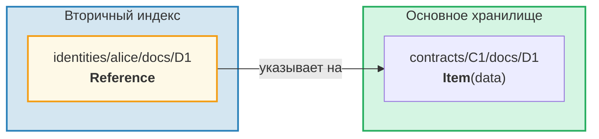
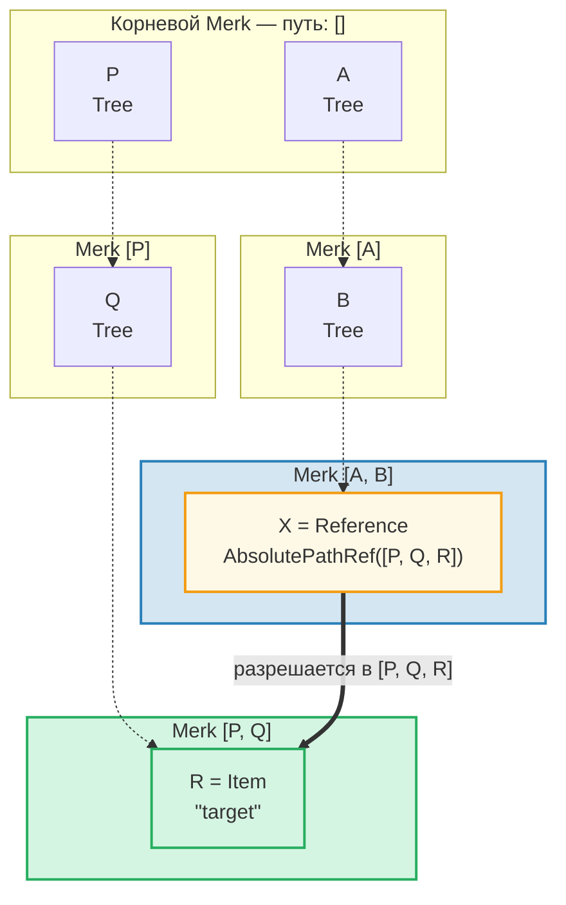
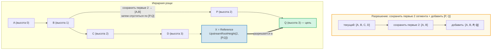
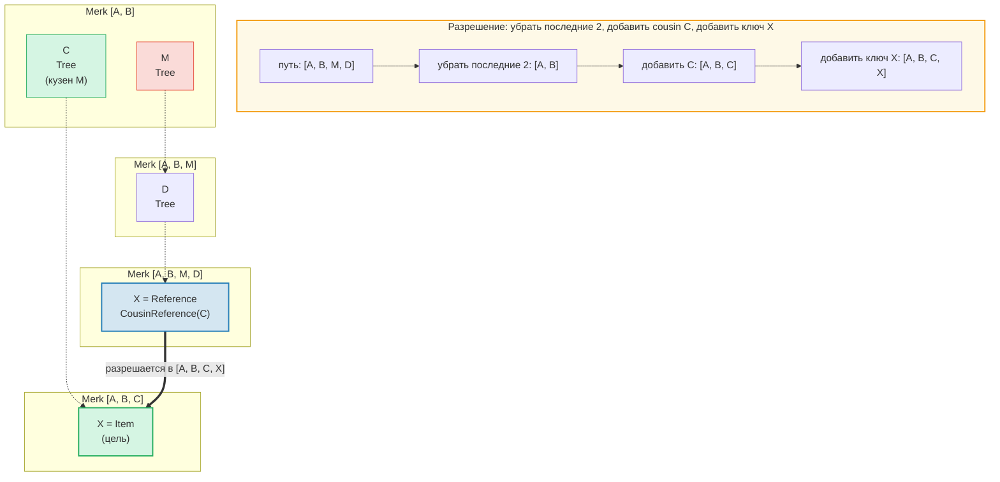
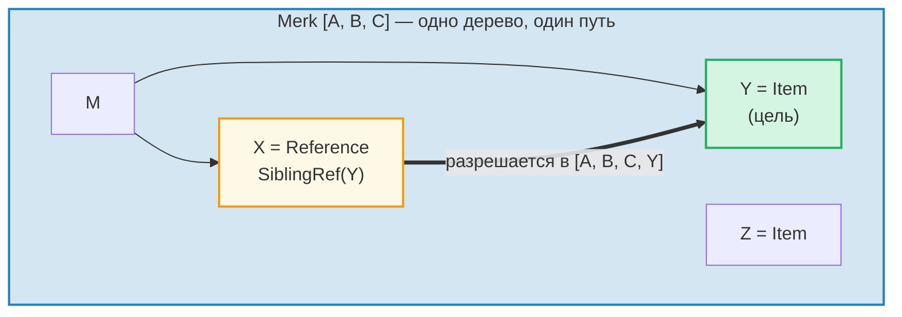
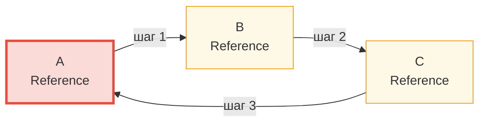

# Система ссылок

## Зачем нужны ссылки

В иерархической базе данных часто необходим доступ к одним и тем же данным по нескольким путям. Например, документы могут храниться в рамках контракта, но также быть доступными для запроса по идентификатору владельца. **Ссылки** (References) — это ответ GroveDB: они являются указателями из одного места в другое, подобно символическим ссылкам в файловой системе.



Ключевые свойства:
- Ссылки **аутентифицированы** — value_hash ссылки включает как саму ссылку, так и целевой элемент
- Ссылки могут быть **цепочечными** — ссылка может указывать на другую ссылку
- Обнаружение циклов предотвращает бесконечные петли
- Настраиваемый лимит переходов предотвращает исчерпание ресурсов

## Семь типов ссылок

```rust
// grovedb-element/src/reference_path/mod.rs
pub enum ReferencePathType {
    AbsolutePathReference(Vec<Vec<u8>>),
    UpstreamRootHeightReference(u8, Vec<Vec<u8>>),
    UpstreamRootHeightWithParentPathAdditionReference(u8, Vec<Vec<u8>>),
    UpstreamFromElementHeightReference(u8, Vec<Vec<u8>>),
    CousinReference(Vec<u8>),
    RemovedCousinReference(Vec<Vec<u8>>),
    SiblingReference(Vec<u8>),
}
```

Рассмотрим каждый тип с диаграммами.

### AbsolutePathReference

Простейший тип. Хранит полный путь к цели:



> X хранит полный абсолютный путь `[P, Q, R]`. Независимо от расположения X, он всегда разрешается в ту же цель.

### UpstreamRootHeightReference

Сохраняет первые N сегментов текущего пути, затем добавляет новый путь:



### UpstreamRootHeightWithParentPathAdditionReference

Как UpstreamRootHeight, но добавляет обратно последний сегмент текущего пути:

```text
    Ссылка по пути [A, B, C, D, E] ключ=X
    UpstreamRootHeightWithParentPathAdditionReference(2, [P, Q])

    Текущий путь:       [A, B, C, D, E]
    Сохранить первые 2: [A, B]
    Добавить [P, Q]:    [A, B, P, Q]
    Добавить последний: [A, B, P, Q, E]   ← "E" из исходного пути добавлен обратно

    Полезно для: индексов, где нужно сохранить ключ родителя
```

### UpstreamFromElementHeightReference

Отбрасывает последние N сегментов, затем добавляет:

```text
    Ссылка по пути [A, B, C, D] ключ=X
    UpstreamFromElementHeightReference(1, [P, Q])

    Текущий путь:       [A, B, C, D]
    Отбросить последний: [A, B, C]
    Добавить [P, Q]:    [A, B, C, P, Q]
```

### CousinReference

Заменяет только непосредственного родителя новым ключом:



> «Кузен» — это соседнее поддерево прародителя ссылки. Ссылка поднимается на два уровня вверх, затем спускается в поддерево кузена.

### RemovedCousinReference

Как CousinReference, но заменяет родителя многосегментным путём:

```text
    Ссылка по пути [A, B, C, D] ключ=X
    RemovedCousinReference([M, N])

    Текущий путь:   [A, B, C, D]
    Убрать родителя C: [A, B]
    Добавить [M, N]: [A, B, M, N]
    Добавить ключ X: [A, B, M, N, X]
```

### SiblingReference

Простейшая относительная ссылка — просто меняет ключ в рамках того же родителя:



> Простейший тип ссылки. X и Y — братья в одном дереве Merk: разрешение просто меняет ключ, сохраняя тот же путь.

## Следование по ссылкам и лимит переходов

Когда GroveDB встречает элемент Reference, она должна **пройти по нему**, чтобы найти фактическое значение. Поскольку ссылки могут указывать на другие ссылки, это включает цикл:

```rust
// grovedb/src/reference_path.rs
pub const MAX_REFERENCE_HOPS: usize = 10;

pub fn follow_reference(...) -> CostResult<ResolvedReference, Error> {
    let mut hops_left = MAX_REFERENCE_HOPS;
    let mut visited = HashSet::new();

    while hops_left > 0 {
        // Resolve reference path to absolute path
        let target_path = current_ref.absolute_qualified_path(...);

        // Check for cycles
        if !visited.insert(target_path.clone()) {
            return Err(Error::CyclicReference);
        }

        // Fetch element at target
        let element = Element::get(target_path);

        match element {
            Element::Reference(next_ref, ..) => {
                // Still a reference — keep following
                current_ref = next_ref;
                hops_left -= 1;
            }
            other => {
                // Found the actual element!
                return Ok(ResolvedReference { element: other, ... });
            }
        }
    }

    Err(Error::ReferenceLimit)  // Exceeded 10 hops
}
```

## Обнаружение циклов

`HashSet` `visited` отслеживает все пути, которые мы уже видели. Если мы встречаем путь, который уже посещали, значит, обнаружен цикл:



> **Трассировка обнаружения циклов:**
>
> | Шаг | Переход | Множество visited | Результат |
> |------|--------|-------------|--------|
> | 1 | Начинаем с A | { A } | A — Ref → переходим |
> | 2 | A → B | { A, B } | B — Ref → переходим |
> | 3 | B → C | { A, B, C } | C — Ref → переходим |
> | 4 | C → A | A уже в visited! | **Error::CyclicRef** |
>
> Без обнаружения циклов это зациклилось бы навсегда. `MAX_REFERENCE_HOPS = 10` также ограничивает глубину обхода для длинных цепочек.

## Ссылки в Merk — Комбинированные хеши значений

Когда Reference хранится в дереве Merk, его `value_hash` должен аутентифицировать и структуру ссылки, и целевые данные:

```rust
// merk/src/tree/kv.rs
pub fn update_hashes_using_reference_value_hash(
    mut self,
    reference_value_hash: CryptoHash,
) -> CostContext<Self> {
    // Hash the reference element's own bytes
    let actual_value_hash = value_hash(self.value_as_slice());

    // Combine: H(reference_bytes) ⊕ H(referenced_data)
    let combined = combine_hash(&actual_value_hash, &reference_value_hash);

    self.value_hash = combined;
    self.hash = kv_digest_to_kv_hash(self.key(), self.value_hash());
    // ...
}
```

Это означает, что изменение либо самой ссылки, ЛИБО данных, на которые она указывает, изменит корневой хеш — оба криптографически связаны.

---
