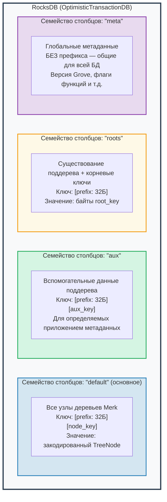
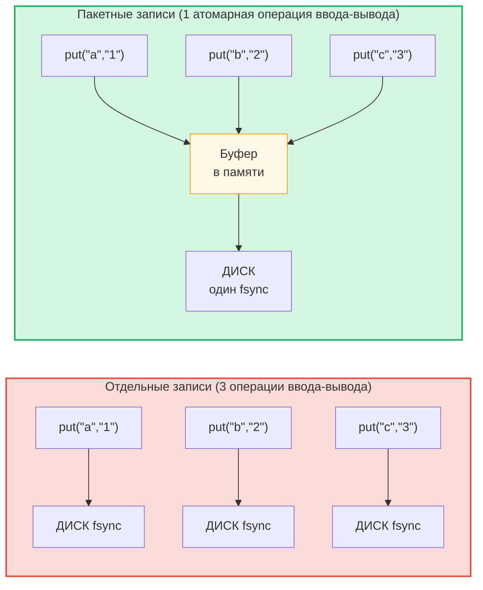

# Уровень хранения

## RocksDB с OptimisticTransactionDB

GroveDB использует **RocksDB** в качестве бэкенда хранения, а именно вариант `OptimisticTransactionDB`, поддерживающий транзакции:

```rust
// storage/src/rocksdb_storage/storage.rs
pub(crate) type Db = OptimisticTransactionDB;
pub(crate) type Tx<'db> = Transaction<'db, Db>;

pub struct RocksDbStorage {
    db: OptimisticTransactionDB,
}
```

**Оптимистичные транзакции** работают, предполагая отсутствие конфликтов. Если две транзакции модифицируют одни и те же данные, вторая при фиксации завершится ошибкой и может быть повторена. Это эффективнее пессимистичных блокировок для нагрузок, где конфликты редки.

Параметры RocksDB настроены для рабочей нагрузки GroveDB:

```rust
lazy_static! {
    static ref DEFAULT_OPTS: rocksdb::Options = {
        let mut opts = rocksdb::Options::default();
        opts.create_if_missing(true);
        opts.increase_parallelism(num_cpus::get() as i32);
        opts.set_allow_mmap_writes(true);
        opts.set_allow_mmap_reads(true);
        opts.create_missing_column_families(true);
        opts.set_atomic_flush(true);
        opts
    };
}
```

## Четыре семейства столбцов

Семейства столбцов (column families) RocksDB действуют как отдельные пространства имён «ключ-значение» в единой базе данных. GroveDB использует четыре:



> **Пример:** Ключ `[ab3fc2...][6e616d65]` в CF "default" отображается на `TreeNode{key:"name", val:"Al"}`, где `ab3fc2...` — это `Blake3(path)`, а `6e616d65` — это `"name"` в байтах.

```rust
pub(crate) const AUX_CF_NAME: &str = "aux";
pub(crate) const ROOTS_CF_NAME: &str = "roots";
pub(crate) const META_CF_NAME: &str = "meta";
// Main data uses the default column family
```

## Контексты хранения с префиксом

Каждое поддерево получает собственный **контекст хранения с префиксом** — обёртку, которая автоматически добавляет 32-байтовый префикс Blake3 ко всем ключам:

```text
    Путь поддерева: ["identities", "alice"]
    Префикс: Blake3(path) = [0xab, 0x3f, 0xc2, ...]  (32 байта)

    Когда поддерево сохраняет ключ "name" со значением "Alice":

    Ключ RocksDB:    [0xab 0x3f 0xc2 ... (32 байта) | 0x6e 0x61 0x6d 0x65]
                      \_________префикс________/       \_____"name"_____/

    Значение RocksDB: [закодированный TreeNode со значением "Alice"]
```

Типы контекстов:

```text
    Без транзакции:
    PrefixedRocksDbImmediateStorageContext
    └── Читает/пишет непосредственно в БД с префиксом

    С транзакцией:
    PrefixedRocksDbTransactionContext
    └── Читает/пишет через транзакцию с префиксом
```

Оба реализуют трейт `StorageContext`:

```rust
pub trait StorageContext<'db> {
    fn get(&self, key: &[u8]) -> CostResult<Option<Vec<u8>>, Error>;
    fn get_aux(&self, key: &[u8]) -> CostResult<Option<Vec<u8>>, Error>;
    fn get_root(&self, key: &[u8]) -> CostResult<Option<Vec<u8>>, Error>;
    fn get_meta(&self, key: &[u8]) -> CostResult<Option<Vec<u8>>, Error>;
    fn put(&self, key: &[u8], value: &[u8], ...) -> CostResult<(), Error>;
    fn put_aux(&self, key: &[u8], value: &[u8], ...) -> CostResult<(), Error>;
    fn put_root(&self, key: &[u8], value: &[u8], ...) -> CostResult<(), Error>;
    fn put_meta(&self, key: &[u8], value: &[u8], ...) -> CostResult<(), Error>;
    fn delete(&self, key: &[u8], ...) -> CostResult<(), Error>;
    // ...
}
```

## Пакеты записей и модель транзакций

Для производительности GroveDB накапливает записи в пакеты:



> 3 синхронизации диска против 1 = ~3 раза быстрее. Пакетные записи также **атомарны** (всё или ничего).

`StorageBatch` накапливает операции, которые сбрасываются на диск вместе:

```rust
pub struct StorageBatch {
    operations: RefCell<Vec<AbstractBatchOperation>>,
}
```

## Критический паттерн commit_local()

При использовании транзакций необходимо следовать критическому паттерну. Записи внутри транзакции буферизуются — они не видны до фиксации:

```rust
// ПРАВИЛЬНЫЙ паттерн:
{
    let tx = db.start_transaction();
    let storage_ctx = db.get_transactional_storage_context(path, &tx);

    storage_ctx.put(key, value);  // Writes to transaction buffer

    drop(storage_ctx);            // Release borrow on tx
    tx.commit_local();            // Flush transaction to DB
}

// НЕПРАВИЛЬНЫЙ — данные теряются:
{
    let tx = db.start_transaction();
    let storage_ctx = db.get_transactional_storage_context(path, &tx);

    storage_ctx.put(key, value);  // Writes to transaction buffer

    // tx уничтожается без commit_local()!
    // Все записи ОТКАТЫВАЮТСЯ!
}
```

Это особенно важно, потому что `storage_ctx` заимствует транзакцию. Необходимо вызвать `drop(storage_ctx)` прежде, чем можно будет вызвать `tx.commit_local()`.

---
