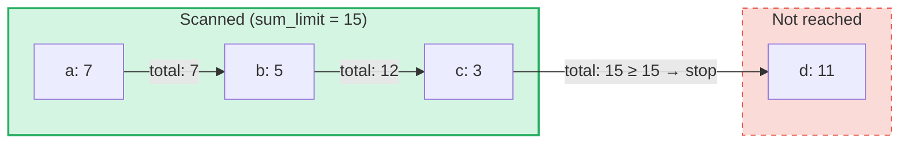

# การ Query ผลรวมสะสม (Aggregate Sum Queries)

## ภาพรวม

Aggregate Sum Queries เป็นประเภทการ query เฉพาะทางที่ออกแบบมาสำหรับ **SumTrees** ใน GroveDB
ในขณะที่การ query ปกติจะดึงข้อมูล element ตามคีย์หรือช่วง การ query ผลรวมสะสมจะวนซ้ำ
ผ่าน element ต่างๆ และสะสมค่าผลรวมจนกว่าจะถึง **ขีดจำกัดผลรวม** ที่กำหนด

วิธีนี้มีประโยชน์สำหรับคำถามเช่น:
- "ให้ธุรกรรมจนกว่ายอดรวมสะสมจะเกิน 1000"
- "รายการใดบ้างที่มีส่วนในค่า 500 หน่วยแรกของ tree นี้?"
- "รวบรวม sum item จนถึงงบประมาณ N"

## แนวคิดหลัก

### ความแตกต่างจากการ Query ปกติ

| คุณสมบัติ | PathQuery | AggregateSumPathQuery |
|---------|-----------|----------------------|
| **เป้าหมาย** | element ทุกประเภท | element ประเภท SumItem / ItemWithSumItem |
| **เงื่อนไขหยุด** | จำนวนจำกัด (count) หรือสิ้นสุดช่วง | ขีดจำกัดผลรวม (ยอดรวมสะสม) **และ/หรือ** จำนวนจำกัดของรายการ |
| **ค่าที่ส่งกลับ** | element หรือคีย์ | คู่ของคีย์-ค่าผลรวม |
| **Subqueries** | ได้ (ลงลึกเข้าไปใน subtree) | ไม่ได้ (ระดับ tree เดียว) |
| **References** | แก้ไขโดยชั้น GroveDB | ตามหรือข้ามได้ตามต้องการ |

### โครงสร้าง AggregateSumQuery

```rust
pub struct AggregateSumQuery {
    pub items: Vec<QueryItem>,              // Keys or ranges to scan
    pub left_to_right: bool,                // Iteration direction
    pub sum_limit: u64,                     // Stop when running total reaches this
    pub limit_of_items_to_check: Option<u16>, // Max number of matching items to return
}
```

การ query จะถูกห่อหุ้มใน `AggregateSumPathQuery` เพื่อระบุตำแหน่งที่จะค้นหาใน grove:

```rust
pub struct AggregateSumPathQuery {
    pub path: Vec<Vec<u8>>,                 // Path to the SumTree
    pub aggregate_sum_query: AggregateSumQuery,
}
```

### ขีดจำกัดผลรวม — ยอดรวมสะสม

`sum_limit` เป็นแนวคิดหลัก เมื่อมีการสแกน element แต่ละตัว ค่าผลรวมจะถูกสะสมไปเรื่อยๆ
เมื่อยอดรวมสะสมถึงหรือเกินขีดจำกัดผลรวม การวนซ้ำจะหยุด:



> **ผลลัพธ์:** `[(a, 7), (b, 5), (c, 3)]` — การวนซ้ำหยุดเพราะ 7 + 5 + 3 = 15 >= sum_limit

ค่าผลรวมที่เป็นลบได้รับการรองรับ ค่าลบจะเพิ่มงบประมาณที่เหลืออยู่:

```text
sum_limit = 12, elements: a(10), b(-3), c(5)

a: total = 10, remaining = 2
b: total =  7, remaining = 5  ← negative value gave us more room
c: total = 12, remaining = 0  ← stop

Result: [(a, 10), (b, -3), (c, 5)]
```

## ตัวเลือกการ Query

โครงสร้าง `AggregateSumQueryOptions` ควบคุมพฤติกรรมของการ query:

```rust
pub struct AggregateSumQueryOptions {
    pub allow_cache: bool,                              // Use cached reads (default: true)
    pub error_if_intermediate_path_tree_not_present: bool, // Error on missing path (default: true)
    pub error_if_non_sum_item_found: bool,              // Error on non-sum elements (default: true)
    pub ignore_references: bool,                        // Skip references (default: false)
}
```

### การจัดการ Element ที่ไม่ใช่ Sum

SumTrees อาจมี element หลายประเภทรวมกัน: `SumItem`, `Item`, `Reference`, `ItemWithSumItem`
และอื่นๆ โดยค่าเริ่มต้น หากพบ element ที่ไม่ใช่ sum และไม่ใช่ reference จะเกิดข้อผิดพลาด

เมื่อตั้งค่า `error_if_non_sum_item_found` เป็น `false` element ที่ไม่ใช่ sum จะถูก**ข้ามอย่างเงียบๆ**
โดยไม่ใช้ช่องจำนวนจำกัดของผู้ใช้:

```text
Tree contents: a(SumItem=7), b(Item), c(SumItem=3)
Query: sum_limit=100, limit_of_items_to_check=2, error_if_non_sum_item_found=false

Scan: a(7) → returned, limit=1
      b(Item) → skipped, limit still 1
      c(3) → returned, limit=0 → stop

Result: [(a, 7), (c, 3)]
```

หมายเหตุ: element ประเภท `ItemWithSumItem` จะถูกประมวลผล**เสมอ** (ไม่มีการข้าม) เพราะมีค่าผลรวมอยู่

### การจัดการ Reference

โดยค่าเริ่มต้น element ประเภท `Reference` จะถูก**ตามไป** — การ query จะแก้ไขห่วงโซ่ reference
(สูงสุด 3 hop ระหว่างทาง) เพื่อค้นหาค่าผลรวมของ element เป้าหมาย:

```text
Tree contents: a(SumItem=7), ref_b(Reference → a)
Query: sum_limit=100

ref_b is followed → resolves to a(SumItem=7)

Result: [(a, 7), (ref_b, 7)]
```

เมื่อตั้งค่า `ignore_references` เป็น `true` reference จะถูกข้ามอย่างเงียบๆ โดยไม่ใช้ช่องจำนวนจำกัด
เช่นเดียวกับการข้าม element ที่ไม่ใช่ sum

ห่วงโซ่ reference ที่ลึกเกิน 3 hop ระหว่างทาง จะทำให้เกิดข้อผิดพลาด `ReferenceLimit`

## ประเภทผลลัพธ์

การ query จะคืนค่า `AggregateSumQueryResult`:

```rust
pub struct AggregateSumQueryResult {
    pub results: Vec<(Vec<u8>, i64)>,       // Key-sum value pairs
    pub hard_limit_reached: bool,           // True if system limit truncated results
}
```

flag `hard_limit_reached` บ่งชี้ว่าขีดจำกัดการสแกนแบบตายตัวของระบบ (ค่าเริ่มต้น: 1024
element) ถูกแตะถึงก่อนที่การ query จะเสร็จสมบูรณ์ตามธรรมชาติ เมื่อเป็น `true` อาจมีผลลัพธ์เพิ่มเติม
อยู่นอกเหนือจากที่ถูกส่งกลับ

## ระบบขีดจำกัดสองระดับ

การ query ผลรวมสะสมมีเงื่อนไขหยุด **สาม** ประการ:

| ขีดจำกัด | แหล่งที่มา | สิ่งที่นับ | ผลเมื่อถึงขีดจำกัด |
|-------|--------|---------------|-------------------|
| **sum_limit** | ผู้ใช้ (query) | ยอดรวมสะสมของค่าผลรวม | หยุดการวนซ้ำ |
| **limit_of_items_to_check** | ผู้ใช้ (query) | รายการที่ตรงกันที่ถูกส่งกลับ | หยุดการวนซ้ำ |
| **ขีดจำกัดการสแกนแบบตายตัว** | ระบบ (GroveVersion, ค่าเริ่มต้น 1024) | element ทั้งหมดที่ถูกสแกน (รวมที่ข้าม) | หยุดการวนซ้ำ, ตั้งค่า `hard_limit_reached` |

ขีดจำกัดการสแกนแบบตายตัวป้องกันการวนซ้ำแบบไม่มีขอบเขตเมื่อไม่ได้ตั้งขีดจำกัดผู้ใช้ element ที่ถูกข้าม
(element ที่ไม่ใช่ sum เมื่อ `error_if_non_sum_item_found=false` หรือ reference เมื่อ
`ignore_references=true`) จะนับรวมในขีดจำกัดการสแกนแบบตายตัว แต่**ไม่**นับรวมในค่า
`limit_of_items_to_check` ของผู้ใช้

## การใช้งาน API

### การ Query อย่างง่าย

```rust
use grovedb::AggregateSumPathQuery;
use grovedb_merk::proofs::query::AggregateSumQuery;

// "Give me items from this SumTree until the total reaches 1000"
let query = AggregateSumQuery::new(1000, None);
let path_query = AggregateSumPathQuery {
    path: vec![b"my_tree".to_vec()],
    aggregate_sum_query: query,
};

let result = db.query_aggregate_sums(
    &path_query,
    true,   // allow_cache
    true,   // error_if_intermediate_path_tree_not_present
    None,   // transaction
    grove_version,
).unwrap().expect("query failed");

for (key, sum_value) in &result.results {
    println!("{}: {}", String::from_utf8_lossy(key), sum_value);
}
```

### การ Query พร้อมตัวเลือก

```rust
use grovedb::{AggregateSumPathQuery, AggregateSumQueryOptions};
use grovedb_merk::proofs::query::AggregateSumQuery;

// Skip non-sum items and ignore references
let query = AggregateSumQuery::new(1000, Some(50));
let path_query = AggregateSumPathQuery {
    path: vec![b"mixed_tree".to_vec()],
    aggregate_sum_query: query,
};

let result = db.query_aggregate_sums_with_options(
    &path_query,
    AggregateSumQueryOptions {
        error_if_non_sum_item_found: false,  // skip Items, Trees, etc.
        ignore_references: true,              // skip References
        ..AggregateSumQueryOptions::default()
    },
    None,
    grove_version,
).unwrap().expect("query failed");

if result.hard_limit_reached {
    println!("Warning: results may be incomplete (hard limit reached)");
}
```

### การ Query ตามคีย์

แทนที่จะสแกนช่วง คุณสามารถ query คีย์เฉพาะได้:

```rust
// Check the sum value of specific keys
let query = AggregateSumQuery::new_with_keys(
    vec![b"alice".to_vec(), b"bob".to_vec(), b"carol".to_vec()],
    u64::MAX,  // no sum limit
    None,      // no item limit
);
```

### การ Query แบบเรียงลำดับจากมากไปน้อย

วนซ้ำจากคีย์ที่สูงสุดไปยังต่ำสุด:

```rust
let query = AggregateSumQuery::new_descending(500, Some(10));
// Or: query.left_to_right = false;
```

## ตารางอ้างอิง Constructor

| Constructor | คำอธิบาย |
|-------------|-------------|
| `new(sum_limit, limit)` | ช่วงเต็ม, เรียงจากน้อยไปมาก |
| `new_descending(sum_limit, limit)` | ช่วงเต็ม, เรียงจากมากไปน้อย |
| `new_single_key(key, sum_limit)` | ค้นหาคีย์เดียว |
| `new_with_keys(keys, sum_limit, limit)` | คีย์เฉพาะหลายรายการ |
| `new_with_keys_reversed(keys, sum_limit, limit)` | คีย์หลายรายการ, เรียงจากมากไปน้อย |
| `new_single_query_item(item, sum_limit, limit)` | QueryItem เดียว (คีย์หรือช่วง) |
| `new_with_query_items(items, sum_limit, limit)` | QueryItem หลายรายการ |

---
