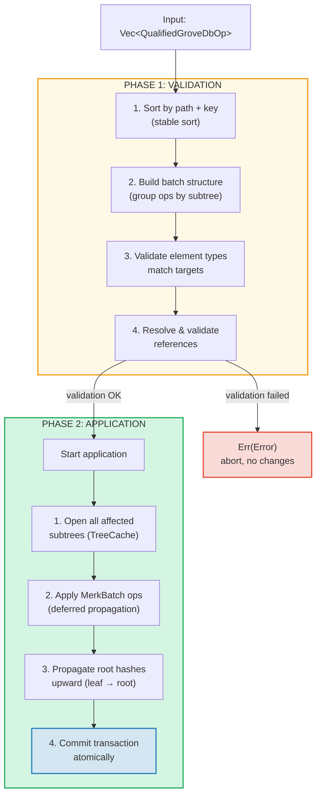
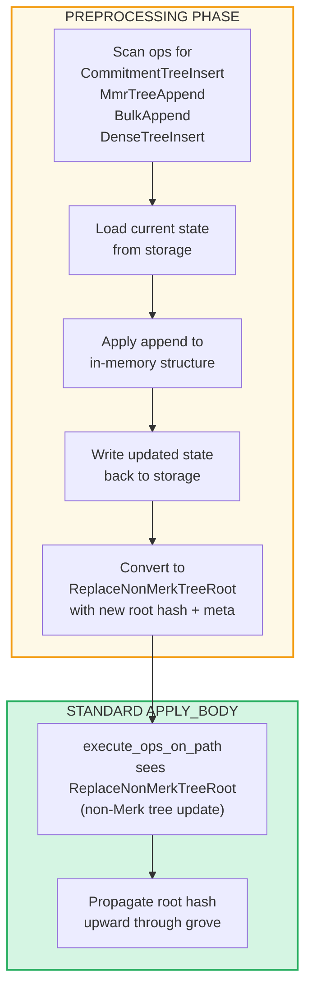

# การดำเนินการแบบ Batch ที่ระดับ Grove

## GroveOp Variant ต่าง ๆ

ที่ระดับ GroveDB การดำเนินการถูกแสดงเป็น `GroveOp`:

```rust
pub enum GroveOp {
    // การดำเนินการที่ผู้ใช้เรียกใช้:
    InsertOnly { element: Element },
    InsertOrReplace { element: Element },
    Replace { element: Element },
    Patch { element: Element, change_in_bytes: i32 },
    RefreshReference { reference_path_type, max_reference_hop, flags, trust_refresh_reference },
    Delete,
    DeleteTree(TreeType),                          // กำหนดพารามิเตอร์ตามประเภทต้นไม้

    // การดำเนินการ append สำหรับต้นไม้ non-Merk (ผู้ใช้เรียกใช้):
    CommitmentTreeInsert { cmx: [u8; 32], payload: Vec<u8> },
    MmrTreeAppend { value: Vec<u8> },
    BulkAppend { value: Vec<u8> },
    DenseTreeInsert { value: Vec<u8> },

    // การดำเนินการภายใน (สร้างโดย preprocessing/propagation, ถูกปฏิเสธโดย from_ops):
    ReplaceTreeRootKey { hash, root_key, aggregate_data },
    InsertTreeWithRootHash { hash, root_key, flags, aggregate_data },
    ReplaceNonMerkTreeRoot { hash: [u8; 32], meta: NonMerkTreeMeta },
    InsertNonMerkTree { hash, root_key, flags, aggregate_data, meta: NonMerkTreeMeta },
}
```

**NonMerkTreeMeta** พาสถานะเฉพาะประเภทต้นไม้ผ่านการประมวลผล batch:

```rust
pub enum NonMerkTreeMeta {
    CommitmentTree { total_count: u64, chunk_power: u8 },
    MmrTree { mmr_size: u64 },
    BulkAppendTree { total_count: u64, chunk_power: u8 },
    DenseTree { count: u16, height: u8 },
}
```

แต่ละการดำเนินการถูกครอบด้วย `QualifiedGroveDbOp` ที่รวม path:

```rust
pub struct QualifiedGroveDbOp {
    pub path: KeyInfoPath,           // ตำแหน่งใน grove
    pub key: Option<KeyInfo>,        // key ไหน (None สำหรับ op ต้นไม้ append-only)
    pub op: GroveOp,                 // จะทำอะไร
}
```

> **หมายเหตุ:** ฟิลด์ `key` เป็น `Option<KeyInfo>` — จะเป็น `None` สำหรับการดำเนินการต้นไม้ append-only (`CommitmentTreeInsert`, `MmrTreeAppend`, `BulkAppend`, `DenseTreeInsert`) ซึ่ง key ของต้นไม้คือส่วนสุดท้ายของ `path` แทน

## การประมวลผลสองเฟส

การดำเนินการ batch ถูกประมวลผลในสองเฟส:



## TreeCache และการเผยแพร่แบบเลื่อนออกไป (Deferred Propagation)

ระหว่างการใช้งาน batch GroveDB ใช้ **TreeCache** เพื่อเลื่อนการเผยแพร่ root hash จนกว่าการดำเนินการทั้งหมดใน subtree จะเสร็จ:

```mermaid
graph TD
    subgraph without["WITHOUT TreeCache (naive)"]
        w1["Op 1: Insert A in X"]
        w1p["Propagate X → parent → root"]
        w2["Op 2: Insert B in X"]
        w2p["Propagate X → parent → root"]
        w3["Op 3: Insert C in X"]
        w3p["Propagate X → parent → root"]
        w1 --> w1p --> w2 --> w2p --> w3 --> w3p
    end

    subgraph with_tc["WITH TreeCache (deferred)"]
        t1["Op 1: Insert A in X<br/>→ buffered"]
        t2["Op 2: Insert B in X<br/>→ buffered"]
        t3["Op 3: Insert C in X<br/>→ buffered"]
        tp["Propagate X → parent → root<br/>(walk up ONCE)"]
        t1 --> t2 --> t3 --> tp
    end

    style without fill:#fadbd8,stroke:#e74c3c,stroke-width:2px
    style with_tc fill:#d5f5e3,stroke:#27ae60,stroke-width:2px
    style w1p fill:#fadbd8,stroke:#e74c3c
    style w2p fill:#fadbd8,stroke:#e74c3c
    style w3p fill:#fadbd8,stroke:#e74c3c
    style tp fill:#d5f5e3,stroke:#27ae60,stroke-width:2px
```



> **3 propagation x O(depth)** เทียบกับ **1 propagation x O(depth)** = เร็วขึ้น 3 เท่าสำหรับ subtree นี้

นี่เป็นการเพิ่มประสิทธิภาพที่สำคัญเมื่อหลาย ๆ operation เป้าหมายเดียวกัน subtree

## การดำเนินการ Atomic ข้ามหลาย Subtree

คุณสมบัติสำคัญของ GroveDB batch คือ **atomicity ข้ามหลาย subtree** batch เดียวสามารถแก้ไข element ในหลาย subtree และการเปลี่ยนแปลงทั้งหมดจะ commit หรือไม่ commit เลย:

```text
    Batch:
    1. Delete ["balances", "alice"]       (ลบยอดคงเหลือ)
    2. Insert ["balances", "bob"] = 100   (เพิ่มยอดคงเหลือ)
    3. Update ["identities", "bob", "rev"] = 2  (อัปเดต revision)

    สาม subtree ที่ได้รับผลกระทบ: balances, identities, identities/bob

    ถ้าการดำเนินการใดล้มเหลว → การดำเนินการทั้งหมดถูก rolled back
    ถ้าทั้งหมดสำเร็จ → ทั้งหมดถูก commit อย่าง atomic
```

ตัวประมวลผล batch จัดการสิ่งนี้โดย:
1. รวบรวม path ที่ได้รับผลกระทบทั้งหมด
2. เปิด subtree ที่จำเป็นทั้งหมด
3. ใช้การดำเนินการทั้งหมด
4. เผยแพร่ root hash ทั้งหมดตามลำดับการพึ่งพา
5. commit transaction ทั้งหมด

## Batch Preprocessing สำหรับต้นไม้ Non-Merk

การดำเนินการ CommitmentTree, MmrTree, BulkAppendTree และ DenseAppendOnlyFixedSizeTree ต้องการเข้าถึง storage context ภายนอก Merk ซึ่งไม่สามารถทำได้ภายใน method `execute_ops_on_path` มาตรฐาน (มันเข้าถึงได้เฉพาะ Merk) การดำเนินการเหล่านี้ใช้รูปแบบ **preprocessing (การประมวลผลล่วงหน้า)**: ก่อนเฟส `apply_body` หลัก จุดเข้า (entry point) จะสแกนหา op ต้นไม้ non-Merk แล้วแปลงเป็น op ภายในมาตรฐาน

```rust
pub enum GroveOp {
    // ... standard ops ...

    // การดำเนินการต้นไม้ non-Merk (ผู้ใช้เรียกใช้):
    CommitmentTreeInsert { cmx: [u8; 32], payload: Vec<u8> },
    MmrTreeAppend { value: Vec<u8> },
    BulkAppend { value: Vec<u8> },
    DenseTreeInsert { value: Vec<u8> },

    // op ภายใน (สร้างโดย preprocessing):
    ReplaceNonMerkTreeRoot { hash: [u8; 32], meta: NonMerkTreeMeta },
}
```



**ทำไมต้อง preprocessing?** ฟังก์ชัน `execute_ops_on_path` ทำงานกับ Merk subtree เดียวและไม่มีสิทธิ์เข้าถึง `self.db` หรือ storage context ที่กว้างกว่า Preprocessing ในจุดเข้า (`apply_batch_with_element_flags_update`, `apply_partial_batch_with_element_flags_update`) มีสิทธิ์เข้าถึงฐานข้อมูลเต็ม จึงสามารถโหลด/บันทึกข้อมูลแล้วส่งต่อ `ReplaceNonMerkTreeRoot` ที่เรียบง่ายให้กลไก batch มาตรฐาน

แต่ละ method preprocessing ทำตามรูปแบบเดียวกัน:
1. **`preprocess_commitment_tree_ops`** — โหลด frontier และ BulkAppendTree จาก data storage, append เข้าทั้งสอง, บันทึกกลับ, แปลงเป็น `ReplaceNonMerkTreeRoot` ด้วย combined root และ meta `CommitmentTree { total_count, chunk_power }` ที่อัปเดตแล้ว
2. **`preprocess_mmr_tree_ops`** — โหลด MMR จาก data storage, append ค่าต่าง ๆ, บันทึกกลับ, แปลงเป็น `ReplaceNonMerkTreeRoot` ด้วย MMR root และ meta `MmrTree { mmr_size }` ที่อัปเดตแล้ว
3. **`preprocess_bulk_append_ops`** — โหลด BulkAppendTree จาก data storage, append ค่า (อาจกระตุ้น chunk compaction), บันทึกกลับ, แปลงเป็น `ReplaceNonMerkTreeRoot` ด้วย state root และ meta `BulkAppendTree { total_count, chunk_power }` ที่อัปเดตแล้ว
4. **`preprocess_dense_tree_ops`** — โหลด DenseFixedSizedMerkleTree จาก data storage, แทรกค่าตามลำดับ, คำนวณ root hash ใหม่, บันทึกกลับ, แปลงเป็น `ReplaceNonMerkTreeRoot` ด้วย root hash และ meta `DenseTree { count, height }` ที่อัปเดตแล้ว

op `ReplaceNonMerkTreeRoot` พา root hash ใหม่และ enum `NonMerkTreeMeta` เพื่อให้ element สามารถถูกสร้างขึ้นใหม่ได้หลังการประมวลผล

---
