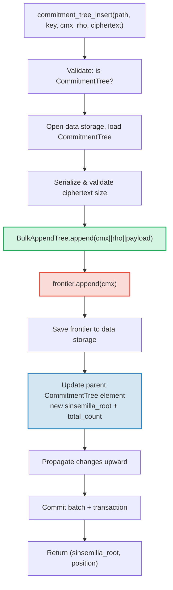

# CommitmentTree — Sinsemilla Commitment Anchor

**CommitmentTree** คือสะพานเชื่อมระหว่าง authenticated storage และระบบ zero-knowledge proof ของ GroveDB มันรวม **BulkAppendTree** (บทที่ 14) สำหรับการจัดเก็บข้อมูลแบบ chunk-compacted ที่มีประสิทธิภาพเข้ากับ **Sinsemilla frontier** ใน data namespace สำหรับ anchor ที่เข้ากันได้กับ ZK เช่นเดียวกับ MmrTree และ BulkAppendTree มัน **ไม่มี child Merk** — combined root hash ไหลเป็น Merk child hash ทั้ง BulkAppendTree entry และ Sinsemilla frontier อยู่ใน **data namespace**

บทนี้ครอบคลุม Sinsemilla hash function และทำไมมันสำคัญสำหรับ zero-knowledge circuit, โครงสร้างข้อมูล frontier และ serialization ที่กระทัดรัด, สถาปัตยกรรม storage แบบ dual-namespace, การดำเนินการ GroveDB, batch preprocessing, การสร้าง witness ฝั่ง client และวิธีการทำงานของ proof

## ทำไมต้องมีต้นไม้ที่เป็นมิตรกับ ZK?

ต้นไม้มาตรฐานของ GroveDB ใช้ Blake3 hashing Blake3 เร็วในซอฟต์แวร์ แต่ **แพงภายใน zero-knowledge circuit** เมื่อผู้ใช้จ่ายต้องพิสูจน์ว่า "ฉันรู้จัก note ที่ตำแหน่ง P ใน commitment tree" โดยไม่เปิดเผย P พวกเขาต้องประเมินฟังก์ชันแฮช Merkle 32 ครั้ง (ครั้งละระดับของต้นไม้) ภายใน ZK circuit

Sinsemilla (ระบุใน ZIP-244 สำหรับ Zcash Orchard protocol) ถูกออกแบบสำหรับกรณีใช้งานนี้โดยเฉพาะ — มันให้ **การแฮชที่มีประสิทธิภาพภายใน circuit** บน Pallas elliptic curve ซึ่งเป็นครึ่งหนึ่งของ Pasta curve cycle ที่ใช้โดยระบบพิสูจน์ Halo 2

| คุณสมบัติ | Blake3 | Sinsemilla |
|----------|--------|------------|
| **ต้นทุน Circuit** | ~25,000 constraint ต่อแฮช | ~800 constraint ต่อแฮช |
| **ความเร็วซอฟต์แวร์** | เร็วมาก (~2 GB/s) | ช้า (~10,000 hash/s) |
| **โครงสร้างเชิงพีชคณิต** | ไม่มี (bitwise) | Pallas curve point operation |
| **วัตถุประสงค์หลัก** | การแฮชทั่วไป, Merkle tree | Merkle proof ภายใน circuit |
| **ใช้โดย** | GroveDB Merk tree, MMR, Bulk | Orchard shielded protocol |
| **ขนาด output** | 32 ไบต์ | 32 ไบต์ (Pallas field element) |

CommitmentTree ใช้ Sinsemilla สำหรับ Merkle tree ที่ ZK circuit ใช้เหตุผล ในขณะที่ยังคงใช้ Blake3 สำหรับ GroveDB Merk hierarchy ด้านบน รายการที่แทรกเข้าต้นไม้จะถูกจัดเก็บผ่าน BulkAppendTree ใน data namespace (chunk-compacted, ดึงได้ตามตำแหน่ง) และถูก append ไปยัง Sinsemilla frontier พร้อมกัน (สร้าง anchor ที่พิสูจน์ด้วย ZK ได้)

## สถาปัตยกรรม Data-Namespace

CommitmentTree จัดเก็บ **ข้อมูลทั้งหมดใน data namespace** ที่ subtree path เดียวกัน เช่นเดียวกับ MmrTree และ BulkAppendTree มัน **ไม่มี child Merk** (ไม่มีฟิลด์ `root_key` — root เฉพาะประเภทไหลเป็น Merk child hash) BulkAppendTree entry และ Sinsemilla frontier อยู่ร่วมกันใน data namespace โดยใช้ key prefix ที่แตกต่างกัน:

```text
┌──────────────────────────────────────────────────────────────┐
│                       CommitmentTree                          │
│                                                               │
│  ┌─────────────────────────────────────────────────────────┐  │
│  │  Data Namespace                                         │  │
│  │                                                         │  │
│  │  BulkAppendTree storage (Chapter 14):                   │  │
│  │    Buffer entries → chunk blobs → chunk MMR             │  │
│  │    value = cmx (32) || rho (32) || ciphertext (216)     │  │
│  │                                                         │  │
│  │  Sinsemilla Frontier (~1KB):                            │  │
│  │    key: b"__ct_data__" (COMMITMENT_TREE_DATA_KEY)       │  │
│  │    Depth-32 incremental Merkle tree                     │  │
│  │    Stores only the rightmost path (leaf + ommers)       │  │
│  │    O(1) append, O(1) root computation                   │  │
│  │    Produces Orchard-compatible Anchor for ZK proofs     │  │
│  └─────────────────────────────────────────────────────────┘  │
│                                                               │
│  sinsemilla_root embedded in Element bytes                    │
│    → flows through Merk value_hash → GroveDB state root      │
└──────────────────────────────────────────────────────────────┘
```

**ทำไมต้องมีสองโครงสร้าง?** BulkAppendTree ให้การจัดเก็บและดึงข้อมูลแบบ chunk-compacted ที่มีประสิทธิภาพสำหรับ encrypted note ที่อาจมีหลายล้านรายการ Sinsemilla frontier ให้ anchor ที่เข้ากันได้กับ ZK ซึ่งสามารถพิสูจน์ภายใน Halo 2 circuit ได้ ทั้งสองถูกอัปเดตพร้อมกันทุกครั้งที่ append

เปรียบเทียบกับประเภทต้นไม้ที่ไม่เป็นมาตรฐานอื่น ๆ:

| | CommitmentTree | MmrTree | BulkAppendTree |
|---|---|---|---|
| **Child Merk** | ไม่ | ไม่ | ไม่ |
| **Data namespace** | BulkAppendTree entry + frontier | MMR node | Buffer + chunk + MMR |
| **Aux namespace** | — | — | — |
| **สืบค้นรายการได้** | ผ่าน V1 proof | ผ่าน V1 proof | ผ่าน V1 proof |
| **ฟังก์ชันแฮช** | Sinsemilla + Blake3 | Blake3 | Blake3 |

## Sinsemilla Frontier

frontier คือ incremental Merkle tree ที่มีความลึก 32 ที่ implement โดย type `Frontier<MerkleHashOrchard, 32>` ของ crate `incrementalmerkletree` แทนที่จะจัดเก็บ leaf ที่เป็นไปได้ทั้ง 2^32 ตัว มันจัดเก็บเฉพาะข้อมูลที่จำเป็นเพื่อ **append leaf ถัดไปและคำนวณ root ปัจจุบัน**: leaf ขวาสุดและ ommer ของมัน (sibling hash ที่จำเป็นสำหรับการคำนวณ root)

```text
                         root (level 32)
                        /               \
                      ...               ...
                     /                     \
                  (level 2)             (level 2)
                  /     \               /     \
              (level 1) (level 1)   (level 1)  ?
              /    \    /    \      /    \
             L0    L1  L2    L3   L4    ?     ← frontier stores L4
                                              + ommers at levels
                                              where left sibling exists
```

frontier จัดเก็บ:
- **leaf**: ค่าที่ append ล่าสุด (Pallas field element)
- **ommer**: left-sibling hash ที่แต่ละระดับที่เส้นทาง frontier ไปทางขวา (สูงสุด 32 ommer สำหรับต้นไม้ลึก 32)
- **position**: ตำแหน่งของ leaf เริ่มต้นที่ 0

คุณสมบัติสำคัญ:
- **O(1) append**: แทรก leaf ใหม่, อัปเดต ommer, คำนวณ root ใหม่
- **O(1) root**: ท่องผ่าน ommer ที่จัดเก็บจาก leaf ถึง root
- **ขนาดคงที่ ~1KB**: ไม่ว่าจะ append leaf ไปกี่ตัว
- **Deterministic**: frontier สองตัวที่มีลำดับ append เหมือนกันจะให้ root เหมือนกัน

ค่าคงที่ `EMPTY_SINSEMILLA_ROOT` คือ root ของต้นไม้ลึก 32 ที่ว่าง คำนวณล่วงหน้าเป็น `MerkleHashOrchard::empty_root(Level::from(32)).to_bytes()`:

```text
0xae2935f1dfd8a24aed7c70df7de3a668eb7a49b1319880dde2bbd9031ae5d82f
```

## การ Append ทำงานอย่างไร — Ommer Cascade

เมื่อ commitment ใหม่ถูก append ที่ตำแหน่ง N จำนวน ommer ที่ต้องอัปเดตเท่ากับ `trailing_ones(N)` — จำนวน trailing 1-bit ในการแทนค่า binary ของ N นี่เป็นรูปแบบเดียวกับ MMR merge cascade (13.4) แต่ทำงานบน ommer แทนที่จะเป็น peak

**ตัวอย่างทีละขั้นตอน — append 4 leaf:**

```text
Position 0 (binary: 0, trailing_ones: 0):
  frontier = { leaf: L0, ommers: [], position: 0 }
  Sinsemilla hashes: 32 (root computation) + 0 (no ommer merges) = 32

Position 1 (binary: 1, trailing_ones: 0 of PREVIOUS position 0):
  Before: position 0 has trailing_ones = 0
  frontier = { leaf: L1, ommers: [H(L0,L1) at level 1], position: 1 }
  Sinsemilla hashes: 32 + 0 = 32

Position 2 (binary: 10, trailing_ones: 0 of PREVIOUS position 1):
  Before: position 1 has trailing_ones = 1
  frontier = { leaf: L2, ommers: [level1_hash], position: 2 }
  Sinsemilla hashes: 32 + 1 = 33

Position 3 (binary: 11, trailing_ones: 0 of PREVIOUS position 2):
  Before: position 2 has trailing_ones = 0
  frontier = { leaf: L3, ommers: [level1_hash, level2_hash], position: 3 }
  Sinsemilla hashes: 32 + 0 = 32
```

**Sinsemilla hash ทั้งหมดต่อ append** คือ:

```text
32 (root computation always traverses all 32 levels)
+ trailing_ones(current_position)  (ommer cascade)
```

โดยเฉลี่ย `trailing_ones` คือ ~1 (geometric distribution) ดังนั้นต้นทุนเฉลี่ยคือ **~33 Sinsemilla hash ต่อ append** กรณีเลวร้ายที่สุด (ที่ตำแหน่ง 2^32 - 1 ซึ่งทุก bit เป็น 1) คือ **64 hash**

## รูปแบบ Serialization ของ Frontier

frontier ถูกจัดเก็บใน data storage ที่ key `b"__ct_data__"` รูปแบบ wire คือ:

```text
┌──────────────────────────────────────────────────────────────────┐
│ has_frontier: u8                                                  │
│   0x00 → empty tree (no more fields)                             │
│   0x01 → non-empty (fields follow)                               │
├──────────────────────────────────────────────────────────────────┤
│ position: u64 BE (8 bytes)      — 0-indexed leaf position        │
├──────────────────────────────────────────────────────────────────┤
│ leaf: [u8; 32]                  — Pallas field element bytes     │
├──────────────────────────────────────────────────────────────────┤
│ ommer_count: u8                 — number of ommers (0..=32)      │
├──────────────────────────────────────────────────────────────────┤
│ ommers: [ommer_count × 32 bytes] — Pallas field elements        │
└──────────────────────────────────────────────────────────────────┘
```

**การวิเคราะห์ขนาด:**

| สถานะ | ขนาด | รายละเอียด |
|-------|------|-----------|
| ว่าง | 1 ไบต์ | flag `0x00` เท่านั้น |
| 1 leaf, 0 ommer | 42 ไบต์ | 1 + 8 + 32 + 1 |
| ~16 ommer (เฉลี่ย) | 554 ไบต์ | 1 + 8 + 32 + 1 + 16×32 |
| 32 ommer (สูงสุด) | 1,066 ไบต์ | 1 + 8 + 32 + 1 + 32×32 |

ขนาด frontier ถูกจำกัดที่ ~1.1KB ไม่ว่าจะ append commitment ไปกี่ล้านตัว สิ่งนี้ทำให้วงจร load→modify→save ถูกมาก (1 seek สำหรับอ่าน, 1 seek สำหรับเขียน)

## Element Representation

```rust
CommitmentTree(
    u64,                  // total_count: จำนวนรายการที่ append แล้ว
    u8,                   // chunk_power: ความสูง dense tree สำหรับ BulkAppendTree buffer
    Option<ElementFlags>, // flags: metadata เพิ่มเติม
)
```

พารามิเตอร์ `chunk_power` ควบคุมความสูง dense tree ของ BulkAppendTree buffer; `chunk_power` ต้องอยู่ในช่วง 1..=16 (ดู 14.1 และ 16)

**ตัวระบุประเภท:**

| ตัวระบุ | ค่า |
|---|---|
| Element discriminant | 11 |
| `TreeType` | `CommitmentTree = 7` |
| `ElementType` | 11 |
| `COMMITMENT_TREE_COST_SIZE` | 12 ไบต์ (8 total_count + 1 chunk_power + 1 discriminant + 2 overhead) |

Sinsemilla root ไม่ได้ถูกจัดเก็บใน Element มันไหลเป็น Merk child hash ผ่านกลไก `insert_subtree` เมื่อ parent Merk คำนวณ `combined_value_hash` Sinsemilla-derived root จะถูกรวมเป็น child hash:

```text
combined_value_hash = blake3(value_hash || child_hash)
                                           ↑ sinsemilla/BulkAppendTree combined root
```

นี่หมายความว่าการเปลี่ยนแปลงใด ๆ ของ Sinsemilla frontier จะเผยแพร่โดยอัตโนมัติผ่าน GroveDB Merk hierarchy ไปจนถึง state root

**Constructor method:**

| Method | สร้าง |
|---|---|
| `Element::empty_commitment_tree(chunk_power)` | ต้นไม้ว่าง, count=0, ไม่มี flag |
| `Element::empty_commitment_tree_with_flags(chunk_power, flags)` | ต้นไม้ว่างพร้อม flag |
| `Element::new_commitment_tree(total_count, chunk_power, flags)` | ทุกฟิลด์ชัดเจน |

## สถาปัตยกรรม Storage

CommitmentTree จัดเก็บข้อมูลทั้งหมดใน **data namespace** เดียวที่ subtree path BulkAppendTree entry และ Sinsemilla frontier อยู่ร่วมกันใน column เดียวโดยใช้ key prefix ที่แตกต่างกัน ไม่มีการใช้ aux namespace

```text
┌──────────────────────────────────────────────────────────────────┐
│  Data Namespace (all CommitmentTree storage)                      │
│                                                                   │
│  BulkAppendTree storage keys (see §14.7):                         │
│    b"m" || pos (u64 BE)  → MMR node blobs                        │
│    b"b" || index (u64 BE)→ buffer entries (cmx || rho || ciphertext) │
│    b"e" || chunk (u64 BE)→ chunk blobs (compacted buffer)         │
│    b"M"                  → BulkAppendTree metadata                │
│                                                                   │
│  Sinsemilla frontier:                                             │
│    b"__ct_data__"        → serialized CommitmentFrontier (~1KB)   │
│                                                                   │
│  No Merk nodes — this is a non-Merk tree.                         │
│  Data authenticated via BulkAppendTree state_root (Blake3).       │
│  Sinsemilla root authenticates all cmx values via Pallas curve.   │
└──────────────────────────────────────────────────────────────────┘
```

**รูปแบบ load→modify→save**: ทุกการดำเนินการที่เปลี่ยนแปลงจะโหลด frontier จาก data storage แก้ไขในหน่วยความจำ และเขียนกลับ เนื่องจาก frontier มีขนาดสูงสุด ~1KB สิ่งนี้เป็นคู่ I/O ที่ไม่แพง (1 seek สำหรับอ่าน, 1 seek สำหรับเขียน) ในขณะเดียวกัน BulkAppendTree ก็ถูกโหลด append และบันทึก

**การเผยแพร่ root hash**: เมื่อรายการถูกแทรก สองสิ่งเปลี่ยนแปลง:
1. สถานะ BulkAppendTree เปลี่ยน (entry ใหม่ใน buffer หรือ chunk compaction)
2. Sinsemilla root เปลี่ยน (commitment ใหม่ใน frontier)

ทั้งสองถูกจับใน element `CommitmentTree` ที่อัปเดตแล้ว hash ของ parent Merk node กลายเป็น:

```text
combined_hash = combine_hash(
    value_hash(element_bytes),    ← includes total_count + chunk_power
    child_hash(combined_root)     ← sinsemilla/BulkAppendTree combined root
)
```

เช่นเดียวกับ MmrTree และ BulkAppendTree, root เฉพาะประเภทไหลเป็น Merk child hash การ authenticate ข้อมูลทั้งหมดไหลผ่าน child hash binding นี้

**ผลกระทบของ non-Merk data storage**: เนื่องจาก data namespace มี BulkAppendTree key (ไม่ใช่ Merk node) การดำเนินการที่ iterate storage เป็น Merk element — เช่น `find_subtrees`, `is_empty_tree` และ `verify_merk_and_submerks` — ต้องจัดการกรณีพิเศษสำหรับ CommitmentTree (และประเภทต้นไม้ non-Merk อื่น ๆ) helper `uses_non_merk_data_storage()` บนทั้ง `Element` และ `TreeType` ระบุประเภทต้นไม้เหล่านี้ การดำเนินการลบจะล้าง data namespace โดยตรงแทนที่จะ iterate และ verify_grovedb ข้าม sub-merk recursion สำหรับประเภทเหล่านี้

## การดำเนินการ GroveDB

CommitmentTree มีสี่การดำเนินการ การดำเนินการแทรกเป็น generic ข้าม `M: MemoSize` (จาก crate `orchard`) ซึ่งควบคุมการตรวจสอบขนาด ciphertext payload ค่าเริ่มต้น `M = DashMemo` ให้ payload 216 ไบต์ (32 epk + 104 enc + 80 out)

```rust
// แทรก commitment (typed) — ส่งคืน (sinsemilla_root, position)
// M ควบคุมการตรวจสอบขนาด ciphertext
db.commitment_tree_insert::<_, _, M>(path, key, cmx, rho, ciphertext, tx, version)

// แทรก commitment (raw bytes) — ตรวจสอบ payload.len() == ciphertext_payload_size::<DashMemo>()
db.commitment_tree_insert_raw(path, key, cmx, rho, payload_vec, tx, version)

// ดึง Orchard Anchor ปัจจุบัน
db.commitment_tree_anchor(path, key, tx, version)

// ดึงค่าตามตำแหน่ง global
db.commitment_tree_get_value(path, key, position, tx, version)

// ดึงจำนวนรายการปัจจุบัน
db.commitment_tree_count(path, key, tx, version)
```

`commitment_tree_insert` แบบ typed รับ `TransmittedNoteCiphertext<M>` และ serialize ภายใน `commitment_tree_insert_raw` แบบ raw (pub(crate)) รับ `Vec<u8>` และถูกใช้โดย batch preprocessing ที่ payload ถูก serialize แล้ว

### commitment_tree_insert

การดำเนินการแทรกอัปเดตทั้ง BulkAppendTree และ Sinsemilla frontier ในการดำเนินการ atomic เดียว:

```text
Step 1: Validate element at path/key is a CommitmentTree
        → extract total_count, chunk_power, flags

Step 2: Build ct_path = path ++ [key]

Step 3: Open data storage context at ct_path
        Load CommitmentTree (frontier + BulkAppendTree)
        Serialize ciphertext → validate payload size matches M
        Append cmx||rho||ciphertext to BulkAppendTree
        Append cmx to Sinsemilla frontier → get new sinsemilla_root
        Track Blake3 + Sinsemilla hash costs

Step 4: Save updated frontier to data storage

Step 5: Open parent Merk at path
        Write updated CommitmentTree element:
          new total_count, same chunk_power, same flags
        Child hash = combined_root (sinsemilla + bulk state)

Step 6: Propagate changes from parent upward through Merk hierarchy

Step 7: Commit storage batch and local transaction
        Return (sinsemilla_root, position)
```



> **สีแดง** = การดำเนินการ Sinsemilla **สีเขียว** = การดำเนินการ BulkAppendTree **สีน้ำเงิน** = การอัปเดต element ที่เชื่อมทั้งสอง

### commitment_tree_anchor

การดำเนินการ anchor เป็น query แบบ read-only:

```text
Step 1: Validate element at path/key is a CommitmentTree
Step 2: Build ct_path = path ++ [key]
Step 3: Load frontier from data storage
Step 4: Return frontier.anchor() as orchard::tree::Anchor
```

type `Anchor` เป็นตัวแทนแบบ Orchard-native ของ Sinsemilla root เหมาะสำหรับส่งโดยตรงไปยัง `orchard::builder::Builder` เมื่อสร้าง spend authorization proof

### commitment_tree_get_value

ดึงค่าที่จัดเก็บ (cmx || rho || payload) ตามตำแหน่ง global:

```text
Step 1: Validate element at path/key is a CommitmentTree
        → extract total_count, chunk_power
Step 2: Build ct_path = path ++ [key]
Step 3: Open data storage context, wrap in CachedBulkStore
Step 4: Load BulkAppendTree, call get_value(position)
Step 5: Return Option<Vec<u8>>
```

สิ่งนี้เป็นไปตามรูปแบบเดียวกับ `bulk_get_value` (14.9) — BulkAppendTree ดึงจาก buffer หรือ chunk blob ที่ compact แล้วอย่างโปร่งใสขึ้นอยู่กับว่าตำแหน่งอยู่ที่ไหน

### commitment_tree_count

ส่งคืนจำนวนรายการทั้งหมดที่ append ไปยังต้นไม้:

```text
Step 1: Read element at path/key
Step 2: Verify it is a CommitmentTree
Step 3: Return total_count from element fields
```

นี่เป็นการอ่านฟิลด์ element ง่าย ๆ — ไม่ต้องเข้าถึง storage นอกจาก parent Merk

## การดำเนินการแบบ Batch

CommitmentTree รองรับ batch insert ผ่าน variant `GroveOp::CommitmentTreeInsert`:

```rust
GroveOp::CommitmentTreeInsert {
    cmx: [u8; 32],      // extracted note commitment
    rho: [u8; 32],      // nullifier of the spent note
    payload: Vec<u8>,    // serialized ciphertext (216 bytes for DashMemo)
}
```

constructor สองตัวสร้าง op นี้:

```rust
// Raw constructor — ผู้เรียก serialize payload เอง
QualifiedGroveDbOp::commitment_tree_insert_op(path, cmx, rho, payload_vec)

// Typed constructor — serialize TransmittedNoteCiphertext<M> ภายใน
QualifiedGroveDbOp::commitment_tree_insert_op_typed::<M>(path, cmx, rho, &ciphertext)
```

อนุญาตให้ insert หลายรายการที่เป้าหมายต้นไม้เดียวกันใน batch เดียว เนื่องจาก `execute_ops_on_path` ไม่สามารถเข้าถึง data storage ทุก CommitmentTree op จึงต้องถูก preprocess ก่อน `apply_body`

**Pipeline ของ preprocessing** (`preprocess_commitment_tree_ops`):

```text
Input: [CTInsert{cmx1}, Insert{...}, CTInsert{cmx2}, CTInsert{cmx3}]
                                       ↑ same (path,key) as cmx1

Step 1: Group CommitmentTreeInsert ops by (path, key)
        group_1: [cmx1, cmx2, cmx3]

Step 2: For each group:
        a. Read existing element → verify CommitmentTree, extract chunk_power
        b. Open transactional storage context at ct_path
        c. Load CommitmentTree from data storage (frontier + BulkAppendTree)
        d. For each (cmx, rho, payload):
           - ct.append_raw(cmx, rho, payload) — validates size, appends to both
        e. Save updated frontier to data storage

Step 3: Replace all CTInsert ops with one ReplaceNonMerkTreeRoot per group
        carrying: hash=bulk_state_root (combined root),
                  meta=NonMerkTreeMeta::CommitmentTree {
                      total_count: new_count,
                      chunk_power,
                  }

Output: [ReplaceNonMerkTreeRoot{...}, Insert{...}]
```

CommitmentTreeInsert op แรกในแต่ละกลุ่มจะถูกแทนที่ด้วย `ReplaceNonMerkTreeRoot`; op ที่ตามมาสำหรับ (path, key) เดียวกันจะถูก drop กลไก batch มาตรฐานจะจัดการการอัปเดต element และการเผยแพร่ root hash

## MemoSize Generic และการจัดการ Ciphertext

struct `CommitmentTree<S, M>` เป็น generic ข้าม `M: MemoSize` (จาก crate `orchard`) ซึ่งควบคุมขนาดของ encrypted note ciphertext ที่จัดเก็บร่วมกับแต่ละ commitment

```rust
pub struct CommitmentTree<S, M: MemoSize = DashMemo> {
    frontier: CommitmentFrontier,
    pub bulk_tree: BulkAppendTree<S>,
    _memo: PhantomData<M>,
}
```

ค่าเริ่มต้น `M = DashMemo` หมายความว่าโค้ดที่มีอยู่ที่ไม่สนใจขนาด memo (เช่น `verify_grovedb`, `commitment_tree_anchor`, `commitment_tree_count`) ทำงานได้โดยไม่ต้องระบุ `M`

**Serialization helper** (public free function):

| ฟังก์ชัน | คำอธิบาย |
|----------|-------------|
| `ciphertext_payload_size::<M>()` | ขนาด payload ที่คาดหวังสำหรับ `MemoSize` ที่กำหนด |
| `serialize_ciphertext::<M>(ct)` | Serialize `TransmittedNoteCiphertext<M>` เป็น bytes |
| `deserialize_ciphertext::<M>(data)` | Deserialize bytes กลับเป็น `TransmittedNoteCiphertext<M>` |

**การตรวจสอบ Payload**: method `append_raw()` ตรวจสอบว่า `payload.len() == ciphertext_payload_size::<M>()` และส่งคืน `CommitmentTreeError::InvalidPayloadSize` เมื่อไม่ตรงกัน method `append()` แบบ typed serialize ภายใน ดังนั้นขนาดจะถูกต้องเสมอจากการสร้าง

### Layout ของ Record ที่จัดเก็บ (280 ไบต์สำหรับ DashMemo)

แต่ละ entry ใน BulkAppendTree จัดเก็บ record encrypted note ที่สมบูรณ์
layout ทั้งหมด โดยนับทุกไบต์:

```text
┌─────────────────────────────────────────────────────────────────────┐
│  Offset   Size   Field                                              │
├─────────────────────────────────────────────────────────────────────┤
│  0        32     cmx — extracted note commitment (Pallas base field)│
│  32       32     rho — nullifier of the spent note                  │
│  64       32     epk_bytes — ephemeral public key (Pallas point)    │
│  96       104    enc_ciphertext — encrypted note plaintext + MAC    │
│  200      80     out_ciphertext — encrypted outgoing data + MAC     │
├─────────────────────────────────────────────────────────────────────┤
│  Total:   280 bytes                                                 │
└─────────────────────────────────────────────────────────────────────┘
```

สองฟิลด์แรก (`cmx` และ `rho`) เป็น **ฟิลด์โปรโตคอลที่ไม่เข้ารหัส** —
เป็นสาธารณะโดยการออกแบบ สามฟิลด์ที่เหลือ (`epk_bytes`,
`enc_ciphertext`, `out_ciphertext`) ประกอบกันเป็น `TransmittedNoteCiphertext` และ
เป็น payload ที่เข้ารหัส

### รายละเอียดทีละฟิลด์

**cmx (32 ไบต์)** — Extracted note commitment, Pallas base field element
นี่คือค่า leaf ที่ถูก append ไปยัง Sinsemilla frontier มัน commit ต่อ
ทุกฟิลด์ของ note (ผู้รับ, มูลค่า, randomness) โดยไม่เปิดเผย
cmx คือสิ่งที่ทำให้ note "ค้นหาได้" ใน commitment tree

**rho (32 ไบต์)** — Nullifier ของ note ที่ถูกใช้จ่ายใน action นี้
Nullifier เป็นสาธารณะอยู่แล้วบน blockchain (ต้องเป็นเช่นนั้นเพื่อป้องกัน
double-spending) การจัดเก็บ `rho` ร่วมกับ commitment ช่วยให้ light client
ที่ทำ trial decryption สามารถตรวจสอบ `esk = PRF(rseed, rho)` และยืนยัน
`epk' == epk` โดยไม่ต้องค้นหา nullifier แยกต่างหาก ฟิลด์นี้อยู่ระหว่าง
`cmx` และ ciphertext เป็นการเชื่อมโยงระดับโปรโตคอลที่ไม่เข้ารหัส

**epk_bytes (32 ไบต์)** — Ephemeral public key, จุดบนเส้นโค้ง Pallas ที่ถูก
serialize ได้มาอย่าง deterministic จาก `rseed` ของ note ผ่าน:

```text
rseed → esk = ToScalar(PRF^expand(rseed, [4] || rho))
esk   → epk = [esk] * g_d     (scalar multiplication on Pallas)
epk   → epk_bytes = Serialize(epk)
```

โดยที่ `g_d = DiversifyHash(d)` เป็น diversified base point สำหรับ
diversifier ของผู้รับ `epk` ช่วยให้ผู้รับคำนวณ shared
secret สำหรับถอดรหัส: `shared_secret = [ivk] * epk` ส่งแบบเปิดเผยเพราะ
ไม่เปิดเผยอะไรเกี่ยวกับผู้ส่งหรือผู้รับโดยไม่รู้ `esk` หรือ `ivk`

**enc_ciphertext (104 ไบต์สำหรับ DashMemo)** — Note plaintext ที่เข้ารหัส
สร้างโดย ChaCha20-Poly1305 AEAD encryption:

```text
enc_ciphertext = ChaCha20-Poly1305.Encrypt(key, nonce=[0;12], aad=[], plaintext)
               = ciphertext (88 bytes) || MAC tag (16 bytes) = 104 bytes
```

symmetric key ได้มาผ่าน ECDH:
`key = BLAKE2b-256("Zcash_OrchardKDF", shared_secret || epk_bytes)`

เมื่อถอดรหัสโดยผู้รับ (ใช้ `ivk`) **note plaintext**
(88 ไบต์สำหรับ DashMemo) ประกอบด้วย:

| Offset | ขนาด | Field | คำอธิบาย |
|--------|------|-------|-------------|
| 0 | 1 | version | เสมอ `0x02` (Orchard, post-ZIP-212) |
| 1 | 11 | diversifier (d) | diversifier ของผู้รับ, ได้มาซึ่ง base point `g_d` |
| 12 | 8 | value (v) | มูลค่า note 64-bit little-endian เป็น duff |
| 20 | 32 | rseed | random seed สำหรับ deterministic derivation ของ `rcm`, `psi`, `esk` |
| 52 | 36 | memo | ข้อมูล memo ชั้นแอปพลิเคชัน (DashMemo: 36 ไบต์) |
| **Total** | **88** | | |

52 ไบต์แรก (version + diversifier + value + rseed) คือ **compact
note** — light client สามารถ trial-decrypt เฉพาะส่วนนี้โดยใช้
ChaCha20 stream cipher (โดยไม่ตรวจสอบ MAC) เพื่อตรวจสอบว่า note เป็นของ
พวกเขาหรือไม่ ถ้าใช่ พวกเขาจะถอดรหัสทั้ง 88 ไบต์และตรวจสอบ MAC

**out_ciphertext (80 ไบต์)** — ข้อมูลขาออกที่เข้ารหัส ช่วยให้
**ผู้ส่ง** กู้คืน note ในภายหลัง เข้ารหัสด้วย Outgoing
Cipher Key:

```text
ock = BLAKE2b-256("Zcash_Orchardock", ovk || cv_net || cmx || epk)
out_ciphertext = ChaCha20-Poly1305.Encrypt(ock, nonce=[0;12], aad=[], plaintext)
               = ciphertext (64 bytes) || MAC tag (16 bytes) = 80 bytes
```

เมื่อถอดรหัสโดยผู้ส่ง (ใช้ `ovk`) **outgoing plaintext**
(64 ไบต์) ประกอบด้วย:

| Offset | ขนาด | Field | คำอธิบาย |
|--------|------|-------|-------------|
| 0 | 32 | pk_d | Diversified transmission key (public key ของผู้รับ) |
| 32 | 32 | esk | Ephemeral secret key (Pallas scalar) |
| **Total** | **64** | | |

ด้วย `pk_d` และ `esk` ผู้ส่งสามารถสร้าง shared secret ใหม่ ถอดรหัส
`enc_ciphertext` และกู้คืน note ทั้งหมด ถ้าผู้ส่งตั้ง `ovk = null`
outgoing plaintext จะถูกเติมด้วยไบต์สุ่มก่อนเข้ารหัส ทำให้
การกู้คืนเป็นไปไม่ได้แม้สำหรับผู้ส่ง (non-recoverable output)

### รูปแบบเข้ารหัส: ChaCha20-Poly1305

ทั้ง `enc_ciphertext` และ `out_ciphertext` ใช้ ChaCha20-Poly1305 AEAD (RFC 8439):

| พารามิเตอร์ | ค่า |
|-----------|-------|
| ขนาด Key | 256 บิต (32 ไบต์) |
| Nonce | `[0u8; 12]` (ปลอดภัยเพราะแต่ละ key ใช้เพียงครั้งเดียว) |
| AAD | ว่าง |
| Tag MAC | 16 ไบต์ (Poly1305) |

nonce ศูนย์ปลอดภัยเพราะ symmetric key ได้มาจาก Diffie-Hellman exchange ใหม่
ต่อ note — แต่ละ key เข้ารหัสเพียงข้อความเดียว

### การเปรียบเทียบขนาด DashMemo vs ZcashMemo

| ส่วนประกอบ | DashMemo | ZcashMemo | หมายเหตุ |
|-----------|----------|-----------|-------|
| ฟิลด์ memo | 36 ไบต์ | 512 ไบต์ | ข้อมูลแอปพลิเคชัน |
| Note plaintext | 88 ไบต์ | 564 ไบต์ | 52 คงที่ + memo |
| enc_ciphertext | 104 ไบต์ | 580 ไบต์ | plaintext + 16 MAC |
| Ciphertext payload (epk+enc+out) | 216 ไบต์ | 692 ไบต์ | ส่งต่อ note |
| Record ที่จัดเก็บทั้งหมด (cmx+rho+payload) | **280 ไบต์** | **756 ไบต์** | BulkAppendTree entry |

memo ที่เล็กกว่าของ DashMemo (36 vs 512 ไบต์) ลดแต่ละ record ที่จัดเก็บลง
476 ไบต์ — มีนัยสำคัญเมื่อจัดเก็บ note นับล้าน

### ขั้นตอน Trial Decryption (Light Client)

light client ที่สแกนหา note ของตัวเองทำลำดับนี้สำหรับแต่ละ
record ที่จัดเก็บ:

```text
1. Read record: cmx (32) || rho (32) || epk (32) || enc_ciphertext (104) || out_ciphertext (80)

2. Compute shared_secret = [ivk] * epk     (ECDH with incoming viewing key)

3. Derive key = BLAKE2b-256("Zcash_OrchardKDF", shared_secret || epk)

4. Trial-decrypt compact note (first 52 bytes of enc_ciphertext):
   → version (1) || diversifier (11) || value (8) || rseed (32)

5. Reconstruct esk = PRF(rseed, rho)    ← rho is needed here!
   Verify: [esk] * g_d == epk           ← confirms this is our note

6. If match: decrypt full enc_ciphertext (88 bytes + 16 MAC):
   → compact_note (52) || memo (36)
   Verify MAC tag for authenticity

7. Reconstruct full Note from (diversifier, value, rseed, rho)
   This note can later be spent by proving knowledge of it in ZK
```

ขั้นตอนที่ 5 คือเหตุผลที่ `rho` ต้องถูกจัดเก็บร่วมกับ ciphertext — หากไม่มี
light client ไม่สามารถตรวจสอบ ephemeral key binding ระหว่าง trial
decryption ได้

## การสร้าง Witness ฝั่ง Client

crate `grovedb-commitment-tree` มี **client-side** tree สำหรับ wallet และ test harness ที่ต้องการสร้าง Merkle witness path สำหรับการใช้จ่าย note เปิดใช้ feature `client` เพื่อใช้:

```toml
grovedb-commitment-tree = { version = "4", features = ["client"] }
```

```rust
pub struct ClientMemoryCommitmentTree {
    inner: ShardTree<MemoryShardStore<MerkleHashOrchard, u32>, 32, 4>,
}
```

`ClientMemoryCommitmentTree` ห่อ `ShardTree` — commitment tree เต็ม (ไม่ใช่แค่ frontier) ที่เก็บประวัติทั้งหมดในหน่วยความจำ สิ่งนี้อนุญาตให้สร้าง authentication path สำหรับ leaf ที่ถูก mark ใด ๆ ซึ่ง frontier เพียงอย่างเดียวไม่สามารถทำได้

**API:**

| Method | คำอธิบาย |
|---|---|
| `new(max_checkpoints)` | สร้างต้นไม้ว่างด้วยขีดจำกัดการเก็บ checkpoint |
| `append(cmx, retention)` | Append commitment ด้วย retention policy |
| `checkpoint(id)` | สร้าง checkpoint ที่สถานะปัจจุบัน |
| `max_leaf_position()` | ตำแหน่งของ leaf ที่ append ล่าสุด |
| `witness(position, depth)` | สร้าง `MerklePath` สำหรับการใช้จ่าย note |
| `anchor()` | root ปัจจุบันเป็น `orchard::tree::Anchor` |

**Retention policy** ควบคุมว่า leaf ใดสามารถ witness ได้ภายหลัง:

| Retention | ความหมาย |
|---|---|
| `Retention::Ephemeral` | ไม่สามารถ witness leaf ได้ (note ของคนอื่น) |
| `Retention::Marked` | สามารถ witness leaf ได้ (note ของคุณเอง) |
| `Retention::Checkpoint { id, marking }` | สร้าง checkpoint, อาจ mark ด้วย |

**การเปรียบเทียบ Server vs Client:**

| | `CommitmentFrontier` (server) | `ClientMemoryCommitmentTree` (client) | `ClientPersistentCommitmentTree` (sqlite) |
|---|---|---|---|
| **Storage** | ~1KB frontier ใน data storage | ต้นไม้เต็มในหน่วยความจำ | ต้นไม้เต็มใน SQLite |
| **สามารถ witness** | ไม่ | ใช่ (เฉพาะ leaf ที่ mark) | ใช่ (เฉพาะ leaf ที่ mark) |
| **คำนวณ anchor ได้** | ใช่ | ใช่ | ใช่ |
| **Anchor ตรงกัน** | ลำดับเดียวกัน → anchor เดียวกัน | ลำดับเดียวกัน → anchor เดียวกัน | ลำดับเดียวกัน → anchor เดียวกัน |
| **คงอยู่หลังรีสตาร์ท** | ใช่ (GroveDB data storage) | ไม่ (สูญหายเมื่อ drop) | ใช่ (SQLite database) |
| **กรณีใช้งาน** | GroveDB server-side anchor tracking | Testing, ephemeral wallet | Production wallet |
| **Feature flag** | `server` | `client` | `sqlite` |

ทั้งสามสร้าง **anchor เหมือนกัน** สำหรับลำดับ append เดียวกัน สิ่งนี้ถูกยืนยันโดย test `test_frontier_and_client_same_root`

### Persistent Client — การสร้าง Witness ที่สำรองด้วย SQLite

`ClientMemoryCommitmentTree` ที่อยู่ในหน่วยความจำจะสูญเสียสถานะทั้งหมดเมื่อ drop สำหรับ production wallet ที่ต้องอยู่รอดหลังรีสตาร์ทโดยไม่ต้องสแกนทั้ง blockchain ใหม่ crate มี `ClientPersistentCommitmentTree` ที่สำรองด้วย SQLite เปิดใช้ feature `sqlite`:

```toml
grovedb-commitment-tree = { version = "4", features = ["sqlite"] }
```

```rust
pub struct ClientPersistentCommitmentTree {
    inner: ShardTree<SqliteShardStore, 32, 4>,
}
```

**สาม constructor mode:**

| Constructor | คำอธิบาย |
|---|---|
| `open(conn, max_checkpoints)` | รับ ownership ของ `rusqlite::Connection` ที่มีอยู่ |
| `open_on_shared_connection(arc, max_checkpoints)` | แชร์ `Arc<Mutex<Connection>>` กับ component อื่น |
| `open_path(path, max_checkpoints)` | สะดวก — เปิด/สร้าง SQLite DB ที่ file path ที่กำหนด |

constructor แบบ bring-your-own-connection (`open`, `open_on_shared_connection`) อนุญาตให้ wallet ใช้ **ฐานข้อมูลที่มีอยู่แล้ว** สำหรับ commitment tree storage `SqliteShardStore` สร้างตารางด้วย prefix `commitment_tree_` ดังนั้นอยู่ร่วมกันกับตารางของแอปพลิเคชันอื่นได้อย่างปลอดภัย

**API** เหมือนกับ `ClientMemoryCommitmentTree`:

| Method | คำอธิบาย |
|---|---|
| `append(cmx, retention)` | Append commitment ด้วย retention policy |
| `checkpoint(id)` | สร้าง checkpoint ที่สถานะปัจจุบัน |
| `max_leaf_position()` | ตำแหน่งของ leaf ที่ append ล่าสุด |
| `witness(position, depth)` | สร้าง `MerklePath` สำหรับการใช้จ่าย note |
| `anchor()` | root ปัจจุบันเป็น `orchard::tree::Anchor` |

**SQLite schema** (4 ตาราง, สร้างอัตโนมัติ):

```sql
commitment_tree_shards                -- Shard data (serialized prunable trees)
commitment_tree_cap                   -- Tree cap (single-row, top of shard tree)
commitment_tree_checkpoints           -- Checkpoint metadata (position or empty)
commitment_tree_checkpoint_marks_removed  -- Marks removed per checkpoint
```

**ตัวอย่าง Persistence:**

```rust
use grovedb_commitment_tree::{ClientPersistentCommitmentTree, Retention, Position};

// เซสชันแรก: append note และปิด
let mut tree = ClientPersistentCommitmentTree::open_path("wallet.db", 100)?;
tree.append(cmx_0, Retention::Marked)?;
tree.append(cmx_1, Retention::Ephemeral)?;
let anchor_before = tree.anchor()?;
drop(tree);

// เซสชันที่สอง: เปิดใหม่ สถานะยังคงอยู่
let tree = ClientPersistentCommitmentTree::open_path("wallet.db", 100)?;
let anchor_after = tree.anchor()?;
assert_eq!(anchor_before, anchor_after);  // anchor เดียวกัน ไม่ต้องสแกนใหม่
```

**ตัวอย่าง Shared connection** (สำหรับ wallet ที่มี SQLite database อยู่แล้ว):

```rust
use std::sync::{Arc, Mutex};
use grovedb_commitment_tree::rusqlite::Connection;

let conn = Arc::new(Mutex::new(Connection::open("wallet.db")?));
// conn ยังถูกใช้โดย component อื่นของ wallet...
let mut tree = ClientPersistentCommitmentTree::open_on_shared_connection(
    conn.clone(), 100
)?;
```

crate `grovedb-commitment-tree` re-export `rusqlite` ภายใต้ feature flag `sqlite` ดังนั้น downstream consumer ไม่จำเป็นต้องเพิ่ม `rusqlite` เป็น dependency แยกต่างหาก

**SqliteShardStore internals:**

`SqliteShardStore` implement 18 method ทั้งหมดของ `ShardStore` trait Shard tree ถูก serialize โดยใช้รูปแบบ binary ที่กระทัดรัด:

```text
Nil:    [0x00]                                     — 1 byte
Leaf:   [0x01][hash: 32][flags: 1]                 — 34 bytes
Parent: [0x02][has_ann: 1][ann?: 32][left][right]  — recursive
```

`LocatedPrunableTree` เพิ่ม address prefix: `[level: 1][index: 8][tree_bytes]`

enum `ConnectionHolder` abstract เหนือ owned vs shared connection:

```rust
enum ConnectionHolder {
    Owned(Connection),                    // exclusive access
    Shared(Arc<Mutex<Connection>>),       // shared with other components
}
```

การดำเนินการฐานข้อมูลทั้งหมดเข้าถึง connection ผ่าน helper `with_conn` ที่จัดการทั้งสอง mode อย่างโปร่งใส โดย lock mutex เฉพาะเมื่อเป็น shared

## การรวม Proof

CommitmentTree รองรับสอง proof path:

**1. Sinsemilla anchor proof (ZK path):**

```text
GroveDB root hash
  ↓ Merk proof (V0, standard)
Parent Merk node
  ↓ value_hash includes CommitmentTree element bytes
CommitmentTree element bytes
  ↓ contains sinsemilla_root field
Sinsemilla root (Orchard Anchor)
  ↓ ZK proof (Halo 2 circuit, off-chain)
Note commitment at position P
```

1. Parent Merk proof แสดงว่า element `CommitmentTree` มีอยู่ที่ path/key ที่อ้าง พร้อม byte เฉพาะ
2. byte เหล่านั้นรวมฟิลด์ `sinsemilla_root`
3. client (wallet) สร้าง Merkle witness ใน Sinsemilla tree อย่างอิสระโดยใช้ `ClientMemoryCommitmentTree::witness()` (testing) หรือ `ClientPersistentCommitmentTree::witness()` (production, สำรองด้วย SQLite)
4. ZK circuit ตรวจสอบ witness กับ anchor (sinsemilla_root)

**2. Item retrieval proof (V1 path):**

รายการแต่ละตัว (cmx || rho || payload) สามารถ query ตามตำแหน่งและพิสูจน์โดยใช้ V1 proof (9.6) กลไกเดียวกับที่ใช้โดย BulkAppendTree แบบ standalone V1 proof รวม BulkAppendTree authentication path สำหรับตำแหน่งที่ร้องขอ เชื่อมกับ parent Merk proof สำหรับ CommitmentTree element

## การติดตามต้นทุน

CommitmentTree แนะนำฟิลด์ต้นทุนเฉพาะสำหรับ Sinsemilla operation:

```rust
pub struct OperationCost {
    pub seek_count: u32,
    pub storage_cost: StorageCost,
    pub storage_loaded_bytes: u64,
    pub hash_node_calls: u32,
    pub sinsemilla_hash_calls: u32,   // ← ฟิลด์ใหม่สำหรับ CommitmentTree
}
```

ฟิลด์ `sinsemilla_hash_calls` แยกจาก `hash_node_calls` เพราะ Sinsemilla hash แพงกว่า Blake3 อย่างมากทั้งในเวลา CPU และต้นทุน ZK circuit

**รายละเอียดต้นทุนต่อ append:**

| ส่วนประกอบ | กรณีเฉลี่ย | กรณีเลวร้ายที่สุด |
|---|---|---|
| Sinsemilla hash | 33 (32 root + 1 ommer เฉลี่ย) | 64 (32 root + 32 ommer) |
| Frontier I/O seek | 2 (get + put) | 2 |
| Frontier byte ที่โหลด | 554 (~16 ommer) | 1,066 (32 ommer) |
| Frontier byte ที่เขียน | 554 | 1,066 |
| BulkAppendTree hash | ~5 Blake3 (amortized, ดู 14.15) | O(chunk_size) เมื่อ compaction |
| BulkAppendTree I/O | 2-3 seek (metadata + buffer) | +2 เมื่อ chunk compaction |

**ค่าคงที่ประมาณต้นทุน** (จาก `average_case_costs.rs` และ `worst_case_costs.rs`):

```rust
// Average case
const AVG_FRONTIER_SIZE: u32 = 554;    // ~16 ommers
const AVG_SINSEMILLA_HASHES: u32 = 33; // 32 root levels + 1 avg ommer

// Worst case
const MAX_FRONTIER_SIZE: u32 = 1066;   // 32 ommers (max depth)
const MAX_SINSEMILLA_HASHES: u32 = 64; // 32 root levels + 32 ommers
```

ต้นทุน BulkAppendTree ถูกติดตามร่วมกับต้นทุน Sinsemilla โดยรวมทั้ง Blake3 hash (จาก BulkAppendTree buffer/chunk operation) และ Sinsemilla hash (จาก frontier append) เป็น `OperationCost` เดียว

## Orchard Key Hierarchy และ Re-export

crate `grovedb-commitment-tree` re-export Orchard API ทั้งหมดที่จำเป็นเพื่อสร้างและตรวจสอบ shielded transaction สิ่งนี้อนุญาตให้โค้ด Platform import ทุกอย่างจาก crate เดียว

**ประเภทการจัดการ key:**

```text
SpendingKey
  ├── SpendAuthorizingKey → SpendValidatingKey
  └── FullViewingKey
        ├── IncomingViewingKey (decrypt received notes)
        ├── OutgoingViewingKey (decrypt sent notes)
        └── Address (= PaymentAddress, derive recipient addresses)
```

**ประเภท Note:**

| ประเภท | วัตถุประสงค์ |
|---|---|
| `Note` | Note เต็มที่มีค่า, ผู้รับ, randomness |
| `ExtractedNoteCommitment` | `cmx` ที่ดึงจาก note (32 ไบต์) |
| `Nullifier` | tag เฉพาะที่ mark note ว่าถูกใช้แล้ว |
| `Rho` | input สำหรับ nullifier derivation (เชื่อม spend กับ note ก่อนหน้า) |
| `NoteValue` | ค่า note 64 บิต |
| `ValueCommitment` | Pedersen commitment ต่อค่า note |

**ประเภท Proof และ bundle:**

| ประเภท | วัตถุประสงค์ |
|---|---|
| `ProvingKey` | Halo 2 proving key สำหรับ Orchard circuit |
| `VerifyingKey` | Halo 2 verifying key สำหรับ Orchard circuit |
| `BatchValidator` | Batch verification ของ Orchard bundle หลายตัว |
| `Bundle<T, V>` | ชุดของ Action ที่ประกอบเป็น shielded transfer |
| `Action` | คู่ spend/output เดียวภายใน bundle |
| `Authorized` | สถานะ authorization ของ bundle (signature + ZK proof) |
| `Flags` | flag ของ bundle (spends enabled, outputs enabled) |
| `Proof` | Halo 2 proof ภายใน authorized bundle |

**ประเภท Builder:**

| ประเภท | วัตถุประสงค์ |
|---|---|
| `Builder` | สร้าง Orchard bundle จาก spend และ output |
| `BundleType` | กำหนดกลยุทธ์ padding สำหรับ bundle |

**ประเภท Tree:**

| ประเภท | วัตถุประสงค์ |
|---|---|
| `Anchor` | Sinsemilla root เป็น Orchard-native type |
| `MerkleHashOrchard` | Sinsemilla hash node ใน commitment tree |
| `MerklePath` | authentication path 32 ระดับสำหรับการสร้าง witness |

## ไฟล์ Implementation

| ไฟล์ | วัตถุประสงค์ |
|------|---------|
| `grovedb-commitment-tree/src/lib.rs` | `CommitmentFrontier` struct, serialization, `EMPTY_SINSEMILLA_ROOT`, re-export |
| `grovedb-commitment-tree/src/commitment_tree/mod.rs` | `CommitmentTree<S, M>` struct, typed/raw append, ciphertext ser/de helper |
| `grovedb-commitment-tree/src/commitment_frontier/mod.rs` | `CommitmentFrontier` (Sinsemilla frontier wrapping `Frontier`) |
| `grovedb-commitment-tree/src/error.rs` | `CommitmentTreeError` (including `InvalidPayloadSize`) |
| `grovedb-commitment-tree/src/client/mod.rs` | `ClientMemoryCommitmentTree`, in-memory witness generation |
| `grovedb-commitment-tree/src/client/sqlite_store.rs` | `SqliteShardStore`, `ShardStore` impl over SQLite, tree serialization |
| `grovedb-commitment-tree/src/client/client_persistent_commitment_tree.rs` | `ClientPersistentCommitmentTree`, SQLite-backed witness generation |
| `grovedb-commitment-tree/Cargo.toml` | Feature flag: `server`, `client`, `sqlite` |
| `grovedb-element/src/element/mod.rs` | `Element::CommitmentTree` variant (3 ฟิลด์: `u64, u8, Option<ElementFlags>`) |
| `grovedb-element/src/element/constructor.rs` | `empty_commitment_tree(chunk_power)`, `new_commitment_tree_with_all()` |
| `grovedb-element/src/element/helpers.rs` | `uses_non_merk_data_storage()` helper |
| `merk/src/tree_type/costs.rs` | `COMMITMENT_TREE_COST_SIZE = 12` |
| `merk/src/tree_type/mod.rs` | `TreeType::CommitmentTree = 7`, `uses_non_merk_data_storage()` |
| `grovedb/src/operations/commitment_tree.rs` | GroveDB operations: typed insert, raw insert, anchor, get_value, count, batch preprocessing |
| `grovedb/src/operations/delete/mod.rs` | Non-Merk tree type delete handling |
| `grovedb/src/batch/mod.rs` | `GroveOp::CommitmentTreeInsert`, `commitment_tree_insert_op_typed` constructor |
| `grovedb/src/batch/estimated_costs/average_case_costs.rs` | โมเดลต้นทุนกรณีเฉลี่ย |
| `grovedb/src/batch/estimated_costs/worst_case_costs.rs` | โมเดลต้นทุนกรณีเลวร้ายที่สุด |
| `grovedb/src/tests/commitment_tree_tests.rs` | 32 integration test |

## การเปรียบเทียบกับประเภทต้นไม้อื่น

| | CommitmentTree | MmrTree | BulkAppendTree | DenseTree |
|---|---|---|---|---|
| **Element discriminant** | 11 | 12 | 13 | 14 |
| **TreeType** | 7 | 8 | 9 | 10 |
| **มี child Merk** | ไม่ | ไม่ | ไม่ | ไม่ |
| **Data namespace** | BulkAppendTree entry + Sinsemilla frontier | MMR node | Buffer + chunk + MMR | ค่าตามตำแหน่ง |
| **ฟังก์ชันแฮช** | Sinsemilla + Blake3 | Blake3 | Blake3 | Blake3 |
| **ประเภท Proof** | V1 (Bulk) + ZK (Sinsemilla) | V1 (MMR proof) | V1 (Bulk proof) | V1 (DenseTree proof) |
| **แฮชต่อ append** | ~33 Sinsemilla + ~5 Blake3 | ~2 Blake3 | ~5 Blake3 (amortized) | O(n) Blake3 |
| **ขนาดต้นทุน** | 12 ไบต์ | 11 ไบต์ | 12 ไบต์ | 6 ไบต์ |
| **ความจุ** | ไม่จำกัด | ไม่จำกัด | ไม่จำกัด | คงที่ (2^h - 1) |
| **เป็นมิตรกับ ZK** | ใช่ (Halo 2) | ไม่ | ไม่ | ไม่ |
| **Chunk compaction** | ใช่ (chunk_power ปรับแต่งได้) | ไม่ | ใช่ | ไม่ |
| **กรณีใช้งาน** | Shielded note commitment | ล็อกเหตุการณ์/ธุรกรรม | ล็อก bulk ปริมาณมาก | โครงสร้างขนาดเล็กมีขอบเขต |

เลือก CommitmentTree เมื่อคุณต้องการ ZK-provable anchor สำหรับ shielded protocol ด้วยการจัดเก็บ chunk-compacted ที่มีประสิทธิภาพ เลือก MmrTree เมื่อคุณต้องการ append-only log อย่างง่ายพร้อม proof ของ leaf แต่ละตัว เลือก BulkAppendTree เมื่อคุณต้องการ range query ปริมาณมากพร้อม chunk-based snapshot เลือก DenseAppendOnlyFixedSizeTree เมื่อคุณต้องการโครงสร้างที่กระทัดรัด ความจุคงที่ ที่ทุกตำแหน่งจัดเก็บค่าและ root hash ถูกคำนวณใหม่ทันทีเสมอ

---
