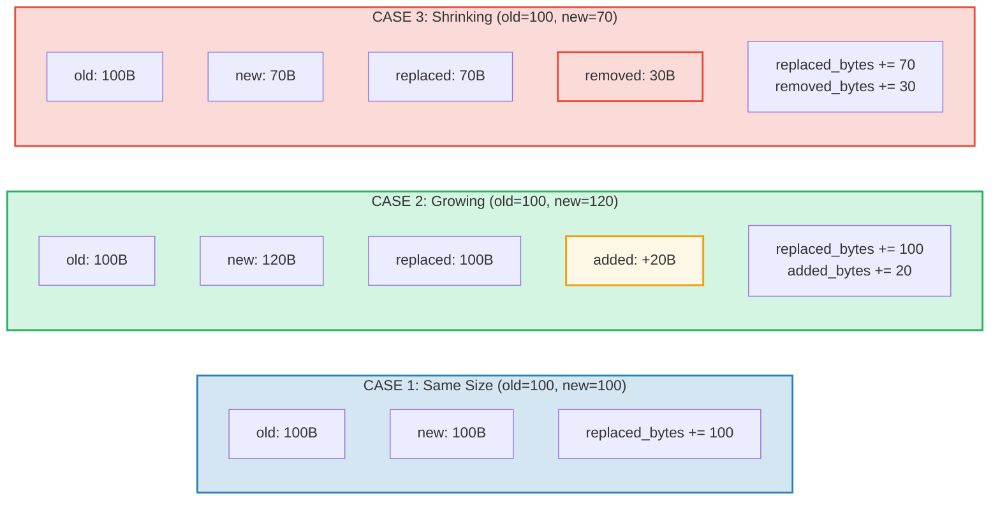

# การติดตามต้นทุน

## โครงสร้าง OperationCost

ทุกการดำเนินการใน GroveDB จะสะสมต้นทุน วัดเป็นทรัพยากรการคำนวณ:

```rust
// costs/src/lib.rs
pub struct OperationCost {
    pub seek_count: u32,              // จำนวนการ seek ที่เก็บข้อมูล
    pub storage_cost: StorageCost,    // ไบต์ที่เพิ่ม/แทนที่/ลบ
    pub storage_loaded_bytes: u64,    // ไบต์ที่อ่านจากดิสก์
    pub hash_node_calls: u32,         // จำนวนรอบแฮช Blake3
    pub sinsemilla_hash_calls: u32,   // จำนวนรอบแฮช Sinsemilla (EC ops)
}
```

> **Sinsemilla hash calls** ติดตามการดำเนินการแฮชบน elliptic curve สำหรับ CommitmentTree anchor สิ่งเหล่านี้มีค่าใช้จ่ายสูงกว่า Blake3 node hash อย่างมาก

ต้นทุน storage แยกย่อยได้อีก:

```rust
// costs/src/storage_cost/mod.rs
pub struct StorageCost {
    pub added_bytes: u32,                   // ข้อมูลใหม่ที่เขียน
    pub replaced_bytes: u32,                // ข้อมูลที่มีอยู่ถูกเขียนทับ
    pub removed_bytes: StorageRemovedBytes, // ข้อมูลที่ถูกปลดปล่อย
}
```

## รูปแบบ CostContext

ทุกการดำเนินการส่งคืนผลลัพธ์ที่ครอบด้วย `CostContext`:

```rust
pub struct CostContext<T> {
    pub value: T,               // ผลลัพธ์ของการดำเนินการ
    pub cost: OperationCost,    // ทรัพยากรที่ใช้ไป
}

pub type CostResult<T, E> = CostContext<Result<T, E>>;
```

สิ่งนี้สร้างรูปแบบการติดตามต้นทุนแบบ **monadic** — ต้นทุนไหลผ่านเชนของการดำเนินการโดยอัตโนมัติ:

```rust
// Unwrap ผลลัพธ์ เพิ่มต้นทุนเข้าตัวสะสม
let result = expensive_operation().unwrap_add_cost(&mut total_cost);

// เชื่อมต่อการดำเนินการ สะสมต้นทุน
let final_result = op1()
    .flat_map(|x| op2(x))      // ต้นทุนจาก op1 + op2
    .flat_map(|y| op3(y));      // + ต้นทุนจาก op3
```

## แมโคร cost_return_on_error!

รูปแบบที่พบบ่อยที่สุดในโค้ด GroveDB คือแมโคร `cost_return_on_error!` ซึ่งทำหน้าที่เหมือน `?` แต่รักษาต้นทุนไว้เมื่อ return ก่อนกำหนด:

```rust
macro_rules! cost_return_on_error {
    ( &mut $cost:ident, $($body:tt)+ ) => {
        {
            let result_with_cost = { $($body)+ };
            let result = result_with_cost.unwrap_add_cost(&mut $cost);
            match result {
                Ok(x) => x,
                Err(e) => return Err(e).wrap_with_cost($cost),
            }
        }
    };
}
```

ในทางปฏิบัติ:

```rust
fn insert_element(&self, path: &[&[u8]], key: &[u8], element: Element) -> CostResult<(), Error> {
    let mut cost = OperationCost::default();

    // การเรียกแมโครแต่ละครั้งเพิ่มต้นทุนของการดำเนินการเข้า `cost`
    // และคืนค่า Ok (หรือ early-return ด้วยต้นทุนสะสมเมื่อเกิด Err)
    let merk = cost_return_on_error!(&mut cost, self.open_merk(path));
    cost_return_on_error!(&mut cost, merk.insert(key, element));
    cost_return_on_error!(&mut cost, self.propagate_changes(path));

    Ok(()).wrap_with_cost(cost)
    // `cost` ตอนนี้มีผลรวมของต้นทุนจากสามการดำเนินการ
}
```

## รายละเอียดต้นทุน Storage

เมื่อค่าถูกอัปเดต ต้นทุนขึ้นอยู่กับว่าค่าใหม่ใหญ่กว่า เล็กกว่า หรือเท่ากับค่าเดิม:



## ต้นทุนการดำเนินการแฮช

ต้นทุนแฮชถูกวัดเป็น "hash node calls" — จำนวนรอบการบีบอัดบล็อกของ Blake3:

| การดำเนินการ | ขนาดอินพุต | จำนวนรอบแฮช |
|-----------|-----------|------------|
| `value_hash(small)` | < 64 ไบต์ | 1 |
| `value_hash(medium)` | 64-127 ไบต์ | 2 |
| `kv_hash` | key + value_hash | แตกต่างกัน |
| `node_hash` | 96 ไบต์ (3 x 32) | 2 (เสมอ) |
| `combine_hash` | 64 ไบต์ (2 x 32) | 1 (เสมอ) |
| `node_hash_with_count` | 104 ไบต์ (3 x 32 + 8) | 2 (เสมอ) |
| Sinsemilla (CommitmentTree) | Pallas curve EC op | ติดตามแยกต่างหากผ่าน `sinsemilla_hash_calls` |

สูตรทั่วไปสำหรับ Blake3:

```text
hash_calls = 1 + (input_bytes - 1) / 64
```

## การประมาณกรณีเลวร้ายที่สุดและกรณีเฉลี่ย

GroveDB มีฟังก์ชันสำหรับ **ประมาณ** ต้นทุนของการดำเนินการก่อนดำเนินการจริง สิ่งนี้สำคัญสำหรับการคำนวณค่าธรรมเนียม blockchain — คุณต้องทราบต้นทุนก่อนที่จะผูกพันจ่าย

```rust
// ต้นทุนกรณีเลวร้ายที่สุดสำหรับการอ่านโหนด
pub fn add_worst_case_get_merk_node(
    cost: &mut OperationCost,
    not_prefixed_key_len: u32,
    max_element_size: u32,
    node_type: NodeType,
) {
    cost.seek_count += 1;  // disk seek หนึ่งครั้ง
    cost.storage_loaded_bytes +=
        TreeNode::worst_case_encoded_tree_size(
            not_prefixed_key_len, max_element_size, node_type
        ) as u64;
}

// ต้นทุนกรณีเลวร้ายที่สุดของการเผยแพร่
pub fn add_worst_case_merk_propagate(
    cost: &mut OperationCost,
    input: &WorstCaseLayerInformation,
) {
    let levels = match input {
        MaxElementsNumber(n) => ((*n + 1) as f32).log2().ceil() as u32,
        NumberOfLevels(n) => *n,
    };
    let mut nodes_updated = levels;

    // AVL rotation อาจอัปเดตโหนดเพิ่มเติม
    if levels > 2 {
        nodes_updated += 2;  // สูงสุด 2 โหนดเพิ่มเติมสำหรับ rotation
    }

    cost.storage_cost.replaced_bytes += nodes_updated * MERK_BIGGEST_VALUE_SIZE;
    cost.storage_loaded_bytes +=
        nodes_updated as u64 * (MERK_BIGGEST_VALUE_SIZE + MERK_BIGGEST_KEY_SIZE) as u64;
    cost.seek_count += nodes_updated;
    cost.hash_node_calls += nodes_updated * 2;
}
```

ค่าคงที่ที่ใช้:

```rust
pub const MERK_BIGGEST_VALUE_SIZE: u32 = u16::MAX as u32;  // 65535
pub const MERK_BIGGEST_KEY_SIZE: u32 = 256;
```

---
