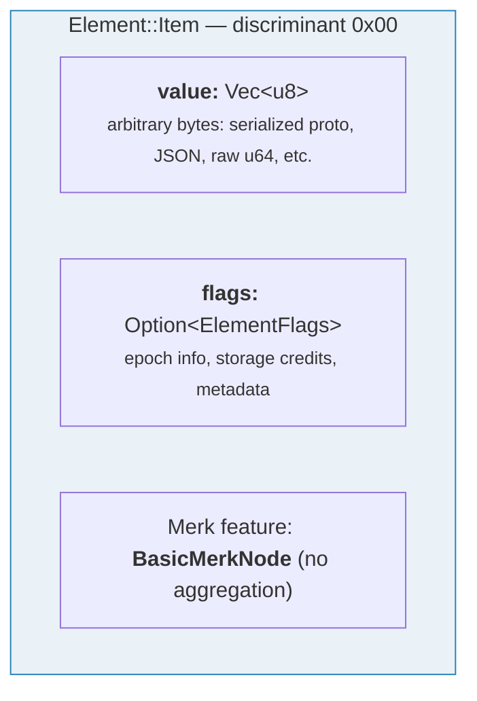
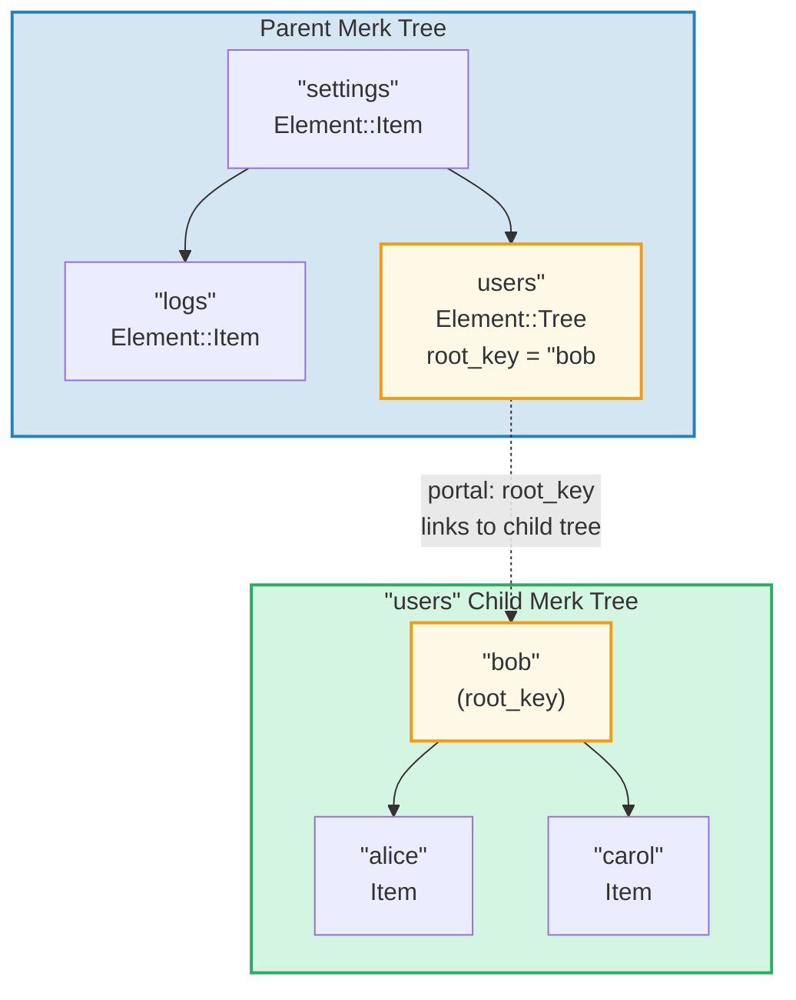
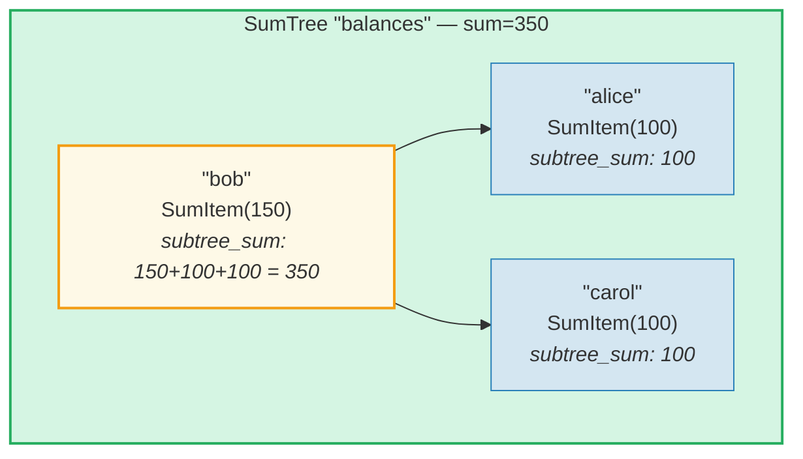
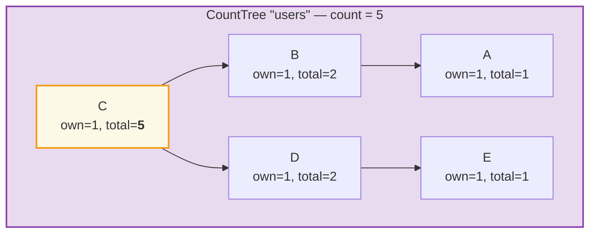
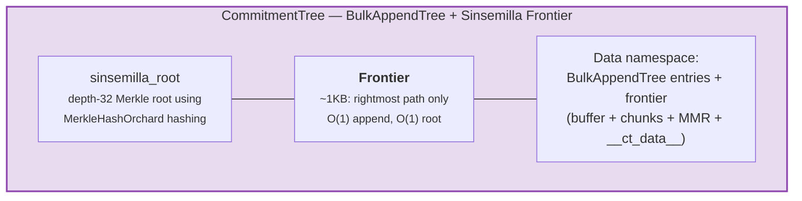

# ระบบ Element

ในขณะที่ Merk จัดการกับคู่ key-value ดิบ GroveDB ทำงานในระดับที่สูงกว่าโดยใช้ **Element** — ค่าที่มีประเภท (typed value) และมีความหมายเชิงสัญลักษณ์ ทุกค่าที่จัดเก็บใน GroveDB คือ Element

## Element Enum

```rust
// grovedb-element/src/element/mod.rs
pub enum Element {
    Item(Vec<u8>, Option<ElementFlags>),                                    // [0]
    Reference(ReferencePathType, MaxReferenceHop, Option<ElementFlags>),    // [1]
    Tree(Option<Vec<u8>>, Option<ElementFlags>),                           // [2]
    SumItem(SumValue, Option<ElementFlags>),                               // [3]
    SumTree(Option<Vec<u8>>, SumValue, Option<ElementFlags>),              // [4]
    BigSumTree(Option<Vec<u8>>, BigSumValue, Option<ElementFlags>),        // [5]
    CountTree(Option<Vec<u8>>, CountValue, Option<ElementFlags>),          // [6]
    CountSumTree(Option<Vec<u8>>, CountValue, SumValue, Option<ElementFlags>), // [7]
    ProvableCountTree(Option<Vec<u8>>, CountValue, Option<ElementFlags>),  // [8]
    ItemWithSumItem(Vec<u8>, SumValue, Option<ElementFlags>),              // [9]
    ProvableCountSumTree(Option<Vec<u8>>, CountValue, SumValue,
                         Option<ElementFlags>),                            // [10]
    CommitmentTree(u64, u8, Option<ElementFlags>),                         // [11]
    MmrTree(u64, Option<ElementFlags>),                                    // [12]
    BulkAppendTree(u64, u8, Option<ElementFlags>),                         // [13]
    DenseAppendOnlyFixedSizeTree(u16, u8, Option<ElementFlags>),           // [14]
}
```

ตัวเลข discriminant (แสดงในวงเล็บ) ใช้ระหว่างการ serialization (อนุกรมข้อมูล)

type alias ที่ใช้ทั่วทั้งโปรเจกต์:

```rust
pub type ElementFlags = Vec<u8>;        // เมตาดาต้าตามอำเภอใจต่อ element
pub type MaxReferenceHop = Option<u8>;  // ขีดจำกัดจำนวนการกระโดดสำหรับ reference (ตัวเลือก)
pub type SumValue = i64;                // ผลรวมแบบมีเครื่องหมาย 64 บิต
pub type BigSumValue = i128;            // ผลรวมแบบมีเครื่องหมาย 128 บิต
pub type CountValue = u64;              // จำนวนนับแบบไม่มีเครื่องหมาย 64 บิต
```

## Item — การจัดเก็บ Key-Value พื้นฐาน

element ที่ง่ายที่สุด จัดเก็บไบต์ตามอำเภอใจ:

```rust
Element::Item(value: Vec<u8>, flags: Option<ElementFlags>)
```



Constructor (ตัวสร้าง):

```rust
Element::new_item(b"hello world".to_vec())
Element::new_item_with_flags(b"data".to_vec(), Some(vec![0x01, 0x02]))
```

Item มีส่วนร่วมในการรวมค่า (sum aggregation): ภายใน SumTree Item จะให้ค่าผลรวมเริ่มต้นเป็น 0 SumItem ให้ค่าที่กำหนดไว้อย่างชัดเจน

## Tree — ตัวบรรจุสำหรับ Subtree

element ชนิด Tree คือ **ประตูทางเข้า (portal)** สู่ Merk tree อีกต้นหนึ่ง โดยจัดเก็บ root key ของต้นไม้ลูก (ถ้ามี):

```rust
Element::Tree(root_key: Option<Vec<u8>>, flags: Option<ElementFlags>)
```



> element ชนิด Tree ใน Merk แม่จะจัดเก็บ `root_key` ของ Merk tree ลูก สิ่งนี้สร้าง **ประตูทางเข้า** — ลิงก์จาก Merk tree หนึ่งไปยังอีกต้นหนึ่ง

เมื่อต้นไม้ว่างเปล่า `root_key` จะเป็น `None` constructor `Element::empty_tree()` สร้าง `Element::Tree(None, None)`

## SumItem / SumTree — ผลรวมแบบรวมค่า

**SumTree** จะรักษาผลรวมของค่า sum-contribution ของลูกทั้งหมดโดยอัตโนมัติ:

```rust
Element::SumTree(root_key: Option<Vec<u8>>, sum: SumValue, flags: Option<ElementFlags>)
Element::SumItem(value: SumValue, flags: Option<ElementFlags>)
```



> **สูตรการรวมค่า:** `node_sum = own_value + left_child_sum + right_child_sum`
> Bob: 150 + 100 (alice) + 100 (carol) = **350** ผลรวมที่ราก (350) ถูกจัดเก็บใน element SumTree ของแม่

ผลรวมถูกรักษาที่ระดับ Merk ผ่าน feature type `TreeFeatureType::SummedMerkNode(i64)` ระหว่างการเผยแพร่ (propagation) ของต้นไม้ aggregate data ของแต่ละโหนดจะถูกคำนวณใหม่:

```text
aggregate_sum = own_sum + left_child_sum + right_child_sum
```

## CountTree, CountSumTree, BigSumTree

ประเภทต้นไม้แบบรวมค่าเพิ่มเติม:

| ประเภท Element | Merk Feature Type | สิ่งที่รวมค่า |
|---|---|---|
| `CountTree` | `CountedMerkNode(u64)` | จำนวน element |
| `CountSumTree` | `CountedSummedMerkNode(u64, i64)` | ทั้งจำนวนนับและผลรวม |
| `BigSumTree` | `BigSummedMerkNode(i128)` | ผลรวม 128 บิตสำหรับค่าขนาดใหญ่ |
| `ProvableCountTree` | `ProvableCountedMerkNode(u64)` | จำนวนนับที่ฝังในแฮช |
| `ProvableCountSumTree` | `ProvableCountedSummedMerkNode(u64, i64)` | จำนวนนับในแฮช + ผลรวม |

**ProvableCountTree** มีความพิเศษ: จำนวนนับถูกรวมในการคำนวณ `node_hash` (ผ่าน `node_hash_with_count`) ดังนั้น proof สามารถตรวจสอบจำนวนนับได้โดยไม่ต้องเปิดเผยค่าใด ๆ

## การอนุกรม (Serialization) ของ Element

Element ถูก serialize โดยใช้ **bincode** ด้วยลำดับไบต์แบบ big-endian:

```rust
pub fn serialize(&self, grove_version: &GroveVersion) -> Result<Vec<u8>, ElementError> {
    let config = config::standard().with_big_endian().with_no_limit();
    bincode::encode_to_vec(self, config)
}
```

ไบต์แรกคือ **discriminant** ทำให้ตรวจจับประเภทได้ใน O(1):

```rust
pub fn from_serialized_value(value: &[u8]) -> Option<ElementType> {
    match value.first()? {
        0 => Some(ElementType::Item),
        1 => Some(ElementType::Reference),
        2 => Some(ElementType::Tree),
        3 => Some(ElementType::SumItem),
        // ... ฯลฯ
    }
}
```

## TreeFeatureType และการไหลของ Aggregate Data

enum `TreeFeatureType` เชื่อมช่องว่างระหว่าง GroveDB Element และ Merk node:

```rust
pub enum TreeFeatureType {
    BasicMerkNode,                              // ไม่มีการรวมค่า
    SummedMerkNode(i64),                       // รวมผลรวม
    BigSummedMerkNode(i128),                   // ผลรวมขนาดใหญ่
    CountedMerkNode(u64),                      // นับจำนวน
    CountedSummedMerkNode(u64, i64),           // นับ + ผลรวม
    ProvableCountedMerkNode(u64),              // จำนวนนับในแฮช
    ProvableCountedSummedMerkNode(u64, i64),   // จำนวนนับในแฮช + ผลรวม
}
```

Aggregate data ไหล **ขึ้น** ผ่านต้นไม้:



> **ตารางการรวมค่า:** aggregate ของแต่ละโหนด = own(1) + left_aggregate + right_aggregate
>
> | โหนด | own | left_agg | right_agg | total |
> |------|-----|----------|-----------|-------|
> | A | 1 | 0 | 0 | 1 |
> | B | 1 | 1 (A) | 0 | 2 |
> | E | 1 | 0 | 0 | 1 |
> | D | 1 | 0 | 1 (E) | 2 |
> | C | 1 | 2 (B) | 2 (D) | **5** (root) |

จำนวนนับที่จัดเก็บในแต่ละโหนดแสดงจำนวนรวมใน subtree ที่มีรากเป็นโหนดนั้น รวมตัวมันเอง จำนวนนับของโหนดรากคือจำนวนรวมสำหรับทั้งต้นไม้

enum `AggregateData` พาข้อมูลนี้ผ่านระบบ Link:

```rust
pub enum AggregateData {
    NoAggregateData,
    Sum(i64),
    BigSum(i128),
    Count(u64),
    CountAndSum(u64, i64),
    ProvableCount(u64),
    ProvableCountAndSum(u64, i64),
}
```

## CommitmentTree — ต้นไม้ Commitment แบบ Sinsemilla

**CommitmentTree** ให้ Sinsemilla Merkle tree ความลึก 32 ระดับสำหรับติดตาม note commitment anchor (จุดยึดการผูกพันบันทึก) ตามที่ใช้ในโปรโตคอล Orchard shielded ของ Zcash มันครอบ `incrementalmerkletree::Frontier<MerkleHashOrchard, 32>` สำหรับการ append (เพิ่มท้าย) และการคำนวณ root แบบ O(1):

```rust
Element::CommitmentTree(
    total_count: u64,               // จำนวน commitment ที่ถูก append
    chunk_power: u8,                // ขนาดการบีบอัดของ BulkAppendTree (chunk_size = 2^chunk_power)
    flags: Option<ElementFlags>,
)                                   // discriminant [11]
```

> **หมายเหตุ:** Sinsemilla frontier root hash ไม่ได้ถูกจัดเก็บใน Element มันถูกเก็บใน data storage (ที่เก็บข้อมูล) และไหลผ่านกลไก Merk child hash (`insert_subtree`'s `subtree_root_hash` parameter) การเปลี่ยนแปลงใด ๆ กับ frontier จะเผยแพร่ขึ้นผ่านลำดับชั้น GroveDB Merk โดยอัตโนมัติ



**สถาปัตยกรรม:**
- *frontier* (เส้นทางด้านขวาสุดของ Merkle tree ขนาดคงที่ ~1KB) ถูกจัดเก็บใน **data namespace** ด้วย key `COMMITMENT_TREE_DATA_KEY`
- ข้อมูล note จริง (`cmx || ciphertext`) ถูกจัดเก็บผ่าน **BulkAppendTree** ใน **data namespace** — บีบอัดเป็น chunk สามารถดึงข้อมูลตามตำแหน่ง
- anchor ในอดีตถูกติดตามโดย Platform ในต้นไม้ provable แยกต่างหาก
- Sinsemilla root ไม่ได้ถูกเก็บใน Element — มันไหลเป็น Merk child hash ผ่านลำดับชั้นแฮชของ GroveDB

**การดำเนินการ:**
- `commitment_tree_insert(path, key, cmx, ciphertext, tx)` — Typed append ที่รับ `TransmittedNoteCiphertext<M>`; คืนค่า `(new_root, position)`
- `commitment_tree_anchor(path, key, tx)` — ดึง Orchard Anchor ปัจจุบัน
- `commitment_tree_get_value(path, key, position, tx)` — ดึงค่าตามตำแหน่ง
- `commitment_tree_count(path, key, tx)` — ดึงจำนวนรายการทั้งหมด

**MemoSize generic:** `CommitmentTree<S, M: MemoSize = DashMemo>` ตรวจสอบว่า payload ของ ciphertext ตรงกับขนาดที่คาดหวังสำหรับ `M` สำหรับ Dash (memo 36 ไบต์): `epk_bytes (32) + enc_ciphertext (104) + out_ciphertext (80) = 216 ไบต์`

**การติดตามต้นทุน:** การดำเนินการแฮช Sinsemilla ถูกติดตามผ่าน `cost.sinsemilla_hash_calls` การคำนวณ root จะผ่าน 32 ระดับเสมอ Ommer merge จะ cascade ตาม `trailing_ones()` ของตำแหน่งก่อนหน้า การดำเนินการ BulkAppendTree เพิ่มต้นทุนแฮช Blake3

## MmrTree — Merkle Mountain Range

**MmrTree** จัดเก็บข้อมูลใน Merkle Mountain Range (MMR) แบบ append-only โดยใช้การแฮช Blake3 โหนด MMR ถูกจัดเก็บในคอลัมน์ **data** (เดียวกับ Merk node) ไม่ได้อยู่ใน Merk subtree ลูก ดู **[บทที่ 13](#chapter-13-the-mmr-tree--append-only-authenticated-logs)** สำหรับรายละเอียดเชิงลึกเกี่ยวกับวิธีการทำงานของ MMR วิธีการเติม วิธีการสร้างและตรวจสอบ proof และวิธีที่ MmrTree ผนวกเข้ากับ GroveDB

```rust
Element::MmrTree(
    mmr_size: u64,                  // ขนาด MMR ภายใน (จำนวนโหนด ไม่ใช่จำนวนใบ)
    flags: Option<ElementFlags>,
)                                   // discriminant [12]
```

> **หมายเหตุ:** MMR root hash ไม่ได้ถูกจัดเก็บใน Element มันไหลเป็น Merk child hash ผ่าน parameter `subtree_root_hash` ของ `insert_subtree`

**การดำเนินการ:** `mmr_tree_append`, `mmr_tree_root_hash`, `mmr_tree_get_value`, `mmr_tree_leaf_count` **Proof:** V1 proof (ดู 9.6 และ 13.9)

## BulkAppendTree — โครงสร้างแบบ Append-Only สองระดับ

**BulkAppendTree** รวมบัฟเฟอร์ dense Merkle tree กับ chunk-level MMR เพื่อการ append ที่มีประสิทธิภาพสูงพร้อม range proof ที่พิสูจน์ได้ เป็น non-Merk tree — ข้อมูลอยู่ใน **data** namespace ไม่ได้อยู่ใน Merk subtree ลูก ดู **[บทที่ 14](#chapter-14-the-bulkappendtree--high-throughput-append-only-storage)** สำหรับรายละเอียดเชิงลึกเกี่ยวกับสถาปัตยกรรมสองระดับ การบีบอัด chunk การสร้าง proof การตรวจสอบ และการผนวกเข้ากับ GroveDB

```rust
Element::BulkAppendTree(
    total_count: u64,               // จำนวนค่าทั้งหมดที่ถูก append
    chunk_power: u8,                // ความสูงของ dense tree (ความจุบัฟเฟอร์ = 2^chunk_power - 1)
    flags: Option<ElementFlags>,
)                                   // discriminant [13]
```

> **หมายเหตุ:** state root (`blake3("bulk_state" || mmr_root || dense_tree_root)`) ไม่ได้ถูกจัดเก็บใน Element มันไหลเป็น Merk child hash ผ่าน parameter `subtree_root_hash` ของ `insert_subtree`

**การดำเนินการ:** `bulk_append`, `bulk_get_value`, `bulk_get_chunk`, `bulk_get_buffer`, `bulk_count`, `bulk_chunk_count`
**Proof:** V1 range proof (ดู 9.6 และ 14.10)

## DenseAppendOnlyFixedSizeTree — ที่เก็บข้อมูลแน่นความจุคงที่

**DenseAppendOnlyFixedSizeTree** คือ complete binary tree ที่มีความสูงคงที่ *h* ซึ่งทุกโหนด (ทั้ง internal และ leaf) จัดเก็บค่าข้อมูล ตำแหน่งถูกเติมตามลำดับ level-order (BFS) root hash ถูกคำนวณใหม่แบบ on the fly — ไม่มีแฮชตัวกลางถูกเก็บถาวร ดู **[บทที่ 16](#chapter-16-the-denseappendonlyfixedsizetree--dense-fixed-capacity-merkle-storage)** สำหรับรายละเอียดเชิงลึกทั้งหมด

```rust
Element::DenseAppendOnlyFixedSizeTree(
    count: u16,                     // จำนวนค่าที่จัดเก็บ (สูงสุด 65,535)
    height: u8,                     // ความสูงของต้นไม้ (1..=16, ไม่เปลี่ยนแปลง), ความจุ = 2^h - 1
    flags: Option<ElementFlags>,
)                                   // discriminant [14]
```

> **หมายเหตุ:** root hash ไม่ได้ถูกจัดเก็บใน Element — มันถูกคำนวณใหม่แบบ on the fly และไหลเป็น Merk child hash ฟิลด์ `count` เป็น `u16` (ไม่ใช่ u64) ทำให้ต้นไม้จำกัดที่ 65,535 ตำแหน่ง ความสูงถูกจำกัดที่ 1..=16

**การดำเนินการ:** `dense_tree_insert`, `dense_tree_get`, `dense_tree_root_hash`, `dense_tree_count`
**Proof:** ระดับ element เท่านั้น (ยังไม่มี subquery proof)

## Non-Merk Tree — รูปแบบร่วม

CommitmentTree, MmrTree, BulkAppendTree และ DenseAppendOnlyFixedSizeTree มีรูปแบบสถาปัตยกรรมร่วมที่แยกพวกมันออกจากประเภทต้นไม้ที่ใช้ Merk (Tree, SumTree, CountTree ฯลฯ):

| คุณสมบัติ | ต้นไม้แบบ Merk | ต้นไม้แบบ Non-Merk |
|----------|-----------------|-------------------|
| Child Merk subtree | ใช่ (`root_key = Some(...)`) | ไม่ (ไม่มีฟิลด์ root_key) |
| การจัดเก็บข้อมูล | คู่ key-value ของ Merk | blob ในคอลัมน์ data (key ที่ไม่ใช่ Merk) |
| การผูก root hash | `combine_hash(elem_hash, child_root_hash)` | `combine_hash(elem_hash, type_specific_root)` |
| Type-specific root | ดูแลโดย Merk AVL | ไหลเป็น Merk child hash (ไม่อยู่ในไบต์ element) |
| รูปแบบ proof | V0 (layer-by-layer Merk) | V1 (type-specific proof) |
| TreeFeatureType | BasicMerkNode (ไม่มีการรวมค่า) | BasicMerkNode |

> **หมายเหตุเกี่ยวกับคอลัมน์จัดเก็บ:** ต้นไม้ non-Merk ทั้งสี่ประเภท (MmrTree, CommitmentTree, BulkAppendTree, DenseAppendOnlyFixedSizeTree) จัดเก็บข้อมูลในคอลัมน์ **data** โดยใช้ key ที่ไม่ใช่ Merk CommitmentTree จัดเก็บ Sinsemilla frontier ร่วมกับ BulkAppendTree entry ในคอลัมน์ **data** เดียวกัน (key `b"__ct_data__"`)

Type-specific root (sinsemilla root, MMR root, state root หรือ dense tree root hash) ไม่ได้ถูกจัดเก็บใน Element แต่มันไหลเป็น Merk **child hash** ผ่าน parameter `subtree_root_hash` ของ `insert_subtree` ค่า combined_value_hash ของ Merk จะกลายเป็น `combine_hash(value_hash(element_bytes), type_specific_root)` การเปลี่ยนแปลงใด ๆ กับ type-specific root จะเปลี่ยน child hash ซึ่งเปลี่ยน combined_value_hash ซึ่งเผยแพร่ขึ้นผ่านลำดับชั้นแฮชของ GroveDB — รักษาความสมบูรณ์ทางการเข้ารหัส

---
