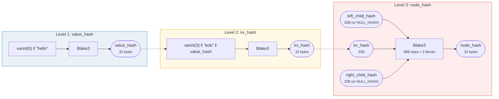
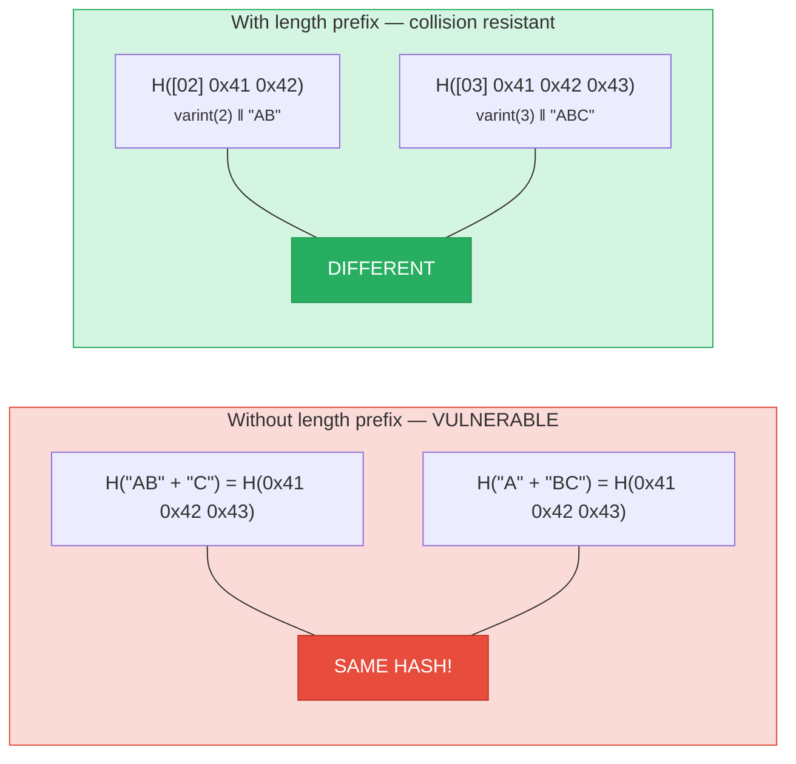
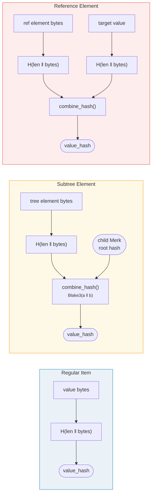

# การแฮช — ความสมบูรณ์ทางการเข้ารหัส

ทุกโหนดใน Merk tree จะถูกแฮชเพื่อสร้าง **root hash (แฮชราก)** — ค่าขนาด 32 ไบต์เพียงค่าเดียวที่รับรองต้นไม้ทั้งต้น การเปลี่ยนแปลงใด ๆ กับ key, ค่า หรือความสัมพันธ์เชิงโครงสร้าง จะทำให้ root hash แตกต่างออกไป

## ลำดับชั้นการแฮชสามระดับ

Merk ใช้ระบบการแฮชสามระดับ จากด้านในสู่ด้านนอก:

ตัวอย่าง: key = `"bob"` (3 ไบต์), value = `"hello"` (5 ไบต์):



> ROOT ของต้นไม้ = `node_hash` ของโหนดราก — รับรอง **ทุก** key, ค่า และความสัมพันธ์เชิงโครงสร้าง ลูกที่ไม่มีจะใช้ `NULL_HASH = [0x00; 32]`

### ระดับ 1: value_hash

```rust
// merk/src/tree/hash.rs
pub fn value_hash(value: &[u8]) -> CostContext<CryptoHash> {
    let mut hasher = blake3::Hasher::new();
    let val_length = value.len().encode_var_vec();  // การเข้ารหัส Varint
    hasher.update(val_length.as_slice());
    hasher.update(value);
    // ...
}
```

ความยาวของค่าถูก **เข้ารหัสด้วย varint** และนำหน้า สิ่งนี้สำคัญสำหรับ collision resistance (ความต้านทานการชน) — หากไม่มีมัน `H("AB" || "C")` จะเท่ากับ `H("A" || "BC")`

### ระดับ 2: kv_hash

```rust
pub fn kv_hash(key: &[u8], value: &[u8]) -> CostContext<CryptoHash> {
    let mut hasher = blake3::Hasher::new();
    let key_length = key.len().encode_var_vec();
    hasher.update(key_length.as_slice());
    hasher.update(key);
    let vh = value_hash(value);
    hasher.update(vh.as_slice());  // แฮชซ้อน
    // ...
}
```

สิ่งนี้ผูก key กับค่า สำหรับการตรวจสอบ proof ยังมี variant ที่รับ value_hash ที่คำนวณไว้แล้ว:

```rust
pub fn kv_digest_to_kv_hash(key: &[u8], value_hash: &CryptoHash) -> CostContext<CryptoHash>
```

ใช้เมื่อผู้ตรวจสอบ (verifier) มี value_hash อยู่แล้ว (เช่น สำหรับ subtree ที่ value_hash เป็น combined hash)

### ระดับ 3: node_hash

```rust
pub fn node_hash(
    kv: &CryptoHash,
    left: &CryptoHash,
    right: &CryptoHash,
) -> CostContext<CryptoHash> {
    let mut hasher = blake3::Hasher::new();
    hasher.update(kv);       // 32 ไบต์
    hasher.update(left);     // 32 ไบต์
    hasher.update(right);    // 32 ไบต์ — รวม 96 ไบต์
    // แฮชเสมอ 2 ครั้ง (96 ไบต์ / 64-byte block = 2)
}
```

ถ้าลูกไม่มี แฮชของมันคือ **NULL_HASH** — 32 ไบต์ศูนย์:

```rust
pub const NULL_HASH: CryptoHash = [0; HASH_LENGTH];  // [0u8; 32]
```

## Blake3 เป็นฟังก์ชันแฮช

GroveDB ใช้ **Blake3** สำหรับการแฮชทั้งหมด คุณสมบัติหลัก:

- **เอาต์พุต 256 บิต** (32 ไบต์)
- **ขนาดบล็อก**: 64 ไบต์
- **ความเร็ว**: เร็วกว่า SHA-256 ประมาณ 3 เท่าบนฮาร์ดแวร์สมัยใหม่
- **สตรีมมิ่ง**: สามารถป้อนข้อมูลเข้าแบบทีละส่วนได้

ต้นทุนของการดำเนินการแฮชถูกคำนวณจากจำนวนบล็อก 64 ไบต์ที่ประมวลผล:

```rust
let hashes = 1 + (hasher.count() - 1) / 64;  // จำนวนรอบการแฮช
```

## การเข้ารหัส Length-Prefix เพื่อ Collision Resistance

ทุกอินพุตที่มีความยาวไม่คงที่จะถูกนำหน้าด้วยความยาวโดยใช้ **การเข้ารหัส varint**:



> **อินพุต value_hash**: `[varint(value.len)] [value bytes]`
> **อินพุต kv_hash**: `[varint(key.len)] [key bytes] [value_hash: 32 bytes]`

หากไม่มี length prefix ผู้โจมตีสามารถสร้างคู่ key-value ที่แตกต่างกันแต่ให้ digest เดียวกัน length prefix ทำให้สิ่งนี้เป็นไปไม่ได้ทางการเข้ารหัส

## การแฮชแบบรวม (Combined Hashing) สำหรับ Element พิเศษ

สำหรับ **subtree** และ **reference** ค่า `value_hash` ไม่ใช่แค่ `H(value)` เพียงอย่างเดียว แต่เป็น **combined hash (แฮชรวม)** ที่ผูก element กับเป้าหมาย:



> **Subtree:** ผูก root hash ของ Merk ลูกเข้ากับแม่ **Reference:** ผูกทั้งเส้นทาง reference และค่าเป้าหมาย การเปลี่ยนอย่างใดอย่างหนึ่งจะเปลี่ยน root hash

ฟังก์ชัน `combine_hash`:

```rust
pub fn combine_hash(hash_one: &CryptoHash, hash_two: &CryptoHash) -> CostContext<CryptoHash> {
    let mut hasher = blake3::Hasher::new();
    hasher.update(hash_one);   // 32 ไบต์
    hasher.update(hash_two);   // 32 ไบต์ — รวม 64 ไบต์ = แฮชพอดี 1 ครั้ง
    // ...
}
```

สิ่งนี้คือสิ่งที่ช่วยให้ GroveDB รับรองลำดับชั้นทั้งหมดผ่าน root hash เดียว — value_hash ของต้นไม้แม่สำหรับ subtree element จะรวม root hash ของต้นไม้ลูกไว้ด้วย

## การแฮชแบบรวมค่าสำหรับ ProvableCountTree

โหนด `ProvableCountTree` จะรวมจำนวนรวม (aggregate count) ไว้ใน node hash:

```rust
pub fn node_hash_with_count(
    kv: &CryptoHash,
    left: &CryptoHash,
    right: &CryptoHash,
    count: u64,
) -> CostContext<CryptoHash> {
    let mut hasher = blake3::Hasher::new();
    hasher.update(kv);                        // 32 ไบต์
    hasher.update(left);                      // 32 ไบต์
    hasher.update(right);                     // 32 ไบต์
    hasher.update(&count.to_be_bytes());      // 8 ไบต์ — รวม 104 ไบต์
    // ยังคงแฮชพอดี 2 ครั้ง (104 < 128 = 2 x 64)
}
```

ซึ่งหมายความว่า proof ของจำนวนไม่ต้องเปิดเผยข้อมูลจริง — จำนวนถูกฝังอยู่ในการรับรองทางการเข้ารหัส (cryptographic commitment) แล้ว

---
