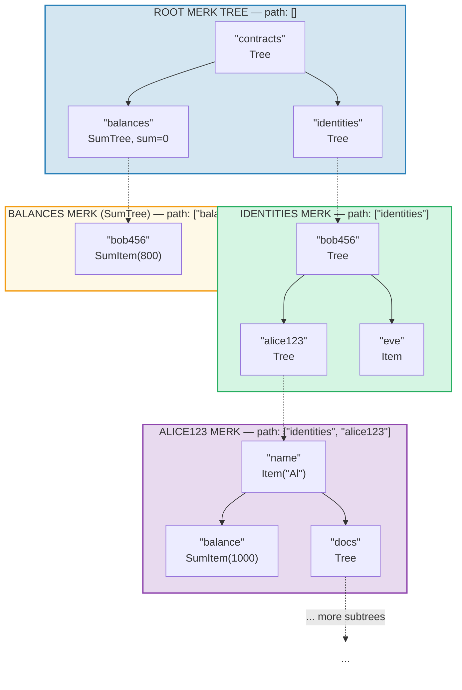
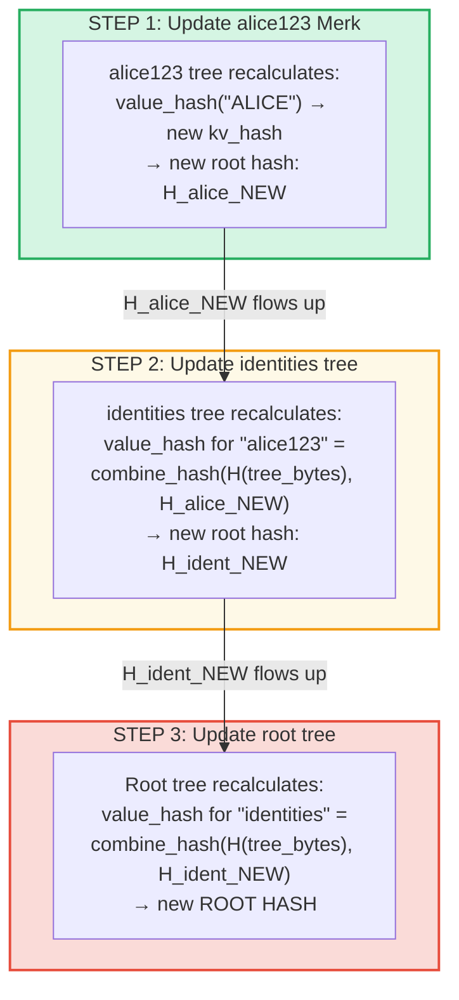
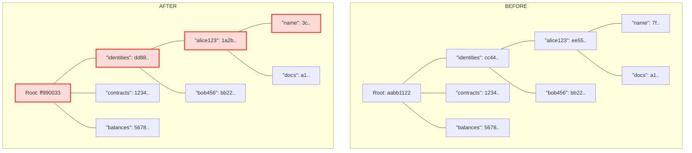
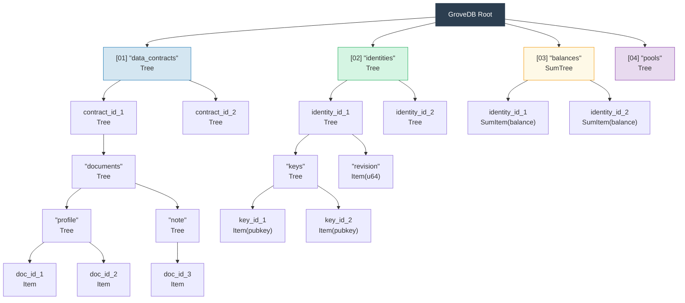

# โครงสร้าง Grove แบบลำดับชั้น — ต้นไม้ของต้นไม้

## Subtree ซ้อนกันภายในต้นไม้แม่อย่างไร

คุณลักษณะที่โดดเด่นของ GroveDB คือ Merk tree สามารถมี element ที่ตัวเองก็เป็น Merk tree ได้ สิ่งนี้สร้าง **namespace แบบลำดับชั้น (hierarchical namespace)**:



> กล่องสีแต่ละกล่องคือ Merk tree แยกกัน ลูกศรเส้นประแสดงลิงก์ portal (ประตูทางเข้า) จาก element ชนิด Tree ไปยัง Merk tree ลูก เส้นทาง (path) ไปยังแต่ละ Merk แสดงอยู่ในป้ายชื่อ

## ระบบการระบุที่อยู่ด้วย Path

ทุก element ใน GroveDB ถูกระบุที่อยู่ด้วย **path (เส้นทาง)** — ลำดับของสตริงไบต์ที่นำทางจากรากผ่าน subtree ไปยัง key เป้าหมาย:

```text
    Path: ["identities", "alice123", "name"]

    ขั้นตอน 1: ในต้นไม้ราก ค้นหา "identities" → element ชนิด Tree
    ขั้นตอน 2: เปิด subtree identities ค้นหา "alice123" → element ชนิด Tree
    ขั้นตอน 3: เปิด subtree alice123 ค้นหา "name" → Item("Alice")
```

Path ถูกแสดงเป็น `Vec<Vec<u8>>` หรือใช้ type `SubtreePath` เพื่อการจัดการที่มีประสิทธิภาพโดยไม่ต้องจัดสรรหน่วยความจำ:

```rust
// เส้นทางไปยัง element (ทุกส่วนยกเว้นส่วนสุดท้าย)
let path: &[&[u8]] = &[b"identities", b"alice123"];
// key ภายใน subtree สุดท้าย
let key: &[u8] = b"name";
```

## การสร้าง Prefix ด้วย Blake3 สำหรับการแยก Storage

แต่ละ subtree ใน GroveDB ได้ **namespace ที่เก็บข้อมูลที่แยกจากกัน** ใน RocksDB namespace ถูกกำหนดโดยการแฮช path ด้วย Blake3:

```rust
pub type SubtreePrefix = [u8; 32];

// prefix ถูกคำนวณโดยการแฮชส่วนของ path
// storage/src/rocksdb_storage/storage.rs
```

ตัวอย่าง:

```text
    Path: ["identities", "alice123"]
    Prefix: Blake3(["identities", "alice123"]) = [0xab, 0x3f, ...]  (32 ไบต์)

    ใน RocksDB key สำหรับ subtree นี้ถูกจัดเก็บเป็น:
    [prefix: 32 bytes][original_key]

    ดังนั้น "name" ใน subtree นี้จะกลายเป็น:
    [0xab, 0x3f, ...][0x6e, 0x61, 0x6d, 0x65]  ("name")
```

สิ่งนี้รับประกัน:
- ไม่มีการชนกันของ key ระหว่าง subtree (prefix 32 ไบต์ = การแยก 256 บิต)
- การคำนวณ prefix ที่มีประสิทธิภาพ (แฮช Blake3 เดียวบนไบต์ path)
- ข้อมูล subtree อยู่ใกล้กันใน RocksDB เพื่อประสิทธิภาพของ cache

## การเผยแพร่ Root Hash ผ่านลำดับชั้น

เมื่อค่าเปลี่ยนแปลงลึกใน grove การเปลี่ยนแปลงต้อง **เผยแพร่ขึ้น (propagate upward)** เพื่ออัปเดต root hash:

```text
    การเปลี่ยนแปลง: อัปเดต "name" เป็น "ALICE" ใน identities/alice123/

    ขั้นตอน 1: อัปเดตค่าใน Merk tree ของ alice123
            → ต้นไม้ alice123 ได้ root hash ใหม่: H_alice_new

    ขั้นตอน 2: อัปเดต element "alice123" ในต้นไม้ identities
            → value_hash ของต้นไม้ identities สำหรับ "alice123" =
              combine_hash(H(tree_element_bytes), H_alice_new)
            → ต้นไม้ identities ได้ root hash ใหม่: H_ident_new

    ขั้นตอน 3: อัปเดต element "identities" ในต้นไม้ราก
            → value_hash ของต้นไม้รากสำหรับ "identities" =
              combine_hash(H(tree_element_bytes), H_ident_new)
            → ROOT HASH เปลี่ยน
```



**ก่อน เทียบกับ หลัง** — โหนดที่เปลี่ยนถูกทำเครื่องหมายด้วยสีแดง:



> เฉพาะโหนดบนเส้นทางจากค่าที่เปลี่ยนขึ้นไปถึงรากเท่านั้นที่ถูกคำนวณใหม่ โหนดพี่น้อง (sibling) และสาขาอื่นยังคงไม่เปลี่ยนแปลง

การเผยแพร่ถูก implement โดย `propagate_changes_with_transaction` ซึ่งเดินขึ้นจาก path ของ subtree ที่ถูกแก้ไขไปยัง root โดยอัปเดตแฮชของ element แม่ตลอดเส้นทาง

## ตัวอย่างโครงสร้าง Grove หลายระดับ

ต่อไปนี้คือตัวอย่างสมบูรณ์ที่แสดงวิธีที่ Dash Platform จัดโครงสร้าง state ของมัน:



แต่ละกล่องคือ Merk tree แยกกัน ที่ได้รับการรับรองตลอดทางขึ้นไปถึง root hash เดียวที่ validator ทั้งหมดเห็นพ้องกัน

---
