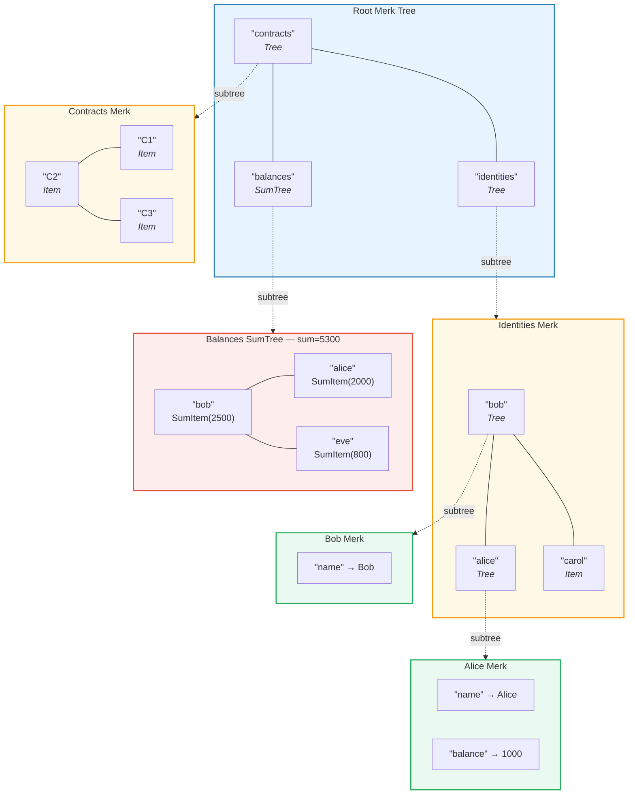
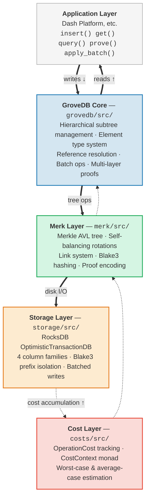

# บทนำ — GroveDB คืออะไร?

## แนวคิดหลัก

GroveDB คือ **โครงสร้างข้อมูลแบบลำดับชั้นที่มีการรับรองความถูกต้อง (hierarchical authenticated data structure)** — โดยพื้นฐานแล้วคือ *grove* (ต้นไม้ของต้นไม้) ที่สร้างบน Merkle AVL tree แต่ละโหนด (node) ในฐานข้อมูลเป็นส่วนหนึ่งของต้นไม้ที่ได้รับการรับรองทางการเข้ารหัส (cryptographically authenticated tree) และแต่ละต้นไม้สามารถมีต้นไม้อื่นเป็นลูกได้ ทำให้เกิดลำดับชั้นลึกของสถานะที่ตรวจสอบได้

> กล่องสีแต่ละกล่องคือ **Merk tree แยกกัน** ลูกศรเส้นประแสดงความสัมพันธ์ subtree (ต้นไม้ย่อย) — element ชนิด Tree ในต้นไม้แม่จะมี root key ของ Merk ลูก

ในฐานข้อมูลแบบดั้งเดิม คุณอาจจัดเก็บข้อมูลใน key-value store แบบแบนราบโดยมี Merkle tree เพียงต้นเดียวอยู่ด้านบนเพื่อการรับรองความถูกต้อง GroveDB ใช้แนวทางที่แตกต่าง: มันซ้อน Merkle tree ไว้ภายใน Merkle tree ซึ่งให้ประโยชน์ดังนี้:

1. **ดัชนีรอง (secondary index) ที่มีประสิทธิภาพ** — สืบค้นด้วยเส้นทาง (path) ใดก็ได้ ไม่จำกัดเฉพาะ primary key
2. **proof (หลักฐาน) ทางการเข้ารหัสที่กระชับ** — พิสูจน์การมีอยู่ (หรือไม่มีอยู่) ของข้อมูลใดก็ได้
3. **ข้อมูลแบบรวม (aggregate data)** — ต้นไม้สามารถรวมค่า นับ หรือคำนวณรวมลูก ๆ ได้โดยอัตโนมัติ
4. **การดำเนินการแบบ atomic ข้ามต้นไม้** — batch operation (การดำเนินการเป็นชุด) สามารถครอบคลุมหลาย subtree ได้

## ทำไม GroveDB จึงถูกสร้างขึ้น

GroveDB ถูกออกแบบมาสำหรับ **Dash Platform** ซึ่งเป็นแพลตฟอร์มแอปพลิเคชันแบบกระจายศูนย์ (decentralized application platform) ที่ทุกชิ้นส่วนของสถานะ (state) ต้อง:

- **รับรองได้ (Authenticated)**: โหนดใดก็ได้สามารถพิสูจน์สถานะใดก็ได้ให้ light client ตรวจสอบ
- **กำหนดผลลัพธ์ได้แน่นอน (Deterministic)**: ทุกโหนดคำนวณ state root เดียวกันเป๊ะ
- **มีประสิทธิภาพ (Efficient)**: การดำเนินการต้องเสร็จภายในเวลาจำกัดของบล็อก
- **สืบค้นได้ (Queryable)**: แอปพลิเคชันต้องการ query (การสืบค้น) ที่หลากหลาย ไม่ใช่แค่ค้นหาด้วย key เพียงอย่างเดียว

แนวทางแบบดั้งเดิมมีข้อจำกัด:

| แนวทาง | ปัญหา |
|----------|---------|
| Plain Merkle Tree | รองรับเฉพาะการค้นหาด้วย key ไม่มี range query |
| Ethereum MPT | การปรับสมดุลมีค่าใช้จ่ายสูง ขนาด proof ใหญ่ |
| Flat key-value + single tree | ไม่มี hierarchical query, proof เดียวครอบคลุมทุกอย่าง |
| B-tree | ไม่ได้ถูก Merklize โดยธรรมชาติ การรับรองมีความซับซ้อน |

GroveDB แก้ปัญหาเหล่านี้โดยรวม **การรับประกันสมดุลที่พิสูจน์แล้วของ AVL tree** เข้ากับ **การซ้อนแบบลำดับชั้น** และ **ระบบประเภท element ที่หลากหลาย**

## ภาพรวมสถาปัตยกรรม

GroveDB ถูกจัดระเบียบเป็นชั้น (layer) ที่แตกต่างกัน โดยแต่ละชั้นมีหน้าที่ชัดเจน:

ข้อมูลไหล **ลง** ผ่านชั้นเหล่านี้ในระหว่างการเขียน และไหล **ขึ้น** ในระหว่างการอ่าน ทุกการดำเนินการจะสะสมต้นทุน (cost) ขณะที่ผ่านแต่ละชั้น ทำให้สามารถคิดค่าใช้จ่ายทรัพยากรได้อย่างแม่นยำ

---
