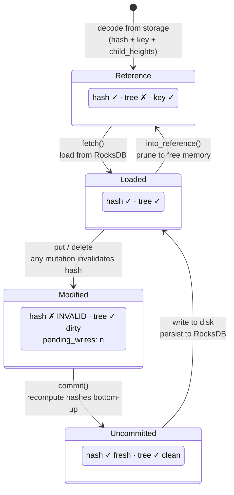
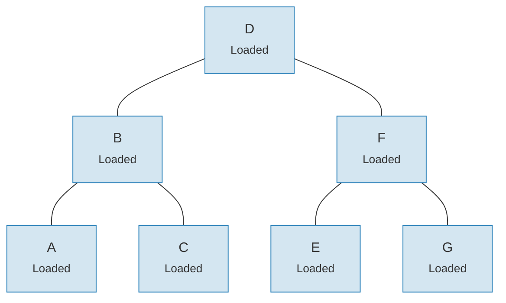
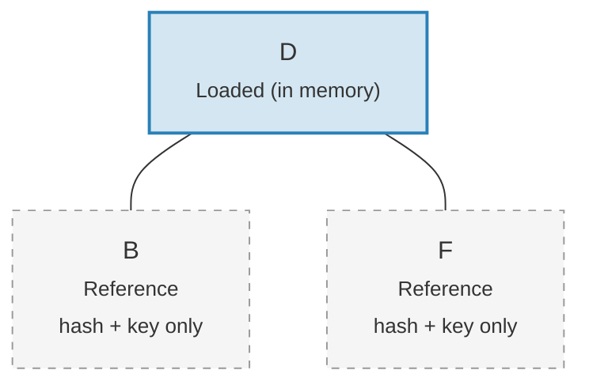

# ระบบ Link — สถาปัตยกรรม Lazy Loading

การโหลด Merk tree ทั้งต้นเข้าหน่วยความจำจะมีค่าใช้จ่ายสูงเกินไปสำหรับต้นไม้ขนาดใหญ่ ระบบ Link แก้ปัญหานี้โดยแสดงการเชื่อมต่อกับลูกในสี่สถานะที่เป็นไปได้ ทำให้สามารถ **lazy loading (โหลดเมื่อจำเป็น)** ได้ — ลูกจะถูกดึงจากที่เก็บข้อมูลเฉพาะเมื่อต้องการจริงเท่านั้น

## สี่สถานะของ Link

```rust
// merk/src/tree/link.rs
pub enum Link {
    Reference {                    // ตัดทิ้ง: มีเฉพาะ metadata ไม่มี tree ในหน่วยความจำ
        hash: CryptoHash,
        child_heights: (u8, u8),
        key: Vec<u8>,
        aggregate_data: AggregateData,
    },
    Modified {                     // เพิ่งเปลี่ยนแปลง ยังไม่ได้คำนวณแฮช
        pending_writes: usize,
        child_heights: (u8, u8),
        tree: TreeNode,
    },
    Uncommitted {                  // แฮชแล้วแต่ยังไม่ได้เขียนลงที่เก็บข้อมูล
        hash: CryptoHash,
        child_heights: (u8, u8),
        tree: TreeNode,
        aggregate_data: AggregateData,
    },
    Loaded {                       // โหลดจากที่เก็บข้อมูลครบถ้วน
        hash: CryptoHash,
        child_heights: (u8, u8),
        tree: TreeNode,
        aggregate_data: AggregateData,
    },
}
```

## แผนภาพการเปลี่ยนสถานะ



## แต่ละสถานะเก็บอะไร

| สถานะ | มีแฮช? | มี Tree ในหน่วยความจำ? | วัตถุประสงค์ |
|-------|-------|-----------------|---------|
| **Reference** | ใช่ | ไม่ | การแสดงผลแบบกระชับบนดิสก์ เก็บเฉพาะ key, hash, child heights และ aggregate data |
| **Modified** | ไม่ | ใช่ | หลังการเปลี่ยนแปลงใด ๆ ติดตามจำนวน `pending_writes` สำหรับการเพิ่มประสิทธิภาพ batch |
| **Uncommitted** | ใช่ | ใช่ | หลังคำนวณแฮชแล้วแต่ก่อนเขียนลงที่เก็บข้อมูล สถานะกลางระหว่าง commit |
| **Loaded** | ใช่ | ใช่ | โหลดเสร็จสมบูรณ์ พร้อมสำหรับการอ่านหรือการแก้ไขเพิ่มเติม |

ฟิลด์ `pending_writes` ใน `Modified` มีความน่าสนใจ:

```rust
// คำนวณเป็น: 1 + left_pending_writes + right_pending_writes
pending_writes: 1 + tree.child_pending_writes(true)
                  + tree.child_pending_writes(false),
```

จำนวนนี้ช่วยขั้นตอน commit ตัดสินใจลำดับการเขียนเพื่อประสิทธิภาพสูงสุด

## รูปแบบ Fetch Callback

ระบบ Link ใช้ **Fetch trait** เพื่อ abstract วิธีการโหลดโหนดลูก:

```rust
pub trait Fetch {
    fn fetch(
        &self,
        link: &Link,
        value_defined_cost_fn: Option<&impl Fn(&[u8], &GroveVersion) -> Option<ValueDefinedCostType>>,
        grove_version: &GroveVersion,
    ) -> CostResult<TreeNode, Error>;
}
```

การ implement Fetch ที่แตกต่างกันมีไว้สำหรับวัตถุประสงค์ที่ต่างกัน:

- **StorageFetch**: โหลดจาก RocksDB (เส้นทางปกติ)
- **PanicSource**: ใช้ในการทดสอบที่ไม่ควรมีการ fetch เกิดขึ้น
- **MockSource**: ส่งคืนข้อมูลทดสอบที่ควบคุมได้

รูปแบบนี้ช่วยให้การดำเนินการกับต้นไม้ **ไม่ขึ้นกับที่เก็บข้อมูล (storage-agnostic)** — ตรรกะการปรับสมดุลและการเปลี่ยนแปลงเดียวกันทำงานได้ไม่ว่าข้อมูลจะมาจากที่ใด

## รูปแบบ Walker

`Walker` ครอบ (wrap) `TreeNode` ด้วย Fetch source เพื่อให้การท่องต้นไม้ (tree traversal) ที่ปลอดภัยพร้อมการ lazy loading อัตโนมัติ (`merk/src/tree/walk/mod.rs`):

```rust
pub struct Walker<S: Fetch + Sized + Clone> {
    tree: Owner<TreeNode>,
    source: S,
}
```

Walker มีสามการดำเนินการหลัก:

**walk()** — แยกลูก แปลงข้อมูล แล้วเชื่อมกลับ:

```rust
pub fn walk<F, T>(self, left: bool, f: F, ...) -> CostResult<Self, Error>
where
    F: FnOnce(Option<Self>) -> CostResult<Option<T>, Error>,
    T: Into<TreeNode>,
```

**detach()** — ถอดลูกออก โหลดจากที่เก็บข้อมูลถ้าจำเป็น:

```rust
pub fn detach(self, left: bool, ...) -> CostResult<(Self, Option<Self>), Error>
```

ถ้าลูกเป็น `Link::Reference` (ถูกตัดทิ้ง) detach จะเรียก `fetch()` เพื่อโหลดก่อน ถ้าลูกอยู่ในหน่วยความจำอยู่แล้ว (`Modified`, `Uncommitted`, `Loaded`) ก็แค่รับความเป็นเจ้าของ (ownership)

**attach()** — เชื่อมลูกกับแม่:

```rust
pub fn attach(self, left: bool, maybe_child: Option<Self>) -> Self
```

การเชื่อมจะสร้าง `Link::Modified` เสมอ เพราะความสัมพันธ์แม่-ลูกได้เปลี่ยนแปลง

## ประสิทธิภาพหน่วยความจำผ่านการตัดทิ้ง (Pruning)

หลัง commit การเปลี่ยนแปลง ต้นไม้สามารถ **ตัดทิ้ง (prune)** subtree ที่โหลดแล้วกลับเป็น `Link::Reference` เพื่อปลดปล่อยหน่วยความจำในขณะที่ยังคงแฮชที่จำเป็นสำหรับการสร้าง proof:

**ก่อนการตัดทิ้ง** — ทั้ง 7 โหนดอยู่ในหน่วยความจำ:



**หลังการตัดทิ้ง** — เฉพาะ root อยู่ในหน่วยความจำ ลูกเป็น `Link::Reference` (แค่ hash + key):



> **Link::Loaded** เก็บ `hash + child_heights + tree (TreeNode)` ส่วน **Link::Reference** เก็บเฉพาะ `hash + child_heights + key` — TreeNode ถูกปลดปล่อยจากหน่วยความจำ

การแปลงนั้นง่าย:

```rust
pub fn into_reference(self) -> Link {
    Link::Reference {
        hash: self.hash(),
        child_heights: self.child_heights(),
        key: self.key().to_vec(),
        aggregate_data: self.aggregate_data(),
    }
}
```

สิ่งนี้สำคัญสำหรับการจำกัดการใช้หน่วยความจำในต้นไม้ขนาดใหญ่ — เฉพาะโหนดที่กำลังถูกเข้าถึงเท่านั้นที่ต้องอยู่ในหน่วยความจำ

---
