# Merk Tree — ต้นไม้ Merkle AVL

Merk tree เป็นหน่วยสร้างพื้นฐานของ GroveDB ทุก subtree (ต้นไม้ย่อย) ใน grove คือ Merk tree — ต้นไม้ค้นหาแบบทวิภาค (binary search tree) ที่ปรับสมดุลตัวเอง โดยทุกโหนดจะถูกแฮชด้วยวิธีการเข้ารหัส ทำให้ได้ root hash (แฮชราก) เพียงค่าเดียวที่รับรองเนื้อหาทั้งหมดของต้นไม้

## Merk Node คืออะไร?

ต่างจากการนำ Merkle tree ไปใช้งานหลายแบบที่ข้อมูลอยู่เฉพาะที่ใบ (leaf) ใน Merk tree **ทุกโหนดจัดเก็บคู่ key-value** ซึ่งหมายความว่าไม่มีโหนดภายใน (internal node) ที่ "ว่างเปล่า" — ต้นไม้เป็นทั้งโครงสร้างค้นหาและที่เก็บข้อมูลพร้อมกัน

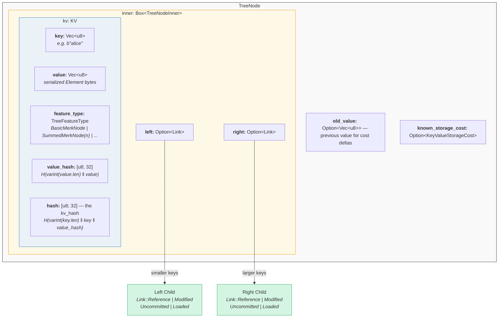

ในโค้ด (`merk/src/tree/mod.rs`):

```rust
pub struct TreeNode {
    pub(crate) inner: Box<TreeNodeInner>,
    pub(crate) old_value: Option<Vec<u8>>,        // ค่าก่อนหน้าสำหรับการติดตามต้นทุน
    pub(crate) known_storage_cost: Option<KeyValueStorageCost>,
}

pub struct TreeNodeInner {
    pub(crate) left: Option<Link>,    // ลูกซ้าย (key ที่เล็กกว่า)
    pub(crate) right: Option<Link>,   // ลูกขวา (key ที่ใหญ่กว่า)
    pub(crate) kv: KV,               // ข้อมูล key-value
}
```

`Box<TreeNodeInner>` เก็บโหนดไว้บน heap ซึ่งจำเป็นเพราะลิงก์ลูกสามารถมี `TreeNode` instance ทั้งตัวแบบเรียกซ้ำ (recursive) ได้

## โครงสร้าง KV

struct `KV` เก็บทั้งข้อมูลดิบและ digest ทางการเข้ารหัส (`merk/src/tree/kv.rs`):

```rust
pub struct KV {
    pub(super) key: Vec<u8>,                        // key สำหรับค้นหา
    pub(super) value: Vec<u8>,                      // ค่าที่จัดเก็บ
    pub(super) feature_type: TreeFeatureType,       // พฤติกรรมการรวมค่า (aggregation)
    pub(crate) value_defined_cost: Option<ValueDefinedCostType>,
    pub(super) hash: CryptoHash,                    // kv_hash
    pub(super) value_hash: CryptoHash,              // H(value)
}
```

สองประเด็นสำคัญ:

1. **Key ไม่ถูกจัดเก็บบนดิสก์เป็นส่วนหนึ่งของโหนดที่ถูก encode** มันถูกจัดเก็บเป็น key ของ RocksDB เมื่อโหนดถูกถอดรหัส (decode) จากที่เก็บข้อมูล key จะถูกแทรกเข้ามาจากภายนอก วิธีนี้หลีกเลี่ยงการซ้ำซ้อนของไบต์ key

2. **มีฟิลด์แฮชสองฟิลด์** `value_hash` คือ `H(value)` และ `hash` (kv_hash) คือ `H(key, value_hash)` การเก็บทั้งสองค่าช่วยให้ระบบ proof สามารถเลือกได้ว่าจะเปิดเผยข้อมูลมากเท่าใด

## ธรรมชาติกึ่งสมดุล — AVL "โยกเยก" อย่างไร

Merk tree คือ **AVL tree** — ต้นไม้ค้นหาแบบทวิภาคที่ปรับสมดุลตัวเองแบบคลาสสิกที่ประดิษฐ์โดย Adelson-Velsky และ Landis เงื่อนไขหลัก (invariant) คือ:

> สำหรับทุกโหนด ความแตกต่างของความสูงระหว่าง subtree ซ้ายและขวาต้องไม่เกิน 1

ซึ่งแสดงเป็น **balance factor (ตัวชี้วัดสมดุล)**:

```text
balance_factor = right_height - left_height
```

ค่าที่ถูกต้อง: **{-1, 0, 1}**

```rust
// merk/src/tree/mod.rs
pub const fn balance_factor(&self) -> i8 {
    let left_height = self.child_height(true) as i8;
    let right_height = self.child_height(false) as i8;
    right_height - left_height
}
```

แต่มีจุดละเอียดอ่อน: แม้แต่ละโหนดจะเอียงได้เพียงหนึ่งระดับ แต่การเอียงเหล่านี้สามารถ **สะสม** ตลอดทั้งต้นไม้ นี่คือเหตุผลที่เราเรียกมันว่า "กึ่งสมดุล" — ต้นไม้ไม่ได้สมดุลอย่างสมบูรณ์เหมือนต้นไม้ทวิภาคแบบสมบูรณ์ (complete binary tree)

พิจารณาต้นไม้ที่มี 10 โหนด ต้นไม้ที่สมดุลอย่างสมบูรณ์จะมีความสูง 4 (ceil(log2(10+1))) แต่ AVL tree อาจมีความสูง 5:

**สมดุลอย่างสมบูรณ์ (ความสูง 4)** — ทุกระดับเต็ม:

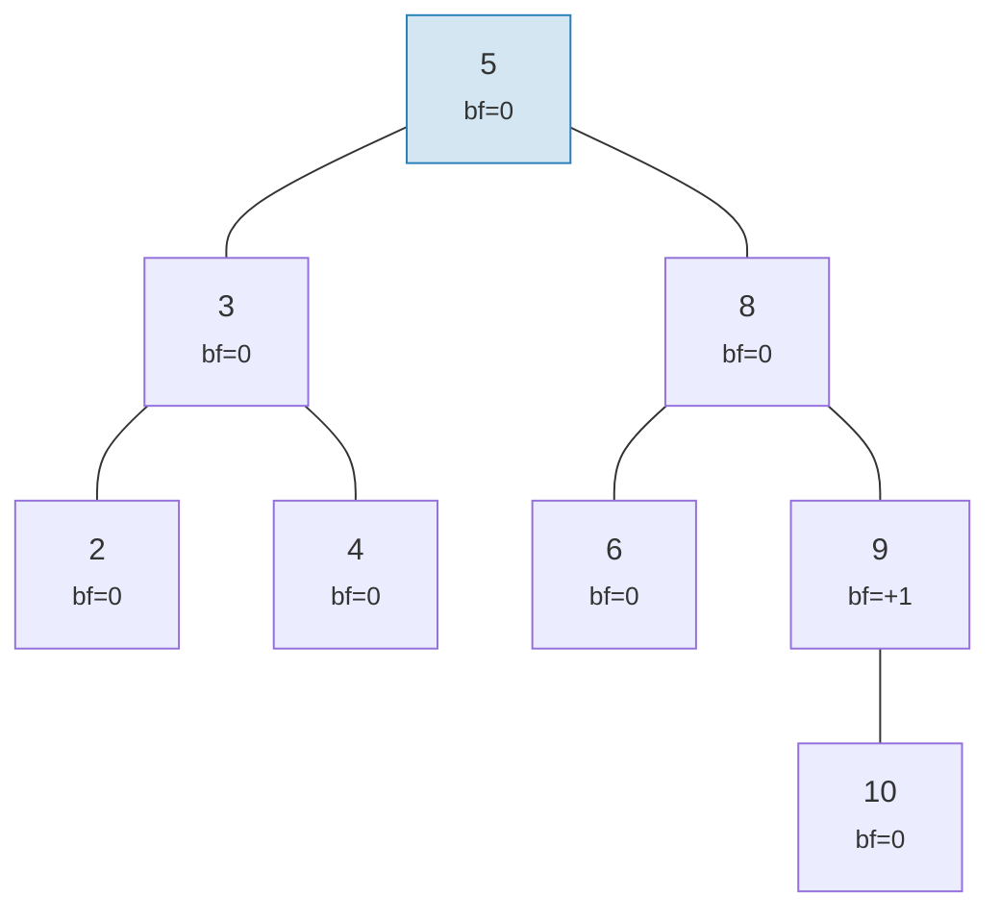

**AVL ที่ถูกต้องแบบ "โยกเยก" (ความสูง 5)** — แต่ละโหนดเอียงไม่เกิน 1 แต่สะสมกัน:

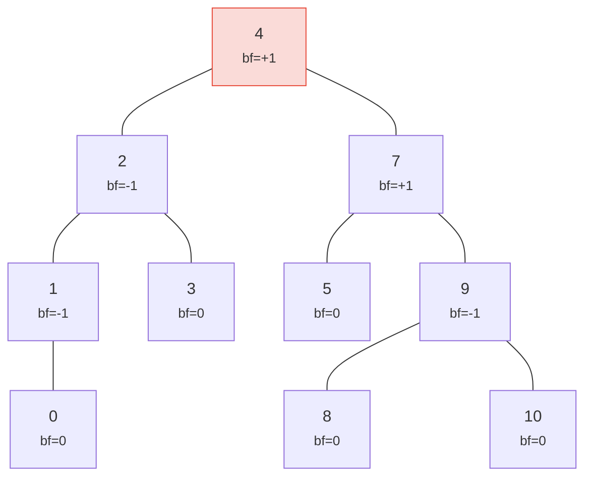

> ความสูง 5 เทียบกับ 4 ที่สมบูรณ์แบบ — นั่นคือ "การโยกเยก" กรณีเลวร้ายที่สุด: h <= 1.44 x log2(n+2)

ต้นไม้ทั้งสองเป็น AVL tree ที่ถูกต้อง! ความสูงกรณีเลวร้ายที่สุดของ AVL tree คือ:

```text
h <= 1.4404 x log2(n + 2) - 0.3277
```

ดังนั้นสำหรับ **n = 1,000,000** โหนด:
- สมดุลสมบูรณ์แบบ: ความสูง 20
- กรณีเลวร้ายที่สุดของ AVL: ความสูง ~29

ค่าใช้จ่ายเพิ่ม ~44% นี้คือราคาของกฎการหมุน (rotation) ที่เรียบง่ายของ AVL ในทางปฏิบัติ การแทรกแบบสุ่มจะสร้างต้นไม้ที่ใกล้เคียงกับสมดุลสมบูรณ์แบบมากกว่า

ต่อไปนี้คือลักษณะของต้นไม้ที่ถูกต้องและไม่ถูกต้อง:

**ถูกต้อง** — balance factor ทั้งหมดอยู่ใน {-1, 0, +1}:

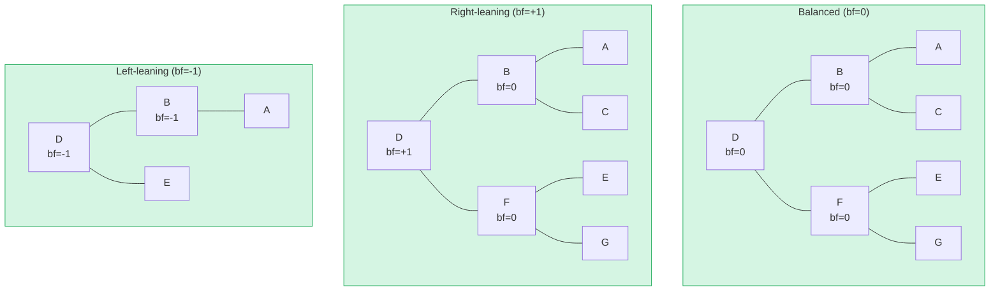

**ไม่ถูกต้อง** — balance factor = +2 (ต้องหมุน!):

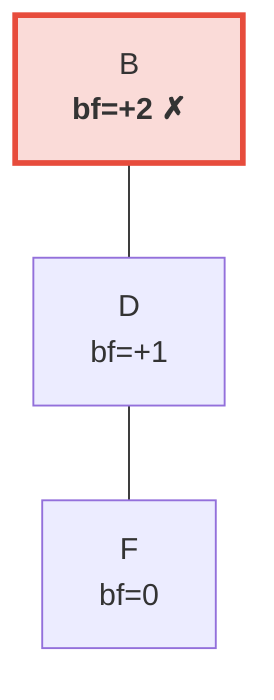

> subtree ด้านขวาสูงกว่าด้านซ้าย (ซึ่งว่างเปล่า) 2 ระดับ สิ่งนี้จะกระตุ้นให้เกิด **left rotation (การหมุนซ้าย)** เพื่อคืนค่า invariant ของ AVL

## การหมุน (Rotation) — คืนสมดุล

เมื่อการแทรกหรือลบทำให้ balance factor ถึง +/-2 ต้นไม้ต้องถูก **หมุน** เพื่อคืนค่า invariant ของ AVL มีสี่กรณี ซึ่งย่อได้เป็นสองการดำเนินการพื้นฐาน

### การหมุนซ้ายเดี่ยว (Single Left Rotation)

ใช้เมื่อโหนด **หนักด้านขวา** (bf = +2) และลูกขวาของมัน **หนักด้านขวาหรือสมดุล** (bf >= 0):

**ก่อน** (bf=+2):

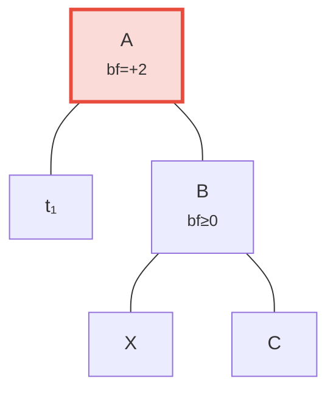

**หลัง** การหมุนซ้าย — B ถูกเลื่อนขึ้นเป็น root:

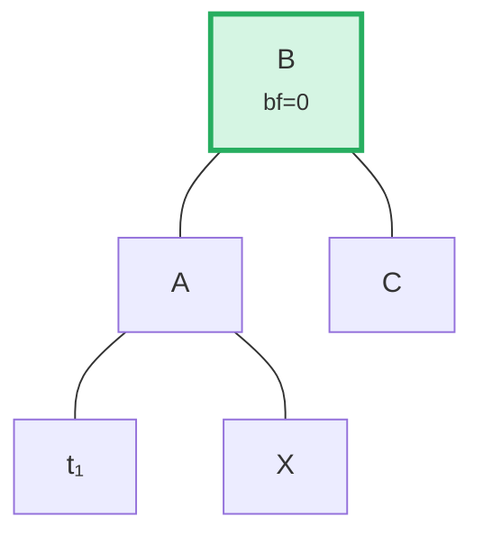

> **ขั้นตอน:** (1) แยก B ออกจาก A (2) แยก X (ลูกซ้ายของ B) (3) เชื่อม X เป็นลูกขวาของ A (4) เชื่อม A เป็นลูกซ้ายของ B subtree ที่มี root เป็น B ตอนนี้สมดุลแล้ว

ในโค้ด (`merk/src/tree/ops.rs`):

```rust
fn rotate<V>(self, left: bool, ...) -> CostResult<Self, Error> {
    // แยกลูกฝั่งที่หนัก
    let (tree, child) = self.detach_expect(left, ...);
    // แยกหลานจากฝั่งตรงข้ามของลูก
    let (child, maybe_grandchild) = child.detach(!left, ...);

    // เชื่อมหลานกับ root ดั้งเดิม
    tree.attach(left, maybe_grandchild)
        .maybe_balance(...)
        .flat_map_ok(|tree| {
            // เชื่อม root ดั้งเดิมเป็นลูกของโหนดที่ถูกเลื่อนขึ้น
            child.attach(!left, Some(tree))
                .maybe_balance(...)
        })
}
```

สังเกตว่า `maybe_balance` ถูกเรียกแบบเรียกซ้ำ (recursive) — การหมุนเองอาจสร้างความไม่สมดุลใหม่ที่ต้องแก้ไขเพิ่มเติม

### การหมุนสองครั้ง (Double Rotation) (ซ้าย-ขวา)

ใช้เมื่อโหนด **หนักด้านซ้าย** (bf = -2) แต่ลูกซ้าย **หนักด้านขวา** (bf > 0) การหมุนเดี่ยวจะไม่แก้ปัญหานี้:

**ขั้นตอนที่ 0: ก่อน** — C หนักด้านซ้าย (bf=-2) แต่ลูกซ้าย A เอียงขวา (bf=+1) การหมุนเดี่ยวไม่สามารถแก้ได้:

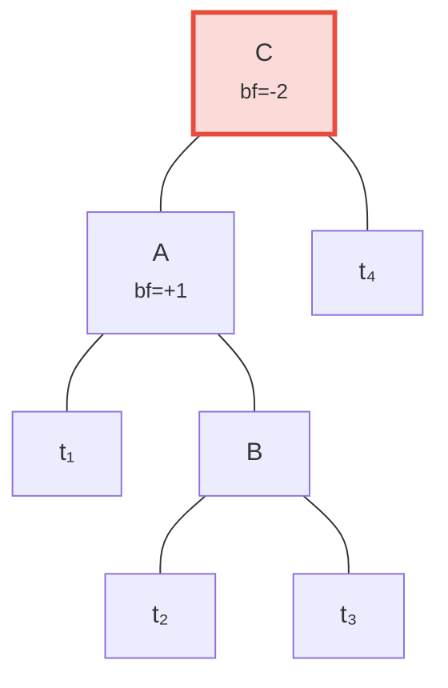

**ขั้นตอนที่ 1: หมุนซ้ายที่ลูก A** — ตอนนี้ทั้ง C และ B เอียงซ้าย แก้ได้ด้วยการหมุนเดี่ยว:

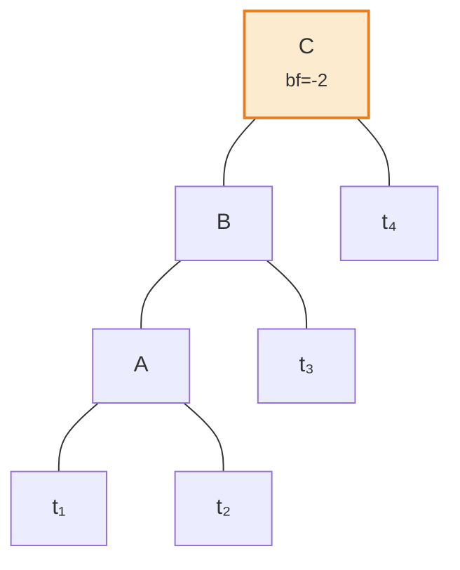

**ขั้นตอนที่ 2: หมุนขวาที่ root C** — สมดุลแล้ว!

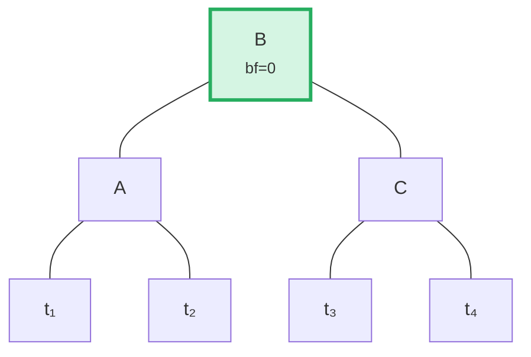

อัลกอริทึมตรวจจับกรณีนี้โดยเปรียบเทียบทิศทางการเอียงของแม่กับ balance factor ของลูก:

```rust
fn maybe_balance<V>(self, ...) -> CostResult<Self, Error> {
    let balance_factor = self.balance_factor();
    if balance_factor.abs() <= 1 {
        return Ok(self);  // สมดุลอยู่แล้ว
    }

    let left = balance_factor < 0;  // true ถ้าหนักด้านซ้าย

    // ต้องหมุนสองครั้งเมื่อลูกเอียงตรงข้ามกับแม่
    let tree = if left == (self.tree().link(left).unwrap().balance_factor() > 0) {
        // การหมุนแรก: หมุนลูกในทิศทางตรงข้าม
        self.walk_expect(left, |child|
            child.rotate(!left, ...).map_ok(Some), ...
        )
    } else {
        self
    };

    // การหมุนที่สอง (หรือเพียงครั้งเดียว)
    tree.rotate(left, ...)
}
```

## การดำเนินการแบบ Batch — การสร้างและการใช้งาน

แทนที่จะแทรก element ทีละตัว Merk รองรับ batch operation (การดำเนินการเป็นชุด) ที่ใช้การเปลี่ยนแปลงหลายอย่างในรอบเดียว สิ่งนี้สำคัญสำหรับประสิทธิภาพ: batch ของ N การดำเนินการบนต้นไม้ที่มี M element ใช้เวลา **O((M + N) log(M + N))** เทียบกับ O(N log M) สำหรับการแทรกแบบต่อเนื่อง

### ประเภท MerkBatch

```rust
type MerkBatch<K> = [(K, Op)];

enum Op {
    Put(Vec<u8>, TreeFeatureType),  // แทรกหรืออัปเดตด้วยค่าและประเภทคุณลักษณะ
    PutWithSpecializedCost(...),     // แทรกด้วยต้นทุนที่กำหนดไว้ล่วงหน้า
    PutCombinedReference(...),       // แทรก reference ด้วยแฮชรวม
    Replace(Vec<u8>, TreeFeatureType),
    Patch { .. },                    // อัปเดตค่าบางส่วน
    Delete,                          // ลบ key
    DeleteLayered,                   // ลบด้วยต้นทุนแบบชั้น
    DeleteMaybeSpecialized,          // ลบด้วยต้นทุนเฉพาะทางแบบตัวเลือก
}
```

### กลยุทธ์ที่ 1: build() — สร้างจากศูนย์

เมื่อต้นไม้ว่างเปล่า `build()` สร้างต้นไม้ที่สมดุลโดยตรงจาก batch ที่เรียงลำดับแล้วโดยใช้อัลกอริทึม **median-split (แบ่งครึ่งตรงกลาง)**:

batch นำเข้า (เรียงลำดับแล้ว): `[A, B, C, D, E, F, G]` — เลือกตรงกลาง (D) เป็น root, เรียกซ้ำกับแต่ละครึ่ง:

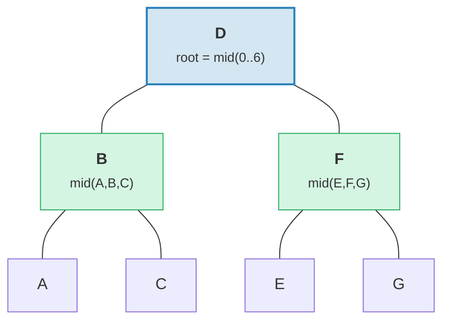

> ผลลัพธ์: ต้นไม้ที่สมดุลอย่างสมบูรณ์แบบด้วยความสูง = 3 = ceil(log2(7))

```rust
fn build(batch: &MerkBatch<K>, ...) -> CostResult<Option<TreeNode>, Error> {
    let mid_index = batch.len() / 2;
    let (mid_key, mid_op) = &batch[mid_index];

    // สร้างโหนด root จาก element ตรงกลาง
    let mid_tree = TreeNode::new(mid_key.clone(), value.clone(), None, feature_type)?;

    // สร้าง subtree ซ้ายและขวาแบบเรียกซ้ำ
    let left = Self::build(&batch[..mid_index], ...);
    let right = Self::build(&batch[mid_index + 1..], ...);

    // เชื่อมลูก
    mid_tree.attach(true, left).attach(false, right)
}
```

วิธีนี้สร้างต้นไม้ที่มีความสูง ceil(log2(n)) — สมดุลอย่างสมบูรณ์แบบ

### กลยุทธ์ที่ 2: apply_sorted() — ผสานเข้ากับต้นไม้ที่มีอยู่

เมื่อต้นไม้มีข้อมูลอยู่แล้ว `apply_sorted()` ใช้ **binary search (การค้นหาแบบทวิภาค)** เพื่อหาว่าแต่ละ batch operation อยู่ตรงไหน จากนั้นใช้การดำเนินการกับ subtree ซ้ายและขวาแบบเรียกซ้ำ:

ต้นไม้ที่มีอยู่พร้อม batch `[(B, Put), (F, Delete)]`:

Binary search: B < D (ไปซ้าย), F > D (ไปขวา)

**ก่อน:**
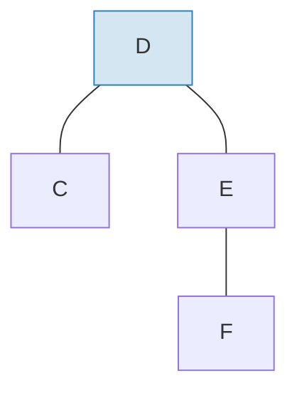

**หลัง** ใช้ batch และปรับสมดุล:
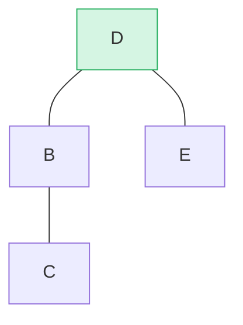

> B ถูกแทรกเป็น subtree ซ้าย, F ถูกลบจาก subtree ขวา `maybe_balance()` ยืนยัน bf(D) = 0

```rust
fn apply_sorted(self, batch: &MerkBatch<K>, ...) -> CostResult<...> {
    let search = batch.binary_search_by(|(key, _)| key.cmp(self.tree().key()));

    match search {
        Ok(index) => {
            // Key ตรงกับโหนดนี้ — ใช้การดำเนินการโดยตรง
            // (Put แทนที่ค่า, Delete ลบโหนด)
        }
        Err(mid) => {
            // ไม่พบ key — mid คือจุดแบ่ง
            // เรียกซ้ำกับ left_batch[..mid] และ right_batch[mid..]
        }
    }

    self.recurse(batch, mid, exclusive, ...)
}
```

method `recurse` แบ่ง batch และเดินไปซ้ายและขวา:

```rust
fn recurse(self, batch: &MerkBatch<K>, mid: usize, ...) {
    let left_batch = &batch[..mid];
    let right_batch = &batch[mid..];  // หรือ mid+1 ถ้า exclusive

    // ใช้ left batch กับ subtree ซ้าย
    let tree = self.walk(true, |maybe_left| {
        Self::apply_to(maybe_left, left_batch, ...)
    });

    // ใช้ right batch กับ subtree ขวา
    let tree = tree.walk(false, |maybe_right| {
        Self::apply_to(maybe_right, right_batch, ...)
    });

    // ปรับสมดุลหลังแก้ไข
    tree.maybe_balance(...)
}
```

### การลบโหนด

เมื่อลบโหนดที่มีลูกสองตัว Merk จะเลื่อน **edge node (โหนดขอบ)** จาก subtree ที่สูงกว่าขึ้นมาแทน วิธีนี้ลดโอกาสที่จะต้องหมุนเพิ่มเติม:

**ก่อน** — ลบ D (มีลูกสองตัว, ความสูง subtree ขวา >= ซ้าย):

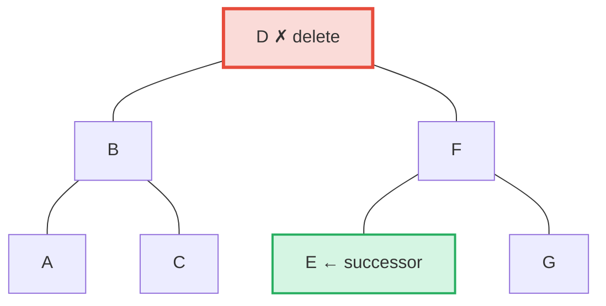

**หลัง** — E (ซ้ายสุดใน subtree ขวา = in-order successor ตัวถัดไปตามลำดับ) ถูกเลื่อนขึ้นมาแทนตำแหน่งของ D:

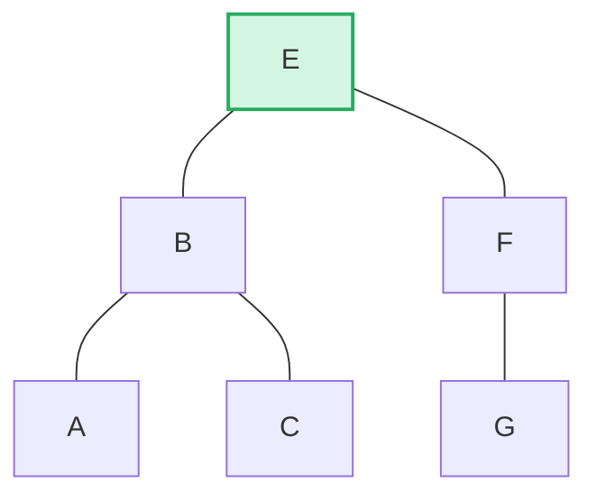

> **กฎ:** ถ้าความสูงซ้าย > ขวา -> เลื่อนขอบขวาของ subtree ซ้ายขึ้น ถ้าความสูงขวา >= ซ้าย -> เลื่อนขอบซ้ายของ subtree ขวาขึ้น วิธีนี้ลดการปรับสมดุลหลังการลบให้น้อยที่สุด

```rust
pub fn remove(self, ...) -> CostResult<Option<Self>, Error> {
    let has_left = tree.link(true).is_some();
    let has_right = tree.link(false).is_some();
    let left = tree.child_height(true) > tree.child_height(false);

    if has_left && has_right {
        // ลูกสองตัว: เลื่อนขอบของลูกที่สูงกว่า
        let (tree, tall_child) = self.detach_expect(left, ...);
        let (_, short_child) = tree.detach_expect(!left, ...);
        tall_child.promote_edge(!left, short_child, ...)
    } else if has_left || has_right {
        // ลูกตัวเดียว: เลื่อนขึ้นมาโดยตรง
        self.detach_expect(left, ...).1
    } else {
        // โหนดใบ: แค่ลบ
        None
    }
}
```

---
