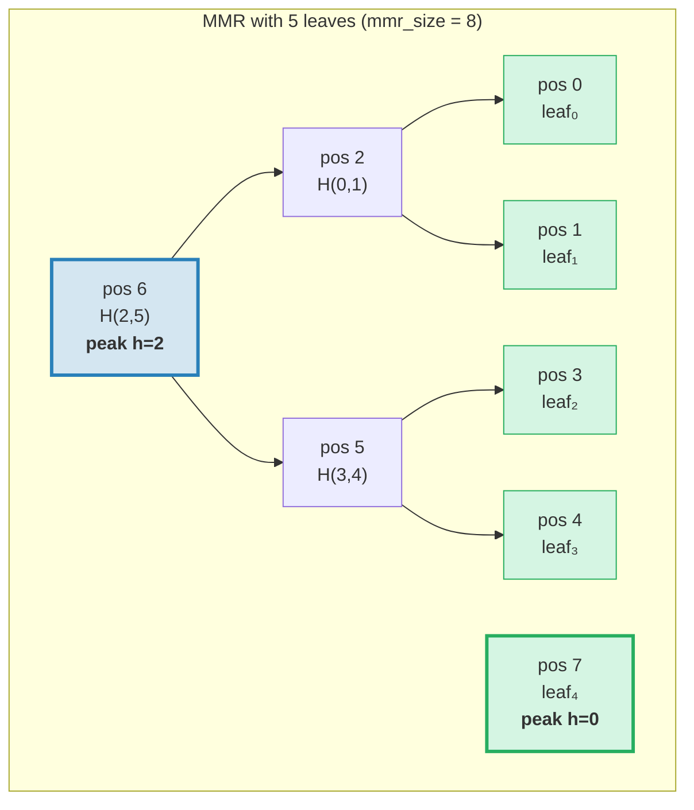
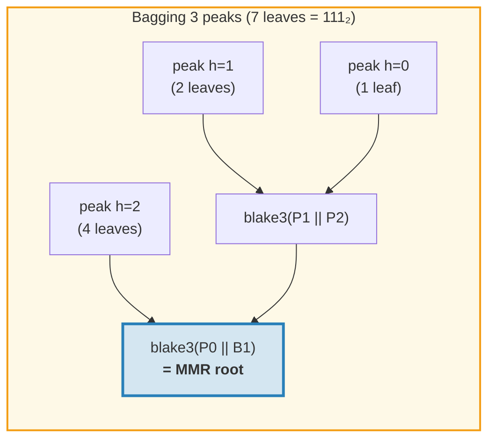
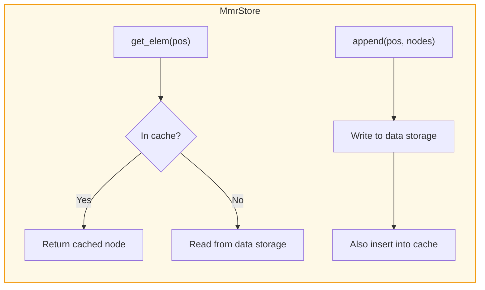
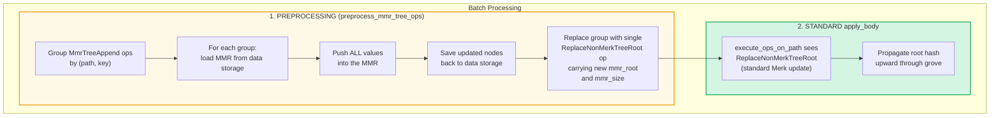
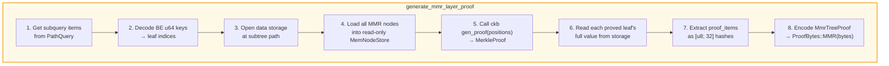
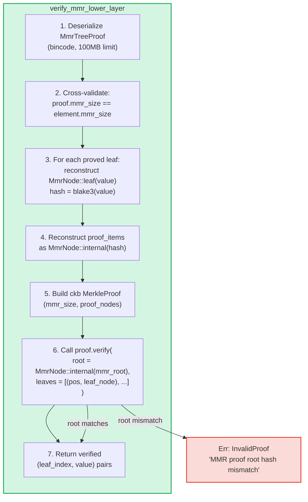

# MMR Tree — ล็อกที่ authenticate ได้แบบ Append-Only

**MmrTree** คือโครงสร้างข้อมูล append-only ที่ authenticate ได้ของ GroveDB สร้างบน Merkle Mountain Range (MMR) ด้วยการแฮช Blake3 ในขณะที่ Merk AVL tree (บทที่ 2) เก่งในการดำเนินการ key-value แบบสุ่มด้วยการอัปเดต O(log N) แต่ MMR ถูกสร้างมาเพื่อกรณี append-only โดยเฉพาะ: ไม่มี rotation เลย, ต้นทุนแฮชเฉลี่ย O(1) ต่อการ append และรูปแบบ I/O แบบต่อเนื่อง

บทนี้ครอบคลุมโครงสร้างข้อมูล MMR อย่างละเอียด — มันเติบโตอย่างไร, โหนดถูกจัดเก็บอย่างไร, การ append ส่งผลต่อเนื่อง (cascade) อย่างไร และระบบ proof ช่วยให้บุคคลที่สามตรวจสอบว่าค่าเฉพาะถูก append ที่ตำแหน่งเฉพาะได้อย่างไร

## ทำไมต้องมีประเภทต้นไม้แยก?

Merk tree มาตรฐานของ GroveDB จัดการข้อมูล key-value ที่เรียงลำดับได้ดี แต่ล็อกแบบ append-only มีความต้องการที่แตกต่างกัน:

| คุณสมบัติ | Merk AVL Tree | MMR |
|----------|--------------|-----|
| การดำเนินการ | Insert, update, delete | Append เท่านั้น |
| การปรับสมดุล | O(log N) rotation ต่อการเขียน | ไม่มี |
| รูปแบบ I/O | สุ่ม (การปรับสมดุลแตะหลายโหนด) | ต่อเนื่อง (โหนดใหม่อยู่ท้ายเสมอ) |
| แฮชทั้งหมดสำหรับ N insert | O(N log N) | O(N) |
| โครงสร้าง | กำหนดโดยลำดับการแทรก | กำหนดโดยจำนวน leaf เท่านั้น |
| Proof | เส้นทางจาก root ถึง leaf | sibling + peak hash |

สำหรับกรณีใช้งานเช่น transaction log, event stream หรือข้อมูลที่เติบโตแบบ monotone, MMR ดีกว่าอย่างเด็ดขาด: เรียบง่ายกว่า เร็วกว่า และคาดเดาได้มากกว่า

## โครงสร้างข้อมูล MMR

MMR คือ **ป่าของ perfect binary tree** (เรียกว่า "peak") ที่เติบโตจากซ้ายไปขวา แต่ละ peak คือ complete binary tree ที่มีความสูง *h* ประกอบด้วย 2^h leaf

ข้อมูลเชิงลึกสำคัญ: **การแทนค่าแบบ binary ของจำนวน leaf กำหนดโครงสร้าง peak** แต่ละ 1-bit ในรูปแบบ binary สอดคล้องกับ peak หนึ่ง:

```text
Leaf count    Binary    Peaks
─────────     ──────    ─────
1             1         one peak h=0
2             10        one peak h=1
3             11        peaks h=1, h=0
4             100       one peak h=2
5             101       peaks h=2, h=0
6             110       peaks h=2, h=1
7             111       peaks h=2, h=1, h=0
8             1000      one peak h=3
```

นี่หมายความว่าโครงสร้าง MMR ถูกกำหนดอย่างสมบูรณ์โดยตัวเลขเดียว — จำนวน leaf MMR สองตัวที่มีจำนวน leaf เท่ากันจะมีรูปร่างเหมือนกันเสมอ ไม่ว่าค่าที่ถูก append จะเป็นอะไรก็ตาม

## MMR เติมเต็มอย่างไร

แต่ละโหนดใน MMR มี **ตำแหน่ง** (เริ่มต้นที่ 0) leaf และ internal node สลับกันในรูปแบบเฉพาะ นี่คือการเติบโตทีละขั้น:

**หลัง 1 leaf (mmr_size = 1):**
```text
pos:  0
      leaf₀        ← one peak at height 0
```

**หลัง 2 leaf (mmr_size = 3):**
```text
pos:     2          ← internal: blake3(leaf₀.hash || leaf₁.hash)
        / \
       0   1        ← leaves

One peak at height 1. Positions 0 and 1 are leaves, position 2 is internal.
```
เมื่อ leaf₁ ถูก append มันสร้าง peak ที่ height 0 แต่มี peak ที่ height 0 อยู่แล้ว (leaf₀) ดังนั้นพวกมัน **รวมกัน (merge)** เป็น peak ที่ height 1

**หลัง 3 leaf (mmr_size = 4):**
```text
pos:     2     3    ← peak h=1, peak h=0
        / \
       0   1

Two peaks. No merge — heights 1 and 0 are different.
(Binary: 3 = 11₂ → one peak per 1-bit)
```

**หลัง 4 leaf (mmr_size = 7):**
```text
pos:         6              ← internal: merge of nodes 2 and 5
           /   \
         2       5          ← internal nodes
        / \     / \
       0   1   3   4        ← leaves

One peak at height 2.
```
ตรงนี้เริ่มน่าสนใจ การ append leaf₃ (ตำแหน่ง 4) สร้าง node₅ (รวมตำแหน่ง 3 และ 4) แต่ตอนนี้ node₅ (height 1) และ node₂ (height 1) เป็น peak ที่อยู่ติดกันและมี height เท่ากัน ดังนั้นพวกมันรวมเป็น node₆ **การ cascade ของ merge สองครั้งจากการ append เดียว**

**หลัง 5 leaf (mmr_size = 8):**
```text
pos:         6         7    ← peak h=2, peak h=0
           /   \
         2       5
        / \     / \
       0   1   3   4

Two peaks. (Binary: 5 = 101₂)
```

**หลัง 7 leaf (mmr_size = 11):**
```text
pos:         6         10    ← peak h=2, peak h=1, peak h=0
           /   \      / \
         2       5   8   9    7
        / \     / \
       0   1   3   4

Three peaks. (Binary: 7 = 111₂)
```

**หลัง 8 leaf (mmr_size = 15):**
```text
pos:              14                     ← single peak h=3
               /      \
            6            13
          /   \        /    \
        2       5    9       12
       / \     / \  / \     / \
      0   1   3  4 7   8  10  11

One peak at height 3. Three cascading merges from appending leaf₇.
```



> **สีน้ำเงิน** = peak (root ของ perfect binary subtree) **สีเขียว** = leaf node

## Merge Cascade

เมื่อ leaf ใหม่ถูก append มันอาจกระตุ้นห่วงโซ่ของการ merge จำนวน merge เท่ากับจำนวน **trailing 1-bit** ในการแทนค่า binary ของจำนวน leaf ปัจจุบัน:

| จำนวน leaf (ก่อน push) | Binary | trailing 1s | จำนวน Merge | แฮชทั้งหมด |
|--------------------------|--------|-------------|--------|--------------|
| 0 | `0` | 0 | 0 | 1 (leaf เท่านั้น) |
| 1 | `1` | 1 | 1 | 2 |
| 2 | `10` | 0 | 0 | 1 |
| 3 | `11` | 2 | 2 | 3 |
| 4 | `100` | 0 | 0 | 1 |
| 5 | `101` | 1 | 1 | 2 |
| 6 | `110` | 0 | 0 | 1 |
| 7 | `111` | 3 | 3 | 4 |

**แฮชทั้งหมดต่อ push** = `1 + trailing_ones(leaf_count)`:
- 1 แฮชสำหรับ leaf เอง: `blake3(value)`
- N แฮชสำหรับ merge cascade: `blake3(left.hash || right.hash)` สำหรับแต่ละ merge

นี่คือวิธีที่ GroveDB ติดตามต้นทุนแฮชสำหรับแต่ละ append การ implement:
```rust
pub fn hash_count_for_push(leaf_count: u64) -> u32 {
    1 + leaf_count.trailing_ones()
}
```

## MMR Size เทียบกับ Leaf Count

MMR จัดเก็บทั้ง leaf และ internal node ในพื้นที่ตำแหน่งแบบแบน ดังนั้น `mmr_size` จะใหญ่กว่า leaf count เสมอ ความสัมพันธ์ที่แน่นอนคือ:

```text
mmr_size = 2 * leaf_count - popcount(leaf_count)
```

โดยที่ `popcount` คือจำนวน 1-bit (ซึ่งก็คือจำนวน peak) แต่ละ internal node รวม subtree สองต้น ลดจำนวนโหนดลงหนึ่งต่อ merge

การคำนวณย้อนกลับ — leaf count จาก mmr_size — ใช้ตำแหน่ง peak:

```rust
fn mmr_size_to_leaf_count(mmr_size: u64) -> u64 {
    // Each peak at height h contains 2^h leaves
    get_peaks(mmr_size).iter()
        .map(|&peak_pos| 1u64 << pos_height_in_tree(peak_pos))
        .sum()
}
```

| mmr_size | leaf_count | peaks |
|----------|-----------|-------|
| 0 | 0 | (ว่าง) |
| 1 | 1 | h=0 |
| 3 | 2 | h=1 |
| 4 | 3 | h=1, h=0 |
| 7 | 4 | h=2 |
| 8 | 5 | h=2, h=0 |
| 10 | 6 | h=2, h=1 |
| 11 | 7 | h=2, h=1, h=0 |
| 15 | 8 | h=3 |

GroveDB จัดเก็บ `mmr_size` ใน Element (ไม่ใช่ leaf count) เพราะไลบรารี ckb MMR ใช้ตำแหน่งภายใน การดำเนินการ `mmr_tree_leaf_count` คำนวณ leaf count ได้ทันที

## MMR Root Hash — การรวม Peak

MMR มีหลาย peak (หนึ่งต่อ 1-bit ในจำนวน leaf) เพื่อสร้าง root hash ขนาด 32 ไบต์เดียว peak จะถูก **"bagged"** จากขวาไปซ้าย:

```text
root = bag_rhs_peaks(peaks):
    start with rightmost peak
    fold leftward: blake3(left_peak || accumulated_right)
```

กรณีมี 1 peak, root คือ hash ของ peak นั้นเอง กรณีมี 3 peak:



> root hash เปลี่ยนทุกครั้งที่ append แม้เมื่อไม่มี merge เกิดขึ้น เพราะ peak ขวาสุดเปลี่ยนและต้องคำนวณ bagging ใหม่

## โครงสร้างโหนดและ Serialization

แต่ละโหนด MMR คือ `MmrNode`:

```rust
struct MmrNode {
    hash: [u8; 32],           // Blake3 hash
    value: Option<Vec<u8>>,   // Some สำหรับ leaf, None สำหรับ internal node
}
```

**Leaf node:** `hash = blake3(value_bytes)`, `value = Some(value_bytes)`
**Internal node:** `hash = blake3(left.hash || right.hash)`, `value = None`

ฟังก์ชัน merge ตรงไปตรงมา — เชื่อมต่อ hash ขนาด 32 ไบต์สองตัวแล้ว Blake3 ผลลัพธ์:

```rust
fn blake3_merge(left: &[u8; 32], right: &[u8; 32]) -> [u8; 32] {
    let mut input = [0u8; 64];
    input[..32].copy_from_slice(left);
    input[32..].copy_from_slice(right);
    *blake3::hash(&input).as_bytes()
}
```

> **หมายเหตุเกี่ยวกับ PartialEq:** `MmrNode` implement `PartialEq` โดยเปรียบเทียบ **เฉพาะฟิลด์ hash** ไม่รวม value สิ่งนี้สำคัญสำหรับการตรวจสอบ proof: ตัวตรวจสอบ ckb เปรียบเทียบ root ที่สร้างขึ้นใหม่ (value = None) กับ root ที่คาดหวัง ถ้า PartialEq เปรียบเทียบฟิลด์ value ด้วย proof ของ MMR ที่มี leaf เดียวจะล้มเหลวเสมอ เพราะ leaf มี `value: Some(...)` แต่การสร้าง root ใหม่ให้ `value: None`

**รูปแบบ Serialization:**
```text
Internal: [0x00] [hash: 32 bytes]                                = 33 bytes
Leaf:     [0x01] [hash: 32 bytes] [value_len: 4 BE] [value...]   = 37 + len bytes
```

ไบต์ flag แยก internal node จาก leaf Deserialization ตรวจสอบความยาวที่แน่นอน — ไม่อนุญาตให้มีไบต์ต่อท้าย

## สถาปัตยกรรม Storage

MmrTree จัดเก็บโหนดใน **data** column (column family เดียวกันที่ใช้โดย Merk node) ไม่ใช่ใน child Merk subtree Element ไม่มีฟิลด์ `root_key` — MMR root hash ไหลเป็น Merk **child hash** ผ่าน `insert_subtree(subtree_root_hash)` ซึ่ง authenticate สถานะ MMR

**Storage key** อิงตามตำแหน่ง:
```text
key = 'm' || position_as_be_u64    (9 bytes: prefix + u64 BE)
```

ดังนั้นตำแหน่ง 42 ถูกจัดเก็บที่ key `[0x6D, 0x00, 0x00, 0x00, 0x00, 0x00, 0x00, 0x00, 0x2A]`

การค้นหา leaf *i* ต้องคำนวณตำแหน่ง MMR ก่อน: `pos = leaf_index_to_pos(i)` จากนั้นอ่าน data key `m{pos}`

**Write-through cache:** ระหว่างการ append โหนดที่เขียนใหม่ต้องสามารถอ่านได้ทันทีสำหรับ merge ที่ตามมาใน push เดียวกัน เนื่องจาก transactional storage ของ GroveDB เลื่อนการเขียนไปเป็น batch (ไม่สามารถมองเห็นได้จากการอ่านจนกว่าจะ commit) adapter `MmrStore` จึงห่อ storage context ด้วย `HashMap` cache ในหน่วยความจำ:



สิ่งนี้ทำให้มั่นใจว่าเมื่อการ append leaf₃ กระตุ้น merge cascade (สร้าง internal node ที่ตำแหน่ง 5 และ 6) node₅ จะพร้อมใช้งานทันทีเมื่อคำนวณ node₆ แม้ว่า node₅ ยังไม่ได้ commit ไปยัง RocksDB

**การเผยแพร่ root hash ไปยัง GroveDB state root:**

```text
combined_value_hash = blake3(
    blake3(varint(len) || element_bytes),   ← value_hash จาก serialized Element
    mmr_root_hash                           ← child_hash = root เฉพาะประเภท
)
```

MMR root hash ไหลเป็น Merk child hash ผ่าน `insert_subtree` การเปลี่ยนแปลงใด ๆ ของสถานะ MMR จะสร้าง `combined_value_hash` ที่แตกต่าง ซึ่งเผยแพร่ขึ้นผ่าน parent Merk hierarchy ไปจนถึง GroveDB state root

## การดำเนินการ GroveDB

MmrTree มีสี่การดำเนินการ:

```rust
// Append ค่า — ส่งคืน (new_mmr_root, leaf_index)
db.mmr_tree_append(path, key, value, tx, version)

// อ่าน root hash ปัจจุบัน (จาก Element, ไม่เข้าถึง storage)
db.mmr_tree_root_hash(path, key, tx, version)

// ดึงค่า leaf ตาม index เริ่มต้นที่ 0
db.mmr_tree_get_value(path, key, leaf_index, tx, version)

// ดึงจำนวน leaf ที่ append แล้ว
db.mmr_tree_leaf_count(path, key, tx, version)
```

### ขั้นตอนการ Append

การดำเนินการ append ซับซ้อนที่สุด ดำเนินงาน 8 ขั้นตอน:

```mermaid
graph TD
    subgraph append["mmr_tree_append(path, key, value, tx)"]
        A1["1. Read Element at path/key<br/>→ get mmr_size, flags"]
        A2["2. Open data storage at<br/>path/key subtree"]
        A3["3. Create MmrNode::leaf(value)<br/>hash = blake3(value)"]
        A4["4. Push leaf into ckb MMR<br/>→ cascading merges write<br/>new internal nodes"]
        A5["5. Commit → flush new<br/>nodes to storage"]
        A6["6. Bag peaks → new mmr_root"]
        A7["7. Update Element with<br/>new mmr_root and mmr_size"]
        A8["8. Propagate changes up<br/>through GroveDB Merk<br/>hierarchy + commit tx"]

        A1 --> A2 --> A3 --> A4 --> A5 --> A6 --> A7 --> A8
    end

    style append fill:#d5f5e3,stroke:#27ae60,stroke-width:2px
    style A6 fill:#d4e6f1,stroke:#2980b9,stroke-width:2px
```



ขั้นตอน 4 อาจเขียน 1 โหนด (leaf เท่านั้น) หรือ 1 + N โหนด (leaf + N internal merge node) ขั้นตอน 5 เรียก `mmr.commit()` ซึ่ง flush ckb MemStore ไปยัง MmrStore ขั้นตอน 7 เรียก `insert_subtree` ด้วย MMR root ใหม่เป็น child hash (ผ่าน `subtree_root_hash`) เนื่องจาก MmrTree ไม่มี child Merk

### การดำเนินการอ่าน

`mmr_tree_root_hash` คำนวณ root จากข้อมูล MMR ใน storage
`mmr_tree_leaf_count` คำนวณ leaf count จาก `mmr_size` ใน Element ไม่จำเป็นต้องเข้าถึง data storage

`mmr_tree_get_value` คำนวณ `pos = leaf_index_to_pos(leaf_index)` อ่าน data storage entry เดียวที่ `m{pos}` deserialize `MmrNode` และส่งคืน `node.value`

## การดำเนินการแบบ Batch

การ append MMR หลายรายการสามารถทำแบบ batch ได้โดยใช้ `GroveOp::MmrTreeAppend { value }` เนื่องจากฟังก์ชัน batch มาตรฐาน `execute_ops_on_path` เข้าถึงได้เฉพาะ Merk (ไม่ใช่ storage context ของ MMR) การ append MMR จึงใช้ **เฟส preprocessing**:



ตัวอย่าง: batch ที่มี 3 append ไปยัง MMR เดียวกัน:
```rust
vec![
    QualifiedGroveDbOp { path: p, key: k, op: MmrTreeAppend { value: v1 } },
    QualifiedGroveDbOp { path: p, key: k, op: MmrTreeAppend { value: v2 } },
    QualifiedGroveDbOp { path: p, key: k, op: MmrTreeAppend { value: v3 } },
]
```

Preprocessing โหลด MMR ครั้งเดียว push v1, v2, v3 (สร้าง intermediate node ทั้งหมด) บันทึกทุกอย่างไปยัง data storage จากนั้นปล่อย `ReplaceNonMerkTreeRoot` เดียวที่มี `mmr_root` สุดท้ายและ `mmr_size` กลไก batch มาตรฐานจัดการส่วนที่เหลือ

## การสร้าง Proof

MMR proof เป็น **V1 proof** — ใช้ variant `ProofBytes::MMR` ในโครงสร้าง proof แบบหลายชั้น (ดู 9.6) proof แสดงให้เห็นว่าค่า leaf เฉพาะอยู่ที่ตำแหน่งเฉพาะภายใน MMR และ hash ของพวกมันสอดคล้องกับ `mmr_root` ที่จัดเก็บใน parent element

### การเข้ารหัส Query

Query key เข้ารหัสตำแหน่งเป็น **big-endian u64 bytes** สิ่งนี้รักษาลำดับการเรียง lexicographic (เนื่องจาก BE encoding เป็น monotonic) ทำให้ทุก variant มาตรฐานของ `QueryItem` ทำงานได้:

```text
QueryItem::Key([0,0,0,0,0,0,0,5])            → leaf index 5
QueryItem::RangeInclusive([..2]..=[..7])      → leaf indices [2, 3, 4, 5, 6, 7]
QueryItem::RangeFrom([..10]..)                → leaf indices [10, 11, ..., N-1]
QueryItem::RangeFull                          → all leaves [0..leaf_count)
```

ขีดจำกัดความปลอดภัยที่ **10,000,000 index** ป้องกันการหมดหน่วยความจำจาก range query ที่ไม่มีขอบเขต MMR ที่ว่าง (leaf เป็นศูนย์) ส่งคืน proof ว่าง

### โครงสร้าง MmrTreeProof

```rust
struct MmrTreeProof {
    mmr_size: u64,                 // ขนาด MMR ณ เวลาสร้าง proof
    leaves: Vec<(u64, Vec<u8>)>,   // (leaf_index, value) สำหรับแต่ละ leaf ที่ถูกพิสูจน์
    proof_items: Vec<[u8; 32]>,    // Sibling/peak hash สำหรับการตรวจสอบ
}
```

`proof_items` มี hash ชุดน้อยที่สุดที่จำเป็นเพื่อสร้างเส้นทางจาก leaf ที่ถูกพิสูจน์ขึ้นไปจนถึง MMR root สิ่งเหล่านี้คือ sibling node ในแต่ละระดับและ peak hash ที่ไม่เกี่ยวข้อง

### ขั้นตอนการสร้าง



ขั้นตอน 4 ใช้ `MemNodeStore` — BTreeMap แบบ read-only ที่โหลด MMR node ทั้งหมดจาก data storage ล่วงหน้า ตัวสร้าง proof ของ ckb ต้องการ random access ดังนั้น node ทั้งหมดต้องอยู่ในหน่วยความจำ

ขั้นตอน 5 เป็นจุดที่ไลบรารี ckb ทำงานหนัก: จาก MMR size และตำแหน่งที่ต้องพิสูจน์ มันกำหนดว่าต้องการ sibling และ peak hash ใดบ้าง

### ตัวอย่างทีละขั้นตอน

**การพิสูจน์ leaf 2 ใน MMR ที่มี 5 leaf (mmr_size = 8):**

```text
MMR structure:
pos:         6         7
           /   \
         2       5
        / \     / \
       0   1   3   4

Leaf index 2 → MMR position 3

To verify leaf at position 3:
  1. Hash the claimed value: leaf_hash = blake3(value)
  2. Sibling at position 4:  node₅ = blake3(leaf_hash || proof[pos 4])
  3. Sibling at position 2:  node₆ = blake3(proof[pos 2] || node₅)
  4. Peak at position 7:     root  = bag(node₆, proof[pos 7])
  5. Compare: root == expected mmr_root ✓

proof_items = [hash(pos 4), hash(pos 2), hash(pos 7)]
leaves = [(2, original_value_bytes)]
```

ขนาด proof สำหรับตัวอย่างนี้คือ: 3 hash (96 ไบต์) + 1 ค่า leaf + metadata โดยทั่วไป การพิสูจน์ K leaf จาก MMR ที่มี N leaf ต้องใช้ sibling hash O(K * log N) ตัว

## การตรวจสอบ Proof

การตรวจสอบเป็นแบบ **pure** — ไม่ต้องเข้าถึงฐานข้อมูล ผู้ตรวจสอบต้องการเพียง proof bytes และ MMR root hash ที่คาดหวัง (ซึ่งดึงจาก parent element ที่ถูกพิสูจน์ใน Merk layer ด้านบน)

### ขั้นตอนการตรวจสอบ



ฟังก์ชัน `MerkleProof::verify` ของ ckb สร้าง root ใหม่จาก leaf และ proof item จากนั้นเปรียบเทียบ (โดยใช้ `PartialEq` ซึ่งตรวจสอบเฉพาะ hash) กับ root ที่คาดหวัง

### สายโซ่แห่งความเชื่อถือ (Chain of Trust)

สายโซ่ทั้งหมดจาก GroveDB state root ไปจนถึงค่า leaf ที่ตรวจสอบแล้ว:

```text
GroveDB state_root (known/trusted)
│
├─ V0 Merk proof layer 0: proves subtree exists at root
│   └─ root_hash matches state_root ✓
│
├─ V0 Merk proof layer 1: proves MmrTree element at path/key
│   └─ KVValueHash node: element_bytes contain mmr_root
│   └─ combined_hash = combine_hash(H(element_bytes), mmr_root)
│   └─ root_hash matches parent layer ✓
│
└─ V1 MMR proof: proves leaf values are in the MMR
    └─ Reconstruct paths from leaves through siblings to peaks
    └─ Bag peaks → reconstructed root
    └─ reconstructed root == mmr_root from element_bytes ✓
    └─ Result: leaf₂ = [verified value bytes]
```

### คุณสมบัติด้านความปลอดภัย

- **การตรวจสอบข้าม mmr_size:** `mmr_size` ของ proof ต้องตรงกับ `mmr_size` ของ element ความไม่ตรงกันบ่งบอกว่า proof ถูกสร้างจากสถานะอื่นและถูกปฏิเสธ
- **ขีดจำกัดขนาด Bincode:** Deserialization ใช้ขีดจำกัด 100MB เพื่อป้องกัน length header ที่ถูกสร้างขึ้นจากการทำให้เกิดการจัดสรรหน่วยความจำขนาดใหญ่
- **การนับ Limit:** แต่ละ leaf ที่ถูกพิสูจน์จะลด query limit รวมลง 1 โดยใช้ `saturating_sub` เพื่อป้องกัน underflow
- **การส่งคืน Child hash:** ผู้ตรวจสอบส่งคืน MMR root ที่คำนวณได้เป็น child hash สำหรับการคำนวณ combine_hash ใน parent layer
- **การปฏิเสธ V0:** การพยายาม subquery เข้าไปใน MmrTree ด้วย V0 proof จะส่งคืน `Error::NotSupported` เฉพาะ V1 proof เท่านั้นที่สามารถลงไปในต้นไม้ non-Merk ได้

## การติดตามต้นทุน

การดำเนินการ MMR ติดตามต้นทุนอย่างแม่นยำ:

| การดำเนินการ | จำนวนรอบแฮช | การดำเนินการ Storage |
|-----------|-----------|-------------------|
| Append 1 leaf | `1 + trailing_ones(leaf_count)` | เขียน 1 leaf + เขียน N internal |
| Root hash | 0 (cached ใน Element) | อ่าน 1 Element |
| Get value | 0 | อ่าน 1 Element + อ่าน 1 data |
| Leaf count | 0 | อ่าน 1 Element |

สูตรจำนวนแฮช `1 + trailing_ones(N)` ให้จำนวน Blake3 call ที่แน่นอน: 1 สำหรับ leaf hash บวกหนึ่ง merge hash ต่อระดับ cascade

**การวิเคราะห์แบบ amortized:** สำหรับ N append ทั้งหมด จำนวนแฮชรวมคือ:

```text
Σ (1 + trailing_ones(i)) for i = 0..N-1
= N + Σ trailing_ones(i) for i = 0..N-1
= N + (N - popcount(N))
≈ 2N
```

ดังนั้นต้นทุน amortized ต่อ append คือประมาณ **2 Blake3 hash call** — คงที่และเป็นอิสระจากขนาดต้นไม้ เปรียบเทียบกับ Merk AVL tree ที่แต่ละ insert ต้องใช้ O(log N) hash สำหรับเส้นทางบวก rotation hash ที่อาจเกิดขึ้น

**ต้นทุน Storage:** แต่ละ append เขียน 1 leaf node (37 + value_len ไบต์) บวก 0 ถึง log₂(N) internal node (33 ไบต์แต่ละตัว) การเขียน storage amortized ต่อ append คือประมาณ 33 + 37 + value_len ไบต์ ≈ 70 + value_len ไบต์

## ไฟล์ Implementation

| ไฟล์ | วัตถุประสงค์ |
|------|---------|
| `grovedb-mmr/src/node.rs` | `MmrNode` struct, Blake3 merge, serialization |
| `grovedb-mmr/src/grove_mmr.rs` | `GroveMmr` wrapper รอบ ckb MMR |
| `grovedb-mmr/src/util.rs` | `mmr_node_key`, `hash_count_for_push`, `mmr_size_to_leaf_count` |
| `grovedb-mmr/src/proof.rs` | `MmrTreeProof` generation and verification |
| `grovedb-mmr/src/dense_merkle.rs` | Dense Merkle tree root (ใช้โดย BulkAppendTree) |
| `grovedb/src/operations/mmr_tree.rs` | GroveDB operations + `MmrStore` adapter + batch preprocessing |
| `grovedb/src/operations/proof/generate.rs` | V1 proof generation: `generate_mmr_layer_proof`, `query_items_to_leaf_indices` |
| `grovedb/src/operations/proof/verify.rs` | V1 proof verification: `verify_mmr_lower_layer` |
| `grovedb/src/tests/mmr_tree_tests.rs` | 28 integration test |

## การเปรียบเทียบกับโครงสร้างที่ authenticate ได้อื่น ๆ

| | MMR (MmrTree) | Merk AVL (Tree) | Sinsemilla (CommitmentTree) |
|---|---|---|---|
| **กรณีใช้งาน** | ล็อก append-only | ที่จัดเก็บ key-value | ZK-friendly commitment |
| **ฟังก์ชันแฮช** | Blake3 | Blake3 | Sinsemilla (Pallas curve) |
| **การดำเนินการ** | Append, อ่านตาม index | Insert, update, delete, query | Append, witness |
| **แฮช amortized/เขียน** | ~2 | O(log N) | ~33 (32 ระดับ + ommer) |
| **ประเภท Proof** | V1 (MMR sibling hash) | V0 (Merk path proof) | Witness (Merkle auth path) |
| **เป็นมิตรกับ ZK** | ไม่ | ไม่ | ใช่ (Halo 2 circuit) |
| **การปรับสมดุล** | ไม่มี | AVL rotation | ไม่มี |
| **รองรับการลบ** | ไม่ | ใช่ | ไม่ |

---
