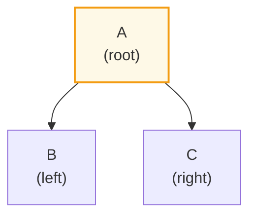
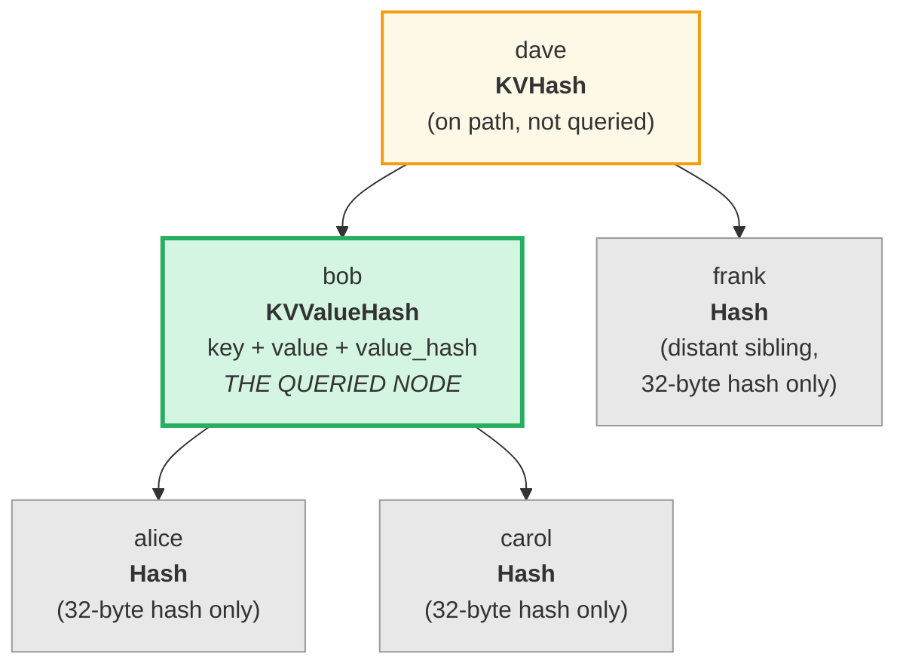
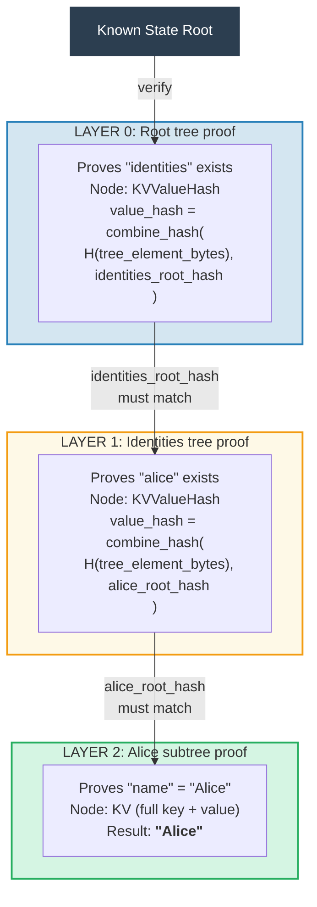
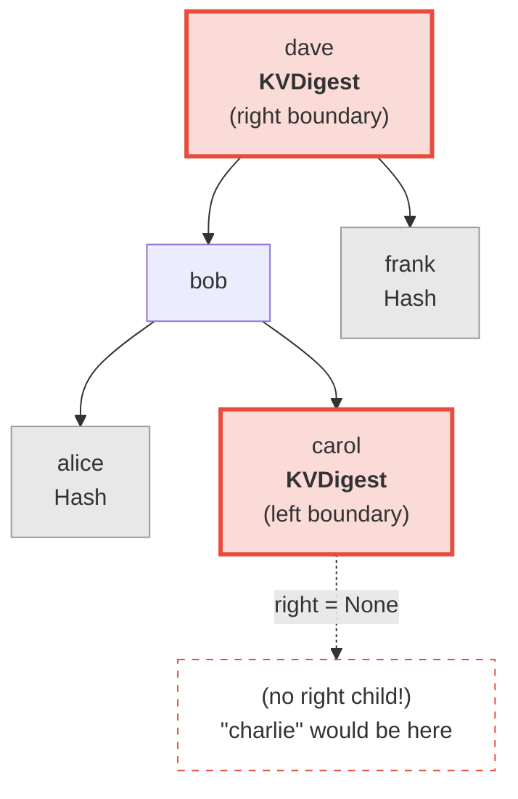
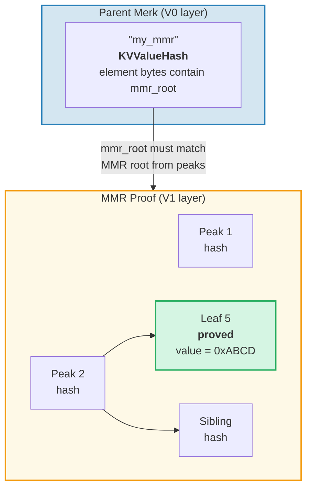
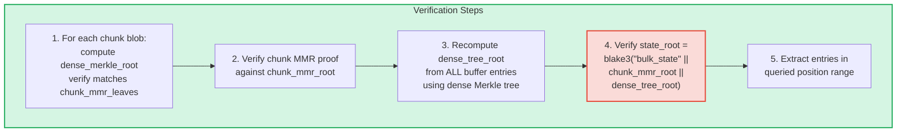
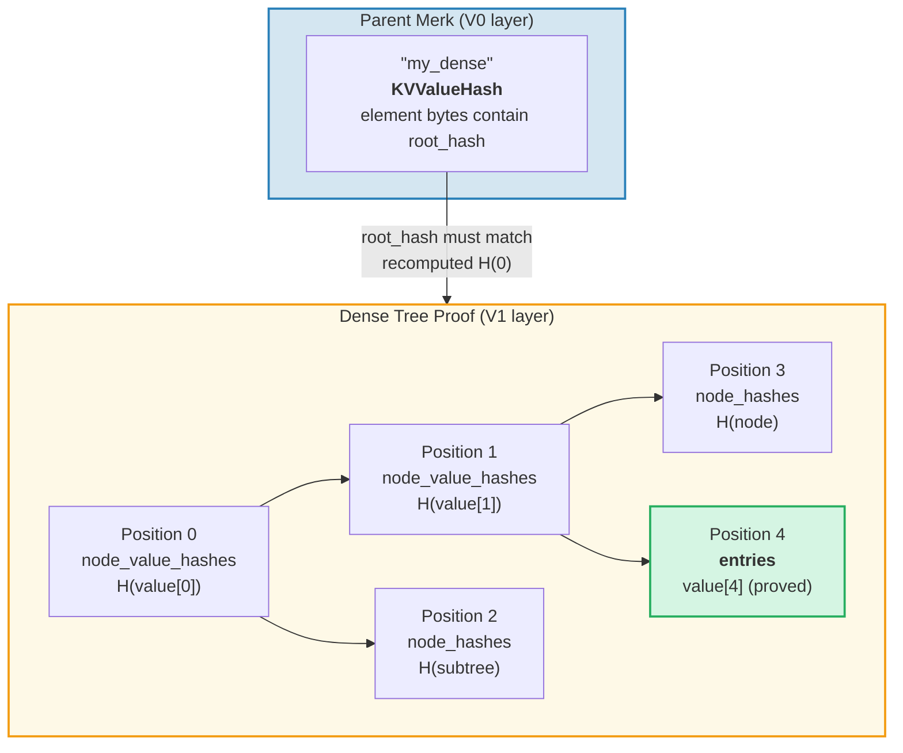

# ระบบ Proof

ระบบ proof (หลักฐาน) ของ GroveDB ช่วยให้ฝ่ายใดก็ได้ตรวจสอบความถูกต้องของผลลัพธ์ query โดยไม่ต้องมีฐานข้อมูลทั้งหมด proof คือการแสดงแบบกระชับของโครงสร้างต้นไม้ที่เกี่ยวข้อง ซึ่งช่วยให้สามารถสร้าง root hash ขึ้นมาใหม่ได้

## การดำเนินการ Proof แบบ Stack

proof ถูกเข้ารหัสเป็นลำดับ **การดำเนินการ (operation)** ที่สร้างต้นไม้บางส่วนขึ้นมาใหม่โดยใช้ stack machine:

```rust
// merk/src/proofs/mod.rs
pub enum Op {
    Push(Node),        // ดัน node ลง stack (ลำดับ key จากน้อยไปมาก)
    PushInverted(Node),// ดัน node (ลำดับ key จากมากไปน้อย)
    Parent,            // ดึง parent ออก, ดึง child ออก → เชื่อม child เป็น LEFT ของ parent
    Child,             // ดึง child ออก, ดึง parent ออก → เชื่อม child เป็น RIGHT ของ parent
    ParentInverted,    // ดึง parent ออก, ดึง child ออก → เชื่อม child เป็น RIGHT ของ parent
    ChildInverted,     // ดึง child ออก, ดึง parent ออก → เชื่อม child เป็น LEFT ของ parent
}
```

การทำงานใช้ stack:

Proof ops: `Push(B), Push(A), Parent, Push(C), Child`

| ขั้นตอน | การดำเนินการ | Stack (top→ขวา) | การกระทำ |
|------|-----------|-------------------|--------|
| 1 | Push(B) | [ B ] | ดัน B ลง stack |
| 2 | Push(A) | [ B , A ] | ดัน A ลง stack |
| 3 | Parent | [ A{left:B} ] | ดึง A (parent) ออก, ดึง B (child) ออก, B → LEFT ของ A |
| 4 | Push(C) | [ A{left:B} , C ] | ดัน C ลง stack |
| 5 | Child | [ A{left:B, right:C} ] | ดึง C (child) ออก, ดึง A (parent) ออก, C → RIGHT ของ A |

ผลลัพธ์สุดท้าย — ต้นไม้เดียวบน stack:



> ผู้ตรวจสอบ (verifier) คำนวณ `node_hash(A) = Blake3(kv_hash_A || node_hash_B || node_hash_C)` แล้วตรวจสอบว่าตรงกับ root hash ที่คาดหวัง

นี่คือฟังก์ชัน `execute` (`merk/src/proofs/tree.rs`):

```rust
pub fn execute<I, F>(ops: I, collapse: bool, mut visit_node: F) -> CostResult<Tree, Error>
where
    I: IntoIterator<Item = Result<Op, Error>>,
    F: FnMut(&Node) -> Result<(), Error>,
{
    let mut stack: Vec<Tree> = Vec::with_capacity(32);

    for op in ops {
        match op? {
            Op::Parent => {
                let (mut parent, child) = (try_pop(&mut stack), try_pop(&mut stack));
                parent.left = Some(Child { tree: Box::new(child), hash: child.hash() });
                stack.push(parent);
            }
            Op::Child => {
                let (child, mut parent) = (try_pop(&mut stack), try_pop(&mut stack));
                parent.right = Some(Child { tree: Box::new(child), hash: child.hash() });
                stack.push(parent);
            }
            Op::Push(node) => {
                visit_node(&node)?;
                stack.push(Tree::from(node));
            }
            // ... variant แบบกลับด้าน (Inverted) สลับซ้าย/ขวา
        }
    }
    // รายการสุดท้ายบน stack คือ root
}
```

## ประเภท Node ใน Proof

แต่ละ `Push` พาข้อมูล `Node` ที่มีข้อมูลเพียงพอสำหรับการตรวจสอบ:

```rust
pub enum Node {
    // ข้อมูลน้อยที่สุด — แค่แฮช ใช้สำหรับ sibling ที่ห่างไกล
    Hash(CryptoHash),

    // KV hash สำหรับโหนดบน path แต่ไม่ถูกสืบค้น
    KVHash(CryptoHash),

    // key-value เต็มสำหรับรายการที่ถูกสืบค้น
    KV(Vec<u8>, Vec<u8>),

    // Key, value และ value_hash ที่คำนวณไว้แล้ว
    // ใช้สำหรับ subtree ที่ value_hash = combine_hash(...)
    KVValueHash(Vec<u8>, Vec<u8>, CryptoHash),

    // KV พร้อม feature type — สำหรับ ProvableCountTree หรือการกู้คืน chunk
    KVValueHashFeatureType(Vec<u8>, Vec<u8>, CryptoHash, TreeFeatureType),

    // Reference: key, ค่าที่ dereference แล้ว, แฮชของ reference element
    KVRefValueHash(Vec<u8>, Vec<u8>, CryptoHash),

    // สำหรับรายการใน ProvableCountTree
    KVCount(Vec<u8>, Vec<u8>, u64),

    // KV hash + count สำหรับโหนด ProvableCountTree ที่ไม่ถูกสืบค้น
    KVHashCount(CryptoHash, u64),

    // Reference ใน ProvableCountTree
    KVRefValueHashCount(Vec<u8>, Vec<u8>, CryptoHash, u64),

    // สำหรับ boundary/absence proof ใน ProvableCountTree
    KVDigestCount(Vec<u8>, CryptoHash, u64),

    // Key + value_hash สำหรับ absence proof (ต้นไม้ปกติ)
    KVDigest(Vec<u8>, CryptoHash),
}
```

การเลือกประเภท Node กำหนดข้อมูลที่ผู้ตรวจสอบต้องการ:

**Query: "ดึงค่าสำหรับ key 'bob'"**



> เขียว = โหนดที่ถูกสืบค้น (เปิดเผยข้อมูลเต็ม) เหลือง = อยู่บน path (kv_hash เท่านั้น) เทา = sibling (แค่ node hash 32 ไบต์)

เข้ารหัสเป็น proof ops:

| # | Op | ผลกระทบ |
|---|----|----|
| 1 | Push(Hash(alice_node_hash)) | ดัน alice hash |
| 2 | Push(KVValueHash("bob", value, value_hash)) | ดัน bob พร้อมข้อมูลเต็ม |
| 3 | Parent | alice กลายเป็นลูกซ้ายของ bob |
| 4 | Push(Hash(carol_node_hash)) | ดัน carol hash |
| 5 | Child | carol กลายเป็นลูกขวาของ bob |
| 6 | Push(KVHash(dave_kv_hash)) | ดัน dave kv_hash |
| 7 | Parent | subtree bob กลายเป็นซ้ายของ dave |
| 8 | Push(Hash(frank_node_hash)) | ดัน frank hash |
| 9 | Child | frank กลายเป็นลูกขวาของ dave |

## การสร้าง Proof หลายชั้น

เนื่องจาก GroveDB เป็นต้นไม้ของต้นไม้ proof จึงครอบคลุมหลายชั้น (layer) แต่ละชั้นพิสูจน์ส่วนที่เกี่ยวข้องของ Merk tree หนึ่งต้น และชั้นต่าง ๆ ถูกเชื่อมกันด้วยกลไก combined value_hash:

**Query:** `Get ["identities", "alice", "name"]`



> **ห่วงโซ่แห่งความเชื่อถือ (chain of trust):** `known_state_root → ตรวจสอบ Layer 0 → ตรวจสอบ Layer 1 → ตรวจสอบ Layer 2 → "Alice"` root hash ที่สร้างขึ้นใหม่ของแต่ละชั้นต้องตรงกับ value_hash จากชั้นด้านบน

ผู้ตรวจสอบตรวจสอบแต่ละชั้น โดยยืนยันว่า:
1. proof ของชั้นสร้าง root hash ที่ตรงกับที่คาดหวัง
2. root hash ตรงกับ value_hash จากชั้นแม่
3. root hash ระดับบนสุดตรงกับ state root ที่ทราบ

## การตรวจสอบ Proof

การตรวจสอบตาม proof layer จากล่างขึ้นบนหรือบนลงล่าง โดยใช้ฟังก์ชัน `execute` เพื่อสร้างต้นไม้ของแต่ละชั้นขึ้นมาใหม่ method `Tree::hash()` ใน proof tree คำนวณแฮชตามประเภท node:

```rust
impl Tree {
    pub fn hash(&self) -> CostContext<CryptoHash> {
        match &self.node {
            Node::Hash(hash) => *hash,  // เป็นแฮชอยู่แล้ว คืนค่าโดยตรง

            Node::KVHash(kv_hash) =>
                node_hash(kv_hash, &self.child_hash(true), &self.child_hash(false)),

            Node::KV(key, value) =>
                kv_hash(key, value)
                    .flat_map(|kv_hash| node_hash(&kv_hash, &left, &right)),

            Node::KVValueHash(key, _, value_hash) =>
                kv_digest_to_kv_hash(key, value_hash)
                    .flat_map(|kv_hash| node_hash(&kv_hash, &left, &right)),

            Node::KVValueHashFeatureType(key, _, value_hash, feature_type) => {
                let kv = kv_digest_to_kv_hash(key, value_hash);
                match feature_type {
                    ProvableCountedMerkNode(count) =>
                        node_hash_with_count(&kv, &left, &right, *count),
                    _ => node_hash(&kv, &left, &right),
                }
            }

            Node::KVRefValueHash(key, referenced_value, ref_element_hash) => {
                let ref_value_hash = value_hash(referenced_value);
                let combined = combine_hash(ref_element_hash, &ref_value_hash);
                let kv = kv_digest_to_kv_hash(key, &combined);
                node_hash(&kv, &left, &right)
            }
            // ... variant อื่น ๆ
        }
    }
}
```

## Absence Proof

GroveDB สามารถพิสูจน์ว่า key **ไม่มีอยู่** สิ่งนี้ใช้โหนดขอบเขต (boundary node) — โหนดที่จะอยู่ติดกับ key ที่หายไปถ้ามันมีอยู่:

**พิสูจน์:** "charlie" ไม่มีอยู่



> **Binary search:** alice < bob < carol < **"charlie"** < dave < frank "charlie" จะอยู่ระหว่าง carol กับ dave ลูกขวาของ carol คือ `None` พิสูจน์ว่าไม่มีอะไรอยู่ระหว่าง carol กับ dave ดังนั้น "charlie" ไม่สามารถมีอยู่ในต้นไม้นี้

สำหรับ range query absence proof แสดงว่าไม่มี key ภายในช่วงที่สืบค้นที่ไม่ได้รวมอยู่ในชุดผลลัพธ์

## V1 Proof — ต้นไม้ Non-Merk

ระบบ proof V0 ทำงานเฉพาะกับ Merk subtree โดยลงไปทีละชั้นผ่านลำดับชั้น grove อย่างไรก็ตาม element ประเภท **CommitmentTree**, **MmrTree**, **BulkAppendTree** และ **DenseAppendOnlyFixedSizeTree** จัดเก็บข้อมูลภายนอก Merk tree ลูก พวกมันไม่มี Merk ลูกให้ลงไป — type-specific root hash ของพวกมันไหลเป็น Merk child hash แทน

**รูปแบบ proof V1** ขยาย V0 เพื่อจัดการต้นไม้ non-Merk เหล่านี้ด้วยโครงสร้าง proof เฉพาะประเภท:

```rust
/// รูปแบบ proof ที่แต่ละชั้นใช้
pub enum ProofBytes {
    Merk(Vec<u8>),            // proof ops ของ Merk มาตรฐาน
    MMR(Vec<u8>),             // MMR membership proof
    BulkAppendTree(Vec<u8>),  // BulkAppendTree range proof
    DenseTree(Vec<u8>),       // Dense tree inclusion proof
    CommitmentTree(Vec<u8>),  // Sinsemilla root (32 ไบต์) + BulkAppendTree proof
}

/// หนึ่งชั้นของ V1 proof
pub struct LayerProof {
    pub merk_proof: ProofBytes,
    pub lower_layers: BTreeMap<Vec<u8>, LayerProof>,
}
```

**กฎการเลือก V0/V1:** หากทุกชั้นใน proof เป็น Merk tree มาตรฐาน `prove_query` จะสร้าง `GroveDBProof::V0` (เข้ากันได้ย้อนหลัง) หากชั้นใดเกี่ยวข้องกับ MmrTree, BulkAppendTree หรือ DenseAppendOnlyFixedSizeTree จะสร้าง `GroveDBProof::V1`

### Proof ของต้นไม้ Non-Merk ผูกกับ Root Hash อย่างไร

Merk tree แม่พิสูจน์ไบต์ที่ serialize ของ element ผ่าน proof node ของ Merk มาตรฐาน (`KVValueHash`) type-specific root (เช่น `mmr_root` หรือ `state_root`) ไหลเป็น Merk **child hash** — ไม่ได้ฝังอยู่ในไบต์ element:

```text
combined_value_hash = combine_hash(
    Blake3(varint(len) || element_bytes),   ← มี count, height ฯลฯ
    type_specific_root                      ← mmr_root / state_root / dense_root
)
```

proof เฉพาะประเภทจึงพิสูจน์ว่าข้อมูลที่สืบค้นสอดคล้องกับ type-specific root ที่ถูกใช้เป็น child hash

### MMR Tree Proof

MMR proof แสดงว่าใบ (leaf) เฉพาะอยู่ในตำแหน่งที่ทราบภายใน MMR และว่า root hash ของ MMR ตรงกับ child hash ที่เก็บใน Merk node แม่:

```rust
pub struct MmrProof {
    pub mmr_size: u64,
    pub proof: MerkleProof,  // ckb_merkle_mountain_range::MerkleProof
    pub leaves: Vec<MmrProofLeaf>,
}

pub struct MmrProofLeaf {
    pub position: u64,       // ตำแหน่ง MMR
    pub leaf_index: u64,     // ดัชนีใบเชิงตรรกะ
    pub hash: [u8; 32],      // แฮชของใบ
    pub value: Vec<u8>,      // ไบต์ค่าของใบ
}
```



**Key ของ query คือตำแหน่ง:** Query item เข้ารหัสตำแหน่งเป็น big-endian u64 ไบต์ (ซึ่งรักษาลำดับการเรียง) `QueryItem::RangeInclusive` ด้วยตำแหน่งเริ่มต้น/สิ้นสุดที่เข้ารหัสแบบ BE จะเลือกช่วงต่อเนื่องของใบ MMR

**การตรวจสอบ:**
1. สร้าง `MmrNode` leaf จาก proof ขึ้นมาใหม่
2. ตรวจสอบ ckb `MerkleProof` กับ MMR root ที่คาดหวังจาก child hash ของ Merk แม่
3. ตรวจสอบข้ามว่า `proof.mmr_size` ตรงกับขนาดที่เก็บใน element
4. คืนค่าของใบที่ถูกพิสูจน์

### BulkAppendTree Proof

proof ของ BulkAppendTree ซับซ้อนกว่าเพราะข้อมูลอยู่ในสองที่: chunk blob ที่ปิดผนึกแล้วและบัฟเฟอร์ที่กำลังดำเนินการ range proof ต้องคืนค่า:

- **chunk blob เต็ม** สำหรับ chunk ที่เสร็จสมบูรณ์ที่ทับซ้อนกับช่วง query
- **buffer entry แต่ละตัว** สำหรับตำแหน่งที่ยังอยู่ในบัฟเฟอร์

```rust
pub struct BulkAppendTreeProof {
    pub chunk_power: u8,
    pub total_count: u64,
    pub chunk_blobs: Vec<(u64, Vec<u8>)>,       // (chunk_index, blob_bytes)
    pub chunk_mmr_size: u64,
    pub chunk_mmr_proof_items: Vec<[u8; 32]>,    // MMR sibling hashes
    pub chunk_mmr_leaves: Vec<(u64, [u8; 32])>,  // (mmr_pos, dense_merkle_root)
    pub buffer_entries: Vec<Vec<u8>>,             // buffer entry ทั้งหมดปัจจุบัน (dense tree)
    pub chunk_mmr_root: [u8; 32],
}
```



> **ทำไมต้องรวม buffer entry ทั้งหมด?** บัฟเฟอร์คือ dense Merkle tree ที่ root hash ผูกพันกับทุก entry เพื่อตรวจสอบ `dense_tree_root` ผู้ตรวจสอบต้องสร้างต้นไม้ใหม่จาก entry ทั้งหมด เนื่องจากบัฟเฟอร์ถูกจำกัดด้วย `capacity` entry (สูงสุด 65,535) สิ่งนี้ยอมรับได้

**การนับ limit:** แต่ละค่า (ภายใน chunk หรือบัฟเฟอร์) นับต่อ query limit ไม่ใช่ chunk blob ทั้งก้อน ถ้า query มี `limit: 100` และ chunk มี 1024 entry โดย 500 ทับซ้อนกับช่วง entry ทั้ง 500 ตัวนับต่อ limit

### DenseAppendOnlyFixedSizeTree Proof

proof ของ dense tree แสดงว่าตำแหน่งเฉพาะเก็บค่าเฉพาะ รับรองกับ root hash ของต้นไม้ (ซึ่งไหลเป็น Merk child hash) โหนดทั้งหมดใช้ `blake3(H(value) || H(left) || H(right))` ดังนั้นโหนดบรรพบุรุษ (ancestor) บน auth path ต้องการเพียง **value hash** ขนาด 32 ไบต์ — ไม่ใช่ค่าเต็ม

```rust
pub struct DenseTreeProof {
    pub entries: Vec<(u16, Vec<u8>)>,            // (position, value) ที่ถูกพิสูจน์
    pub node_value_hashes: Vec<(u16, [u8; 32])>, // value hash ของ ancestor บน auth path
    pub node_hashes: Vec<(u16, [u8; 32])>,       // แฮช subtree sibling ที่คำนวณไว้แล้ว
}
```

> `height` และ `count` มาจาก Element แม่ (ซึ่งรับรองโดยลำดับชั้น Merk) ไม่ใช่จาก proof



**การตรวจสอบ** เป็นฟังก์ชันบริสุทธิ์ (pure function) ที่ไม่ต้องเข้าถึงที่เก็บข้อมูล:
1. สร้าง lookup map จาก `entries`, `node_value_hashes` และ `node_hashes`
2. คำนวณ root hash ใหม่แบบ recursive จากตำแหน่ง 0:
   - ตำแหน่งมีแฮชคำนวณไว้แล้วใน `node_hashes` → ใช้โดยตรง
   - ตำแหน่งมีค่าใน `entries` → `blake3(blake3(value) || H(left) || H(right))`
   - ตำแหน่งมีแฮชใน `node_value_hashes` → `blake3(hash || H(left) || H(right))`
   - ตำแหน่ง `>= count` หรือ `>= capacity` → `[0u8; 32]`
3. เปรียบเทียบ root ที่คำนวณกับ root hash ที่คาดหวังจาก element แม่
4. คืน entry ที่ถูกพิสูจน์เมื่อสำเร็จ

**proof หลายตำแหน่ง** จะรวม auth path ที่ทับซ้อนกัน: ancestor ร่วมและค่าของพวกมันจะปรากฏเพียงครั้งเดียว ทำให้กระชับกว่า proof เดี่ยวที่เป็นอิสระ

---
