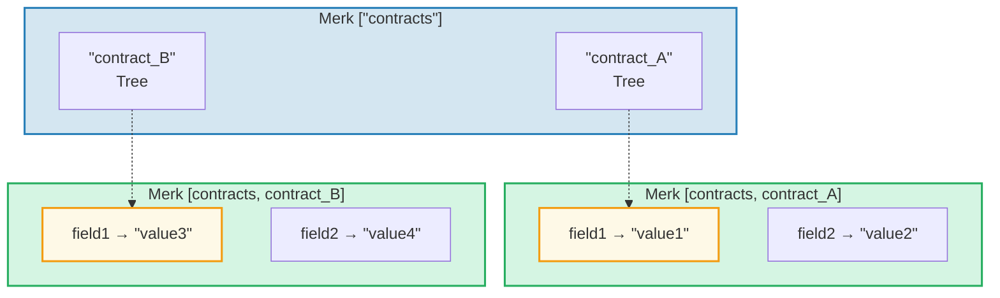
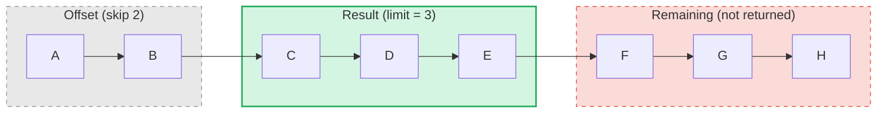

# ระบบ Query

## โครงสร้าง PathQuery

การสืบค้น (query) ของ GroveDB ใช้ type `PathQuery` ซึ่งรวม path (ตำแหน่งที่จะค้นหา) กับ query (สิ่งที่จะเลือก):

```rust
pub struct PathQuery {
    pub path: Vec<Vec<u8>>,         // path เริ่มต้นใน grove
    pub query: SizedQuery,          // สิ่งที่จะเลือก
}

pub struct SizedQuery {
    pub query: Query,               // เกณฑ์การเลือก
    pub limit: Option<u16>,         // จำนวนผลลัพธ์สูงสุด
    pub offset: Option<u16>,        // ข้ามผลลัพธ์ N ตัวแรก
}
```

## ประเภท Query

```rust
pub struct Query {
    pub items: Vec<QueryItem>,              // สิ่งที่จะจับคู่
    pub default_subquery_branch: SubqueryBranch,
    pub conditional_subquery_branches: Option<IndexMap<QueryItem, SubqueryBranch>>,
    pub left_to_right: bool,                // ทิศทางการวนซ้ำ
    pub add_parent_tree_on_subquery: bool,  // รวม element ต้นไม้แม่ในผลลัพธ์ (v2)
}
```

> **`add_parent_tree_on_subquery`** (v2): เมื่อเป็น `true` element ของต้นไม้แม่ (เช่น CountTree หรือ SumTree) จะถูกรวมในผลลัพธ์ query ร่วมกับค่าของลูก สิ่งนี้ช่วยให้คุณดึงทั้งค่ารวม (aggregate value) และ element แต่ละตัวในหนึ่ง query

## QueryItem — สิ่งที่จะเลือก

แต่ละ `QueryItem` ระบุ key หรือช่วง (range) ที่จะจับคู่:

```rust
pub enum QueryItem {
    Key(Vec<u8>),                           // จับคู่ key ตรง
    Range(Range<Vec<u8>>),                  // ช่วงแบบเปิดปลาย [start..end)
    RangeInclusive(RangeInclusive<Vec<u8>>),// ช่วงแบบรวมปลาย [start..=end]
    RangeFull(RangeFull),                   // key ทั้งหมด
    RangeFrom(RangeFrom<Vec<u8>>),          // [start..)
    RangeTo(RangeTo<Vec<u8>>),              // [..end)
    RangeToInclusive(RangeToInclusive<Vec<u8>>), // [..=end]
    RangeAfter(RangeFrom<Vec<u8>>),         // (start..) เริ่มแบบไม่รวม
    RangeAfterTo(Range<Vec<u8>>),           // (start..end) ไม่รวมทั้งสองด้าน
    RangeAfterToInclusive(RangeInclusive<Vec<u8>>), // (start..=end]
}
```

ตัวอย่าง query:

Merk tree (เรียงลำดับ): `alice  bob  carol  dave  eve  frank`

| Query | การเลือก | ผลลัพธ์ |
|-------|-----------|--------|
| `Key("bob")` | alice **[bob]** carol dave eve frank | bob |
| `RangeInclusive("bob"..="dave")` | alice **[bob carol dave]** eve frank | bob, carol, dave |
| `RangeAfter("carol"..)` | alice bob carol **[dave eve frank]** | dave, eve, frank |
| `RangeFull`, limit=2 | **[alice bob]** carol dave eve frank *(หยุดเพราะ limit)* | alice, bob |
| `RangeFull`, limit=2, right-to-left | alice bob carol dave **[eve frank]** *(หยุดเพราะ limit)* | frank, eve |

## Subquery และ Conditional Branch

พลังที่แท้จริงของ GroveDB query คือ **subquery (การสืบค้นย่อย)** — เมื่อ query ตรงกับ element ชนิด Tree, query สามารถลงไปใน subtree นั้นโดยอัตโนมัติ:



> **PathQuery:** `path: ["contracts"], query: RangeFull` ร่วมกับ `default_subquery: Key("field1")`
>
> **การทำงาน:**
> 1. `RangeFull` บน ["contracts"] → ตรงกับ contract_A, contract_B
> 2. ทั้งสองเป็น element ชนิด Tree → ลงไปด้วย subquery `Key("field1")`
> 3. contract_A → "value1", contract_B → "value3"
>
> **ผลลัพธ์:** `["value1", "value3"]`

**Conditional subquery (subquery แบบมีเงื่อนไข)** ให้คุณใช้ subquery ที่แตกต่างกันตาม key ที่ถูกจับคู่:

```rust
conditional_subquery_branches: Some(indexmap! {
    QueryItem::Key(b"contract_A".to_vec()) => SubqueryBranch {
        subquery: Some(Query { items: vec![Key(b"field1".to_vec())] }),
        ..
    },
    QueryItem::Key(b"contract_B".to_vec()) => SubqueryBranch {
        subquery: Some(Query { items: vec![Key(b"field2".to_vec())] }),
        ..
    },
})
```

สิ่งนี้จะดึง `field1` จาก `contract_A` แต่ `field2` จาก `contract_B`

## Sized Query — Limit และ Offset

wrapper `SizedQuery` เพิ่มการแบ่งหน้า (pagination):



> `SizedQuery { query: RangeFull, limit: Some(3), offset: Some(2) }` → ผลลัพธ์: **[C, D, E]**

เมื่อรวมกับ `left_to_right: false` การวนซ้ำจะกลับทิศทาง:

```text
    SizedQuery {
        query: Query { items: [RangeFull], left_to_right: false, .. },
        limit: Some(3),
        offset: None
    }

    ผลลัพธ์: [H, G, F]
```

## การรวม Query (Query Merging)

PathQuery หลายตัวสามารถถูกรวมเป็น query เดียวเพื่อประสิทธิภาพ อัลกอริทึมการรวมจะหาคำนำหน้า path ที่เหมือนกันและรวม query item:

```text
    Query A: path=["users"], query=Key("alice")
    Query B: path=["users"], query=Key("bob")

    รวมแล้ว:  path=["users"], query=items=[Key("alice"), Key("bob")]
```

---
