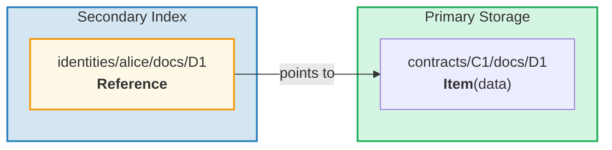
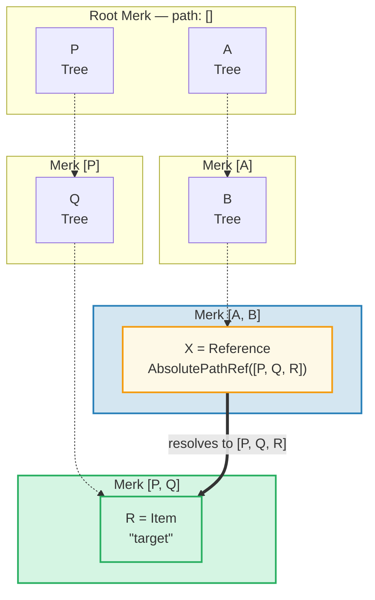
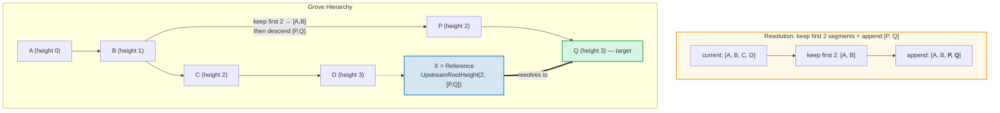
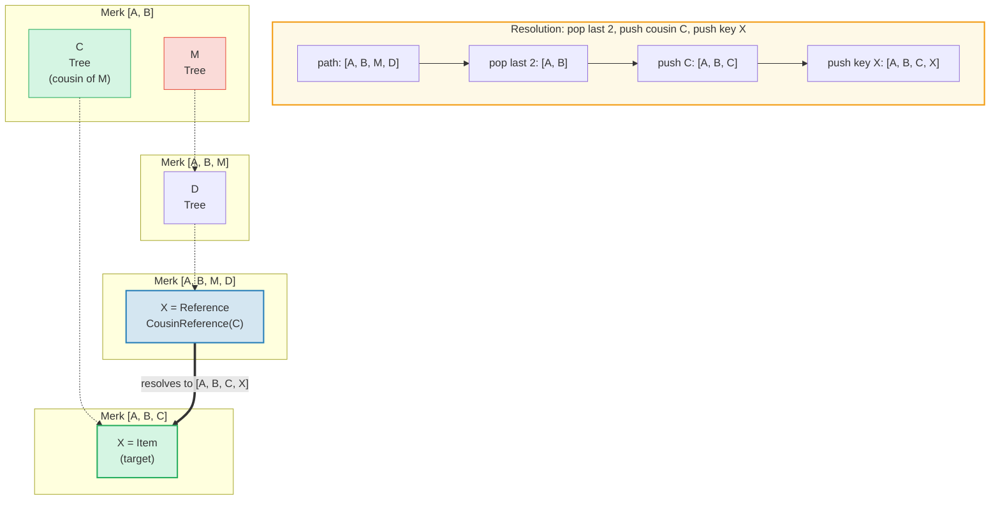
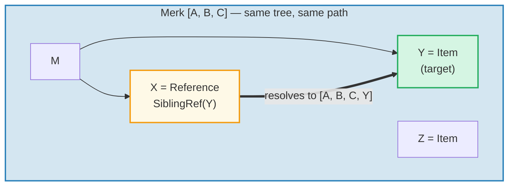
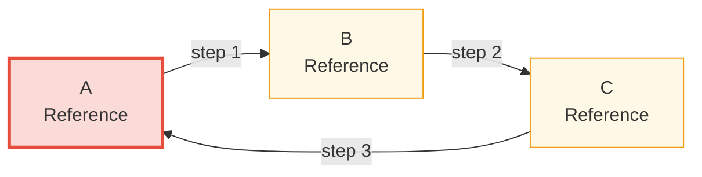

# ระบบ Reference

## ทำไมจึงมี Reference

ในฐานข้อมูลแบบลำดับชั้น คุณมักจะต้องการให้ข้อมูลเดียวกันเข้าถึงได้จากหลาย path ตัวอย่างเช่น เอกสารอาจถูกจัดเก็บภายใต้ contract แต่ก็สามารถสืบค้นได้ตาม owner identity ด้วย **Reference** คือคำตอบของ GroveDB — เป็นตัวชี้ (pointer) จากตำแหน่งหนึ่งไปยังอีกตำแหน่งหนึ่ง คล้ายกับ symbolic link ในระบบไฟล์



คุณสมบัติหลัก:
- Reference ได้รับ **การรับรอง (authenticated)** — value_hash ของ reference รวมทั้ง reference เองและ element ที่ถูกอ้างอิง
- Reference สามารถ **ต่อเป็นลูกโซ่ (chained)** ได้ — reference สามารถชี้ไปยัง reference อื่น
- การตรวจจับวงจร (cycle detection) ป้องกันการวนซ้ำไม่สิ้นสุด
- ขีดจำกัดการกระโดด (hop limit) ที่ปรับได้ป้องกันการใช้ทรัพยากรจนหมด

## Reference ทั้งเจ็ดประเภท

```rust
// grovedb-element/src/reference_path/mod.rs
pub enum ReferencePathType {
    AbsolutePathReference(Vec<Vec<u8>>),
    UpstreamRootHeightReference(u8, Vec<Vec<u8>>),
    UpstreamRootHeightWithParentPathAdditionReference(u8, Vec<Vec<u8>>),
    UpstreamFromElementHeightReference(u8, Vec<Vec<u8>>),
    CousinReference(Vec<u8>),
    RemovedCousinReference(Vec<Vec<u8>>),
    SiblingReference(Vec<u8>),
}
```

มาดูแต่ละประเภทพร้อมแผนภาพ

### AbsolutePathReference

ประเภทที่ง่ายที่สุด จัดเก็บ path เต็มไปยังเป้าหมาย:



> X จัดเก็บ path แบบสัมบูรณ์เต็ม `[P, Q, R]` ไม่ว่า X จะอยู่ที่ไหน มันจะ resolve (แก้ไข) ไปยังเป้าหมายเดียวกันเสมอ

### UpstreamRootHeightReference

เก็บ N ส่วนแรกของ path ปัจจุบัน แล้วต่อด้วย path ใหม่:



### UpstreamRootHeightWithParentPathAdditionReference

เหมือน UpstreamRootHeight แต่เพิ่มส่วนสุดท้ายของ path ปัจจุบันกลับเข้าไป:

```text
    Reference ที่ path [A, B, C, D, E] key=X
    UpstreamRootHeightWithParentPathAdditionReference(2, [P, Q])

    Current path:    [A, B, C, D, E]
    เก็บ 2 ส่วนแรก: [A, B]
    ต่อ [P, Q]:      [A, B, P, Q]
    เพิ่มส่วนสุดท้ายกลับ: [A, B, P, Q, E]   ← "E" จาก path ดั้งเดิมถูกเพิ่มกลับ

    มีประโยชน์สำหรับ: ดัชนีที่ parent key ควรถูกรักษาไว้
```

### UpstreamFromElementHeightReference

ตัด N ส่วนท้ายออก แล้วต่อด้วย:

```text
    Reference ที่ path [A, B, C, D] key=X
    UpstreamFromElementHeightReference(1, [P, Q])

    Current path:     [A, B, C, D]
    ตัดส่วนท้าย 1:    [A, B, C]
    ต่อ [P, Q]:       [A, B, C, P, Q]
```

### CousinReference

แทนที่เฉพาะ parent โดยตรงด้วย key ใหม่:



> "cousin (ลูกพี่ลูกน้อง)" คือ subtree พี่น้องของปู่/ย่าของ reference โดย reference จะนำทางขึ้น 2 ระดับ แล้วลงไปใน cousin subtree

### RemovedCousinReference

เหมือน CousinReference แต่แทนที่ parent ด้วย path หลายส่วน:

```text
    Reference ที่ path [A, B, C, D] key=X
    RemovedCousinReference([M, N])

    Current path:  [A, B, C, D]
    Pop parent C:  [A, B]
    ต่อ [M, N]:    [A, B, M, N]
    Push key X:    [A, B, M, N, X]
```

### SiblingReference

reference แบบสัมพัทธ์ที่ง่ายที่สุด — แค่เปลี่ยน key ภายใน parent เดียวกัน:



> ประเภท reference ที่ง่ายที่สุด X และ Y เป็นพี่น้อง (sibling) ใน Merk tree เดียวกัน — การ resolve แค่เปลี่ยน key โดยรักษา path เดิม

## การตาม Reference และขีดจำกัดการกระโดด (Hop Limit)

เมื่อ GroveDB พบ element ชนิด Reference มันต้อง **ตาม (follow)** ไปเพื่อหาค่าจริง เนื่องจาก reference สามารถชี้ไปยัง reference อื่น สิ่งนี้เกี่ยวข้องกับลูป:

```rust
// grovedb/src/reference_path.rs
pub const MAX_REFERENCE_HOPS: usize = 10;

pub fn follow_reference(...) -> CostResult<ResolvedReference, Error> {
    let mut hops_left = MAX_REFERENCE_HOPS;
    let mut visited = HashSet::new();

    while hops_left > 0 {
        // Resolve reference path เป็น absolute path
        let target_path = current_ref.absolute_qualified_path(...);

        // ตรวจสอบวงจร
        if !visited.insert(target_path.clone()) {
            return Err(Error::CyclicReference);
        }

        // ดึง element ที่เป้าหมาย
        let element = Element::get(target_path);

        match element {
            Element::Reference(next_ref, ..) => {
                // ยังเป็น reference — ตามต่อ
                current_ref = next_ref;
                hops_left -= 1;
            }
            other => {
                // เจอ element จริงแล้ว!
                return Ok(ResolvedReference { element: other, ... });
            }
        }
    }

    Err(Error::ReferenceLimit)  // เกินขีดจำกัด 10 hops
}
```

## การตรวจจับวงจร (Cycle Detection)

HashSet `visited` ติดตามทุก path ที่เคยเห็น ถ้าพบ path ที่เคยเยือนแล้ว แสดงว่ามีวงจร:



> **การตรวจสอบการตรวจจับวงจร:**
>
> | ขั้นตอน | ตาม | visited set | ผลลัพธ์ |
> |------|--------|-------------|--------|
> | 1 | เริ่มที่ A | { A } | A เป็น Ref → ตามต่อ |
> | 2 | A → B | { A, B } | B เป็น Ref → ตามต่อ |
> | 3 | B → C | { A, B, C } | C เป็น Ref → ตามต่อ |
> | 4 | C → A | A อยู่ใน visited แล้ว! | **Error::CyclicRef** |
>
> หากไม่มีการตรวจจับวงจร สิ่งนี้จะวนซ้ำตลอดไป `MAX_REFERENCE_HOPS = 10` ยังจำกัดความลึกของการเดินทางสำหรับ chain ที่ยาวด้วย

## Reference ใน Merk — Combined Value Hash

เมื่อ Reference ถูกจัดเก็บใน Merk tree `value_hash` ของมันต้องรับรองทั้งโครงสร้าง reference และข้อมูลที่ถูกอ้างอิง:

```rust
// merk/src/tree/kv.rs
pub fn update_hashes_using_reference_value_hash(
    mut self,
    reference_value_hash: CryptoHash,
) -> CostContext<Self> {
    // แฮชไบต์ของ reference element เอง
    let actual_value_hash = value_hash(self.value_as_slice());

    // รวม: H(reference_bytes) + H(referenced_data)
    let combined = combine_hash(&actual_value_hash, &reference_value_hash);

    self.value_hash = combined;
    self.hash = kv_digest_to_kv_hash(self.key(), self.value_hash());
    // ...
}
```

ซึ่งหมายความว่าการเปลี่ยนทั้ง reference เองหรือข้อมูลที่มันชี้ไป จะเปลี่ยน root hash — ทั้งสองถูกผูกทางการเข้ารหัส

---
