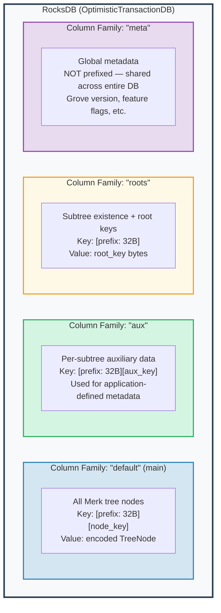
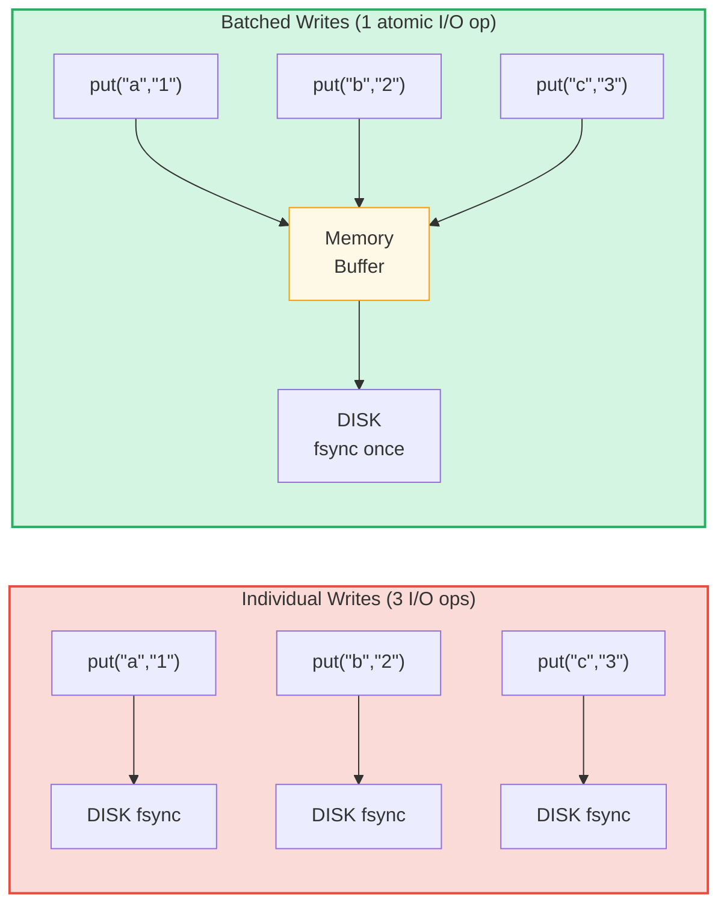

# ชั้นจัดเก็บข้อมูล

## RocksDB กับ OptimisticTransactionDB

GroveDB ใช้ **RocksDB** เป็น storage backend (ส่วนหลังของการจัดเก็บข้อมูล) โดยเฉพาะ variant `OptimisticTransactionDB` ที่รองรับ transaction (ธุรกรรม):

```rust
// storage/src/rocksdb_storage/storage.rs
pub(crate) type Db = OptimisticTransactionDB;
pub(crate) type Tx<'db> = Transaction<'db, Db>;

pub struct RocksDbStorage {
    db: OptimisticTransactionDB,
}
```

**Optimistic transaction (ธุรกรรมแบบมองโลกในแง่ดี)** ทำงานโดยสมมติว่าจะไม่มีข้อขัดแย้ง หากสอง transaction แก้ไขข้อมูลเดียวกัน transaction ที่ commit ทีหลังจะล้มเหลวและสามารถลองใหม่ได้ วิธีนี้มีประสิทธิภาพมากกว่า pessimistic locking (การล็อกแบบมองโลกในแง่ร้าย) สำหรับ workload ที่ข้อขัดแย้งเกิดขึ้นน้อย

ตัวเลือก RocksDB ถูกปรับจูนสำหรับ workload ของ GroveDB:

```rust
lazy_static! {
    static ref DEFAULT_OPTS: rocksdb::Options = {
        let mut opts = rocksdb::Options::default();
        opts.create_if_missing(true);
        opts.increase_parallelism(num_cpus::get() as i32);
        opts.set_allow_mmap_writes(true);
        opts.set_allow_mmap_reads(true);
        opts.create_missing_column_families(true);
        opts.set_atomic_flush(true);
        opts
    };
}
```

## สี่ Column Family

Column family ของ RocksDB ทำหน้าที่เหมือน namespace ของ key-value ที่แยกกันภายในฐานข้อมูลเดียว GroveDB ใช้สี่ตัว:



> **ตัวอย่าง:** Key `[ab3fc2...][6e616d65]` ใน CF "default" จับคู่กับ `TreeNode{key:"name", val:"Al"}` โดยที่ `ab3fc2...` คือ `Blake3(path)` และ `6e616d65` คือ `"name"` ในไบต์

```rust
pub(crate) const AUX_CF_NAME: &str = "aux";
pub(crate) const ROOTS_CF_NAME: &str = "roots";
pub(crate) const META_CF_NAME: &str = "meta";
// ข้อมูลหลักใช้ default column family
```

## Prefixed Storage Context

แต่ละ subtree ได้ **prefixed storage context** ของตัวเอง — wrapper (ตัวห่อหุ้ม) ที่นำหน้า key ทุกตัวด้วย prefix Blake3 ขนาด 32 ไบต์โดยอัตโนมัติ:

```text
    Subtree path: ["identities", "alice"]
    Prefix: Blake3(path) = [0xab, 0x3f, 0xc2, ...]  (32 ไบต์)

    เมื่อ subtree จัดเก็บ key "name" กับค่า "Alice":

    RocksDB key:   [0xab 0x3f 0xc2 ... (32 bytes) | 0x6e 0x61 0x6d 0x65]
                    \_________prefix________/       \_____"name"_____/

    RocksDB value: [encoded TreeNode with value "Alice"]
```

ประเภท context:

```text
    ไม่มี transaction:
    PrefixedRocksDbImmediateStorageContext
    └── อ่าน/เขียนโดยตรงไปยัง DB พร้อม prefix

    มี transaction:
    PrefixedRocksDbTransactionContext
    └── อ่าน/เขียนผ่าน Transaction พร้อม prefix
```

ทั้งสองอย่าง implement trait `StorageContext`:

```rust
pub trait StorageContext<'db> {
    fn get(&self, key: &[u8]) -> CostResult<Option<Vec<u8>>, Error>;
    fn get_aux(&self, key: &[u8]) -> CostResult<Option<Vec<u8>>, Error>;
    fn get_root(&self, key: &[u8]) -> CostResult<Option<Vec<u8>>, Error>;
    fn get_meta(&self, key: &[u8]) -> CostResult<Option<Vec<u8>>, Error>;
    fn put(&self, key: &[u8], value: &[u8], ...) -> CostResult<(), Error>;
    fn put_aux(&self, key: &[u8], value: &[u8], ...) -> CostResult<(), Error>;
    fn put_root(&self, key: &[u8], value: &[u8], ...) -> CostResult<(), Error>;
    fn put_meta(&self, key: &[u8], value: &[u8], ...) -> CostResult<(), Error>;
    fn delete(&self, key: &[u8], ...) -> CostResult<(), Error>;
    // ...
}
```

## Write Batch และ Transaction Model

เพื่อประสิทธิภาพ GroveDB สะสมการเขียนเป็น batch:



> 3 disk sync เทียบกับ 1 disk sync = เร็วขึ้นประมาณ 3 เท่า การเขียนแบบ batch ยังเป็น **atomic** (ทั้งหมดหรือไม่เลย) อีกด้วย

`StorageBatch` สะสมการดำเนินการที่จะถูก flush พร้อมกัน:

```rust
pub struct StorageBatch {
    operations: RefCell<Vec<AbstractBatchOperation>>,
}
```

## รูปแบบ commit_local() ที่สำคัญ

เมื่อใช้ transaction มีรูปแบบสำคัญที่ต้องปฏิบัติตาม การเขียนภายใน transaction จะถูก buffer ไว้ — ไม่สามารถมองเห็นได้จนกว่าจะ commit:

```rust
// รูปแบบที่ถูกต้อง:
{
    let tx = db.start_transaction();
    let storage_ctx = db.get_transactional_storage_context(path, &tx);

    storage_ctx.put(key, value);  // เขียนไปยัง transaction buffer

    drop(storage_ctx);            // ปลดปล่อย borrow บน tx
    tx.commit_local();            // flush transaction ไปยัง DB
}

// ไม่ถูกต้อง — ข้อมูลจะสูญหาย:
{
    let tx = db.start_transaction();
    let storage_ctx = db.get_transactional_storage_context(path, &tx);

    storage_ctx.put(key, value);  // เขียนไปยัง transaction buffer

    // tx drop ที่นี่โดยไม่มี commit_local()!
    // การเขียนทั้งหมดถูก ROLLED BACK!
}
```

สิ่งนี้สำคัญเป็นพิเศษเพราะ `storage_ctx` ยืม (borrow) transaction คุณต้อง `drop(storage_ctx)` ก่อนที่จะเรียก `tx.commit_local()` ได้

---
