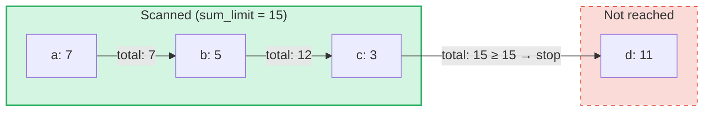

# Toplu Toplam Sorgulari

## Genel Bakis

Toplu Toplam Sorgulari, GroveDB'deki **SumTree**'ler icin tasarlanmis ozel bir sorgu turudur.
Normal sorgular elemanlari anahtar veya araliga gore getirirken, toplu toplam sorgulari
elemanlar uzerinde yineleyerek bir **toplam limiti**'ne ulasilana kadar toplam degerlerini biriktirir.

Bu, su tur sorular icin kullanislidir:
- "Toplam calisma degeri 1000'i asana kadar bana islemleri ver"
- "Bu agactaki ilk 500 birimlik degere hangi ogeler katki sagliyor?"
- "N butcesine kadar toplam ogelerini topla"

## Temel Kavramlar

### Normal Sorgulardan Farki

| Ozellik | PathQuery | AggregateSumPathQuery |
|---------|-----------|----------------------|
| **Hedef** | Herhangi bir eleman tipi | SumItem / ItemWithSumItem elemanlari |
| **Durma kosulu** | Limit (sayi) veya aralik sonu | Toplam limiti (calisma toplami) **ve/veya** oge limiti |
| **Dondurdugu** | Elemanlar veya anahtarlar | Anahtar-toplam degeri ciftleri |
| **Alt sorgular** | Evet (alt agaclara iner) | Hayir (tek agac seviyesi) |
| **Referanslar** | GroveDB katmani tarafindan cozumlenir | Istege bagli olarak takip edilir veya goz ardi edilir |

### AggregateSumQuery Yapisi

```rust
pub struct AggregateSumQuery {
    pub items: Vec<QueryItem>,              // Keys or ranges to scan
    pub left_to_right: bool,                // Iteration direction
    pub sum_limit: u64,                     // Stop when running total reaches this
    pub limit_of_items_to_check: Option<u16>, // Max number of matching items to return
}
```

Sorgu, grove icinde nereye bakilacagini belirlemek icin bir `AggregateSumPathQuery` ile sarmalanir:

```rust
pub struct AggregateSumPathQuery {
    pub path: Vec<Vec<u8>>,                 // Path to the SumTree
    pub aggregate_sum_query: AggregateSumQuery,
}
```

### Toplam Limiti — Calisma Toplami

`sum_limit` temel kavramdir. Elemanlar taranirken toplam degerleri biriktirilir.
Calisma toplami toplam limitine ulastiginda veya astiginda yineleme durur:



> **Sonuc:** `[(a, 7), (b, 5), (c, 3)]` — yineleme durur cunku 7 + 5 + 3 = 15 >= sum_limit

Negatif toplam degerleri desteklenir. Negatif bir deger kalan butceyi arttirir:

```text
sum_limit = 12, elements: a(10), b(-3), c(5)

a: total = 10, remaining = 2
b: total =  7, remaining = 5  ← negative value gave us more room
c: total = 12, remaining = 0  ← stop

Result: [(a, 10), (b, -3), (c, 5)]
```

## Sorgu Secenekleri

`AggregateSumQueryOptions` yapisi sorgu davranisini kontrol eder:

```rust
pub struct AggregateSumQueryOptions {
    pub allow_cache: bool,                              // Use cached reads (default: true)
    pub error_if_intermediate_path_tree_not_present: bool, // Error on missing path (default: true)
    pub error_if_non_sum_item_found: bool,              // Error on non-sum elements (default: true)
    pub ignore_references: bool,                        // Skip references (default: false)
}
```

### Toplam Olmayan Elemanlarin Islenmesi

SumTree'ler farkli eleman tiplerinin karisimini icerebilir: `SumItem`, `Item`, `Reference`, `ItemWithSumItem`
ve digerleri. Varsayilan olarak, toplam olmayan ve referans olmayan bir elemanla karsilasildiginda hata uretilir.

`error_if_non_sum_item_found` degeri `false` olarak ayarlandiginda, toplam olmayan elemanlar
kullanici limiti slotunu tuketmeden **sessizce atlanir**:

```text
Tree contents: a(SumItem=7), b(Item), c(SumItem=3)
Query: sum_limit=100, limit_of_items_to_check=2, error_if_non_sum_item_found=false

Scan: a(7) → returned, limit=1
      b(Item) → skipped, limit still 1
      c(3) → returned, limit=0 → stop

Result: [(a, 7), (c, 3)]
```

Not: `ItemWithSumItem` elemanlari bir toplam degeri tasidiklari icin **her zaman** islenir (asla atlanmaz).

### Referans Isleme

Varsayilan olarak, `Reference` elemanlari **takip edilir** — sorgu, hedef elemanin toplam degerini
bulmak icin referans zincirini (en fazla 3 ara atlama) cozumler:

```text
Tree contents: a(SumItem=7), ref_b(Reference → a)
Query: sum_limit=100

ref_b is followed → resolves to a(SumItem=7)

Result: [(a, 7), (ref_b, 7)]
```

`ignore_references` degeri `true` oldugundan, referanslar limit slotunu tuketmeden sessizce atlanir,
toplam olmayan elemanlarin atlanmasina benzer sekilde.

3 ara atlamadan derin referans zincirleri `ReferenceLimit` hatasi uretir.

## Sonuc Tipi

Sorgular bir `AggregateSumQueryResult` dondurur:

```rust
pub struct AggregateSumQueryResult {
    pub results: Vec<(Vec<u8>, i64)>,       // Key-sum value pairs
    pub hard_limit_reached: bool,           // True if system limit truncated results
}
```

`hard_limit_reached` bayragi, sorgu dogal olarak tamamlanmadan once sistemin sert tarama limitinin
(varsayilan: 1024 eleman) ulasilip ulasilmadigini belirtir. `true` oldugunda, dondurulenin
otesinde daha fazla sonuc mevcut olabilir.

## Uc Limit Sistemi

Toplu toplam sorgularinin **uc** durma kosulu vardir:

| Limit | Kaynak | Neyi sayar | Ulasildiginda etki |
|-------|--------|------------|-------------------|
| **sum_limit** | Kullanici (sorgu) | Toplam degerlerin calisma toplami | Yinelemeyi durdurur |
| **limit_of_items_to_check** | Kullanici (sorgu) | Dondurulmus eslesen ogeler | Yinelemeyi durdurur |
| **Sert tarama limiti** | Sistem (GroveVersion, varsayilan 1024) | Taranan tum elemanlar (atlananlar dahil) | Yinelemeyi durdurur, `hard_limit_reached` ayarlar |

Sert tarama limiti, kullanici limiti belirlenmediginde sinirsiz yinelemeyi onler. Atlanan elemanlar
(`error_if_non_sum_item_found=false` ile toplam olmayan ogeler veya `ignore_references=true` ile
referanslar) sert tarama limitine dahil edilir ancak kullanicinin `limit_of_items_to_check`
degerine dahil **edilmez**.

## API Kullanimi

### Basit Sorgu

```rust
use grovedb::AggregateSumPathQuery;
use grovedb_merk::proofs::query::AggregateSumQuery;

// "Give me items from this SumTree until the total reaches 1000"
let query = AggregateSumQuery::new(1000, None);
let path_query = AggregateSumPathQuery {
    path: vec![b"my_tree".to_vec()],
    aggregate_sum_query: query,
};

let result = db.query_aggregate_sums(
    &path_query,
    true,   // allow_cache
    true,   // error_if_intermediate_path_tree_not_present
    None,   // transaction
    grove_version,
).unwrap().expect("query failed");

for (key, sum_value) in &result.results {
    println!("{}: {}", String::from_utf8_lossy(key), sum_value);
}
```

### Secenekli Sorgu

```rust
use grovedb::{AggregateSumPathQuery, AggregateSumQueryOptions};
use grovedb_merk::proofs::query::AggregateSumQuery;

// Skip non-sum items and ignore references
let query = AggregateSumQuery::new(1000, Some(50));
let path_query = AggregateSumPathQuery {
    path: vec![b"mixed_tree".to_vec()],
    aggregate_sum_query: query,
};

let result = db.query_aggregate_sums_with_options(
    &path_query,
    AggregateSumQueryOptions {
        error_if_non_sum_item_found: false,  // skip Items, Trees, etc.
        ignore_references: true,              // skip References
        ..AggregateSumQueryOptions::default()
    },
    None,
    grove_version,
).unwrap().expect("query failed");

if result.hard_limit_reached {
    println!("Warning: results may be incomplete (hard limit reached)");
}
```

### Anahtar Tabanli Sorgular

Bir aralik taramak yerine belirli anahtarlari sorgulayabilirsiniz:

```rust
// Check the sum value of specific keys
let query = AggregateSumQuery::new_with_keys(
    vec![b"alice".to_vec(), b"bob".to_vec(), b"carol".to_vec()],
    u64::MAX,  // no sum limit
    None,      // no item limit
);
```

### Azalan Sorgular

En yuksek anahtardan en dusuge dogru yineleme:

```rust
let query = AggregateSumQuery::new_descending(500, Some(10));
// Or: query.left_to_right = false;
```

## Kurucu Referansi

| Kurucu | Aciklama |
|--------|----------|
| `new(sum_limit, limit)` | Tam aralik, artan siralama |
| `new_descending(sum_limit, limit)` | Tam aralik, azalan siralama |
| `new_single_key(key, sum_limit)` | Tek anahtar arama |
| `new_with_keys(keys, sum_limit, limit)` | Birden fazla belirli anahtar |
| `new_with_keys_reversed(keys, sum_limit, limit)` | Birden fazla anahtar, azalan siralama |
| `new_single_query_item(item, sum_limit, limit)` | Tek QueryItem (anahtar veya aralik) |
| `new_with_query_items(items, sum_limit, limit)` | Birden fazla QueryItem |

---
