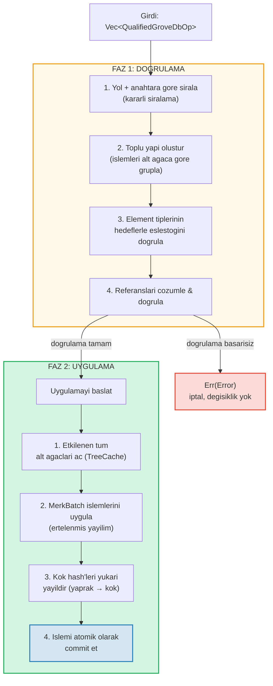
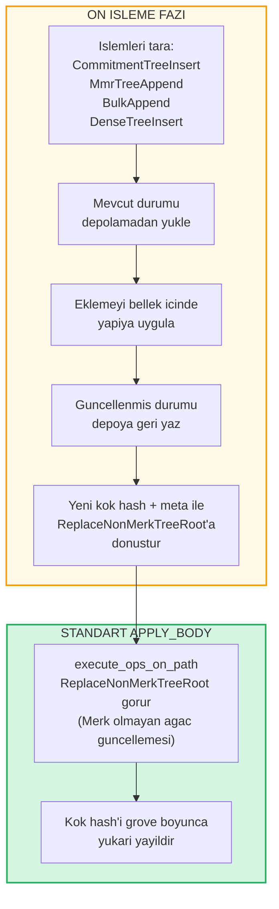

# Grove Seviyesinde Toplu Islemler

## GroveOp Varyantlari

GroveDB seviyesinde islemler `GroveOp` olarak temsil edilir:

```rust
pub enum GroveOp {
    // Kullaniciya yonelik islemler:
    InsertOnly { element: Element },
    InsertOrReplace { element: Element },
    Replace { element: Element },
    Patch { element: Element, change_in_bytes: i32 },
    RefreshReference { reference_path_type, max_reference_hop, flags, trust_refresh_reference },
    Delete,
    DeleteTree(TreeType),                          // Agac tipine gore parametrelenmis

    // Merk olmayan agac ekleme islemleri (kullaniciya yonelik):
    CommitmentTreeInsert { cmx: [u8; 32], payload: Vec<u8> },
    MmrTreeAppend { value: Vec<u8> },
    BulkAppend { value: Vec<u8> },
    DenseTreeInsert { value: Vec<u8> },

    // Dahili islemler (on isleme/yayilim tarafindan olusturulur, from_ops tarafindan reddedilir):
    ReplaceTreeRootKey { hash, root_key, aggregate_data },
    InsertTreeWithRootHash { hash, root_key, flags, aggregate_data },
    ReplaceNonMerkTreeRoot { hash: [u8; 32], meta: NonMerkTreeMeta },
    InsertNonMerkTree { hash, root_key, flags, aggregate_data, meta: NonMerkTreeMeta },
}
```

**NonMerkTreeMeta**, toplu islem islemesi boyunca agac tipine ozel durumu tasir:

```rust
pub enum NonMerkTreeMeta {
    CommitmentTree { total_count: u64, chunk_power: u8 },
    MmrTree { mmr_size: u64 },
    BulkAppendTree { total_count: u64, chunk_power: u8 },
    DenseTree { count: u16, height: u8 },
}
```

Her islem, yolu iceren bir `QualifiedGroveDbOp` icine sarilir:

```rust
pub struct QualifiedGroveDbOp {
    pub path: KeyInfoPath,           // Grove icindeki konum
    pub key: Option<KeyInfo>,        // Hangi anahtar (yalnizca ekleme agac islemleri icin None)
    pub op: GroveOp,                 // Ne yapilacak
}
```

> **Not:** `key` alani `Option<KeyInfo>`'dir -- agac anahtarinin `path`'in son segmenti oldugu yalnizca ekleme yapilabilen agac islemleri (`CommitmentTreeInsert`, `MmrTreeAppend`, `BulkAppend`, `DenseTreeInsert`) icin `None`'dir.

## Iki Fazli Islem

Toplu islemler iki fazda islenir:



## TreeCache ve Ertelenmis Yayilim

Toplu uygulama sirasinda, GroveDB bir alt agactaki tum islemler tamamlanana kadar kok hash yayilimini ertelemek icin bir **TreeCache** kullanir:

```mermaid
graph TD
    subgraph without["TreeCache OLMADAN (naif)"]
        w1["Islem 1: X'e A ekle"]
        w1p["X → ust → koke yayildir"]
        w2["Islem 2: X'e B ekle"]
        w2p["X → ust → koke yayildir"]
        w3["Islem 3: X'e C ekle"]
        w3p["X → ust → koke yayildir"]
        w1 --> w1p --> w2 --> w2p --> w3 --> w3p
    end

    subgraph with_tc["TreeCache ILE (ertelenmis)"]
        t1["Islem 1: X'e A ekle<br/>→ tamponlandi"]
        t2["Islem 2: X'e B ekle<br/>→ tamponlandi"]
        t3["Islem 3: X'e C ekle<br/>→ tamponlandi"]
        tp["X → ust → koke yayildir<br/>(TEK SEFERDE yukari yuru)"]
        t1 --> t2 --> t3 --> tp
    end

    style without fill:#fadbd8,stroke:#e74c3c,stroke-width:2px
    style with_tc fill:#d5f5e3,stroke:#27ae60,stroke-width:2px
    style w1p fill:#fadbd8,stroke:#e74c3c
    style w2p fill:#fadbd8,stroke:#e74c3c
    style w3p fill:#fadbd8,stroke:#e74c3c
    style tp fill:#d5f5e3,stroke:#27ae60,stroke-width:2px
```



> **3 yayilim x O(derinlik)** karsi **1 yayilim x O(derinlik)** = bu alt agac icin 3 kat daha hizli.

Bu, bircok islemin ayni alt agaci hedefledigi durumlarda onemli bir optimizasyondur.

## Atomik Capraz Alt Agac Islemleri

GroveDB toplu islemlerinin temel bir ozelligi **alt agaclar arasi atomikliktir**. Tek bir topluluk birden fazla alt agactaki elemanlari degistirebilir ve ya tum degisiklikler commit edilir ya da hicbiri:

```text
    Topluluk:
    1. ["balances", "alice"] sil        (bakiye kaldir)
    2. ["balances", "bob"] = 100 ekle   (bakiye ekle)
    3. ["identities", "bob", "rev"] = 2 guncelle  (revizyon guncelle)

    Etkilenen uc alt agac: balances, identities, identities/bob

    HERHANGI BIR islem basarisiz olursa → TUM islemler geri alinir
    HEPSI basarili olursa → HEPSI atomik olarak commit edilir
```

Toplu isleyici bunu su sekilde ele alir:
1. Etkilenen tum yollari toplar
2. Gerekli tum alt agaclari acar
3. Tum islemleri uygular
4. Tum kok hash'leri bagimlilik sirasina gore yayildirir
5. Tum islemi commit eder

## Merk Olmayan Agaclar icin Toplu On Islem

CommitmentTree, MmrTree, BulkAppendTree ve DenseAppendOnlyFixedSizeTree islemleri, standart `execute_ops_on_path` metodu icinde mevcut olmayan Merk disindaki depolama baglamlarina erisim gerektirir (yalnizca Merk'e erisimi vardir). Bu islemler bir **on isleme (preprocessing) deseni** kullanir: ana `apply_body` fazindan once, giris noktalari Merk olmayan agac islemlerini tarar ve standart dahili islemlere donusturur.

```rust
pub enum GroveOp {
    // ... standart islemler ...

    // Merk olmayan agac islemleri (kullaniciya yonelik):
    CommitmentTreeInsert { cmx: [u8; 32], payload: Vec<u8> },
    MmrTreeAppend { value: Vec<u8> },
    BulkAppend { value: Vec<u8> },
    DenseTreeInsert { value: Vec<u8> },

    // Dahili islemler (on isleme tarafindan uretilir):
    ReplaceNonMerkTreeRoot { hash: [u8; 32], meta: NonMerkTreeMeta },
}
```



**Neden on isleme?** `execute_ops_on_path` fonksiyonu tek bir Merk alt agaci uzerinde calisir ve `self.db`'ye veya daha genis depolama baglamlarina erisimi yoktur. Giris noktalarinda (`apply_batch_with_element_flags_update`, `apply_partial_batch_with_element_flags_update`) on isleme yapmak veritabanina tam erisme sahiptir, boylece verileri yukleyip/kaydedebilir ve sonra standart toplu makineye basit bir `ReplaceNonMerkTreeRoot` teslim edebilir.

Her on isleme metodu ayni deseni izler:
1. **`preprocess_commitment_tree_ops`** -- Veri deposundan frontier ve BulkAppendTree'yi yukler, her ikisine de ekler, geri kaydeder, guncellenmmis birlesik kok ve `CommitmentTree { total_count, chunk_power }` meta ile `ReplaceNonMerkTreeRoot`'a donusturur
2. **`preprocess_mmr_tree_ops`** -- Veri deposundan MMR'yi yukler, degerleri ekler, geri kaydeder, guncellenmis MMR koku ve `MmrTree { mmr_size }` meta ile `ReplaceNonMerkTreeRoot`'a donusturur
3. **`preprocess_bulk_append_ops`** -- Veri deposundan BulkAppendTree'yi yukler, degerleri ekler (parca sikistirmasi tetikleyebilir), geri kaydeder, guncellenmis durum koku ve `BulkAppendTree { total_count, chunk_power }` meta ile `ReplaceNonMerkTreeRoot`'a donusturur
4. **`preprocess_dense_tree_ops`** -- Veri deposundan DenseFixedSizedMerkleTree'yi yukler, degerleri sirali olarak ekler, kok hash'i yeniden hesaplar, geri kaydeder, guncellenmis kok hash ve `DenseTree { count, height }` meta ile `ReplaceNonMerkTreeRoot`'a donusturur

`ReplaceNonMerkTreeRoot` islemi, islem sonrasinda elementin tamamen yeniden olusturulabilmesi icin yeni kok hash'i ve bir `NonMerkTreeMeta` enum'u tasir.

---
