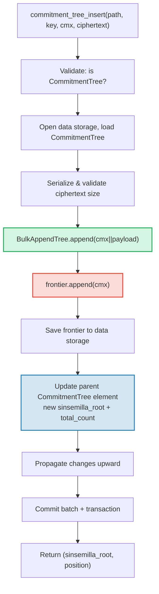

# CommitmentTree — Sinsemilla Taahhut Capalari

**CommitmentTree**, GroveDB'nin dogrulanmis depolama ile sifir bilgi ispat (zero-knowledge proof) sistemleri arasindaki koprusudur. Verimli parca-sikistirilmis veri depolamasi icin bir **BulkAppendTree** (Bolum 14) ile veri ad alaninda ZK uyumlu capalar icin bir **Sinsemilla frontier**'i birlestirir. MmrTree ve BulkAppendTree gibi, **alt Merk'e sahip degildir** — birlesmis kok hash'i Merk alt hash'i (child hash) olarak akar. Hem BulkAppendTree girdileri hem de Sinsemilla frontier'i **veri ad alaninda** (data namespace) bulunur.

Bu bolum, Sinsemilla hash fonksiyonunu ve sifir bilgi devreleri icin neden onemli oldugunu, frontier veri yapisini ve kompakt serilestirmesini, cift ad alanli depolama mimarisini, GroveDB islemlerini, toplu on islemeyi, istemci tarafi tanik (witness) olusturmayi ve ispatların nasil calistigini kapsar.

## Neden ZK Uyumlu Bir Agac?

GroveDB'nin standart agaclari Blake3 hash'lemesi kullanir. Blake3 yazilimda hizlidir, ancak **sifir bilgi devrelerinin icinde pahalidir**. Bir harcayici "Taahhut agacindaki P konumunda bir not biliyorum" ifadesini P'yi aciklamadan ispatlamak istediginde, bir ZK devresi icinde Merkle hash fonksiyonunu 32 kez (agac seviyesi basina bir kez) degerlendirmelidir.

Sinsemilla (Zcash Orchard protokolu icin ZIP-244'te belirtilmistir), tam olarak bu kullanim durumu icin tasarlanmistir — Halo 2 ispat sistemi tarafindan kullanilan Pasta egri ciftinin bir yarisi olan Pallas eliptik egrisi uzerinde **verimli devre-ici hash'leme** saglar.

| Ozellik | Blake3 | Sinsemilla |
|----------|--------|------------|
| **Devre maliyeti** | Hash basina ~25.000 kisitlama | Hash basina ~800 kisitlama |
| **Yazilim hizi** | Cok hizli (~2 GB/s) | Yavas (~10.000 hash/s) |
| **Cebirsel yapi** | Yok (bit duzeyi) | Pallas egrisi nokta islemleri |
| **Birincil amac** | Genel hash'leme, Merkle agaclari | Devre-ici Merkle ispatları |
| **Kullanan** | GroveDB Merk agaclari, MMR, Bulk | Orchard korunmali protokol |
| **Cikti boyutu** | 32 bayt | 32 bayt (Pallas alan elemani) |

CommitmentTree, ZK devrelerinin uzerinde muhakeme yaptigi Merkle agaci icin Sinsemilla kullanirken, yukarisindaki GroveDB Merk hiyerarsisi icin Blake3 kullanmaya devam eder. Agaca eklenen ogeler, veri ad alanindaki bir BulkAppendTree araciligiyla (parca sikistirilmis, konuma gore erisilebilir) depolanir ve ayni anda Sinsemilla frontier'ine eklenir (ZK ile ispatlanabilir bir capa uretir).

## Veri Ad Alani Mimarisi

CommitmentTree, **tum verileri ayni alt agac yolundaki veri ad alaninda** depolar. MmrTree ve BulkAppendTree gibi, **alt Merk'e sahip degildir** (`root_key` alani yoktur — tipe ozgu kok, Merk alt hash'i olarak akar). BulkAppendTree girdileri ve Sinsemilla frontier'i, farkli anahtar onekleri kullanarak veri ad alaninda bir arada bulunur:

```text
┌──────────────────────────────────────────────────────────────┐
│                       CommitmentTree                          │
│                                                               │
│  ┌─────────────────────────────────────────────────────────┐  │
│  │  Data Namespace                                         │  │
│  │                                                         │  │
│  │  BulkAppendTree storage (Chapter 14):                   │  │
│  │    Buffer entries → chunk blobs → chunk MMR             │  │
│  │    value = cmx (32 bytes) || ciphertext (216 bytes)     │  │
│  │                                                         │  │
│  │  Sinsemilla Frontier (~1KB):                            │  │
│  │    key: b"__ct_data__" (COMMITMENT_TREE_DATA_KEY)       │  │
│  │    Depth-32 incremental Merkle tree                     │  │
│  │    Stores only the rightmost path (leaf + ommers)       │  │
│  │    O(1) append, O(1) root computation                   │  │
│  │    Produces Orchard-compatible Anchor for ZK proofs     │  │
│  └─────────────────────────────────────────────────────────┘  │
│                                                               │
│  sinsemilla_root embedded in Element bytes                    │
│    → flows through Merk value_hash → GroveDB state root      │
└──────────────────────────────────────────────────────────────┘
```

**Neden iki yapi?** BulkAppendTree, potansiyel olarak milyonlarca sifreli not icin verimli, parca-sikistirilmis depolama ve erisim saglar. Sinsemilla frontier'i ise bir Halo 2 devresi icinde ispatlanabilecek ZK uyumlu capalar saglar. Her ikisi de her eklemede eszamanli olarak guncellenir.

Diger standart olmayan agac tipleriyle karsilastirma:

| | CommitmentTree | MmrTree | BulkAppendTree |
|---|---|---|---|
| **Alt Merk** | Hayir | Hayir | Hayir |
| **Veri ad alani** | BulkAppendTree girdileri + frontier | MMR dugumleri | Tampon + parcalar + MMR |
| **Aux ad alani** | — | — | — |
| **Ogeler sorgulanabilir** | V1 ispatları ile | V1 ispatları ile | V1 ispatları ile |
| **Hash fonksiyonu** | Sinsemilla + Blake3 | Blake3 | Blake3 |

## Sinsemilla Frontier

Frontier, `incrementalmerkletree` crate'inin `Frontier<MerkleHashOrchard, 32>` tipi tarafindan uygulanan derinlik-32 artimsal Merkle agacidir. 2^32 olasi yapragin tumunu depolamak yerine, yalnizca **bir sonraki yapragi eklemek ve mevcut koku hesaplamak** icin gereken bilgiyi depolar: en sagdaki yaprak ve ommerleri (kok hesaplamasi icin gereken kardes hash'ler).

```text
                         root (level 32)
                        /               \
                      ...               ...
                     /                     \
                  (level 2)             (level 2)
                  /     \               /     \
              (level 1) (level 1)   (level 1)  ?
              /    \    /    \      /    \
             L0    L1  L2    L3   L4    ?     ← frontier stores L4
                                              + ommers at levels
                                              where left sibling exists
```

Frontier su bilgileri depolar:
- **leaf**: en son eklenen deger (bir Pallas alan elemani)
- **ommers**: frontier yolunun saga gittigi her seviyedeki sol kardes hash'leri (derinlik-32 agac icin en fazla 32 ommer)
- **position**: yapragin 0 tabanli konumu

Temel ozellikler:
- **O(1) ekleme**: yeni yaprak ekle, ommerleri guncelle, koku yeniden hesapla
- **O(1) kok**: depolanan ommerleri yapraktan koke gezin
- **~1KB sabit boyut**: kac yaprak eklendigine bakilmaksizin
- **Deterministik**: ayni ekleme sirasina sahip iki frontier ayni koku uretir

`EMPTY_SINSEMILLA_ROOT` sabiti, `MerkleHashOrchard::empty_root(Level::from(32)).to_bytes()` olarak onceden hesaplanmis bos bir derinlik-32 agacin kokudur:

```text
0xae2935f1dfd8a24aed7c70df7de3a668eb7a49b1319880dde2bbd9031ae5d82f
```

## Ekleme Nasil Calisir — Ommer Kaskadi

N konumuna yeni bir taahhut eklendiginde, guncellenmesi gereken ommer sayisi `trailing_ones(N)` — N'nin ikili gosterimindeki sondaki 1 bitlerinin sayisi — kadardır. Bu, MMR birlestirme kaskadi (§13.4) ile ayni desendir, ancak zirveler yerine ommerler uzerinde calisir.

**Adim adim ornek — 4 yaprak ekleme:**

```text
Position 0 (binary: 0, trailing_ones: 0):
  frontier = { leaf: L0, ommers: [], position: 0 }
  Sinsemilla hashes: 32 (root computation) + 0 (no ommer merges) = 32

Position 1 (binary: 1, trailing_ones: 0 of PREVIOUS position 0):
  Before: position 0 has trailing_ones = 0
  frontier = { leaf: L1, ommers: [H(L0,L1) at level 1], position: 1 }
  Sinsemilla hashes: 32 + 0 = 32

Position 2 (binary: 10, trailing_ones: 0 of PREVIOUS position 1):
  Before: position 1 has trailing_ones = 1
  frontier = { leaf: L2, ommers: [level1_hash], position: 2 }
  Sinsemilla hashes: 32 + 1 = 33

Position 3 (binary: 11, trailing_ones: 0 of PREVIOUS position 2):
  Before: position 2 has trailing_ones = 0
  frontier = { leaf: L3, ommers: [level1_hash, level2_hash], position: 3 }
  Sinsemilla hashes: 32 + 0 = 32
```

Ekleme basina **toplam Sinsemilla hash sayisi**:

```text
32 (root computation always traverses all 32 levels)
+ trailing_ones(current_position)  (ommer cascade)
```

Ortalamada `trailing_ones` ~1'dir (geometrik dagilim), dolayisiyla ortalama maliyet **ekleme basina ~33 Sinsemilla hash'idir**. En kotu durum (tum bitlerin 1 oldugu 2^32 - 1 konumunda) **64 hash'tir**.

## Frontier Serilestirme Formati

Frontier, `b"__ct_data__"` anahtarinda veri deposunda depolanir. Tel formati su sekildedir:

```text
┌──────────────────────────────────────────────────────────────────┐
│ has_frontier: u8                                                  │
│   0x00 → empty tree (no more fields)                             │
│   0x01 → non-empty (fields follow)                               │
├──────────────────────────────────────────────────────────────────┤
│ position: u64 BE (8 bytes)      — 0-indexed leaf position        │
├──────────────────────────────────────────────────────────────────┤
│ leaf: [u8; 32]                  — Pallas field element bytes     │
├──────────────────────────────────────────────────────────────────┤
│ ommer_count: u8                 — number of ommers (0..=32)      │
├──────────────────────────────────────────────────────────────────┤
│ ommers: [ommer_count × 32 bytes] — Pallas field elements        │
└──────────────────────────────────────────────────────────────────┘
```

**Boyut analizi:**

| Durum | Boyut | Dokum |
|-------|------|-----------|
| Bos | 1 bayt | Yalnizca `0x00` bayragi |
| 1 yaprak, 0 ommer | 42 bayt | 1 + 8 + 32 + 1 |
| ~16 ommer (ortalama) | 554 bayt | 1 + 8 + 32 + 1 + 16×32 |
| 32 ommer (maksimum) | 1.066 bayt | 1 + 8 + 32 + 1 + 32×32 |

Frontier boyutu, kac milyon taahhut eklenmis olursa olsun ~1,1KB ile sinirlidir. Bu, yukle→degistir→kaydet dongusunu cok ucuz kilar (okumak icin 1 arama, yazmak icin 1 arama).

## Element Temsili

```rust
CommitmentTree(
    u64,                  // total_count: number of appended items
    u8,                   // chunk_power: dense tree height for BulkAppendTree buffer
    Option<ElementFlags>, // flags: optional metadata
)
```

`chunk_power` parametresi BulkAppendTree tamponunun yogun agac yuksekligini kontrol eder; `chunk_power` 1..=16 araliginda olmalidir (bkz. §14.1 ve §16).

**Tip tanimlayicilari:**

| Tanimlayici | Deger |
|---|---|
| Element ayirt edicisi | 11 |
| `TreeType` | `CommitmentTree = 7` |
| `ElementType` | 11 |
| `COMMITMENT_TREE_COST_SIZE` | 12 bayt (8 total_count + 1 chunk_power + 1 ayirt edici + 2 ek yuk) |

Sinsemilla koku Element'te DEPOLANMAZ. `insert_subtree` mekanizmasi araciligiyla Merk alt hash'i olarak akar. Ust Merk `combined_value_hash` degerini hesaplarken, Sinsemilla'dan turetilmis kok alt hash olarak dahil edilir:

```text
combined_value_hash = blake3(value_hash || child_hash)
                                           ↑ sinsemilla/BulkAppendTree combined root
```

Bu, Sinsemilla frontier'indeki herhangi bir degisikligin GroveDB Merk hiyerarsisi boyunca durum kokune otomatik olarak yayildigi anlamina gelir.

**Yapici metodlar:**

| Metod | Olusturdugu |
|---|---|
| `Element::empty_commitment_tree(chunk_power)` | Bos agac, count=0, bayrak yok |
| `Element::empty_commitment_tree_with_flags(chunk_power, flags)` | Bayrakli bos agac |
| `Element::new_commitment_tree(total_count, chunk_power, flags)` | Tum alanlar acik |

## Depolama Mimarisi

CommitmentTree tum verilerini alt agac yolundaki tek bir **veri ad alaninda** depolar. BulkAppendTree girdileri ve Sinsemilla frontier'i farkli anahtar onekleri kullanarak ayni sutunda bir arada bulunur. Aux ad alani kullanilmaz.

```text
┌──────────────────────────────────────────────────────────────────┐
│  Data Namespace (all CommitmentTree storage)                      │
│                                                                   │
│  BulkAppendTree storage keys (see §14.7):                         │
│    b"m" || pos (u64 BE)  → MMR node blobs                        │
│    b"b" || index (u64 BE)→ buffer entries (cmx || ciphertext)     │
│    b"e" || chunk (u64 BE)→ chunk blobs (compacted buffer)         │
│    b"M"                  → BulkAppendTree metadata                │
│                                                                   │
│  Sinsemilla frontier:                                             │
│    b"__ct_data__"        → serialized CommitmentFrontier (~1KB)   │
│                                                                   │
│  No Merk nodes — this is a non-Merk tree.                         │
│  Data authenticated via BulkAppendTree state_root (Blake3).       │
│  Sinsemilla root authenticates all cmx values via Pallas curve.   │
└──────────────────────────────────────────────────────────────────┘
```

**Yukle→degistir→kaydet deseni**: Her degistirici islem, frontier'i veri deposundan yukler, bellekte degistirir ve geri yazar. Frontier en fazla ~1KB oldugu icin, bu ucuz bir G/C islemi ciftidir (okumak icin 1 arama, yazmak icin 1 arama). Ayni anda BulkAppendTree de yuklenir, ekleme yapilir ve kaydedilir.

**Kok hash yayilimi**: Bir oge eklendiginde iki sey degisir:
1. BulkAppendTree durumu degisir (tamponda yeni girdi veya parca sikistirmasi)
2. Sinsemilla koku degisir (frontier'de yeni taahhut)

Her ikisi de guncellenmis `CommitmentTree` elementinde yakalanir. Ust Merk dugum hash'i su hale gelir:

```text
combined_hash = combine_hash(
    value_hash(element_bytes),    ← includes total_count + chunk_power
    child_hash(combined_root)     ← sinsemilla/BulkAppendTree combined root
)
```

MmrTree ve BulkAppendTree gibi, tipe ozgu kok Merk alt hash'i olarak akar. Tum veri dogrulama bu alt hash baglamasi uzerinden akar.

**Merk-disi veri depolama etkileri**: Veri ad alani Merk dugumleri yerine BulkAppendTree anahtarlari icerdigi icin, depolamayi Merk elemanlari olarak yineleyen islemler — `find_subtrees`, `is_empty_tree` ve `verify_merk_and_submerks` gibi — CommitmentTree (ve diger Merk-disi agac tipleri) icin ozel durum islemesi yapmalidir. Hem `Element` hem de `TreeType` uzerindeki `uses_non_merk_data_storage()` yardimcisi bu agac tiplerini tanimlar. Silme islemleri veri ad alanini yinelemek yerine dogrudan temizler ve verify_grovedb bu tipler icin alt-merk ozyinelemesini atlar.

## GroveDB Islemleri

CommitmentTree dort islem saglar. Ekleme islemi, sifreli metin (ciphertext) yuk boyutu dogrulamasini kontrol eden `M: MemoSize` (`orchard` crate'inden) uzerinde jenericktir. Varsayilan `M = DashMemo`, 216 baytlik bir yuk verir (32 epk + 104 enc + 80 out).

```rust
// Insert a commitment (typed) — returns (sinsemilla_root, position)
// M controls ciphertext size validation
db.commitment_tree_insert::<_, _, M>(path, key, cmx, ciphertext, tx, version)

// Insert a commitment (raw bytes) — validates payload.len() == ciphertext_payload_size::<DashMemo>()
db.commitment_tree_insert_raw(path, key, cmx, payload_vec, tx, version)

// Get the current Orchard Anchor
db.commitment_tree_anchor(path, key, tx, version)

// Retrieve a value by global position
db.commitment_tree_get_value(path, key, position, tx, version)

// Get the current item count
db.commitment_tree_count(path, key, tx, version)
```

Tipli `commitment_tree_insert`, bir `TransmittedNoteCiphertext<M>` kabul eder ve dahili olarak seriestirir. Ham `commitment_tree_insert_raw` (pub(crate)), yukler zaten serilestirildigi toplu on islemde kullanilan `Vec<u8>` kabul eder.

### commitment_tree_insert

Ekleme islemi, tek bir atomik islemde hem BulkAppendTree'yi hem de Sinsemilla frontier'ini gunceller:

```text
Step 1: Validate element at path/key is a CommitmentTree
        → extract total_count, chunk_power, flags

Step 2: Build ct_path = path ++ [key]

Step 3: Open data storage context at ct_path
        Load CommitmentTree (frontier + BulkAppendTree)
        Serialize ciphertext → validate payload size matches M
        Append cmx||ciphertext to BulkAppendTree
        Append cmx to Sinsemilla frontier → get new sinsemilla_root
        Track Blake3 + Sinsemilla hash costs

Step 4: Save updated frontier to data storage

Step 5: Open parent Merk at path
        Write updated CommitmentTree element:
          new total_count, same chunk_power, same flags
        Child hash = combined_root (sinsemilla + bulk state)

Step 6: Propagate changes from parent upward through Merk hierarchy

Step 7: Commit storage batch and local transaction
        Return (sinsemilla_root, position)
```



> **Kirmizi** = Sinsemilla islemleri. **Yesil** = BulkAppendTree islemleri.
> **Mavi** = her ikisini birlesitren element guncellemesi.

### commitment_tree_anchor

Capa islemi salt okunur bir sorgudur:

```text
Step 1: Validate element at path/key is a CommitmentTree
Step 2: Build ct_path = path ++ [key]
Step 3: Load frontier from data storage
Step 4: Return frontier.anchor() as orchard::tree::Anchor
```

`Anchor` tipi, Sinsemilla kokunun Orchard'a ozgu temsilidir ve harcama yetkilendirme ispatları olustururken dogrudan `orchard::builder::Builder`'a gecmek icin uygundur.

### commitment_tree_get_value

Global konumuna gore depolanmis bir degeri (cmx || payload) getirir:

```text
Step 1: Validate element at path/key is a CommitmentTree
        → extract total_count, chunk_power
Step 2: Build ct_path = path ++ [key]
Step 3: Open data storage context, wrap in CachedBulkStore
Step 4: Load BulkAppendTree, call get_value(position)
Step 5: Return Option<Vec<u8>>
```

Bu, `bulk_get_value` (§14.9) ile ayni deseni izler — BulkAppendTree konumun nereye dustugune bagli olarak tampondan veya sikistirilmis bir parca blobundan seffaf olarak getirir.

### commitment_tree_count

Agaca eklenmis toplam oge sayisini dondurur:

```text
Step 1: Read element at path/key
Step 2: Verify it is a CommitmentTree
Step 3: Return total_count from element fields
```

Bu basit bir element alani okumasidir — ust Merk otesinde depolama erisimi gerekmez.

## Toplu Islemler (Batch Operations)

CommitmentTree, `GroveOp::CommitmentTreeInsert` varyanti araciligiyla toplu eklemeleri destekler:

```rust
GroveOp::CommitmentTreeInsert {
    cmx: [u8; 32],      // extracted note commitment
    payload: Vec<u8>,    // serialized ciphertext (216 bytes for DashMemo)
}
```

Bu islemi olusturan iki yapici:

```rust
// Raw constructor — caller serializes payload manually
QualifiedGroveDbOp::commitment_tree_insert_op(path, cmx, payload_vec)

// Typed constructor — serializes TransmittedNoteCiphertext<M> internally
QualifiedGroveDbOp::commitment_tree_insert_op_typed::<M>(path, cmx, &ciphertext)
```

Ayni agaci hedefleyen birden fazla ekleme tek bir toplu islemde desteklenir. `execute_ops_on_path` veri deposuna erisemedigi icin, tum CommitmentTree islemleri `apply_body`'den once on islenmelidir.

**On islem hatti** (`preprocess_commitment_tree_ops`):

```text
Input: [CTInsert{cmx1}, Insert{...}, CTInsert{cmx2}, CTInsert{cmx3}]
                                       ↑ same (path,key) as cmx1

Step 1: Group CommitmentTreeInsert ops by (path, key)
        group_1: [cmx1, cmx2, cmx3]

Step 2: For each group:
        a. Read existing element → verify CommitmentTree, extract chunk_power
        b. Open transactional storage context at ct_path
        c. Load CommitmentTree from data storage (frontier + BulkAppendTree)
        d. For each (cmx, payload):
           - ct.append_raw(cmx, payload) — validates size, appends to both
        e. Save updated frontier to data storage

Step 3: Replace all CTInsert ops with one ReplaceNonMerkTreeRoot per group
        carrying: hash=bulk_state_root (combined root),
                  meta=NonMerkTreeMeta::CommitmentTree {
                      total_count: new_count,
                      chunk_power,
                  }

Output: [ReplaceNonMerkTreeRoot{...}, Insert{...}]
```

Her gruptaki ilk CommitmentTreeInsert islemi `ReplaceNonMerkTreeRoot` ile degistirilir; ayni (path, key) icin sonraki islemler dusurulur. Standart toplu makine daha sonra element guncellemesini ve kok hash yayilimini ele alir.

## MemoSize Jenerik ve Sifreli Metin Isleme

`CommitmentTree<S, M>` yapisi `M: MemoSize` (`orchard` crate'inden) uzerinde jeneriktir. Bu, her taahhut ile birlikte depolanan sifreli not sifreli metinlerinin boyutunu kontrol eder.

```rust
pub struct CommitmentTree<S, M: MemoSize = DashMemo> {
    frontier: CommitmentFrontier,
    pub bulk_tree: BulkAppendTree<S>,
    _memo: PhantomData<M>,
}
```

Varsayilan `M = DashMemo`, memo boyutuyla ilgilenmeyen mevcut kodun (`verify_grovedb`, `commitment_tree_anchor`, `commitment_tree_count` gibi) `M` belirtmeden calismasi anlamina gelir.

**Depolanan girdi formati**: BulkAppendTree'deki her girdi `cmx (32 bayt) || ciphertext_payload` seklindedir, burada yuk duzenlemesi su sekildedir:

```text
epk_bytes (32) || enc_ciphertext (variable by M) || out_ciphertext (80)
```

`DashMemo` icin: `32 + 104 + 80 = 216 bayt` yuk, dolayisiyla her girdi toplam `32 + 216 = 248 bayt`tir.

**Serilestirme yardimcilari** (genel serbest fonksiyonlar):

| Fonksiyon | Aciklama |
|----------|-------------|
| `ciphertext_payload_size::<M>()` | Verilen `MemoSize` icin beklenen yuk boyutu |
| `serialize_ciphertext::<M>(ct)` | `TransmittedNoteCiphertext<M>`'yi baytlara seriestirir |
| `deserialize_ciphertext::<M>(data)` | Baytlari `TransmittedNoteCiphertext<M>`'ye geri serilestirir |

**Yuk dogrulamasi**: `append_raw()` metodu `payload.len() == ciphertext_payload_size::<M>()` degerini dogrular ve uyumsuzlukta `CommitmentTreeError::InvalidPayloadSize` dondurur. Tipli `append()` metodu dahili olarak seriestirir, dolayisiyla boyut her zaman yapim geregi dogrudur.

## Istemci Tarafi Tanik Olusturma (Client-Side Witness Generation)

`grovedb-commitment-tree` crate'i, not harcamak icin Merkle tanik yollari olusturmasi gereken cuzdanlar ve test donanimi icin bir **istemci tarafi** agaci saglar. Kullanmak icin `client` ozelligini etkinlestirin:

```toml
grovedb-commitment-tree = { version = "4", features = ["client"] }
```

```rust
pub struct ClientMemoryCommitmentTree {
    inner: ShardTree<MemoryShardStore<MerkleHashOrchard, u32>, 32, 4>,
}
```

`ClientMemoryCommitmentTree`, `ShardTree`'yi sarar — tam gecmisi bellekte tutan tam bir taahhut agaci (yalnizca frontier degil). Bu, frontier'in tek basina yapamadigi, isaretlenmis herhangi bir yaprak icin dogrulama yollari olusturmayi saglar.

**API:**

| Metod | Aciklama |
|---|---|
| `new(max_checkpoints)` | Kontrol noktasi tutma siniri ile bos agac olustur |
| `append(cmx, retention)` | Tutma politikasiyla bir taahhut ekle |
| `checkpoint(id)` | Mevcut durumda bir kontrol noktasi olustur |
| `max_leaf_position()` | En son eklenen yapragin konumu |
| `witness(position, depth)` | Bir notu harcamak icin `MerklePath` olustur |
| `anchor()` | Mevcut kok, `orchard::tree::Anchor` olarak |

**Tutma politikalari** hangi yapraklara daha sonra tanik olusturulabilecegini kontrol eder:

| Tutma | Anlam |
|---|---|
| `Retention::Ephemeral` | Yapraga tanik olusturulamaz (baskalarinin notlari) |
| `Retention::Marked` | Yapraga tanik olusturulabilir (kendi notlariniz) |
| `Retention::Checkpoint { id, marking }` | Kontrol noktasi olustur, istege bagli olarak isaretle |

**Sunucu ve Istemci karsilastirmasi:**

| | `CommitmentFrontier` (sunucu) | `ClientMemoryCommitmentTree` (istemci) | `ClientPersistentCommitmentTree` (sqlite) |
|---|---|---|---|
| **Depolama** | Veri deposunda ~1KB frontier | Bellekte tam agac | SQLite'da tam agac |
| **Tanik olusturabilir** | Hayir | Evet (yalnizca isaretlenmis yapraklar) | Evet (yalnizca isaretlenmis yapraklar) |
| **Capa hesaplayabilir** | Evet | Evet | Evet |
| **Capa eslesiyor** | Ayni sira → ayni capa | Ayni sira → ayni capa | Ayni sira → ayni capa |
| **Yeniden baslatmalar arasinda kalici** | Evet (GroveDB veri deposu) | Hayir (drop ile kaybolur) | Evet (SQLite veritabani) |
| **Kullanim alani** | GroveDB sunucu tarafi capa takibi | Test, gecici cuzdanlar | Uretim cuzdanlari |
| **Ozellik bayragi** | `server` | `client` | `sqlite` |

Ucu de ayni ekleme sirasi icin **ayni capalari** uretir. Bu, `test_frontier_and_client_same_root` testi tarafindan dogrulanir.

### Kalici Istemci — SQLite Destekli Tanik Olusturma

Bellek ici `ClientMemoryCommitmentTree`, drop ile tum durumunu kaybeder. Tum blok zincirini yeniden taramadan yeniden baslatmalardan sag cikabilmesi gereken uretim cuzdanlari icin, crate SQLite destekli `ClientPersistentCommitmentTree` saglar. `sqlite` ozelligini etkinlestirin:

```toml
grovedb-commitment-tree = { version = "4", features = ["sqlite"] }
```

```rust
pub struct ClientPersistentCommitmentTree {
    inner: ShardTree<SqliteShardStore, 32, 4>,
}
```

**Uc yapici modu:**

| Yapici | Aciklama |
|---|---|
| `open(conn, max_checkpoints)` | Mevcut bir `rusqlite::Connection`'in sahipligini alir |
| `open_on_shared_connection(arc, max_checkpoints)` | Diger bilesenlerle bir `Arc<Mutex<Connection>>` paylaşir |
| `open_path(path, max_checkpoints)` | Kolaylik — verilen dosya yolunda bir SQLite DB acar/olusturur |

Kendi baglantisinizi getiren yapilar (`open`, `open_on_shared_connection`), cuzdanin taahhut agaci depolamasi icin **mevcut veritabanini** kullanmasina izin verir. `SqliteShardStore` tablolarini `commitment_tree_` onekiyle olusturur, boylece diger uygulama tablolariyla guvenle bir arada bulunur.

**API**, `ClientMemoryCommitmentTree` ile aynidır:

| Metod | Aciklama |
|---|---|
| `append(cmx, retention)` | Tutma politikasiyla bir taahhut ekle |
| `checkpoint(id)` | Mevcut durumda bir kontrol noktasi olustur |
| `max_leaf_position()` | En son eklenen yapragin konumu |
| `witness(position, depth)` | Bir notu harcamak icin `MerklePath` olustur |
| `anchor()` | Mevcut kok, `orchard::tree::Anchor` olarak |

**SQLite semasi** (4 tablo, otomatik olusturulur):

```sql
commitment_tree_shards                -- Shard data (serialized prunable trees)
commitment_tree_cap                   -- Tree cap (single-row, top of shard tree)
commitment_tree_checkpoints           -- Checkpoint metadata (position or empty)
commitment_tree_checkpoint_marks_removed  -- Marks removed per checkpoint
```

**Kalicilik ornegi:**

```rust
use grovedb_commitment_tree::{ClientPersistentCommitmentTree, Retention, Position};

// First session: append notes and close
let mut tree = ClientPersistentCommitmentTree::open_path("wallet.db", 100)?;
tree.append(cmx_0, Retention::Marked)?;
tree.append(cmx_1, Retention::Ephemeral)?;
let anchor_before = tree.anchor()?;
drop(tree);

// Second session: reopen, state is preserved
let tree = ClientPersistentCommitmentTree::open_path("wallet.db", 100)?;
let anchor_after = tree.anchor()?;
assert_eq!(anchor_before, anchor_after);  // same anchor, no re-scan needed
```

**Paylasilan baglanti ornegi** (mevcut bir SQLite veritabani olan cuzdanlar icin):

```rust
use std::sync::{Arc, Mutex};
use grovedb_commitment_tree::rusqlite::Connection;

let conn = Arc::new(Mutex::new(Connection::open("wallet.db")?));
// conn is also used by other wallet components...
let mut tree = ClientPersistentCommitmentTree::open_on_shared_connection(
    conn.clone(), 100
)?;
```

`grovedb-commitment-tree` crate'i `sqlite` ozellik bayragi altinda `rusqlite`'i yeniden ihrac eder, boylece alt tuketicilerin `rusqlite`'i ayri bir bagimlilik olarak eklemesine gerek kalmaz.

**SqliteShardStore ic yapisi:**

`SqliteShardStore`, `ShardStore` arayuzunun 18 metodunun tumunu uygular. Parca agaclari kompakt bir ikili format kullanilarak serilesirilir:

```text
Nil:    [0x00]                                     — 1 byte
Leaf:   [0x01][hash: 32][flags: 1]                 — 34 bytes
Parent: [0x02][has_ann: 1][ann?: 32][left][right]  — recursive
```

`LocatedPrunableTree` bir adres oneki ekler: `[level: 1][index: 8][tree_bytes]`.

`ConnectionHolder` enum'u sahip olunan ve paylasilan baglantilari soyutlar:

```rust
enum ConnectionHolder {
    Owned(Connection),                    // exclusive access
    Shared(Arc<Mutex<Connection>>),       // shared with other components
}
```

Tum veritabani islemleri, her iki modu seffaf olarak ele alan ve yalnizca paylasimli modda mutex'i kilitleyen bir `with_conn` yardimcisi araciligiyla baglantiyi elde eder.

## Ispat Entegrasyonu

CommitmentTree iki ispat yolunu destekler:

**1. Sinsemilla capa ispati (ZK yolu):**

```text
GroveDB root hash
  ↓ Merk proof (V0, standard)
Parent Merk node
  ↓ value_hash includes CommitmentTree element bytes
CommitmentTree element bytes
  ↓ contains sinsemilla_root field
Sinsemilla root (Orchard Anchor)
  ↓ ZK proof (Halo 2 circuit, off-chain)
Note commitment at position P
```

1. Ust Merk ispati, `CommitmentTree` elementinin iddia edilen yol/anahtarda belirli baytlarla var oldugunu kanitlar.
2. Bu baytlar `sinsemilla_root` alanini icerir.
3. Istemci (cuzdan), `ClientMemoryCommitmentTree::witness()` (test) veya `ClientPersistentCommitmentTree::witness()` (uretim, SQLite destekli) kullanarak Sinsemilla agacinda bagimsiz olarak bir Merkle tanigi olusturur.
4. ZK devresi tanigi capaya (sinsemilla_root) karsi dogrular.

**2. Oge erisim ispati (V1 yolu):**

Bireysel ogeler (cmx || payload) konuma gore sorgulanabilir ve bagimsiz BulkAppendTree ile ayni mekanizma olan V1 ispatları (§9.6) kullanilarak ispatlanabilir. V1 ispati, talep edilen konum icin BulkAppendTree dogrulama yolunu, CommitmentTree elementi icin ust Merk ispatina zincirler.

## Maliyet Takibi

CommitmentTree, Sinsemilla islemleri icin ozel bir maliyet alani tanitir:

```rust
pub struct OperationCost {
    pub seek_count: u32,
    pub storage_cost: StorageCost,
    pub storage_loaded_bytes: u64,
    pub hash_node_calls: u32,
    pub sinsemilla_hash_calls: u32,   // ← new field for CommitmentTree
}
```

`sinsemilla_hash_calls` alani `hash_node_calls`'dan ayridir cunku Sinsemilla hash'leri hem CPU zamani hem de ZK devre maliyeti acisindan Blake3'ten dramatik olarak daha pahalidir.

**Ekleme basina maliyet dokumu:**

| Bilesen | Ortalama durum | En kotu durum |
|---|---|---|
| Sinsemilla hash'leri | 33 (32 kok + 1 ommer ort.) | 64 (32 kok + 32 ommer) |
| Frontier G/C aramalari | 2 (get + put) | 2 |
| Frontier yuklenen baytlar | 554 (~16 ommer) | 1.066 (32 ommer) |
| Frontier yazilan baytlar | 554 | 1.066 |
| BulkAppendTree hash'leri | ~5 Blake3 (amortisman, bkz. §14.15) | Sikistirmada O(chunk_size) |
| BulkAppendTree G/C | 2-3 arama (meta veri + tampon) | Parca sikistirmasinda +2 |

**Maliyet tahmin sabitleri** (`average_case_costs.rs` ve `worst_case_costs.rs`'den):

```rust
// Average case
const AVG_FRONTIER_SIZE: u32 = 554;    // ~16 ommers
const AVG_SINSEMILLA_HASHES: u32 = 33; // 32 root levels + 1 avg ommer

// Worst case
const MAX_FRONTIER_SIZE: u32 = 1066;   // 32 ommers (max depth)
const MAX_SINSEMILLA_HASHES: u32 = 64; // 32 root levels + 32 ommers
```

BulkAppendTree bilesen maliyeti Sinsemilla maliyeti ile birlikte izlenir ve hem Blake3 hash'lerini (BulkAppendTree tampon/parca islemlerinden) hem de Sinsemilla hash'lerini (frontier eklemeden) tek bir `OperationCost` icinde birlestirir.

## Orchard Anahtar Hiyerarsisi ve Yeniden Ihraclar

`grovedb-commitment-tree` crate'i, korunmali islemler olusturmak ve dogrulamak icin gereken tam Orchard API'sini yeniden ihrac eder. Bu, Platform kodunun her seyi tek bir crate'den iceri aktarmasini saglar.

**Anahtar yonetim tipleri:**

```text
SpendingKey
  ├── SpendAuthorizingKey → SpendValidatingKey
  └── FullViewingKey
        ├── IncomingViewingKey (decrypt received notes)
        ├── OutgoingViewingKey (decrypt sent notes)
        └── Address (= PaymentAddress, derive recipient addresses)
```

**Not tipleri:**

| Tip | Amac |
|---|---|
| `Note` | Deger, alici, rastgelelik iceren tam not |
| `ExtractedNoteCommitment` | Nottan cikarilmis `cmx` (32 bayt) |
| `Nullifier` | Bir notu harcanmis olarak isaretleyen benzersiz etiket |
| `Rho` | Nullifier turetme girdisi (harcamayi onceki nota baglar) |
| `NoteValue` | 64 bitlik not degeri |
| `ValueCommitment` | Bir not degerine Pedersen taahhut |

**Ispat ve paket tipleri:**

| Tip | Amac |
|---|---|
| `ProvingKey` | Orchard devreleri icin Halo 2 ispatlama anahtari |
| `VerifyingKey` | Orchard devreleri icin Halo 2 dogrulama anahtari |
| `BatchValidator` | Birden fazla Orchard paketinin toplu dogrulamasi |
| `Bundle<T, V>` | Korunmali bir aktarim olusturan Action'lar koleksiyonu |
| `Action` | Bir paket icindeki tekli harcama/cikti cifti |
| `Authorized` | Paket yetkilendirme durumu (imzalar + ZK ispati) |
| `Flags` | Paket bayraklari (harcamalar etkin, ciktilar etkin) |
| `Proof` | Yetkilendirilmis bir paket icindeki Halo 2 ispati |

**Olusturucu tipleri:**

| Tip | Amac |
|---|---|
| `Builder` | Harcamalardan ve ciktilardan bir Orchard paketi olusturur |
| `BundleType` | Paket icin dolgulama stratejisini yapilandirir |

**Agac tipleri:**

| Tip | Amac |
|---|---|
| `Anchor` | Orchard'a ozgu tip olarak Sinsemilla koku |
| `MerkleHashOrchard` | Taahhut agacindaki Sinsemilla hash dugumu |
| `MerklePath` | Tanik olusturma icin 32 seviyeli dogrulama yolu |

## Implementasyon Dosyalari

| Dosya | Amac |
|------|---------|
| `grovedb-commitment-tree/src/lib.rs` | `CommitmentFrontier` yapisi, serilestirme, `EMPTY_SINSEMILLA_ROOT`, yeniden ihraclar |
| `grovedb-commitment-tree/src/commitment_tree/mod.rs` | `CommitmentTree<S, M>` yapisi, tipli/ham ekleme, sifreli metin ser/de yardimcilari |
| `grovedb-commitment-tree/src/commitment_frontier/mod.rs` | `CommitmentFrontier` (Sinsemilla frontier, `Frontier`'i sarar) |
| `grovedb-commitment-tree/src/error.rs` | `CommitmentTreeError` (`InvalidPayloadSize` dahil) |
| `grovedb-commitment-tree/src/client/mod.rs` | `ClientMemoryCommitmentTree`, bellek ici tanik olusturma |
| `grovedb-commitment-tree/src/client/sqlite_store.rs` | `SqliteShardStore`, SQLite uzerinde `ShardStore` uygulamasi, agac serilestirmesi |
| `grovedb-commitment-tree/src/client/client_persistent_commitment_tree.rs` | `ClientPersistentCommitmentTree`, SQLite destekli tanik olusturma |
| `grovedb-commitment-tree/Cargo.toml` | Ozellik bayraklari: `server`, `client`, `sqlite` |
| `grovedb-element/src/element/mod.rs` | `Element::CommitmentTree` varyanti (3 alan: `u64, u8, Option<ElementFlags>`) |
| `grovedb-element/src/element/constructor.rs` | `empty_commitment_tree(chunk_power)`, `new_commitment_tree_with_all()` |
| `grovedb-element/src/element/helpers.rs` | `uses_non_merk_data_storage()` yardimcisi |
| `merk/src/tree_type/costs.rs` | `COMMITMENT_TREE_COST_SIZE = 12` |
| `merk/src/tree_type/mod.rs` | `TreeType::CommitmentTree = 7`, `uses_non_merk_data_storage()` |
| `grovedb/src/operations/commitment_tree.rs` | GroveDB islemleri: tipli ekleme, ham ekleme, capa, get_value, count, toplu on islem |
| `grovedb/src/operations/delete/mod.rs` | Merk-disi agac tipi silme islemesi |
| `grovedb/src/batch/mod.rs` | `GroveOp::CommitmentTreeInsert`, `commitment_tree_insert_op_typed` yapicisi |
| `grovedb/src/batch/estimated_costs/average_case_costs.rs` | Ortalama durum maliyet modeli |
| `grovedb/src/batch/estimated_costs/worst_case_costs.rs` | En kotu durum maliyet modeli |
| `grovedb/src/tests/commitment_tree_tests.rs` | 32 entegrasyon testi |

## Diger Agac Tipleriyle Karsilastirma

| | CommitmentTree | MmrTree | BulkAppendTree | DenseTree |
|---|---|---|---|---|
| **Element ayirt edicisi** | 11 | 12 | 13 | 14 |
| **TreeType** | 7 | 8 | 9 | 10 |
| **Alt Merk var mi** | Hayir | Hayir | Hayir | Hayir |
| **Veri ad alani** | BulkAppendTree girdileri + Sinsemilla frontier | MMR dugumleri | Tampon + parcalar + MMR | Konuma gore degerler |
| **Hash fonksiyonu** | Sinsemilla + Blake3 | Blake3 | Blake3 | Blake3 |
| **Ispat tipi** | V1 (Bulk) + ZK (Sinsemilla) | V1 (MMR ispati) | V1 (Bulk ispati) | V1 (DenseTree ispati) |
| **Ekleme basina hash** | ~33 Sinsemilla + ~5 Blake3 | ~2 Blake3 | ~5 Blake3 (amortismanlı) | O(n) Blake3 |
| **Maliyet boyutu** | 12 bayt | 11 bayt | 12 bayt | 6 bayt |
| **Kapasite** | Sinirsiz | Sinirsiz | Sinirsiz | Sabit (2^h - 1) |
| **ZK uyumlu** | Evet (Halo 2) | Hayir | Hayir | Hayir |
| **Parca sikistirmasi** | Evet (yapilandirilabilir chunk_power) | Hayir | Evet | Hayir |
| **Kullanim alani** | Korunmali not taahhutleri | Olay/islem gunlukleri | Yuksek verimli toplu gunlukler | Kucuk sinirli yapilar |

Verimli parca sikistirilmis depolama ile korunmali protokoller icin ZK ile ispatlanabilir capalara ihtiyaciniz varsa CommitmentTree'yi secin. Bireysel yaprak ispatları ile basit bir yalnizca ekleme gunlugune ihtiyaciniz varsa MmrTree'yi secin. Parca tabanli goruntulerle yuksek verimli aralik sorgularina ihtiyaciniz varsa BulkAppendTree'yi secin. Her konumun bir deger depoladigi ve kok hash'in her zaman anlik olarak yeniden hesaplandigi kompakt, sabit kapasiteli bir yapiya ihtiyaciniz varsa DenseAppendOnlyFixedSizeTree'yi secin.

---
