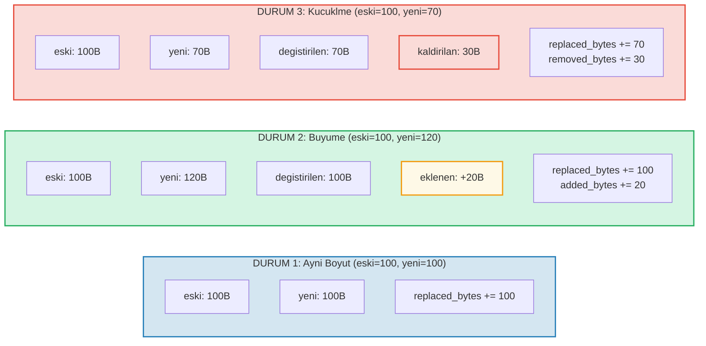

# Maliyet Takibi

## OperationCost Yapisi

GroveDB'deki her islem, hesaplama kaynaklariyla olculen maliyetleri biriktirir:

```rust
// costs/src/lib.rs
pub struct OperationCost {
    pub seek_count: u32,              // Depolama arama sayisi
    pub storage_cost: StorageCost,    // Eklenen/degistirilen/kaldirilan baytlar
    pub storage_loaded_bytes: u64,    // Diskten okunan baytlar
    pub hash_node_calls: u32,         // Blake3 hash islem sayisi
    pub sinsemilla_hash_calls: u32,   // Sinsemilla hash islem sayisi (EC islemleri)
}
```

> **Sinsemilla hash cagirilari**, CommitmentTree capalari icin eliptik egri hash islemlerini izler. Bunlar Blake3 dugum hash'lerinden onemli olcude daha pahalidir.

Depolama maliyetleri daha ayrintili olarak ayrilir:

```rust
// costs/src/storage_cost/mod.rs
pub struct StorageCost {
    pub added_bytes: u32,                   // Yazilan yeni veri
    pub replaced_bytes: u32,                // Uzerine yazilan mevcut veri
    pub removed_bytes: StorageRemovedBytes, // Serbest birakilan veri
}
```

## CostContext Deseni

Tum islemler sonuclarini bir `CostContext` icine sarilmis olarak dondurur:

```rust
pub struct CostContext<T> {
    pub value: T,               // Islem sonucu
    pub cost: OperationCost,    // Tuketilen kaynaklar
}

pub type CostResult<T, E> = CostContext<Result<T, E>>;
```

Bu, bir **monadik** maliyet takip deseni olusturur -- maliyetler islem zincirleri boyunca otomatik olarak akar:

```rust
// Bir sonucu ac, maliyetini bir biriktirirciye ekle
let result = expensive_operation().unwrap_add_cost(&mut total_cost);

// Islemleri zincirle, maliyetleri biriktirir
let final_result = op1()
    .flat_map(|x| op2(x))      // op1 + op2 maliyetleri
    .flat_map(|y| op3(y));      // + op3 maliyetleri
```

## cost_return_on_error! Makrosu

GroveDB kodundaki en yaygin desen, erken donus sirasinda maliyetleri koruyan `?` gibi davranan `cost_return_on_error!` makrosudur:

```rust
macro_rules! cost_return_on_error {
    ( &mut $cost:ident, $($body:tt)+ ) => {
        {
            let result_with_cost = { $($body)+ };
            let result = result_with_cost.unwrap_add_cost(&mut $cost);
            match result {
                Ok(x) => x,
                Err(e) => return Err(e).wrap_with_cost($cost),
            }
        }
    };
}
```

Pratikte:

```rust
fn insert_element(&self, path: &[&[u8]], key: &[u8], element: Element) -> CostResult<(), Error> {
    let mut cost = OperationCost::default();

    // Her makro cagrisi islemin maliyetini `cost`'a ekler
    // ve Ok degerini dondurur (veya Err'de biriktirilmis maliyetle erken doner)
    let merk = cost_return_on_error!(&mut cost, self.open_merk(path));
    cost_return_on_error!(&mut cost, merk.insert(key, element));
    cost_return_on_error!(&mut cost, self.propagate_changes(path));

    Ok(()).wrap_with_cost(cost)
    // `cost` simdi her uc islemin maliyetlerinin toplamini icerir
}
```

## Depolama Maliyet Dokuumu

Bir deger guncellendiginde, maliyet yeni degerin daha buyuk, daha kucuk veya ayni boyutta olmasina baglidir:



## Hash Islem Maliyetleri

Hash maliyetleri "hash dugum cagirilari" -- Blake3 blok sikistirma sayisi -- olarak olculur:

| Islem | Girdi Boyutu | Hash Cagirilari |
|-------|-------------|-----------------|
| `value_hash(kucuk)` | < 64 bayt | 1 |
| `value_hash(orta)` | 64-127 bayt | 2 |
| `kv_hash` | anahtar + value_hash | degisir |
| `node_hash` | 96 bayt (3 x 32) | 2 (her zaman) |
| `combine_hash` | 64 bayt (2 x 32) | 1 (her zaman) |
| `node_hash_with_count` | 104 bayt (3 x 32 + 8) | 2 (her zaman) |
| Sinsemilla (CommitmentTree) | Pallas egrisi EC islemi | `sinsemilla_hash_calls` ile ayrica izlenir |

Blake3 icin genel formul:

```text
hash_cagirilari = 1 + (girdi_bayt - 1) / 64
```

## En Kotu Durum ve Ortalama Durum Tahmini

GroveDB, islem maliyetlerini yurutmeden once **tahmin etme** fonksiyonlari saglar. Bu, blok zinciri ucret hesaplamasi icin kritiktir -- odemek icin taahhut etmeden once maliyeti bilmeniz gerekir.

```rust
// Bir dugum okumak icin en kotu durum maliyeti
pub fn add_worst_case_get_merk_node(
    cost: &mut OperationCost,
    not_prefixed_key_len: u32,
    max_element_size: u32,
    node_type: NodeType,
) {
    cost.seek_count += 1;  // Bir disk arama
    cost.storage_loaded_bytes +=
        TreeNode::worst_case_encoded_tree_size(
            not_prefixed_key_len, max_element_size, node_type
        ) as u64;
}

// En kotu durum yayilim maliyeti
pub fn add_worst_case_merk_propagate(
    cost: &mut OperationCost,
    input: &WorstCaseLayerInformation,
) {
    let levels = match input {
        MaxElementsNumber(n) => ((*n + 1) as f32).log2().ceil() as u32,
        NumberOfLevels(n) => *n,
    };
    let mut nodes_updated = levels;

    // AVL rotasyonlari ek dugumler guncelleyebilir
    if levels > 2 {
        nodes_updated += 2;  // Rotasyonlar icin en fazla 2 ek dugum
    }

    cost.storage_cost.replaced_bytes += nodes_updated * MERK_BIGGEST_VALUE_SIZE;
    cost.storage_loaded_bytes +=
        nodes_updated as u64 * (MERK_BIGGEST_VALUE_SIZE + MERK_BIGGEST_KEY_SIZE) as u64;
    cost.seek_count += nodes_updated;
    cost.hash_node_calls += nodes_updated * 2;
}
```

Kullanilan sabitler:

```rust
pub const MERK_BIGGEST_VALUE_SIZE: u32 = u16::MAX as u32;  // 65535
pub const MERK_BIGGEST_KEY_SIZE: u32 = 256;
```

---
