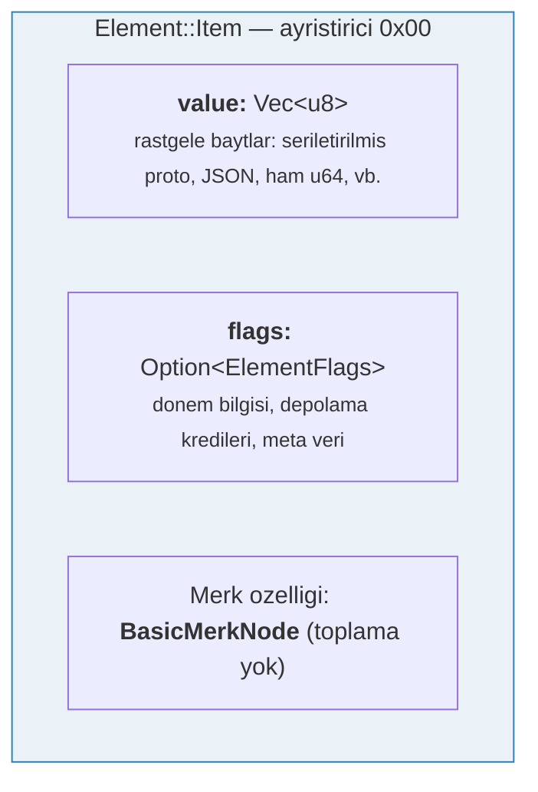
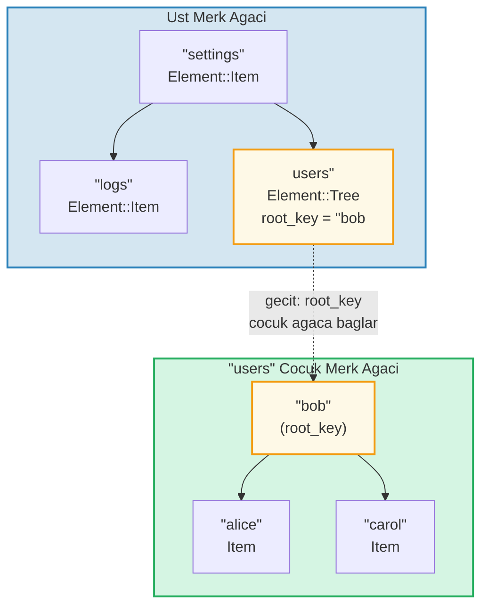
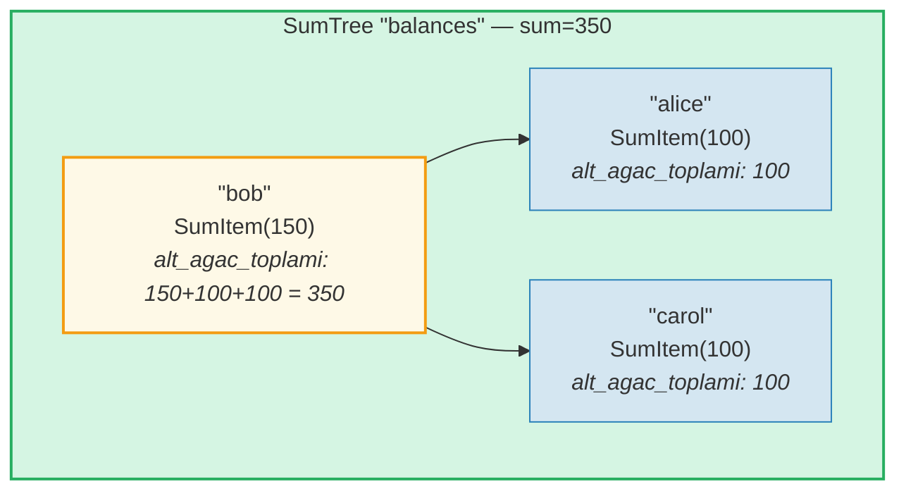
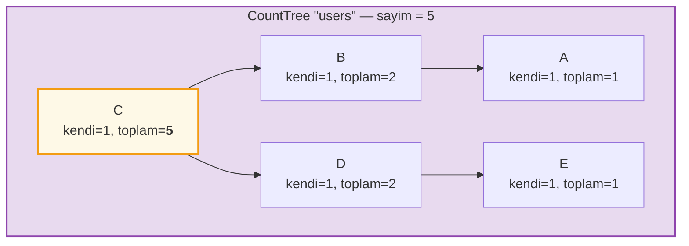
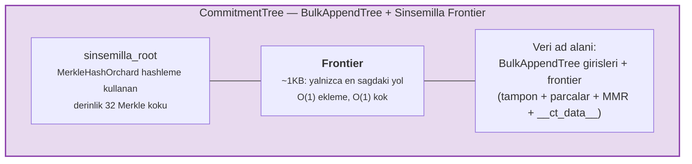

# Element Sistemi

Merk ham anahtar-deger ciftleriyle ilgilenirken, GroveDB daha ust bir seviyede **Elementler** kullanarak calisir -- anlamsal anlam tasiyan tipli degerler. GroveDB'de depolanan her deger bir Element'tir.

## Element Enum'u

```rust
// grovedb-element/src/element/mod.rs
pub enum Element {
    Item(Vec<u8>, Option<ElementFlags>),                                    // [0]
    Reference(ReferencePathType, MaxReferenceHop, Option<ElementFlags>),    // [1]
    Tree(Option<Vec<u8>>, Option<ElementFlags>),                           // [2]
    SumItem(SumValue, Option<ElementFlags>),                               // [3]
    SumTree(Option<Vec<u8>>, SumValue, Option<ElementFlags>),              // [4]
    BigSumTree(Option<Vec<u8>>, BigSumValue, Option<ElementFlags>),        // [5]
    CountTree(Option<Vec<u8>>, CountValue, Option<ElementFlags>),          // [6]
    CountSumTree(Option<Vec<u8>>, CountValue, SumValue, Option<ElementFlags>), // [7]
    ProvableCountTree(Option<Vec<u8>>, CountValue, Option<ElementFlags>),  // [8]
    ItemWithSumItem(Vec<u8>, SumValue, Option<ElementFlags>),              // [9]
    ProvableCountSumTree(Option<Vec<u8>>, CountValue, SumValue,
                         Option<ElementFlags>),                            // [10]
    CommitmentTree(u64, u8, Option<ElementFlags>),                         // [11]
    MmrTree(u64, Option<ElementFlags>),                                    // [12]
    BulkAppendTree(u64, u8, Option<ElementFlags>),                         // [13]
    DenseAppendOnlyFixedSizeTree(u16, u8, Option<ElementFlags>),           // [14]
}
```

Kose parantez icindeki ayristirici numaralar (discriminant) serializasyon sirasinda kullanilir.

Kod boyunca kullanilan tip takilari:

```rust
pub type ElementFlags = Vec<u8>;        // Element basina rastgele meta veri
pub type MaxReferenceHop = Option<u8>;  // Referanslar icin istege bagli siçrama siniri
pub type SumValue = i64;                // 64 bit isaretli toplam
pub type BigSumValue = i128;            // 128 bit isaretli toplam
pub type CountValue = u64;              // 64 bit isaretsiz sayim
```

## Item -- Temel Anahtar-Deger Depolama

En basit element. Rastgele baytlari depolar:

```rust
Element::Item(value: Vec<u8>, flags: Option<ElementFlags>)
```



Kurucular:

```rust
Element::new_item(b"hello world".to_vec())
Element::new_item_with_flags(b"data".to_vec(), Some(vec![0x01, 0x02]))
```

Item'lar toplam (sum) toplamaya katilir: bir SumTree icinde, Item varsayilan olarak 0 toplam katki saglar. SumItem ise acik degerini katki saglar.

## Tree -- Alt Agaclar icin Kapsayicilar

Bir Tree elementi, baska bir Merk agacina acilan bir **gecittir (portal)**. Cocuk agacin kok anahtarini (root key) depolar (varsa):

```rust
Element::Tree(root_key: Option<Vec<u8>>, flags: Option<ElementFlags>)
```



> Ust Merk'teki Tree elementi, cocuk Merk agacinin `root_key`'ini depolar. Bu bir **gecit** olusturur -- bir Merk agacindan digerine bir baglanti.

Agac bos oldugunda `root_key`, `None`'dir. `Element::empty_tree()` kurucusu `Element::Tree(None, None)` olusturur.

## SumItem / SumTree -- Toplam Toplamalar

Bir **SumTree**, tum dogrudan cocuklarinin toplam katkilarini otomatik olarak korur:

```rust
Element::SumTree(root_key: Option<Vec<u8>>, sum: SumValue, flags: Option<ElementFlags>)
Element::SumItem(value: SumValue, flags: Option<ElementFlags>)
```



> **Toplama formulu:** `dugum_toplami = kendi_degeri + sol_cocuk_toplami + sag_cocuk_toplami`
> Bob: 150 + 100 (alice) + 100 (carol) = **350**. Kok toplami (350), ust agacin SumTree elementinde depolanir.

Toplam, `TreeFeatureType::SummedMerkNode(i64)` ozellik tipi araciligiyla Merk katmaninda korunur. Agac yayilimi (propagation) sirasinda, her dugumun toplam verisi yeniden hesaplanir:

```text
toplam = kendi_toplami + sol_cocuk_toplami + sag_cocuk_toplami
```

## CountTree, CountSumTree, BigSumTree

Ek toplama agac tipleri:

| Element Tipi | Merk Ozellik Tipi | Toplamalar |
|---|---|---|
| `CountTree` | `CountedMerkNode(u64)` | Element sayisi |
| `CountSumTree` | `CountedSummedMerkNode(u64, i64)` | Hem sayim hem toplam |
| `BigSumTree` | `BigSummedMerkNode(i128)` | Buyuk degerler icin 128 bit toplam |
| `ProvableCountTree` | `ProvableCountedMerkNode(u64)` | Hash'e dahil edilmis sayim |
| `ProvableCountSumTree` | `ProvableCountedSummedMerkNode(u64, i64)` | Hash'te sayim + toplam |

**ProvableCountTree** ozeldir: sayimi `node_hash` hesaplamasina dahil edilir (`node_hash_with_count` araciligiyla), boylece bir ispat herhangi bir deger ifsa etmeden sayimi dogrulayabilir.

## Element Serializasyonu

Elementler buyuk endian bayt siralamasiyla **bincode** kullanilarak serializasyon edilir:

```rust
pub fn serialize(&self, grove_version: &GroveVersion) -> Result<Vec<u8>, ElementError> {
    let config = config::standard().with_big_endian().with_no_limit();
    bincode::encode_to_vec(self, config)
}
```

Ilk bayt **ayristirici (discriminant)** olup O(1) tip algilamasina olanak tanir:

```rust
pub fn from_serialized_value(value: &[u8]) -> Option<ElementType> {
    match value.first()? {
        0 => Some(ElementType::Item),
        1 => Some(ElementType::Reference),
        2 => Some(ElementType::Tree),
        3 => Some(ElementType::SumItem),
        // ... vb.
    }
}
```

## TreeFeatureType ve Toplam Veri Akisi

`TreeFeatureType` enum'u GroveDB Elementleri ile Merk dugumleri arasindaki boslugu kopruler:

```rust
pub enum TreeFeatureType {
    BasicMerkNode,                              // Toplama yok
    SummedMerkNode(i64),                       // Toplam toplama
    BigSummedMerkNode(i128),                   // Buyuk toplam
    CountedMerkNode(u64),                      // Sayim
    CountedSummedMerkNode(u64, i64),           // Sayim + toplam
    ProvableCountedMerkNode(u64),              // Hash'te sayim
    ProvableCountedSummedMerkNode(u64, i64),   // Hash'te sayim + toplam
}
```

Toplam verisi agac boyunca **yukari dogru** akar:



> **Toplama tablosu:** Her dugumun toplami = kendi(1) + sol_toplam + sag_toplam
>
> | Dugum | kendi | sol_toplam | sag_toplam | toplam |
> |-------|-------|------------|------------|--------|
> | A | 1 | 0 | 0 | 1 |
> | B | 1 | 1 (A) | 0 | 2 |
> | E | 1 | 0 | 0 | 1 |
> | D | 1 | 0 | 1 (E) | 2 |
> | C | 1 | 2 (B) | 2 (D) | **5** (kok) |

Her dugumde depolanan sayim, kendisi de dahil olmak uzere o dugumde koklenmis alt agactaki toplam sayimi temsil eder. Kok dugumun sayimi tum agac icin toplamidir.

`AggregateData` enum'u bunu Link sistemi uzerinden tasir:

```rust
pub enum AggregateData {
    NoAggregateData,
    Sum(i64),
    BigSum(i128),
    Count(u64),
    CountAndSum(u64, i64),
    ProvableCount(u64),
    ProvableCountAndSum(u64, i64),
}
```

## CommitmentTree -- Sinsemilla Taahhut Agaci

Bir **CommitmentTree**, Zcash'in Orchard korunakli protokolunde kullanildigi gibi, not taahhut (note commitment) capa (anchor) takibi icin derinligi 32 olan bir Sinsemilla Merkle agaci saglar. O(1) ekleme ve kok hesaplamasi icin `incrementalmerkletree::Frontier<MerkleHashOrchard, 32>` sarar:

```rust
Element::CommitmentTree(
    total_count: u64,               // Eklenen taahhut sayisi
    chunk_power: u8,                // BulkAppendTree sikistirma boyutu (chunk_size = 2^chunk_power)
    flags: Option<ElementFlags>,
)                                   // ayristirici [11]
```

> **Not:** Sinsemilla sinir (frontier) kok hash'i Element'te DEPOLANMAZ.
> Veri deposunda (data storage) saklanir ve Merk cocuk hash mekanizmasi
> (`insert_subtree`'nin `subtree_root_hash` parametresi) araciligiyla akar. Sinirdaki
> herhangi bir degisiklik otomatik olarak GroveDB Merk hiyerarsisi boyunca yukari yayilir.



**Mimari:**
- *Frontier* (Merkle agacinin en sagdaki yolu, ~1KB sabit boyut) **veri ad alaninda**, `COMMITMENT_TREE_DATA_KEY` anahtariyla depolanir
- Gercek not verisi (`cmx || sifrelenmis_metin`) bir **BulkAppendTree** araciligiyla **veri ad alaninda** depolanir -- parca halinde sikistirilmis, konum bazinda erisilebilir
- Gecmis capalar Platform tarafindan ayri bir kanitlanabilir agacta izlenir
- Sinsemilla koku Element'te DEPOLANMAZ -- GroveDB hash hiyerarsisi uzerinden Merk cocuk hash olarak akar

**Islemler:**
- `commitment_tree_insert(path, key, cmx, ciphertext, tx)` -- `TransmittedNoteCiphertext<M>` kabul eden tipli ekleme; `(yeni_kok, konum)` dondurur
- `commitment_tree_anchor(path, key, tx)` -- Mevcut Orchard Anchor'u al
- `commitment_tree_get_value(path, key, position, tx)` -- Konuma gore deger al
- `commitment_tree_count(path, key, tx)` -- Toplam ogeler sayisini al

**MemoSize jenerik:** `CommitmentTree<S, M: MemoSize = DashMemo>`, sifrelenmis metin yuk boyutlarinin `M` icin beklenen boyutla eslesmesini dogrular. Dash icin (36 baytlik memo'lar): `epk_bytes (32) + enc_ciphertext (104) + out_ciphertext (80) = 216 bayt`.

**Maliyet takibi:** Sinsemilla hash islemleri `cost.sinsemilla_hash_calls` araciligiyla izlenir. Kok hesaplamasi her zaman 32 seviyeyi kat eder. Ommer birlesmeleri onceki konumun `trailing_ones()` degeri boyunca basamaklanir. BulkAppendTree islemleri Blake3 hash maliyetleri ekler.

## MmrTree -- Merkle Dag Silsilesi

Bir **MmrTree**, verileri Blake3 hashleme kullanan yalnizca ekleme yapilabilen (append-only) bir Merkle Dag Silsilesi'nde (MMR - Merkle Mountain Range) depolar. MMR dugumleri **veri** sutununda (Merk dugumleriyle ayni sutun ailesinde) depolanir, cocuk Merk alt agacinda degil. Ayrintili bilgi icin **[Bolum 13](#chapter-13-the-mmr-tree--append-only-authenticated-logs)**'e bakiniz.

```rust
Element::MmrTree(
    mmr_size: u64,                  // Dahili MMR boyutu (dugumler, yapraklar degil)
    flags: Option<ElementFlags>,
)                                   // ayristirici [12]
```

> **Not:** MMR kok hash'i Element'te DEPOLANMAZ. `insert_subtree`'nin `subtree_root_hash` parametresi araciligiyla Merk cocuk hash olarak akar.

**Islemler:** `mmr_tree_append`, `mmr_tree_root_hash`, `mmr_tree_get_value`, `mmr_tree_leaf_count`. **Ispatlar:** V1 ispatlar (bkz. bolum 9.6 ve 13.9).

## BulkAppendTree -- Iki Katmanli Yalnizca Ekleme Yapisi

Bir **BulkAppendTree**, yuksek verimli eklemeler ve kanitlanabilir aralik sorgulari icin yogun bir Merkle agaci tamponunu parca seviyeli bir MMR ile birlestirir. Merk olmayan bir agactir -- veriler **veri** ad alaninda yasir, cocuk Merk alt agacinda degil. Ayrintili bilgi icin **[Bolum 14](#chapter-14-the-bulkappendtree--high-throughput-append-only-storage)**'e bakiniz.

```rust
Element::BulkAppendTree(
    total_count: u64,               // Eklenen toplam deger sayisi
    chunk_power: u8,                // Yogun agac yuksekligi (tampon kapasitesi = 2^chunk_power - 1)
    flags: Option<ElementFlags>,
)                                   // ayristirici [13]
```

> **Not:** Durum koku (`blake3("bulk_state" || mmr_root || dense_tree_root)`) Element'te DEPOLANMAZ. `insert_subtree`'nin `subtree_root_hash` parametresi araciligiyla Merk cocuk hash olarak akar.

**Islemler:** `bulk_append`, `bulk_get_value`, `bulk_get_chunk`, `bulk_get_buffer`, `bulk_count`, `bulk_chunk_count`. **Ispatlar:** V1 aralik ispatlar (bkz. bolum 9.6 ve 14.10).

## DenseAppendOnlyFixedSizeTree -- Yogun Sabit Kapasiteli Depolama

Bir **DenseAppendOnlyFixedSizeTree**, her dugumun (dahili ve yaprak) bir veri degeri depoladigi, sabit yukseklik *h*'ye sahip tam bir ikili agactir. Pozisyonlar seviye siralamasiyla (BFS) doldurulur. Kok hash aninda yeniden hesaplanir -- hicbir ara hash kalici depolanmaz. Tam bilgi icin **[Bolum 16](#chapter-16-the-denseappendonlyfixedsizetree--dense-fixed-capacity-merkle-storage)**'ya bakiniz.

```rust
Element::DenseAppendOnlyFixedSizeTree(
    count: u16,                     // Depolanan deger sayisi (maksimum 65.535)
    height: u8,                     // Agac yuksekligi (1..=16, degistirilemez), kapasite = 2^h - 1
    flags: Option<ElementFlags>,
)                                   // ayristirici [14]
```

> **Not:** Kok hash Element'te DEPOLANMAZ -- aninda yeniden hesaplanir ve Merk cocuk hash olarak akar. `count` alani `u16`'dir (u64 degil), agaclari 65.535 pozisyonla sinirlar. Yukseklikler 1..=16 ile sinirlidir.

**Islemler:** `dense_tree_insert`, `dense_tree_get`, `dense_tree_root_hash`, `dense_tree_count`. **Ispatlar:** Yalnizca element duzeyinde (henuz alt sorgu ispatlari yok).

## Merk Olmayan Agaclar -- Ortak Desenler

CommitmentTree, MmrTree, BulkAppendTree ve DenseAppendOnlyFixedSizeTree, onlari Merk tabanli agac tiplerinden (Tree, SumTree, CountTree, vb.) ayiran ortak bir mimari deseni paylasir:

| Ozellik | Merk tabanli agaclar | Merk olmayan agaclar |
|---------|---------------------|----------------------|
| Cocuk Merk alt agaci | Evet (`root_key = Some(...)`) | Hayir (root_key alani yok) |
| Veri depolama | Merk anahtar-deger ciftleri | Veri sutunu blob'lari (Merk olmayan anahtarlar) |
| Kok hash baglama | `combine_hash(elem_hash, child_root_hash)` | `combine_hash(elem_hash, tip_ozel_kok)` |
| Tipe ozel kok | Merk AVL tarafindan korunur | Merk cocuk hash olarak akar (element baytlarinda DEGIL) |
| Ispat formati | V0 (katman katman Merk) | V1 (tipe ozel ispat) |
| TreeFeatureType | BasicMerkNode (toplama yok) | BasicMerkNode |

> **Depolama sutunu notu:** Dort Merk olmayan agac tipinin tumumu (MmrTree, CommitmentTree, BulkAppendTree, DenseAppendOnlyFixedSizeTree) verilerini Merk olmayan anahtarlar kullanarak **veri** sutununda depolar. CommitmentTree, Sinsemilla sinirini BulkAppendTree girleriyle birlikte ayni **veri** sutununda depolar (`b"__ct_data__"` anahtari).

Tipe ozel kok (sinsemilla koku, MMR koku, durum koku veya yogun agac kok hash'i), Element'te DEPOLANMAZ. Bunun yerine, `insert_subtree`'nin `subtree_root_hash` parametresi araciligiyla Merk **cocuk hash** olarak akar. Merk combined_value_hash, `combine_hash(value_hash(element_baytlari), tipe_ozel_kok)` olur. Tipe ozel kokteki herhangi bir degisiklik cocuk hash'i degistirir, bu da combined_value_hash'i degistirir ve kriptografik butunlugu koruyarak GroveDB hash hiyerarsisi boyunca yukari yayilir.

---
