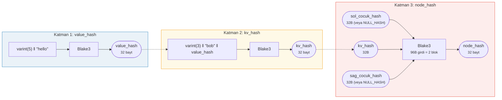
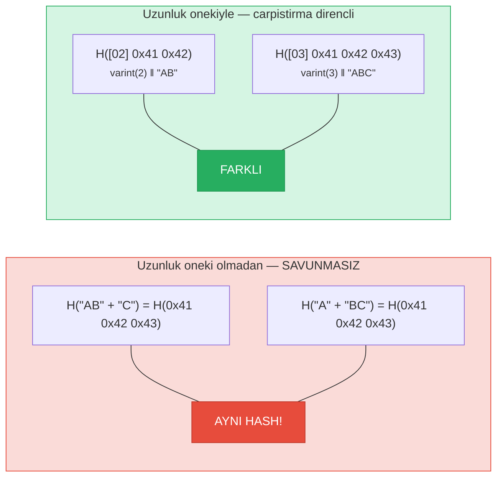
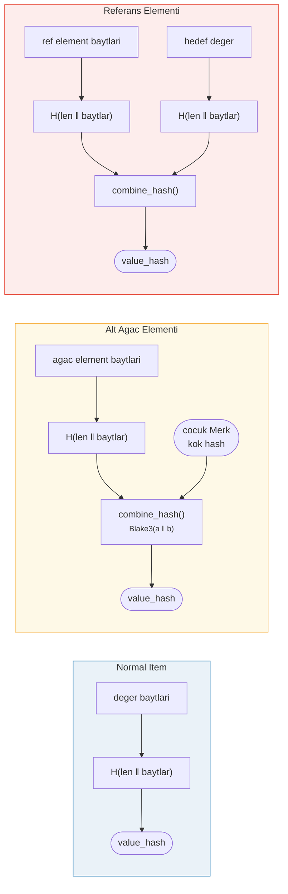

# Hashleme -- Kriptografik Butunluk

Bir Merk agacindaki her dugum, agacin tamamini dogrulayan tek bir 32 baytlik deger olan **kok hash** (root hash) uretmek icin hashlenir. Herhangi bir anahtar, deger veya yapisal iliskide yapilacak herhangi bir degisiklik farkli bir kok hash uretecektir.

## Uc Katmanli Hash Hiyerarsisi

Merk, icten disa dogru uc katmanli bir hashleme semasi kullanir:

Ornek: anahtar = `"bob"` (3 bayt), deger = `"hello"` (5 bayt):



> Agacin KOKU = kok dugumunun `node_hash`'i -- **her** anahtar, deger ve yapisal iliskiyi dogrular. Eksik cocuklar `NULL_HASH = [0x00; 32]` kullanir.

### Katman 1: value_hash

```rust
// merk/src/tree/hash.rs
pub fn value_hash(value: &[u8]) -> CostContext<CryptoHash> {
    let mut hasher = blake3::Hasher::new();
    let val_length = value.len().encode_var_vec();  // Varint kodlamasi
    hasher.update(val_length.as_slice());
    hasher.update(value);
    // ...
}
```

Degerin uzunlugu **varint kodlanarak** basa eklenir. Bu, carpistirma direnci (collision resistance) icin kritiktir -- bu olmadan `H("AB" || "C")`, `H("A" || "BC")`'ye esit olurdu.

### Katman 2: kv_hash

```rust
pub fn kv_hash(key: &[u8], value: &[u8]) -> CostContext<CryptoHash> {
    let mut hasher = blake3::Hasher::new();
    let key_length = key.len().encode_var_vec();
    hasher.update(key_length.as_slice());
    hasher.update(key);
    let vh = value_hash(value);
    hasher.update(vh.as_slice());  // Ic ice hash
    // ...
}
```

Bu, anahtari degere baglar. Ispat (proof) dogrulamasi icin, onceden hesaplanmis value_hash alan bir varyant da vardir:

```rust
pub fn kv_digest_to_kv_hash(key: &[u8], value_hash: &CryptoHash) -> CostContext<CryptoHash>
```

Bu, dogrulayicinin zaten value_hash'e sahip oldugu durumlarda kullanilir (ornegin, value_hash'in birlestirilmis bir hash oldugu alt agaclar icin).

### Katman 3: node_hash

```rust
pub fn node_hash(
    kv: &CryptoHash,
    left: &CryptoHash,
    right: &CryptoHash,
) -> CostContext<CryptoHash> {
    let mut hasher = blake3::Hasher::new();
    hasher.update(kv);       // 32 bayt
    hasher.update(left);     // 32 bayt
    hasher.update(right);    // 32 bayt — toplam 96 bayt
    // Her zaman tam olarak 2 hash islemi (96 bayt / 64 baytlik blok = 2)
}
```

Bir cocuk yoksa, hash'i **NULL_HASH**'tir -- 32 sifir bayt:

```rust
pub const NULL_HASH: CryptoHash = [0; HASH_LENGTH];  // [0u8; 32]
```

## Hash Fonksiyonu Olarak Blake3

GroveDB tum hashleme islemleri icin **Blake3** kullanir. Temel ozellikler:

- **256 bit cikti** (32 bayt)
- **Blok boyutu**: 64 bayt
- **Hiz**: Modern donaninda SHA-256'dan yaklasik 3 kat daha hizli
- **Akis (Streaming)**: Veriler kademeli olarak beslenebilir

Hash islemi maliyeti, kac tane 64 baytlik blogun islendogine gore hesaplanir:

```rust
let hashes = 1 + (hasher.count() - 1) / 64;  // Hash islem sayisi
```

## Carpistirma Direnci icin Uzunluk Oneki Kodlamasi

Her degisken uzunluktaki girdi, **varint kodlamasi** kullanilarak uzunluguyla oneklenir:



> **value_hash girdisi**: `[varint(value.len)] [deger baytlari]`
> **kv_hash girdisi**: `[varint(key.len)] [anahtar baytlari] [value_hash: 32 bayt]`

Uzunluk onekleri olmadan, bir saldirgan ayni ozete hashlenen farkli anahtar-deger ciftleri olusturabilirdi. Uzunluk oneki bunu kriptografik olarak olanaksiz kilar.

## Ozel Elementler icin Birlesik Hashleme

**Alt agaclar (subtree)** ve **referanslar** icin `value_hash` basitce `H(value)` degildir. Bunun yerine, elementi hedefine baglayan bir **birlesik hash** (combined hash) dir:



> **Alt agac:** Cocuk Merk'in kok hash'ini ebeveyne baglar. **Referans:** Hem referans yolunu HEM DE hedef degeri baglar. Birinin degismesi kok hash'i degistirir.

`combine_hash` fonksiyonu:

```rust
pub fn combine_hash(hash_one: &CryptoHash, hash_two: &CryptoHash) -> CostContext<CryptoHash> {
    let mut hasher = blake3::Hasher::new();
    hasher.update(hash_one);   // 32 bayt
    hasher.update(hash_two);   // 32 bayt — toplam 64 bayt, tam olarak 1 hash islemi
    // ...
}
```

GroveDB'nin tum hiyerarsiyi tek bir kok hash araciligiyla dogrulamasini saglayan budur -- bir alt agac elementi icin her ust agacin value_hash'i, cocuk agacin kok hash'ini icerir.

## ProvableCountTree icin Toplam Hashleme

`ProvableCountTree` dugumleri, dugum hash'ine toplam sayiyi (aggregate count) dahil eder:

```rust
pub fn node_hash_with_count(
    kv: &CryptoHash,
    left: &CryptoHash,
    right: &CryptoHash,
    count: u64,
) -> CostContext<CryptoHash> {
    let mut hasher = blake3::Hasher::new();
    hasher.update(kv);                        // 32 bayt
    hasher.update(left);                      // 32 bayt
    hasher.update(right);                     // 32 bayt
    hasher.update(&count.to_be_bytes());      // 8 bayt — toplam 104 bayt
    // Yine tam olarak 2 hash islemi (104 < 128 = 2 x 64)
}
```

Bu, bir sayim ispatinin gercek veriyi ifsa etmeyi gerektirmedigini saglar -- sayim kriptografik taahhude dahil edilmistir.

---
