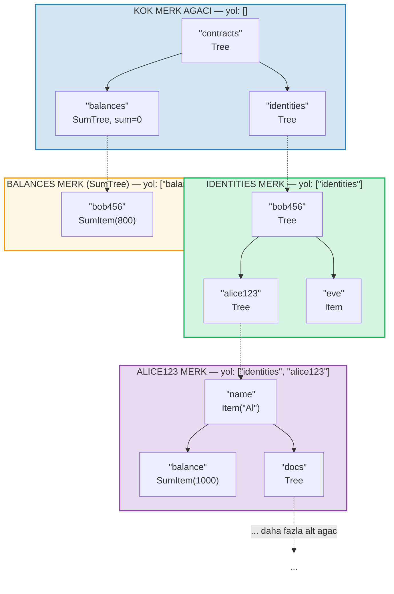
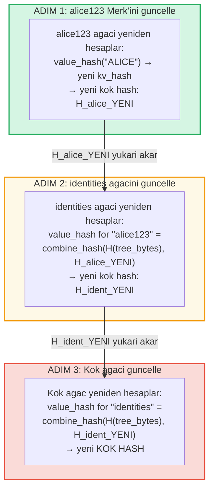
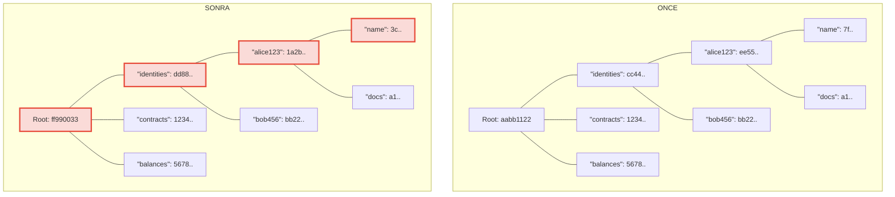
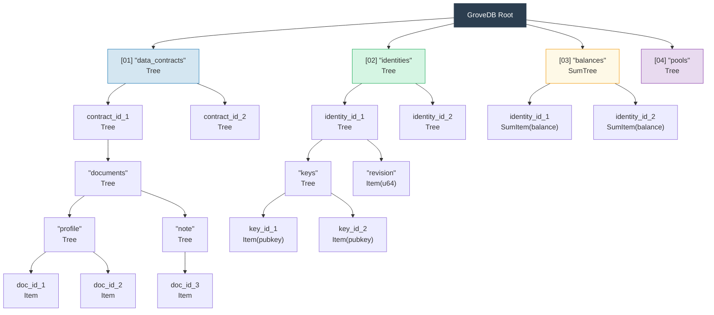

# Hiyerarsik Grove -- Agaclar Agaci

## Alt Agaclar Ust Agaclarin Icine Nasil Yerlestir

GroveDB'nin belirleyici ozelligi, bir Merk agacinin kendisi de Merk agaci olan elementler icerebilmesidir. Bu, bir **hiyerarsik ad alani** olusturur:



> Her renkli kutu ayri bir Merk agacidir. Kesikli oklar, Tree elementlerinden cocuk Merk agaclarina olan gecit baglantilarini temsil eder. Her Merk'in yolu etiketinde gosterilir.

## Yol Adresleme Sistemi

GroveDB'deki her element, bir **yol** (path) ile adreslenir -- kok agactan alt agaclar boyunca hedef anahtara ulasan bir bayt dizileri serisi:

```text
    Yol: ["identities", "alice123", "name"]

    Adim 1: Kok agacta "identities" ara → Tree elementi
    Adim 2: identities alt agacini ac, "alice123" ara → Tree elementi
    Adim 3: alice123 alt agacini ac, "name" ara → Item("Alice")
```

Yollar `Vec<Vec<u8>>` olarak veya bellek ayirmadan verimli manipulasyon icin `SubtreePath` tipi kullanilarak temsil edilir:

```rust
// Elemente giden yol (son segment haric tum segmentler)
let path: &[&[u8]] = &[b"identities", b"alice123"];
// Son alt agac icindeki anahtar
let key: &[u8] = b"name";
```

## Depolama Izolasyonu icin Blake3 Onek Uretimi

GroveDB'deki her alt agac, RocksDB icinde kendi **izole depolama ad alanini** alir. Ad alani, yolun Blake3 ile hashlenmesiyle belirlenir:

```rust
pub type SubtreePrefix = [u8; 32];

// Onek, yol segmentlerinin hashlenmesiyle hesaplanir
// storage/src/rocksdb_storage/storage.rs
```

Ornegin:

```text
    Yol: ["identities", "alice123"]
    Onek: Blake3(["identities", "alice123"]) = [0xab, 0x3f, ...]  (32 bayt)

    RocksDB'de bu alt agacin anahtarlari su sekilde depolanir:
    [onek: 32 bayt][orijinal_anahtar]

    Yani bu alt agactaki "name" su olur:
    [0xab, 0x3f, ...][0x6e, 0x61, 0x6d, 0x65]  ("name")
```

Bu, sunlari saglar:
- Alt agaclar arasinda anahtar carpismalari yok (32 bayt onek = 256 bit izolasyon)
- Verimli onek hesaplamasi (yol baytlari uzerinde tek Blake3 hash'i)
- Alt agac verileri onbellek verimliligi icin RocksDB'de bir arada bulunur

## Hiyerarsi Boyunca Kok Hash Yayilimi

Bir deger grove'un derinliklerinde degistiginde, degisiklik kok hash'i guncellemek icin **yukari dogru yayilmalidir**:

```text
    Degisiklik: identities/alice123/ icinde "name" degerini "ALICE" olarak guncelle

    Adim 1: alice123'un Merk agacinda degeri guncelle
            → alice123 agaci yeni kok hash alir: H_alice_yeni

    Adim 2: identities agacinda "alice123" elementini guncelle
            → identities agacinin "alice123" icin value_hash'i =
              combine_hash(H(tree_element_baytlari), H_alice_yeni)
            → identities agaci yeni kok hash alir: H_ident_yeni

    Adim 3: Kok agacta "identities" elementini guncelle
            → kok agacin "identities" icin value_hash'i =
              combine_hash(H(tree_element_baytlari), H_ident_yeni)
            → KOK HASH degisir
```



**Once ve Sonra** -- degisen dugumler kirmiziyla isaretli:



> Yalnizca degisen degerden koke giden yol uzerindeki dugumler yeniden hesaplanir. Kardes dugumler ve diger dallar degismeden kalir.

Yayilim, degistirilen alt agactan koke kadar yolu yuruyen ve her ust elementin hash'ini guncelleyen `propagate_changes_with_transaction` tarafindan uygulanir.

## Cok Katmanli Grove Yapi Ornegi

Dash Platform'un durumunu nasil yapilandirdigini gosteren eksiksiz bir ornek:



Her kutu, dogrulayicilarin (validator) uzerinde uzlastigi tek bir kok hash'e kadar dogrulanan ayri bir Merk agacidir.

---
