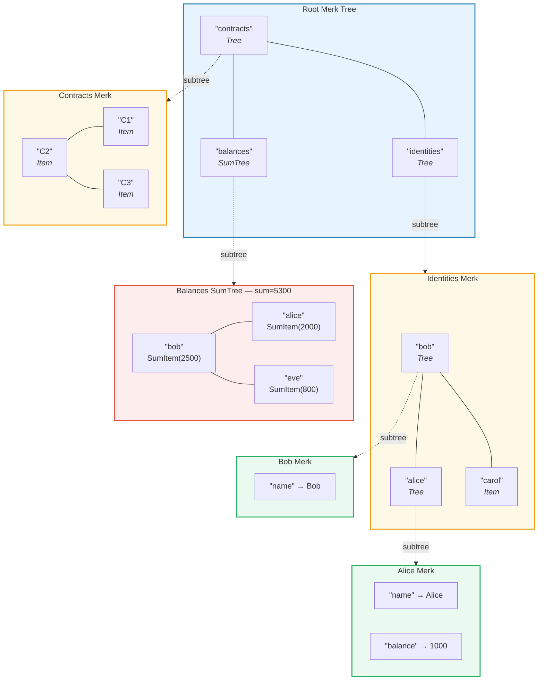
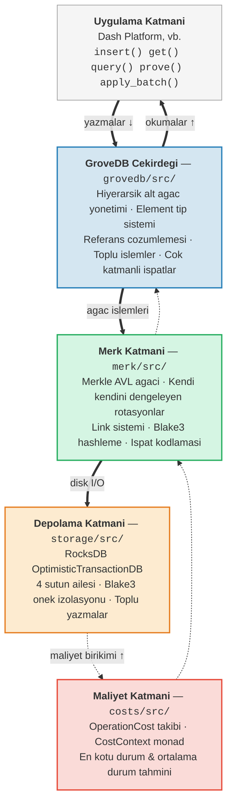

# Giris -- GroveDB Nedir?

## Temel Fikir

GroveDB bir **hiyerarsik kimlik dogrulanabilir veri yapisidir** -- ozunde Merkle AVL agaclari uzerine kurulmus bir *grove* (agaclar agaci). Veritabanindaki her dugum, kriptografik olarak kimlik dogrulanabilir bir agacin parcasidir ve her agac cocuk olarak baska agaclari icerebilir; boylece dogrulanabilir durumun (state) derin bir hiyerarsisi olusur.

> Her renkli kutu **ayri bir Merk agacidir**. Kesikli oklar alt agac (subtree) iliskisini gosterir -- ust agactaki bir Tree elementi, alt Merk'in kok anahtarini (root key) icerir.

Geleneksel bir veritabaninda, veriyi duz bir anahtar-deger deposunda saklayabilir ve kimlik dogrulama (authentication) icin ustune tek bir Merkle agaci koyabilirsiniz. GroveDB farkli bir yaklasim benimser: Merkle agaclarini Merkle agaclarinin icine yerlestirir. Bu size sunlari saglar:

1. **Verimli ikincil dizinler (secondary index)** -- sadece birincil anahtar degil, herhangi bir yol (path) uzerinden sorgulama
2. **Kompakt kriptografik ispatlar (proof)** -- herhangi bir verinin varligini (veya yoklugunu) kanitlama
3. **Toplam veri** -- agaclar cocuklarini otomatik olarak toplayabilir, sayabilir veya baska sekillerde birlestirebilir
4. **Atomik capraz agac islemleri** -- toplu islemler birden fazla alt agaci kapsayabilir

## GroveDB Neden Var?

GroveDB, her durum parcasinin asagidakileri karsilamasi gereken merkezi olmayan bir uygulama platformu olan **Dash Platform** icin tasarlandi:

- **Kimlik dogrulanabilir**: Herhangi bir dugum, herhangi bir durum parcasini hafif bir istemciye (light client) kanitlayabilir
- **Belirleyici (Deterministic)**: Her dugum tam olarak ayni durum kokunu (state root) hesaplar
- **Verimli**: Islemler blok suresi kisitlamalari icinde tamamlanmalidir
- **Sorgulanabilir**: Uygulamalar sadece anahtar aramalari degil, zengin sorgulara ihtiyac duyar

Geleneksel yaklasimlar yetersiz kalir:

| Yaklasim | Sorun |
|----------|-------|
| Duz Merkle Agaci | Yalnizca anahtar aramalarini destekler, aralik sorgulari yok |
| Ethereum MPT | Pahali yeniden dengeleme, buyuk ispat boyutlari |
| Duz anahtar-deger + tek agac | Hiyerarsik sorgu yok, tek bir ispat her seyi kapsar |
| B-agaci | Dogal olarak Merkle yapida degil, karmasik kimlik dogrulama |

GroveDB, **AVL agaclarinin kanitlanmis denge garantilerini**, **hiyerarsik icleme** ve **zengin element tip sistemiyle** birlestirerek bunlari cozer.

## Mimari Genel Bakis

GroveDB, her biri acik bir sorumluluga sahip farkli katmanlar halinde organize edilmistir:

Veri, yazmalar sirasinda bu katmanlar boyunca **asagi** akar ve okumalar sirasinda **yukari** akar. Her islem, yigin boyunca ilerledikce maliyetleri biriktirir ve kesin kaynak muhasebesi yapilmasini saglar.

---
