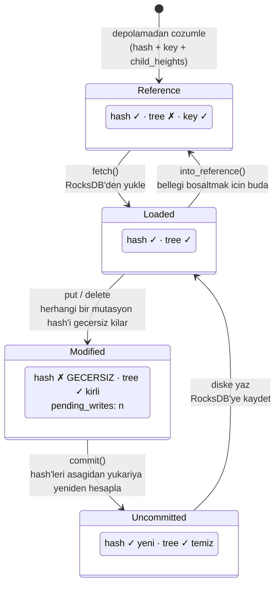
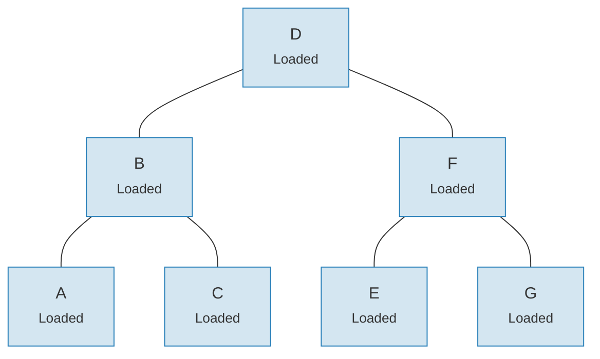
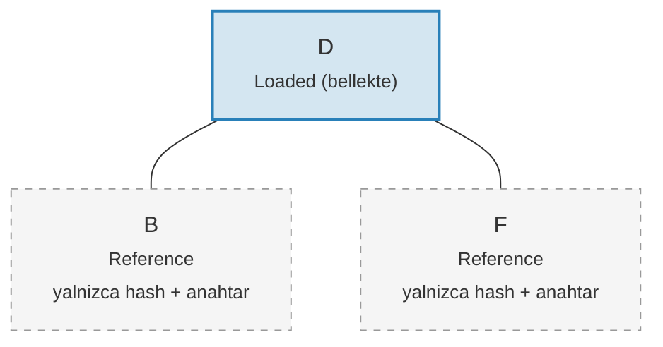

# Link Sistemi -- Tembel Yukleme Mimarisi

Buyuk agaclarda tum bir Merk agacini bellek yuklemeye calismak agirligi kaldirilamayacak kadar pahali olurdu. Link sistemi, cocuk baglantilarin dort olasi durumda temsil edilmesiyle bunu cozer; boylece **tembel yukleme (lazy loading)** saglanir -- cocuklar yalnizca gercekten ihtiyac duyuldugunda depolamadan getirilir.

## Dort Link Durumu

```rust
// merk/src/tree/link.rs
pub enum Link {
    Reference {                    // Budanmis: yalnizca meta veri, bellekte agac yok
        hash: CryptoHash,
        child_heights: (u8, u8),
        key: Vec<u8>,
        aggregate_data: AggregateData,
    },
    Modified {                     // Yakin zamanda degistirilmis, hash henuz hesaplanmadi
        pending_writes: usize,
        child_heights: (u8, u8),
        tree: TreeNode,
    },
    Uncommitted {                  // Hashlenmis ama henuz depoya yazilmamis
        hash: CryptoHash,
        child_heights: (u8, u8),
        tree: TreeNode,
        aggregate_data: AggregateData,
    },
    Loaded {                       // Depolamadan tamamen yuklenmis
        hash: CryptoHash,
        child_heights: (u8, u8),
        tree: TreeNode,
        aggregate_data: AggregateData,
    },
}
```

## Durum Gecis Diyagrami



## Her Durum Ne Depolar

| Durum | Hash? | Bellekte Agac? | Amac |
|-------|-------|----------------|------|
| **Reference** | Evet | Hayir | Kompakt disk uzerindeki temsil. Yalnizca anahtar, hash, cocuk yukseklikleri ve toplam veriyi depolar. |
| **Modified** | Hayir | Evet | Herhangi bir mutasyondan sonra. Toplu optimizasyonu icin `pending_writes` sayisini izler. |
| **Uncommitted** | Evet | Evet | Hash hesaplamasindan sonra ama depolama yazisindan once. Commit sirasindaki ara durum. |
| **Loaded** | Evet | Evet | Tamamen somutlastirilmis. Okumalar veya daha fazla degisiklik icin hazir. |

`Modified` icindeki `pending_writes` alani dikkate degerdir:

```rust
// Su sekilde hesaplanir: 1 + sol_bekleyen_yazmalar + sag_bekleyen_yazmalar
pending_writes: 1 + tree.child_pending_writes(true)
                  + tree.child_pending_writes(false),
```

Bu sayac, commit asamasinin optimum performans icin yazmalari nasil siralayacagina karar vermesine yardimci olur.

## Getirme Geri Cagrisi Deseni

Link sistemi, cocuk dugumlerin nasil yuklendigini soyutlamak icin bir **Fetch trait**'i kullanir:

```rust
pub trait Fetch {
    fn fetch(
        &self,
        link: &Link,
        value_defined_cost_fn: Option<&impl Fn(&[u8], &GroveVersion) -> Option<ValueDefinedCostType>>,
        grove_version: &GroveVersion,
    ) -> CostResult<TreeNode, Error>;
}
```

Farkli fetch uygulamalari farkli amaclara hizmet eder:

- **StorageFetch**: RocksDB'den yukler (normal yol)
- **PanicSource**: Getirmenin asla olmamasi gereken testlerde kullanilir
- **MockSource**: Kontrol edilen test verilerini dondurur

Bu desen, agac islemlerinin **depolamadan bagimsiz** olmasini saglar -- ayni dengeleme ve mutasyon mantigi, verinin nereden geldiginden bagimsiz olarak calisir.

## Walker Deseni

`Walker`, bir `TreeNode`'u bir `Fetch` kaynagiyla sararak otomatik tembel yukleme ile guvenli agac gezintisi saglar (`merk/src/tree/walk/mod.rs`):

```rust
pub struct Walker<S: Fetch + Sized + Clone> {
    tree: Owner<TreeNode>,
    source: S,
}
```

Walker uc temel islem saglar:

**walk()** -- Bir cocugu ayir, donustur ve yeniden bagla:

```rust
pub fn walk<F, T>(self, left: bool, f: F, ...) -> CostResult<Self, Error>
where
    F: FnOnce(Option<Self>) -> CostResult<Option<T>, Error>,
    T: Into<TreeNode>,
```

**detach()** -- Bir cocugu kaldir, gerekirse depolamadan yukle:

```rust
pub fn detach(self, left: bool, ...) -> CostResult<(Self, Option<Self>), Error>
```

Cocuk bir `Link::Reference` (budanmis) ise, detach onu yuklemek icin once `fetch()` cagrisini yapar. Cocuk zaten bellekteyse (`Modified`, `Uncommitted`, `Loaded`), sadece sahipligi (ownership) alir.

**attach()** -- Bir cocugu ebeveyne bagla:

```rust
pub fn attach(self, left: bool, maybe_child: Option<Self>) -> Self
```

Baglama her zaman bir `Link::Modified` olusturur cunku ebeveyn-cocuk iliskisi degismistir.

## Budama ile Bellek Verimliligi

Degisiklikleri commit ettikten sonra, agac yuklenmis alt agaclari tekrar `Link::Reference`'a **budayarak** bellegi serbest birakabilir; bu sirada ispat (proof) uretimi icin gereken hash'i korur:

**Budamadan once** -- 7 dugumun tamami bellekte:



**Budamadan sonra** -- yalnizca kok bellekte, cocuklar `Link::Reference` (sadece hash + anahtar):



> **Link::Loaded** `hash + child_heights + tree (TreeNode)` tutar. **Link::Reference** yalnizca `hash + child_heights + key` tutar -- TreeNode bellekten serbest birakilir.

Donusum basittir:

```rust
pub fn into_reference(self) -> Link {
    Link::Reference {
        hash: self.hash(),
        child_heights: self.child_heights(),
        key: self.key().to_vec(),
        aggregate_data: self.aggregate_data(),
    }
}
```

Bu, buyuk agaclarda bellek kullanimini sinirli tutmak icin kritiktir -- yalnizca aktif olarak erilen dugumlerin bellekte olmasi gerekir.

---
