# Merk Agaci -- Bir Merkle AVL Agaci

Merk agaci, GroveDB'nin temel yapi tasidir. Grove'daki her alt agac bir Merk agacidir -- kendi kendini dengeleyen bir ikili arama agaci (binary search tree) olup, her dugum kriptografik olarak hashlenmisstir; boylece agacin tum icerigini dogrulayan tek bir kok hash'i (root hash) uretilir.

## Merk Dugumu Nedir?

Verinin yalnizca yapraklarda yasadigi bircok Merkle agaci uygulamasinin aksine, bir Merk agacinda **her dugum bir anahtar-deger cifti depolar**. Bu, "bos" ic dugumlerin olmadigini gosterir -- agac hem bir arama yapisi hem de ayni anda bir veri deposudur.

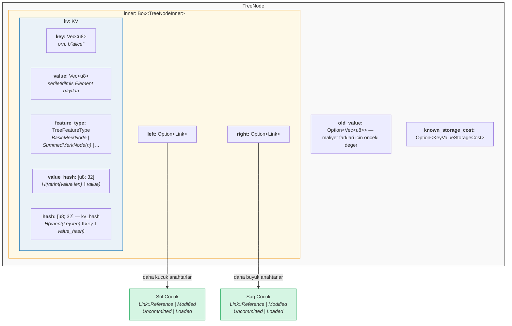

Kodda (`merk/src/tree/mod.rs`):

```rust
pub struct TreeNode {
    pub(crate) inner: Box<TreeNodeInner>,
    pub(crate) old_value: Option<Vec<u8>>,        // Maliyet takibi icin onceki deger
    pub(crate) known_storage_cost: Option<KeyValueStorageCost>,
}

pub struct TreeNodeInner {
    pub(crate) left: Option<Link>,    // Sol cocuk (daha kucuk anahtarlar)
    pub(crate) right: Option<Link>,   // Sag cocuk (daha buyuk anahtarlar)
    pub(crate) kv: KV,               // Anahtar-deger yuklemesi
}
```

`Box<TreeNodeInner>`, dugumu heap'te tutar; bu gereklidir cunku cocuk baglantilari ozyinelemeli olarak tam `TreeNode` orneklerini icerebilir.

## KV Yapisi

`KV` yapisi hem ham veriyi hem de kriptografik ozetlerini (digest) tutar (`merk/src/tree/kv.rs`):

```rust
pub struct KV {
    pub(super) key: Vec<u8>,                        // Arama anahtari
    pub(super) value: Vec<u8>,                      // Depolanan deger
    pub(super) feature_type: TreeFeatureType,       // Toplama (aggregation) davranisi
    pub(crate) value_defined_cost: Option<ValueDefinedCostType>,
    pub(super) hash: CryptoHash,                    // kv_hash
    pub(super) value_hash: CryptoHash,              // H(value)
}
```

Iki onemli nokta:

1. **Anahtarlar, kodlanmis dugumun parcasi olarak diskte depolanmaz.** RocksDB anahtari olarak saklanirlar. Bir dugum depolamadan cozulendugunde (decode), anahtar disindan enjekte edilir. Bu, anahtar baytlarinin cogaltilmasini onler.

2. **Iki hash alani korunur.** `value_hash`, `H(value)` ve `hash` (kv_hash), `H(key, value_hash)` seklindedir. Her ikisini tutmak, ispat (proof) sisteminin ne kadar bilgi acigini secebilmesini saglar.

## Yari Dengeli Yapi -- AVL Nasil "Sallanir"

Bir Merk agaci bir **AVL agacidir** -- Adelson-Velsky ve Landis tarafindan icat edilen klasik kendi kendini dengeleyen ikili arama agaci. Temel degismez (invariant) sudur:

> Her dugum icin, sol ve sag alt agaclari arasindaki yukseklik farki en fazla 1'dir.

Bu, **denge faktoru** (balance factor) olarak ifade edilir:

```text
balance_factor = sag_yukseklik - sol_yukseklik
```

Gecerli degerler: **{-1, 0, 1}**

```rust
// merk/src/tree/mod.rs
pub const fn balance_factor(&self) -> i8 {
    let left_height = self.child_height(true) as i8;
    let right_height = self.child_height(false) as i8;
    right_height - left_height
}
```

Ancak ince bir nokta vardir: her bir dugum yalnizca bir seviye egilebilirken, bu egimler agac boyunca **birikebilir**. Bu yuzden buna "yari dengeli" diyoruz -- agac, tam bir ikili agac gibi mukemmel sekilde dengeli degildir.

10 dugumlu bir agac dusunun. Mukemmel dengeli bir agacin yuksekligi 4 olur (log2(10+1) tavan). Ancak bir AVL agacinin yuksekligi 5 olabilir:

**Mukemmel dengeli (yukseklik 4)** -- her seviye tamamen dolu:

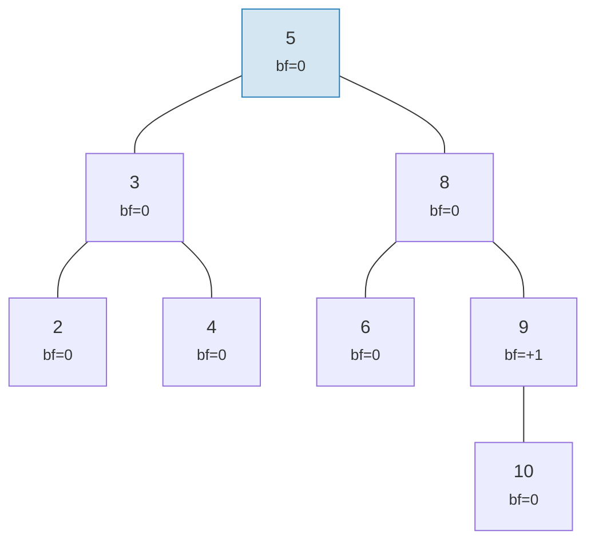

**AVL-gecerli "sallanma" (yukseklik 5)** -- her dugum en fazla 1 egilir, ama birikir:

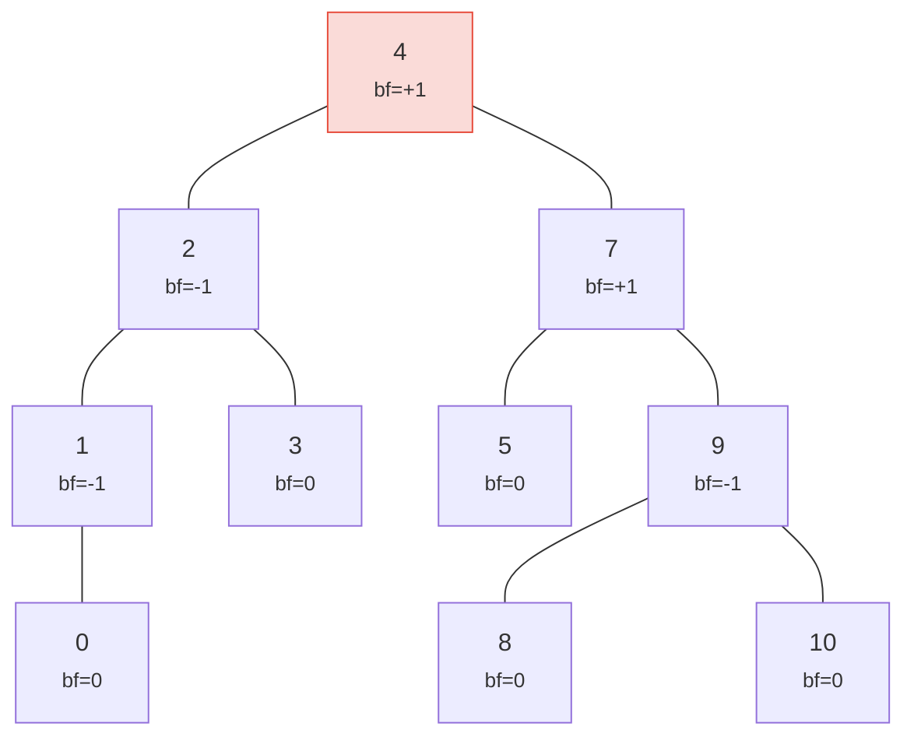

> Yukseklik 5'e karsi mukemmel 4 -- iste bu "sallanma". En kotu durum: h <= 1.44 x log2(n+2).

Her iki agac da gecerli AVL agaclaridir! Bir AVL agacinin en kotu durum yuksekligi:

```text
h <= 1.4404 x log2(n + 2) - 0.3277
```

Yani **n = 1.000.000** dugum icin:
- Mukemmel denge: yukseklik 20
- AVL en kotu durum: yukseklik yaklasik 29

Bu yaklasik %44'luk ek yuk, AVL'nin basit rotasyon kurallarinin bedelidir. Pratikte rastgele eklemeler, mukemmel dengeye cok daha yakin agaclar uretir.

Gecerli ve gecersiz agaclarin nasil gorundugunune bakalim:

**GECERLI** -- tum denge faktorleri {-1, 0, +1} icinde:

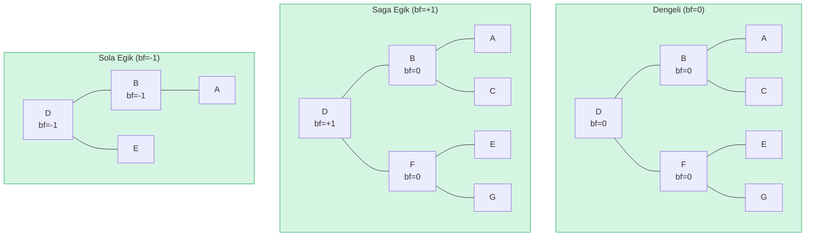

**GECERSIZ** -- denge faktoru = +2 (rotasyon gerekli!):

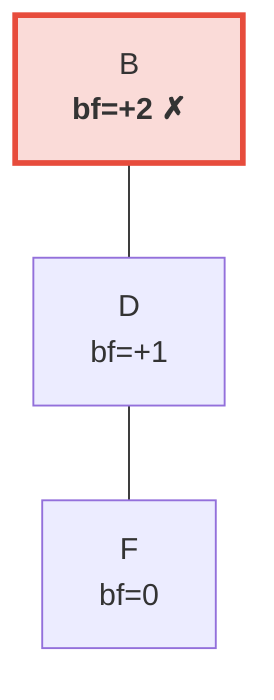

> Sag alt agac, sol alt agactan (ki bos) 2 seviye daha uzundur. Bu, AVL degismezini yeniden saglamak icin bir **sola rotasyon** tetikler.

## Rotasyonlar -- Dengenin Yeniden Saglanmasi

Bir ekleme veya silme, bir denge faktorunun +/-2'ye ulasmasi durumunda, agacin AVL degismezini yeniden saglamak icin **dondurulmesi** gerekir. Dort durum vardir ve bunlar iki temel isleme indirgenebilir.

### Tek Sola Rotasyon

Bir dugum **saga agir** (bf = +2) ve sag cocugu **saga agir veya dengeli** (bf >= 0) oldugunda kullanilir:

**Once** (bf=+2):

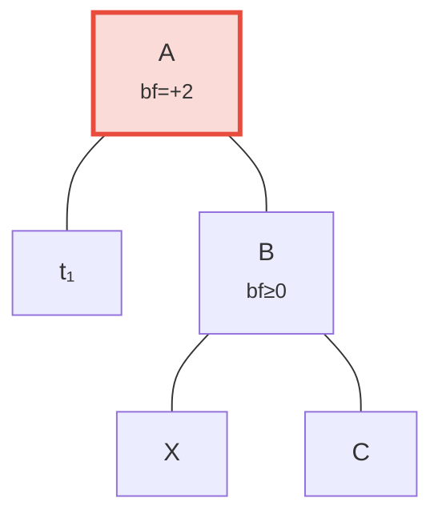

**Sonra** sola rotasyon -- B kok konumuna yukselir:

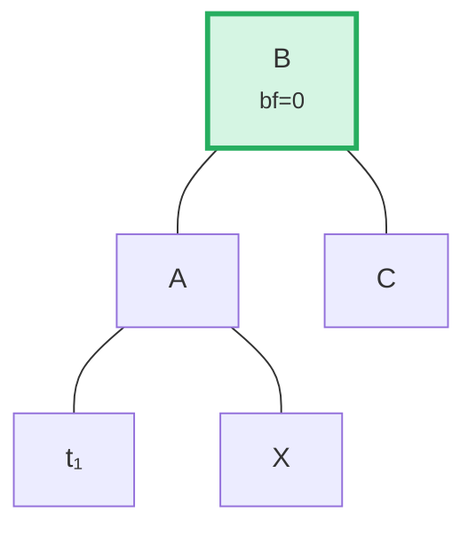

> **Adimlar:** (1) B'yi A'dan ayir. (2) X'i (B'nin sol cocugu) ayir. (3) X'i A'nin sag cocugu olarak bagla. (4) A'yi B'nin sol cocugu olarak bagla. B'nin kokunde bulunan alt agac artik dengelidir.

Kodda (`merk/src/tree/ops.rs`):

```rust
fn rotate<V>(self, left: bool, ...) -> CostResult<Self, Error> {
    // Agir taraftaki cocugu ayir
    let (tree, child) = self.detach_expect(left, ...);
    // Cocugun karsi tarafindan torunu ayir
    let (child, maybe_grandchild) = child.detach(!left, ...);

    // Torunu orijinal koke bagla
    tree.attach(left, maybe_grandchild)
        .maybe_balance(...)
        .flat_map_ok(|tree| {
            // Orijinal koku yukselttirilen dugumun cocugu olarak bagla
            child.attach(!left, Some(tree))
                .maybe_balance(...)
        })
}
```

`maybe_balance`'in ozyinelemeli olarak cagrildigina dikkat edin -- rotasyonun kendisi de duzeltme gerektiren yeni dengesizlikler olusturabilir.

### Cift Rotasyon (Sol-Sag)

Bir dugum **sola agir** (bf = -2) ancak sol cocugu **saga agir** (bf > 0) oldugunda kullanilir. Tek bir rotasyon bunu duzeltemez:

**Adim 0: Once** -- C sola agir (bf=-2) ama sol cocugu A saga egilir (bf=+1). Tek bir rotasyon bunu duzeltemez:

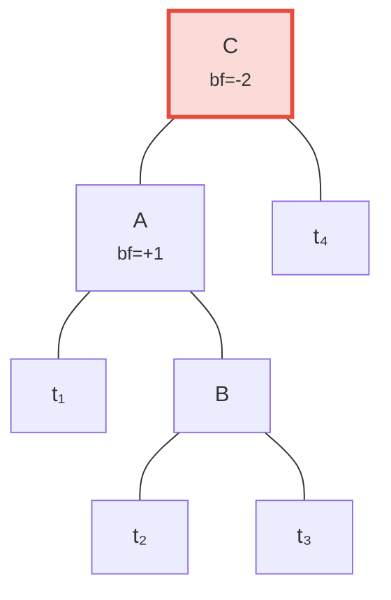

**Adim 1: Cocuk A'yi sola dondur** -- simdi hem C hem B sola egilir, tek bir rotasyonla duzeltilir:

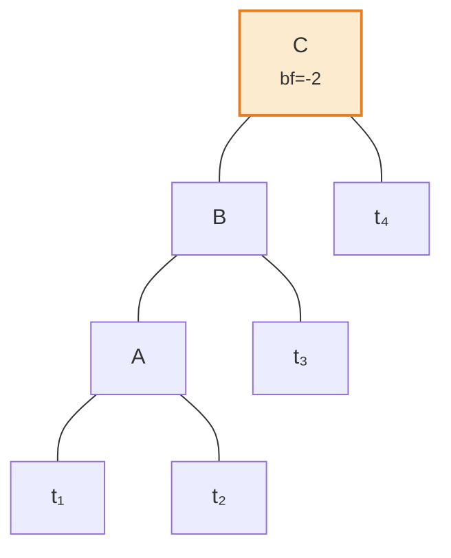

**Adim 2: Kok C'yi saga dondur** -- dengeli!

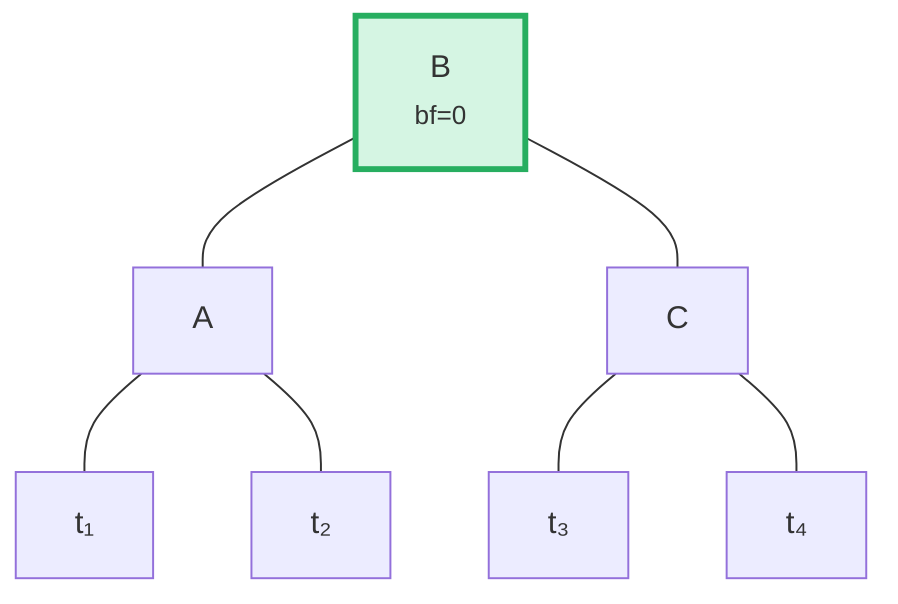

Algoritma, ebeveynin egim yonunu cocugun denge faktoruyle karsilastirarak bu durumu algilar:

```rust
fn maybe_balance<V>(self, ...) -> CostResult<Self, Error> {
    let balance_factor = self.balance_factor();
    if balance_factor.abs() <= 1 {
        return Ok(self);  // Zaten dengeli
    }

    let left = balance_factor < 0;  // Sola agir ise true

    // Cocuk ebeveynin ters yonune egiliyorsa cift rotasyon gerekir
    let tree = if left == (self.tree().link(left).unwrap().balance_factor() > 0) {
        // Ilk rotasyon: cocugu ters yonde dondur
        self.walk_expect(left, |child|
            child.rotate(!left, ...).map_ok(Some), ...
        )
    } else {
        self
    };

    // Ikinci (veya tek) rotasyon
    tree.rotate(left, ...)
}
```

## Toplu Islemler -- Olusturma ve Uygulama

Elemanlari tek tek eklemek yerine, Merk tek bir geciste birden fazla degisikligi uygulayan toplu islemleri (batch operations) destekler. Bu verimlilik icin kritiktir: M elemanli bir agac uzerinde N islemlik bir toplu islem **O((M + N) log(M + N))** zaman alir; sirali eklemelerin O(N log M) suresine karsi.

### MerkBatch Tipi

```rust
type MerkBatch<K> = [(K, Op)];

enum Op {
    Put(Vec<u8>, TreeFeatureType),  // Deger ve ozellik tipiyle ekle veya guncelle
    PutWithSpecializedCost(...),     // Onceden tanimlanmis maliyetle ekle
    PutCombinedReference(...),       // Birlesik hash ile referans ekle
    Replace(Vec<u8>, TreeFeatureType),
    Patch { .. },                    // Kismi deger guncelleme
    Delete,                          // Anahtari kaldir
    DeleteLayered,                   // Katmanli maliyetle kaldir
    DeleteMaybeSpecialized,          // Isteye bagli ozellestirilmis maliyetle kaldir
}
```

### Strateji 1: build() -- Sifirdan Olusturma

Agac bos oldugunda, `build()` siralanmis topluluktan **ortanca bolme (median-split)** algoritmasiyla dogrudan dengeli bir agac olusturur:

Girdi toplulugu (sirali): `[A, B, C, D, E, F, G]` -- ortayi (D) kok olarak sec, her yarim icin ozyinele:

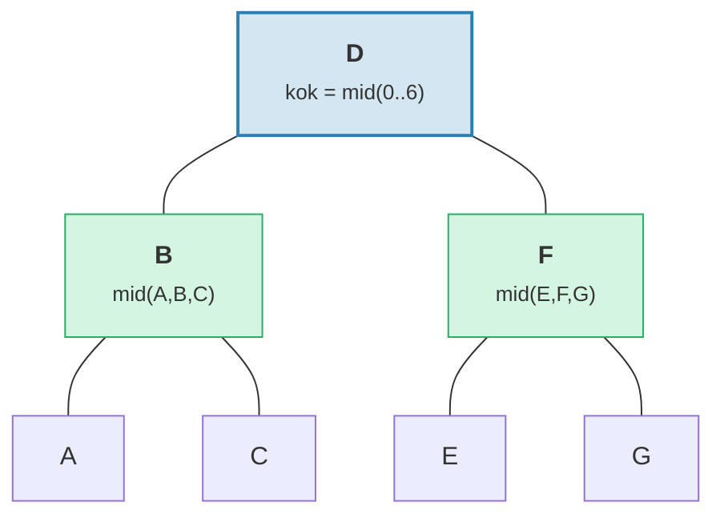

> Sonuc: yukseklik = 3 = log2(7) tavan olan mukemmel dengeli agac.

```rust
fn build(batch: &MerkBatch<K>, ...) -> CostResult<Option<TreeNode>, Error> {
    let mid_index = batch.len() / 2;
    let (mid_key, mid_op) = &batch[mid_index];

    // Orta elemandan kok dugum olustur
    let mid_tree = TreeNode::new(mid_key.clone(), value.clone(), None, feature_type)?;

    // Sol ve sag alt agaclari ozyinelemeli olustur
    let left = Self::build(&batch[..mid_index], ...);
    let right = Self::build(&batch[mid_index + 1..], ...);

    // Cocuklari bagla
    mid_tree.attach(true, left).attach(false, right)
}
```

Bu, yuksekligi log2(n) tavan olan -- mukemmel dengeli -- bir agac uretir.

### Strateji 2: apply_sorted() -- Mevcut Agaca Birlestirme

Agacta zaten veri varsa, `apply_sorted()` her toplu islemin ait oldugu yeri bulmak icin **ikili arama (binary search)** kullanir, sonra islemleri sol ve sag alt agaclara ozyinelemeli olarak uygular:

Mevcut agac ve `[(B, Put), (F, Delete)]` toplulugu:

Ikili arama: B < D (sola git), F > D (saga git).

**Once:**
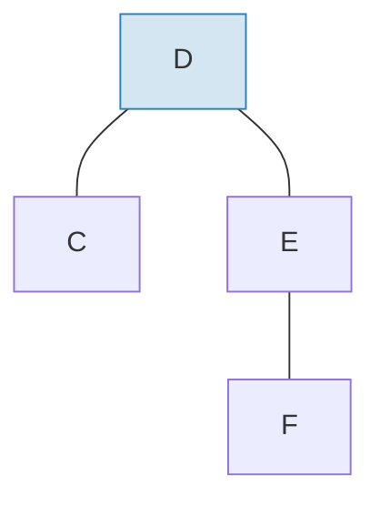

**Sonra** toplu islemi uygulayip yeniden dengeledikten sonra:
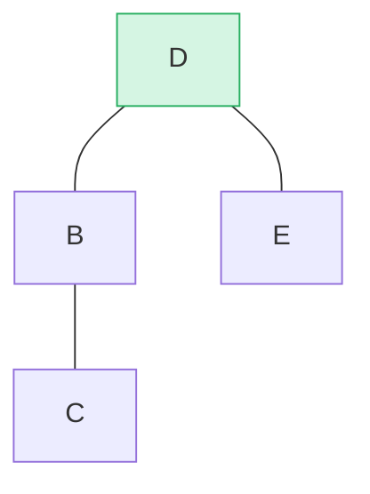

> B sol alt agac olarak eklendi, F sag alt agactan silindi. `maybe_balance()` bf(D) = 0 oldugunu dogruluyor.

```rust
fn apply_sorted(self, batch: &MerkBatch<K>, ...) -> CostResult<...> {
    let search = batch.binary_search_by(|(key, _)| key.cmp(self.tree().key()));

    match search {
        Ok(index) => {
            // Anahtar bu dugumle eslesir -- islemi dogrudan uygula
            // (Put degeri degistirir, Delete dugumu kaldirir)
        }
        Err(mid) => {
            // Anahtar bulunamadi -- mid bolme noktasidir
            // sol_topluluk[..mid] ve sag_topluluk[mid..] uzerinde ozyinele
        }
    }

    self.recurse(batch, mid, exclusive, ...)
}
```

`recurse` metodu toplulugu boler ve sola ve saga yurur:

```rust
fn recurse(self, batch: &MerkBatch<K>, mid: usize, ...) {
    let left_batch = &batch[..mid];
    let right_batch = &batch[mid..];  // veya exclusive ise mid+1

    // Sol toplulugu sol alt agaca uygula
    let tree = self.walk(true, |maybe_left| {
        Self::apply_to(maybe_left, left_batch, ...)
    });

    // Sag toplulugu sag alt agaca uygula
    let tree = tree.walk(false, |maybe_right| {
        Self::apply_to(maybe_right, right_batch, ...)
    });

    // Degisikliklerden sonra yeniden dengele
    tree.maybe_balance(...)
}
```

### Dugum Kaldirma

Iki cocugu olan bir dugum silinirken, Merk **daha uzun alt agacin kenar dugumunu** yukseltir. Bu, ek rotasyonlara ihtiyac duyma olasiligini azaltir:

**Once** -- D'yi silme (iki cocugu var, sag alt agac yuksekligi >= sol):

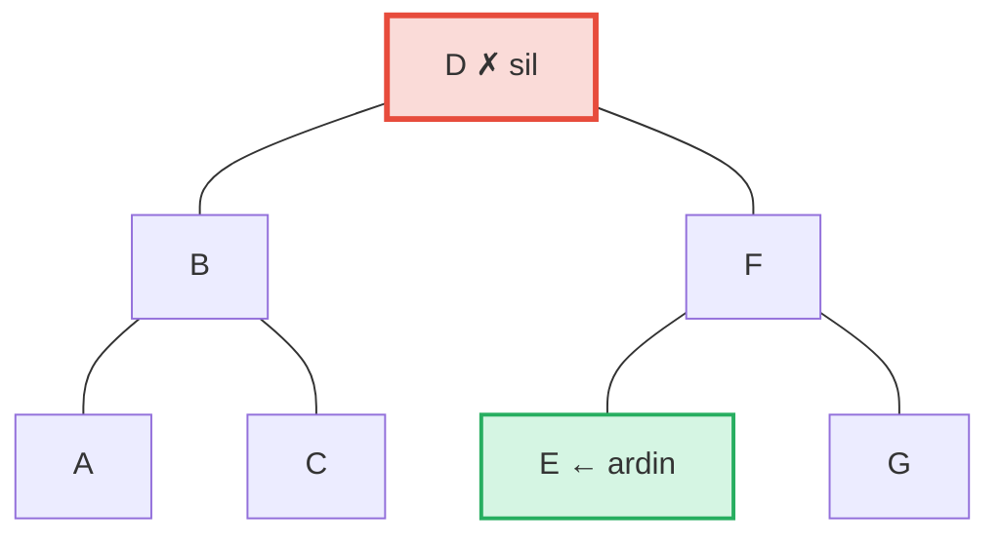

**Sonra** -- E (sag alt agactaki en soldaki = siradaki ardin) D'nin konumuna yukseltilir:

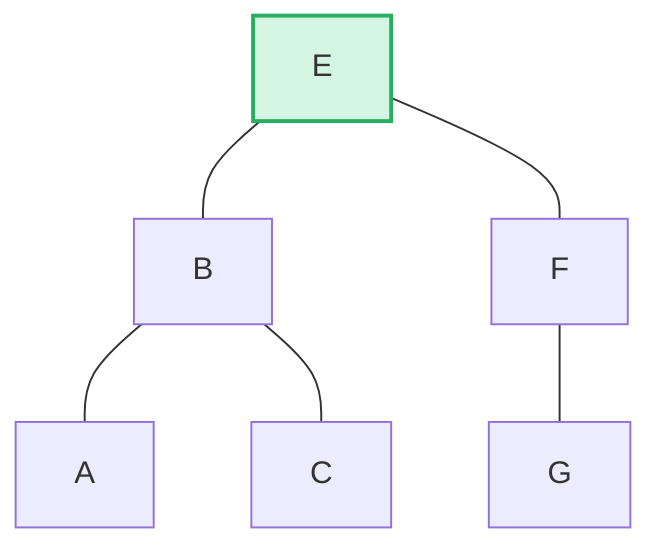

> **Kural:** Sol yukseklik > sag ise sol alt agacin sag kenarini yukselt. Sag yukseklik >= sol ise sag alt agacin sol kenarini yukselt. Bu, silme sonrasi yeniden dengelemeyi en aza indirir.

```rust
pub fn remove(self, ...) -> CostResult<Option<Self>, Error> {
    let has_left = tree.link(true).is_some();
    let has_right = tree.link(false).is_some();
    let left = tree.child_height(true) > tree.child_height(false);

    if has_left && has_right {
        // Iki cocuk: daha uzun cocugun kenarini yukselt
        let (tree, tall_child) = self.detach_expect(left, ...);
        let (_, short_child) = tree.detach_expect(!left, ...);
        tall_child.promote_edge(!left, short_child, ...)
    } else if has_left || has_right {
        // Bir cocuk: dogrudan yukselt
        self.detach_expect(left, ...).1
    } else {
        // Yaprak dugum: sadece kaldir
        None
    }
}
```

---
