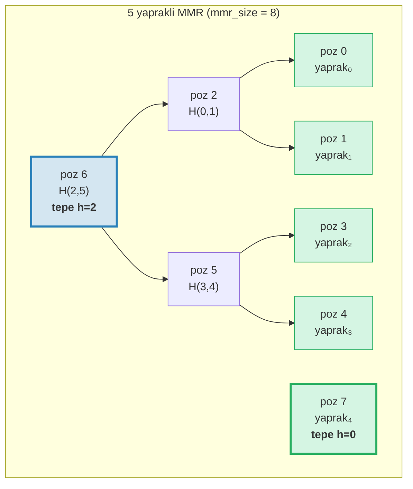
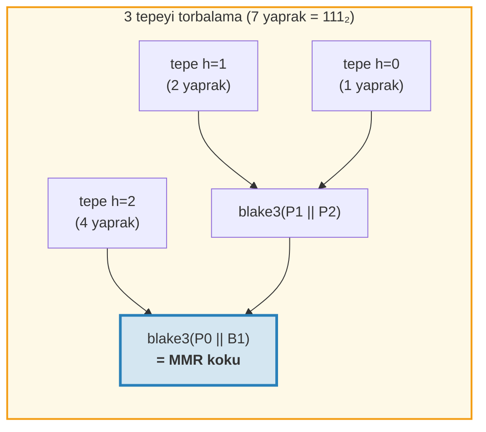
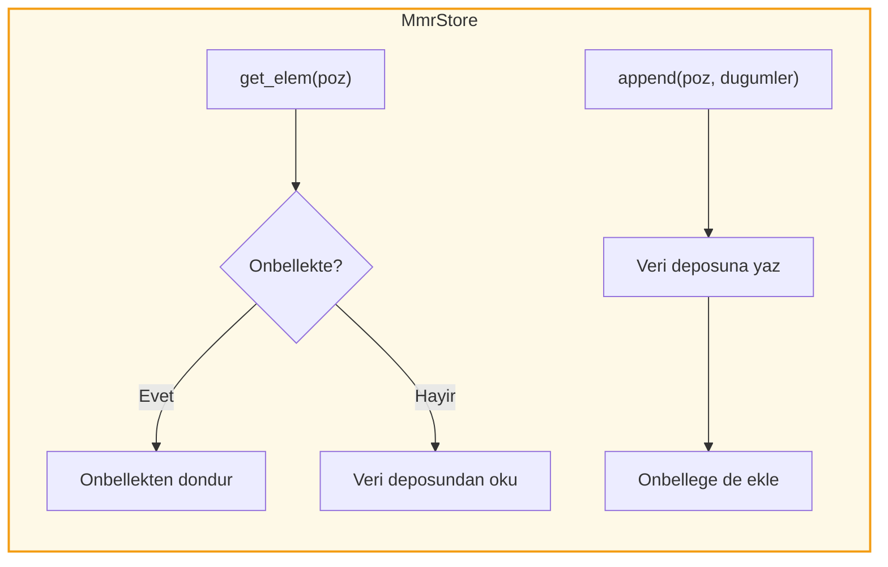
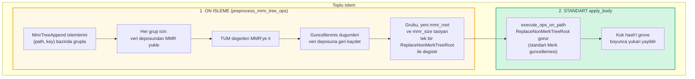
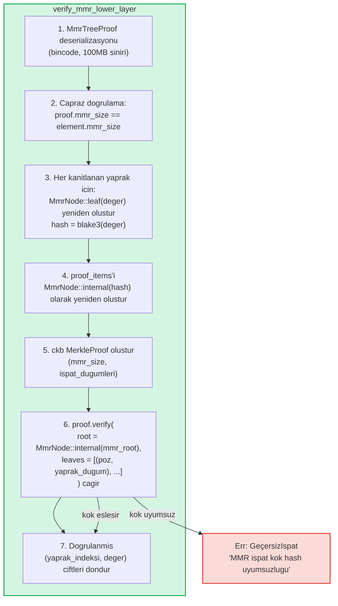

# MMR Agaci -- Yalnizca Ekleme Yapilabilen Kimlik Dogrulanabilir Loglar

**MmrTree**, GroveDB'nin Blake3 hashleme ile yalnizca ekleme yapilabilen (append-only) kimlik dogrulanabilir veri yapisidir ve bir Merkle Dag Silsilesi (MMR - Merkle Mountain Range) uzerine kuruludur. Merk AVL agaclari (Bolum 2) O(log N) guncellemelerle rastgele anahtar-deger islemlerinde ustun olurken, MMR'ler yalnizca ekleme durumu icin ozel olarak tasarlanmistir: sifir rotasyon, ekleme basina amortize O(1) hash maliyeti ve sirali I/O desenleri sunar.

Bu bolum MMR veri yapisini derinlemesine ele alir -- nasil buyudugunu, dugumlerin nasil depolandigini, eklemelerin nasil basamaklandigini ve ispat (proof) sisteminin ucuncu bir tarafin belirli bir degerin belirli bir konumda eklendigini dogrulamasini nasil sagladigini kapsar.

## Neden Ayri Bir Agac Tipi?

GroveDB'nin standart Merk agaclari sirali anahtar-deger verisini iyi isler, ancak yalnizca ekleme yapilabilen loglarin farkli gereksinimleri vardir:

| Ozellik | Merk AVL Agaci | MMR |
|---------|---------------|-----|
| Islemler | Ekleme, guncelleme, silme | Yalnizca ekleme |
| Yeniden dengeleme | Yazma basina O(log N) rotasyon | Yok |
| I/O deseni | Rastgele (yeniden dengeleme bircok dugume dokunur) | Sirali (yeni dugumler her zaman sonda) |
| N ekleme icin toplam hash | O(N log N) | O(N) |
| Yapi | Ekleme sirasina bagli | Yalnizca yaprak sayisina bagli |
| Ispatlar | Kokten yapraga yol | Kardes + tepe hash'leri |

Islem loglari, olay akislari veya monoton olarak buyuyen herhangi bir veri gibi kullanim durumlarinda, MMR kesinlikle daha iyidir: daha basit, daha hizli ve daha tahmin edilebilir.

## MMR Veri Yapisi

Bir MMR, soldan saga buyuyen **mukemmel ikili agac ormanidir** (bunlara "tepeler" denir). Her tepe, tam olarak 2^h yaprak iceren h yuksekliginde tam bir ikili agactir.

Temel kavrayis: **yaprak sayisinin ikili temsili tepe yapisini belirler**. Ikili formdaki her 1-bit bir tepeye karsilik gelir:

```text
Yaprak sayisi  Ikili     Tepeler
─────────      ──────    ─────
1              1         bir tepe h=0
2              10        bir tepe h=1
3              11        tepeler h=1, h=0
4              100       bir tepe h=2
5              101       tepeler h=2, h=0
6              110       tepeler h=2, h=1
7              111       tepeler h=2, h=1, h=0
8              1000      bir tepe h=3
```

Bu, MMR yapisinin tek bir sayi -- yaprak sayisi -- tarafindan tamamen belirlendigi anlamina gelir. Ayni sayida yapragga sahip iki MMR, hangi degerler eklenmis olursa olsun her zaman ayni sekle sahiptir.

## MMR Nasil Doldugar

MMR'deki her dugumun bir **pozisyonu** (0-indeksli) vardir. Yapraklar ve ic dugumler belirli bir duzende serpistirilir. Adim adim buyume:

**1 yapraktan sonra (mmr_size = 1):**
```text
poz:  0
      yaprak₀        ← yukseklik 0'da bir tepe
```

**2 yapraktan sonra (mmr_size = 3):**
```text
poz:     2          ← dahili: blake3(yaprak₀.hash || yaprak₁.hash)
        / \
       0   1        ← yapraklar

Yukseklik 1'de bir tepe. Pozisyon 0 ve 1 yaprak, pozisyon 2 dahili.
```
yaprak₁ eklendoginde, yukseklik 0'da bir tepe olusturdu. Ama zaten yukseklik 0'da bir tepe vardi (yaprak₀), bu yuzden yukseklik 1'de bir tepeye **birlestirildiler**.

**3 yapraktan sonra (mmr_size = 4):**
```text
poz:     2     3    ← tepe h=1, tepe h=0
        / \
       0   1

Iki tepe. Birlestirme yok -- yukseklikler 1 ve 0 farkli.
(Ikili: 3 = 11₂ → her 1-bit basina bir tepe)
```

**4 yapraktan sonra (mmr_size = 7):**
```text
poz:         6              ← dahili: dugum 2 ve 5'in birlesmesi
           /   \
         2       5          ← dahili dugumler
        / \     / \
       0   1   3   4        ← yapraklar

Yukseklik 2'de bir tepe.
```
Burasi ilginc kisim. yaprak₃'u eklemek (pozisyon 4) dugum₅'i olusturur (pozisyon 3 ve 4'un birlesmesi). Ama simdi dugum₅ (yukseklik 1) ve dugum₂ (yukseklik 1) esit yukseklikte bitisik tepelerdir, bu yuzden dugum₆'ya birlesirler. **Tek bir eklemeden iki birlestirme basamagi.**

**5 yapraktan sonra (mmr_size = 8):**
```text
poz:         6         7    ← tepe h=2, tepe h=0
           /   \
         2       5
        / \     / \
       0   1   3   4

Iki tepe. (Ikili: 5 = 101₂)
```

**7 yapraktan sonra (mmr_size = 11):**
```text
poz:         6         10    ← tepe h=2, tepe h=1, tepe h=0
           /   \      / \
         2       5   8   9    7
        / \     / \
       0   1   3   4

Uc tepe. (Ikili: 7 = 111₂)
```

**8 yapraktan sonra (mmr_size = 15):**
```text
poz:              14                     ← tek tepe h=3
               /      \
            6            13
          /   \        /    \
        2       5    9       12
       / \     / \  / \     / \
      0   1   3  4 7   8  10  11

Yukseklik 3'te bir tepe. yaprak₇'yi eklerken uc basamakli birlestirme.
```



> **Mavi** = tepeler (mukemmel ikili alt agaclarin kokleri). **Yesil** = yaprak dugumler.

## Birlestirme Basamagi

Yeni bir yaprak eklendiginde, bir birlestirme zincirini tetikleyebilir. Birlestirme sayisi, mevcut yaprak sayisinin ikili temsilindeki **sondaki 1-bitlerin** sayisina esittir:

| Yaprak sayisi (push oncesi) | Ikili | sondaki 1'ler | Birlestirmeler | Toplam hash |
|-----------------------------|-------|---------------|----------------|-------------|
| 0 | `0` | 0 | 0 | 1 (yalnizca yaprak) |
| 1 | `1` | 1 | 1 | 2 |
| 2 | `10` | 0 | 0 | 1 |
| 3 | `11` | 2 | 2 | 3 |
| 4 | `100` | 0 | 0 | 1 |
| 5 | `101` | 1 | 1 | 2 |
| 6 | `110` | 0 | 0 | 1 |
| 7 | `111` | 3 | 3 | 4 |

**Push basina toplam hash** = `1 + trailing_ones(yaprak_sayisi)`:
- Yapragin kendisi icin 1 hash: `blake3(deger)`
- Birlestirme basamagi icin N hash: her birlestirme icin `blake3(sol.hash || sag.hash)`

GroveDB'nin her ekleme icin hash maliyetlerini nasil izledigi budur. Uygulama:
```rust
pub fn hash_count_for_push(leaf_count: u64) -> u32 {
    1 + leaf_count.trailing_ones()
}
```

## MMR Boyutu ve Yaprak Sayisi

MMR hem yapraklari hem de ic dugumleri duz bir pozisyon alaninda depolar, bu nedenle `mmr_size` her zaman yaprak sayisindan buyuktur. Kesin iliski:

```text
mmr_size = 2 * yaprak_sayisi - popcount(yaprak_sayisi)
```

burada `popcount` 1-bitlerin sayisidir (yani tepelerin sayisi). Her ic dugum iki alt agaci birlestirir ve birlestirme basina dugum sayisini bir azaltir.

Ters hesaplama -- mmr_size'dan yaprak sayisi -- tepe pozisyonlarini kullanir:

```rust
fn mmr_size_to_leaf_count(mmr_size: u64) -> u64 {
    // h yuksekligindeki her tepe 2^h yaprak icerir
    get_peaks(mmr_size).iter()
        .map(|&peak_pos| 1u64 << pos_height_in_tree(peak_pos))
        .sum()
}
```

| mmr_size | yaprak_sayisi | tepeler |
|----------|--------------|---------|
| 0 | 0 | (bos) |
| 1 | 1 | h=0 |
| 3 | 2 | h=1 |
| 4 | 3 | h=1, h=0 |
| 7 | 4 | h=2 |
| 8 | 5 | h=2, h=0 |
| 10 | 6 | h=2, h=1 |
| 11 | 7 | h=2, h=1, h=0 |
| 15 | 8 | h=3 |

GroveDB, Element'te `mmr_size`'i depolar (yaprak sayisini degil) cunku ckb MMR kutuphanesi dahili olarak pozisyonlari kullanir. `mmr_tree_leaf_count` islemi yaprak sayisini aninda turetir.

## MMR Kok Hash -- Tepeleri Torbalama

Bir MMR'nin birden fazla tepesi vardir (yaprak sayisindaki her 1-bit icin bir tane). Tek bir 32 baytlik kok hash uretmek icin tepeler sagdan sola **"torbalanir"**:

```text
root = bag_rhs_peaks(tepeler):
    en sagdaki tepeden basla
    sola dogru katla: blake3(sol_tepe || biriktirilmis_sag)
```

1 tepe ile kok sadece o tepenin hash'idir. 3 tepe ile:



> Kok hash, hicbir birlestirme olmasa bile, **her** eklemede degisir cunku en sagdaki tepe degisir ve torbalama yeniden hesaplanmalidir.

## Dugum Yapisi ve Serializasyon

Her MMR dugumu bir `MmrNode`'dur:

```rust
struct MmrNode {
    hash: [u8; 32],           // Blake3 hash
    value: Option<Vec<u8>>,   // Yapraklar icin Some, dahili dugumler icin None
}
```

**Yaprak dugumu:** `hash = blake3(deger_baytlari)`, `value = Some(deger_baytlari)`
**Dahili dugum:** `hash = blake3(sol.hash || sag.hash)`, `value = None`

Birlestirme fonksiyonu basittir -- iki 32 baytlik hash'i birlestirip Blake3 sonucunu al:

```rust
fn blake3_merge(left: &[u8; 32], right: &[u8; 32]) -> [u8; 32] {
    let mut input = [0u8; 64];
    input[..32].copy_from_slice(left);
    input[32..].copy_from_slice(right);
    *blake3::hash(&input).as_bytes()
}
```

> **PartialEq hakkinda not:** `MmrNode` PartialEq'i yalnizca **hash alanini** karsilastirarak uygular, degeri degil. Bu, ispat dogrulamasi icin kritiktir: ckb dogrulayicisi yeniden olusturulmus bir koku (value = None) beklenen kokle karsilastirir. PartialEq deger alanini karsilastirsa, tek yaprakli MMR ispatlar her zaman basarisiz olurdu cunku yapragin `value: Some(...)` degeri varken kok yeniden olusturmasi `value: None` uretir.

**Serializasyon formati:**
```text
Dahili: [0x00] [hash: 32 bayt]                                = 33 bayt
Yaprak: [0x01] [hash: 32 bayt] [deger_uzunlugu: 4 BE] [deger...]   = 37 + uzunluk bayt
```

Bayrak bayti dahili dugumleri yapraklardan ayirir. Deserializasyon kesin uzunlugu dogrular -- artik baytlara izin verilmez.

## Depolama Mimarisi

MmrTree dugumlerini **veri** sutununda (Merk dugumleriyle ayni sutun ailesi) depolar, cocuk Merk alt agacinda degil. Element'te `root_key` alani yoktur -- MMR kok hash'i `insert_subtree(subtree_root_hash)` araciligiyla Merk **cocuk hash** olarak akar ve MMR durumunu dogrular.

**Depolama anahtarlari** pozisyon tabanlidir:
```text
anahtar = 'm' || pozisyon_be_u64    (9 bayt: onek + u64 BE)
```

Yani pozisyon 42, `[0x6D, 0x00, 0x00, 0x00, 0x00, 0x00, 0x00, 0x00, 0x2A]` anahtarinda depolanir.

*i* yapragini aramak once MMR pozisyonunu hesaplamak gerekir: `poz = leaf_index_to_pos(i)`, sonra `m{poz}` veri anahtarini oku.

**Yazma-izleme onbellegi:** Eklemeler sirasinda yeni yazilan dugumler, ayni push'taki sonraki birlestirmeler icin hemen okunabilir olmalidir. GroveDB'nin islemsel depolamasi yazmalari bir topluluğa ertelediğinden (commit'e kadar okumalara gorunmezler), bir `MmrStore` adaptoru depolama baglamini bellek icinde bir `HashMap` onbellegi ile sarar:



Bu, yaprak₃'u eklerken bir birlestirme basamagi tetiklendiginde (pozisyon 5 ve 6'da dahili dugumler olusturuldugunda), dugum₆ hesaplanirken dugum₅'in RocksDB'ye commit edilmemis olsa bile hemen kullanilabilir olmasini saglar.

**GroveDB durum kokune kok hash yayilimi:**

```text
combined_value_hash = blake3(
    blake3(varint(uzunluk) || element_baytlari),   ← seriletirilmis Element'ten value_hash
    mmr_kok_hash                                    ← child_hash = tipe ozel kok
)
```

MMR kok hash'i `insert_subtree` araciligiyla Merk cocuk hash olarak akar. MMR durumundaki herhangi bir degisiklik farkli bir `combined_value_hash` uretir ve bu, ust Merk hiyerarsisi boyunca GroveDB durum kokune kadar yukari yayilir.

## GroveDB Islemleri

MmrTree dort islem saglar:

```rust
// Bir deger ekle — (yeni_mmr_koku, yaprak_indeksi) dondurur
db.mmr_tree_append(path, key, value, tx, version)

// Mevcut kok hash'i oku (Element'ten, depolama erisimi olmadan)
db.mmr_tree_root_hash(path, key, tx, version)

// 0 tabanli indekse gore yaprak degeri al
db.mmr_tree_get_value(path, key, leaf_index, tx, version)

// Eklenen yaprak sayisini al
db.mmr_tree_leaf_count(path, key, tx, version)
```

### Ekleme Akisi

Ekleme islemi, 8 adim gerçekleştiren en karmasik islemdir:

```mermaid
graph TD
    subgraph append["mmr_tree_append(path, key, value, tx)"]
        A1["1. path/key'deki Element'i oku<br/>→ mmr_size, flags al"]
        A2["2. path/key alt agacinda<br/>veri deposunu ac"]
        A3["3. MmrNode::leaf(value) olustur<br/>hash = blake3(value)"]
        A4["4. Yapragi ckb MMR'ye it<br/>→ basamakli birlestirmeler<br/>yeni dahili dugumler yazar"]
        A5["5. Commit → yeni dugumleri<br/>depoya bosalt"]
        A6["6. Tepeleri torbala → yeni mmr_root"]
        A7["7. Yeni mmr_root ve<br/>mmr_size ile Element'i guncelle"]
        A8["8. GroveDB Merk hiyerarsisi<br/>boyunca degisiklikleri<br/>yukari yayildir + tx commit"]

        A1 --> A2 --> A3 --> A4 --> A5 --> A6 --> A7 --> A8
    end

    style append fill:#d5f5e3,stroke:#27ae60,stroke-width:2px
    style A6 fill:#d4e6f1,stroke:#2980b9,stroke-width:2px
```



Adim 4, 1 dugum (yalnizca yaprak) veya 1 + N dugum (yaprak + N dahili birlestirme dugumu) yazabilir. Adim 5, ckb MemStore'u MmrStore'a bosaltan `mmr.commit()` cagrisini yapar. Adim 7, MmrTree'nin cocuk Merk'i olmadigindan, yeni MMR kokunu cocuk hash olarak (`subtree_root_hash` araciligiyla) `insert_subtree` cagrisini yapar.

### Okuma Islemleri

`mmr_tree_root_hash`, depolamadaki MMR verisinden koku hesaplar. `mmr_tree_leaf_count`, Element'teki `mmr_size`'dan yaprak sayisini turetir. Veri deposu erisimi gerekmez.

`mmr_tree_get_value`, `poz = leaf_index_to_pos(yaprak_indeksi)` hesaplar, `m{poz}`'daki tek veri deposu girisini okur, `MmrNode`'u deserializasyon yapar ve `node.value` dondurur.

## Toplu Islemler

Birden fazla MMR ekleme, `GroveOp::MmrTreeAppend { value }` kullanilarak toplu olarak yapilabilir. Standart `execute_ops_on_path` fonksiyonu yalnizca Merk'e (MMR'nin depolama baglamina degil) erisime sahip oldugundan, MMR eklemeleri bir **on isleme fazi** kullanir:



Ornek: Ayni MMR'ye 3 ekleme iceren bir topluluk:
```rust
vec![
    QualifiedGroveDbOp { path: p, key: k, op: MmrTreeAppend { value: v1 } },
    QualifiedGroveDbOp { path: p, key: k, op: MmrTreeAppend { value: v2 } },
    QualifiedGroveDbOp { path: p, key: k, op: MmrTreeAppend { value: v3 } },
]
```

On isleme MMR'yi bir kez yukler, v1, v2, v3'u iter (tum ara dugumleri olusturur), her seyi veri deposuna kaydeder, sonra nihai `mmr_root` ve `mmr_size` ile tek bir `ReplaceNonMerkTreeRoot` yayar. Standart toplu makine gerisini halledur.

## Ispat Uretimi

MMR ispatlari **V1 ispatlaridir** -- katmanli ispat yapisindaki `ProofBytes::MMR` varyantini kullanirlar (bkz. bolum 9.6). Ispat, belirli yaprak degerlerinin MMR icinde belirli pozisyonlarda var oldugunu ve hash'lerinin ust elementte depolanan `mmr_root` ile tutarli oldugunu gosterir.

### Sorgu Kodlamasi

Sorgu anahtarlari pozisyonlari **buyuk endian u64 baytlari** olarak kodlar. Bu, leksikografik siralama duzeni korur (BE kodlamasi monotoniktir) ve tum standart `QueryItem` varyantlarinin calismaisini saglar:

```text
QueryItem::Key([0,0,0,0,0,0,0,5])            → yaprak indeksi 5
QueryItem::RangeInclusive([..2]..=[..7])      → yaprak indeksleri [2, 3, 4, 5, 6, 7]
QueryItem::RangeFrom([..10]..)                → yaprak indeksleri [10, 11, ..., N-1]
QueryItem::RangeFull                          → tum yapraklar [0..yaprak_sayisi)
```

Sinirsiz aralik sorgularinin bellek tukenmesini onlemek icin **10.000.000 indeks** guvenlik siniri uygulanir. Bos bir MMR (sifir yaprak) bos bir ispat dondurur.

### MmrTreeProof Yapisi

```rust
struct MmrTreeProof {
    mmr_size: u64,                 // Ispat zamaninda MMR boyutu
    leaves: Vec<(u64, Vec<u8>)>,   // (yaprak_indeksi, deger) her kanitlanan yaprak icin
    proof_items: Vec<[u8; 32]>,    // Dogrulama icin kardes/tepe hash'leri
}
```

`proof_items`, kanitlanan yapraklardan MMR kokune giden yollari yeniden olusturmak icin gereken minimum hash kumesini icerir. Bunlar her seviyedeki kardes dugumler ve dahil olmayan tepe hash'leridir.

### Uretim Akisi

```mermaid
graph TD
    subgraph gen["generate_mmr_layer_proof"]
        G1["1. PathQuery'den alt sorgu<br/>ogelerini al"]
        G2["2. BE u64 anahtarlarini<br/>coz → yaprak indeksleri"]
        G3["3. Alt agac yolunda<br/>veri deposunu ac"]
        G4["4. Tum MMR dugumlerini<br/>salt okunur MemNodeStore'a yukle"]
        G5["5. ckb gen_proof(pozisyonlar)<br/>cagir → MerkleProof"]
        G6["6. Her kanitlanan yapragin<br/>tam degerini deposundan oku"]
        G7["7. proof_items'i<br/>[u8; 32] hash'leri olarak cikar"]
        G8["8. MmrTreeProof kodla<br/>→ ProofBytes::MMR(baytlar)"]

        G1 --> G2 --> G3 --> G4 --> G5 --> G6 --> G7 --> G8
    end

    style gen fill:#fef9e7,stroke:#f39c12,stroke-width:2px
```



Adim 4 bir `MemNodeStore` kullanir -- tum MMR dugumlerini veri deposundan on-yukleyen salt okunur bir BTreeMap. ckb ispat uretici rastgele erisime ihtiyac duyar, bu nedenle tum dugumler bellekte olmalidir.

Adim 5, ckb kutuphanesinin agir isi yaptigi yerdir: MMR boyutu ve kanitlanacak pozisyonlar verildiginde, hangi kardes ve tepe hash'lerinin gerekli oldugunu belirler.

### Calistirilmis Ornek

**5 yaprakli bir MMR'de yaprak 2'yi kanitlama (mmr_size = 8):**

```text
MMR yapisi:
poz:         6         7
           /   \
         2       5
        / \     / \
       0   1   3   4

Yaprak indeksi 2 → MMR pozisyonu 3

Pozisyon 3'teki yapragi dogrulamak icin:
  1. Talep edilen degeri hashle: yaprak_hash = blake3(deger)
  2. Pozisyon 4'teki kardes:  dugum₅ = blake3(yaprak_hash || ispat[poz 4])
  3. Pozisyon 2'deki kardes:  dugum₆ = blake3(ispat[poz 2] || dugum₅)
  4. Pozisyon 7'deki tepe:    kok  = torba(dugum₆, ispat[poz 7])
  5. Karsilastir: kok == beklenen mmr_root ✓

proof_items = [hash(poz 4), hash(poz 2), hash(poz 7)]
leaves = [(2, orijinal_deger_baytlari)]
```

Bu ornek icin ispat boyutu: 3 hash (96 bayt) + 1 yaprak degeri + meta veri. Genel olarak, N yaprakli bir MMR'den K yapragi kanitlamak O(K * log N) kardes hash gerektirir.

## Ispat Dogrulamasi

Dogrulama **saftir** -- veritabani erisimi gerektirmez. Dogrulayici yalnizca ispat baytlarina ve beklenen MMR kok hash'ine (ustteki Merk katmaninda kanitlanan ust elementten cikarir) ihtiyac duyar.

### Dogrulama Adimlari



ckb `MerkleProof::verify` fonksiyonu yapraklar ve ispat ogelerinden koku yeniden olusturur, sonra beklenen kokle (yalnizca hash'i kontrol eden `PartialEq` kullanarak) karsilastirir.

### Guven Zinciri

GroveDB durum kokundan dogrulanmis bir yaprak degerine tam zincir:

```text
GroveDB state_root (bilinen/guvenilen)
│
├─ V0 Merk ispat katmani 0: kokte alt agacin var oldugunu kanitlar
│   └─ root_hash state_root ile eslesir ✓
│
├─ V0 Merk ispat katmani 1: path/key'de MmrTree elementini kanitlar
│   └─ KVValueHash dugumu: element_baytlari mmr_root icerir
│   └─ combined_hash = combine_hash(H(element_baytlari), mmr_root)
│   └─ root_hash ust katmanla eslesir ✓
│
└─ V1 MMR ispati: yaprak degerlerinin MMR'de oldugunu kanitlar
    └─ Yapraklardan kardesler uzerinden tepelere yollari yeniden olustur
    └─ Tepeleri torbala → yeniden olusturulmus kok
    └─ yeniden olusturulmus kok == element_baytlarindan mmr_root ✓
    └─ Sonuc: yaprak₂ = [dogrulanmis deger baytlari]
```

### Guvenlik Ozellikleri

- **mmr_size capraz dogrulama:** Ispatin `mmr_size` degeri elementin `mmr_size` degeriyle eslesmeli. Uyumsuzluk, ispatin farkli bir duruma karsi olusturuldugunu gosterir ve reddedilir.
- **Bincode boyut siniri:** Deserializasyon, olusturulmus uzunluk basliklarinin buyuk bellek ayirmalarina neden olmasini onlemek icin 100MB siniri kullanir.
- **Sinir muhasebesi:** Her kanitlanan yaprak, tasmayi onlemek icin `saturating_sub` kullanarak genel sorgu sinirini 1 azaltir.
- **Cocuk hash donus:** Dogrulayici, ust katmandaki combine_hash hesaplamasi icin hesaplanan MMR kokunu cocuk hash olarak dondurur.
- **V0 reddi:** V0 ispatlarla bir MmrTree'ye alt sorgu yapmaya calismak `Error::NotSupported` dondurur. Yalnizca V1 ispatlar Merk olmayan agaclara inebilir.

## Maliyet Takibi

MMR islemleri maliyetleri hassas bir sekilde izler:

| Islem | Hash cagirilari | Depolama islemleri |
|-------|-----------------|--------------------|
| 1 yaprak ekle | `1 + trailing_ones(yaprak_sayisi)` | 1 yaprak yazma + N dahili yazma |
| Kok hash | 0 (Element'te onbellekte) | 1 Element okuma |
| Deger al | 0 | 1 Element okuma + 1 veri okuma |
| Yaprak sayisi | 0 | 1 Element okuma |

`1 + trailing_ones(N)` hash sayisi formulu, kesin Blake3 cagrisi sayisini verir: yaprak hash'i icin 1, artı basamak seviyesi basina bir birlestirme hash'i.

**Amortize analiz:** N ekleme boyunca toplam hash sayisi:

```text
Σ (1 + trailing_ones(i)) i = 0..N-1 icin
= N + Σ trailing_ones(i) i = 0..N-1 icin
= N + (N - popcount(N))
≈ 2N
```

Yani ekleme basina amortize maliyet yaklasik **2 Blake3 hash cagrisidir** -- sabit ve agac boyutundan bagimsiz. Bunu, her eklemenin yol icin O(log N) hash artı potansiyel rotasyon hash'leri gerektirdig Merk AVL agaclariyla karsilastirin.

**Depolama maliyeti:** Her ekleme 1 yaprak dugum (37 + deger_uzunlugu bayt) artı 0 ila log₂(N) dahili dugum (her biri 33 bayt) yazar. Ekleme basina amortize depolama yazmasi yaklasik 33 + 37 + deger_uzunlugu bayt ≈ 70 + deger_uzunlugu bayt.

## Uygulama Dosyalari

| Dosya | Amac |
|-------|------|
| `grovedb-mmr/src/node.rs` | `MmrNode` yapisi, Blake3 birlestirme, serializasyon |
| `grovedb-mmr/src/grove_mmr.rs` | ckb MMR etrafinda `GroveMmr` sarimlayicisi |
| `grovedb-mmr/src/util.rs` | `mmr_node_key`, `hash_count_for_push`, `mmr_size_to_leaf_count` |
| `grovedb-mmr/src/proof.rs` | `MmrTreeProof` uretimi ve dogrulamasi |
| `grovedb-mmr/src/dense_merkle.rs` | Yogun Merkle agaci kokleri (BulkAppendTree tarafindan kullanilir) |
| `grovedb/src/operations/mmr_tree.rs` | GroveDB islemleri + `MmrStore` adaptoru + toplu on isleme |
| `grovedb/src/operations/proof/generate.rs` | V1 ispat uretimi: `generate_mmr_layer_proof`, `query_items_to_leaf_indices` |
| `grovedb/src/operations/proof/verify.rs` | V1 ispat dogrulamasi: `verify_mmr_lower_layer` |
| `grovedb/src/tests/mmr_tree_tests.rs` | 28 entegrasyon testi |

## Diger Kimlik Dogrulanabilir Yapilarla Karsilastirma

| | MMR (MmrTree) | Merk AVL (Tree) | Sinsemilla (CommitmentTree) |
|---|---|---|---|
| **Kullanim durumu** | Yalnizca ekleme loglari | Anahtar-deger deposu | ZK uyumlu taahhutler |
| **Hash fonksiyonu** | Blake3 | Blake3 | Sinsemilla (Pallas egrisi) |
| **Islemler** | Ekleme, indeksle okuma | Ekleme, guncelleme, silme, sorgu | Ekleme, tanik |
| **Amortize hash/yazma** | ~2 | O(log N) | ~33 (32 seviye + ommer'ler) |
| **Ispat tipi** | V1 (MMR kardes hash'leri) | V0 (Merk yol ispati) | Tanik (Merkle yetki yolu) |
| **ZK uyumlu** | Hayir | Hayir | Evet (Halo 2 devreleri) |
| **Yeniden dengeleme** | Yok | AVL rotasyonlari | Yok |
| **Silme destegi** | Hayir | Evet | Hayir |

---
