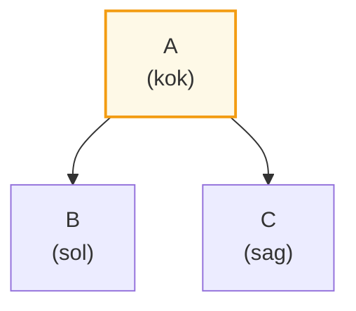
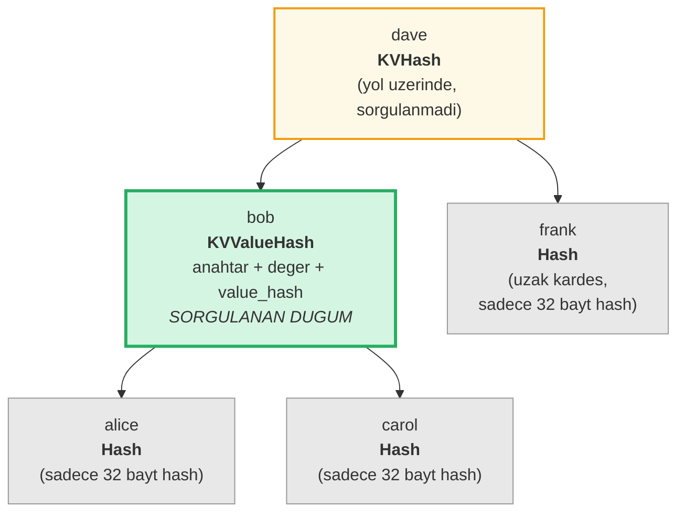
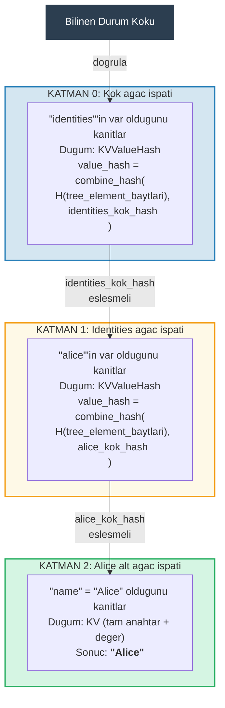
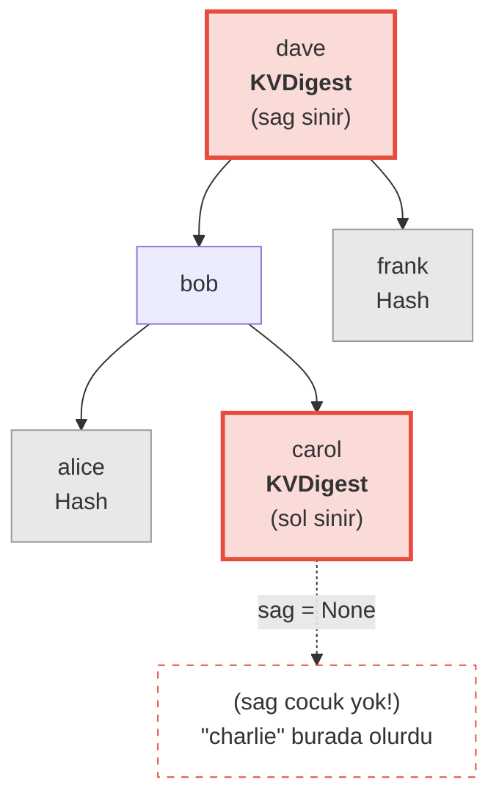
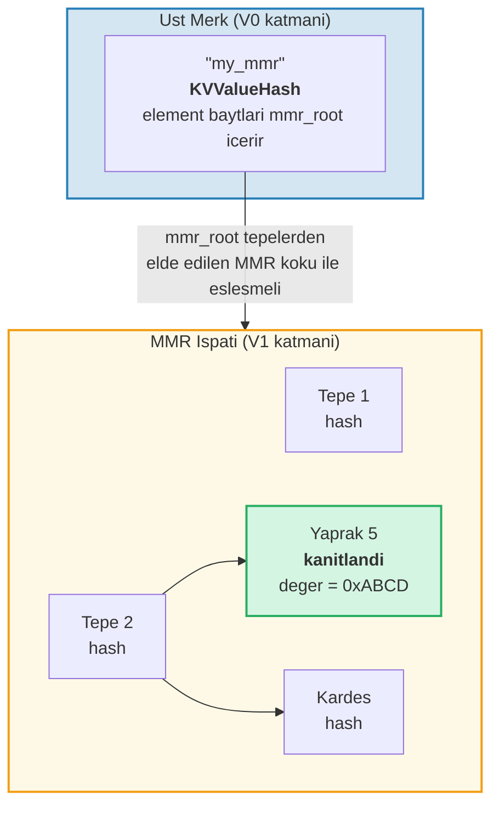
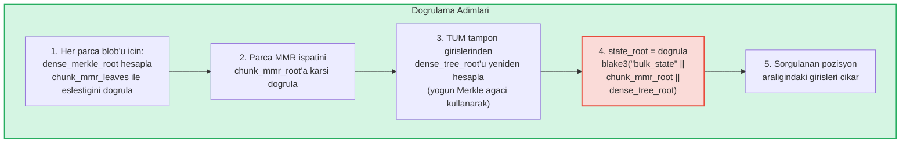
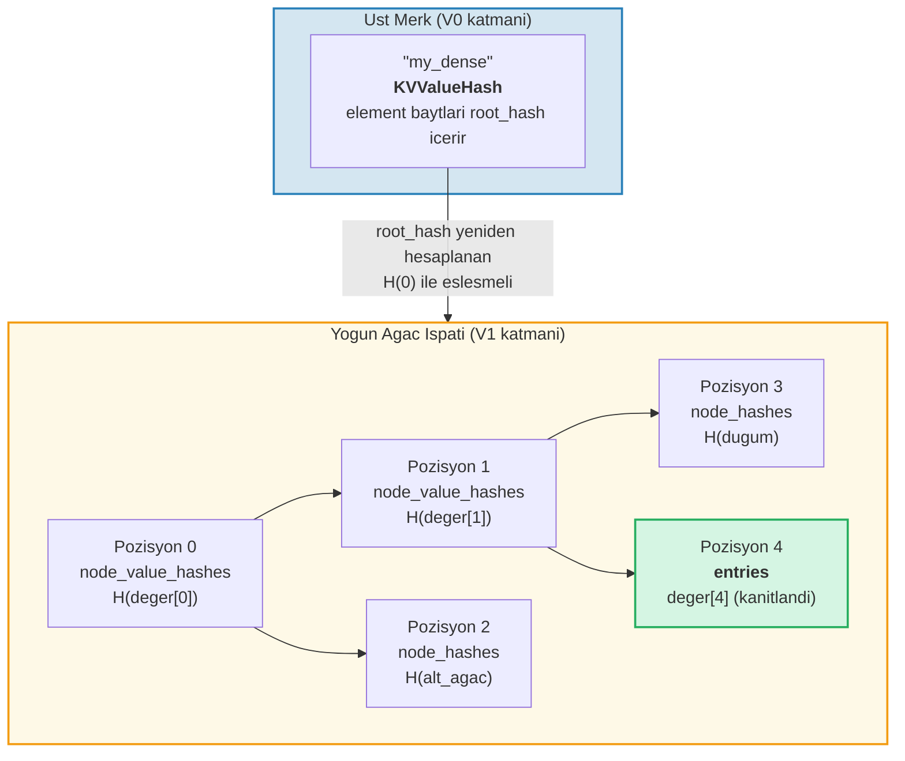

# Ispat Sistemi

GroveDB'nin ispat (proof) sistemi, herhangi bir tarafin tam veritabanina sahip olmadan sorgu sonuclarinin dogrulugunu dogrulamasini saglar. Bir ispat, kok hash'in yeniden olusturulmasina olanak taniyan ilgili agac yapisinin kompakt bir temsilidir.

## Yigin Tabanli Ispat Islemleri

Ispatlar, bir yigin makinesi (stack machine) kullanarak kismi bir agaci yeniden olusturan bir **islemler** dizisi olarak kodlanir:

```rust
// merk/src/proofs/mod.rs
pub enum Op {
    Push(Node),        // Yigina bir dugum it (artan anahtar sirasi)
    PushInverted(Node),// Bir dugum it (azalan anahtar sirasi)
    Parent,            // Ebeveyn cikar, cocuk cikar → cocugu ebeveyinin SOLUNA bagla
    Child,             // Cocuk cikar, ebeveyn cikar → cocugu ebeveyinin SAGINA bagla
    ParentInverted,    // Ebeveyn cikar, cocuk cikar → cocugu ebeveyinin SAGINA bagla
    ChildInverted,     // Cocuk cikar, ebeveyn cikar → cocugu ebeveyinin SOLUNA bagla
}
```

Yurutme bir yigin kullanir:

Ispat islemleri: `Push(B), Push(A), Parent, Push(C), Child`

| Adim | Islem | Yigin (ust→sag) | Eylem |
|------|-------|-----------------|-------|
| 1 | Push(B) | [ B ] | B'yi yigina it |
| 2 | Push(A) | [ B , A ] | A'yi yigina it |
| 3 | Parent | [ A{sol:B} ] | A'yi cikar (ebeveyn), B'yi cikar (cocuk), B → A'nin SOLU |
| 4 | Push(C) | [ A{sol:B} , C ] | C'yi yigina it |
| 5 | Child | [ A{sol:B, sag:C} ] | C'yi cikar (cocuk), A'yi cikar (ebeveyn), C → A'nin SAGI |

Nihai sonuc -- yiginda tek bir agac:



> Dogrulayici `node_hash(A) = Blake3(kv_hash_A || node_hash_B || node_hash_C)` hesaplar ve beklenen kok hash ile eslestogini kontrol eder.

Bu `execute` fonksiyonudur (`merk/src/proofs/tree.rs`):

```rust
pub fn execute<I, F>(ops: I, collapse: bool, mut visit_node: F) -> CostResult<Tree, Error>
where
    I: IntoIterator<Item = Result<Op, Error>>,
    F: FnMut(&Node) -> Result<(), Error>,
{
    let mut stack: Vec<Tree> = Vec::with_capacity(32);

    for op in ops {
        match op? {
            Op::Parent => {
                let (mut parent, child) = (try_pop(&mut stack), try_pop(&mut stack));
                parent.left = Some(Child { tree: Box::new(child), hash: child.hash() });
                stack.push(parent);
            }
            Op::Child => {
                let (child, mut parent) = (try_pop(&mut stack), try_pop(&mut stack));
                parent.right = Some(Child { tree: Box::new(child), hash: child.hash() });
                stack.push(parent);
            }
            Op::Push(node) => {
                visit_node(&node)?;
                stack.push(Tree::from(node));
            }
            // ... Ters varyantlar sol/sag degistirir
        }
    }
    // Yigindaki son oge koktir
}
```

## Ispatlarda Dugum Tipleri

Her `Push` dogrulama icin yeterli bilgiyi iceren bir `Node` tasir:

```rust
pub enum Node {
    // Minimum bilgi — sadece hash. Uzak kardesler icin kullanilir.
    Hash(CryptoHash),

    // Yol uzerindeki ama sorgulanmayan dugumler icin KV hash.
    KVHash(CryptoHash),

    // Sorgulanan ogeler icin tam anahtar-deger.
    KV(Vec<u8>, Vec<u8>),

    // Anahtar, deger ve onceden hesaplanmis value_hash.
    // value_hash = combine_hash(...) olan alt agaclar icin kullanilir
    KVValueHash(Vec<u8>, Vec<u8>, CryptoHash),

    // Ozellik tipiyle KV — ProvableCountTree veya parca geri yukleme icin.
    KVValueHashFeatureType(Vec<u8>, Vec<u8>, CryptoHash, TreeFeatureType),

    // Referans: anahtar, referans cozulmus deger, referans elementinin hash'i.
    KVRefValueHash(Vec<u8>, Vec<u8>, CryptoHash),

    // ProvableCountTree'deki ogeler icin.
    KVCount(Vec<u8>, Vec<u8>, u64),

    // Sorgulanmayan ProvableCountTree dugumleri icin KV hash + sayim.
    KVHashCount(CryptoHash, u64),

    // ProvableCountTree'deki referans.
    KVRefValueHashCount(Vec<u8>, Vec<u8>, CryptoHash, u64),

    // ProvableCountTree'de sinir/yokluk ispatlari icin.
    KVDigestCount(Vec<u8>, CryptoHash, u64),

    // Yokluk ispatlari icin anahtar + value_hash (normal agaclar).
    KVDigest(Vec<u8>, CryptoHash),
}
```

Node tipinin secimi, dogrulayicinin hangi bilgiye ihtiyac duydugunu belirler:

**Sorgu: "'bob' anahtari icin degeri al"**



> Yesil = sorgulanan dugum (tam veri aciga cikarilir). Sari = yol uzerinde (yalnizca kv_hash). Gri = kardesler (sadece 32 baytlik dugum hash'leri).

Ispat islemleri olarak kodlanmis hali:

| # | Islem | Etki |
|---|-------|------|
| 1 | Push(Hash(alice_dugum_hash)) | alice hash'ini it |
| 2 | Push(KVValueHash("bob", deger, value_hash)) | bob'u tam veriyle it |
| 3 | Parent | alice bob'un sol cocugu olur |
| 4 | Push(Hash(carol_dugum_hash)) | carol hash'ini it |
| 5 | Child | carol bob'un sag cocugu olur |
| 6 | Push(KVHash(dave_kv_hash)) | dave kv_hash'ini it |
| 7 | Parent | bob alt agaci dave'in solu olur |
| 8 | Push(Hash(frank_dugum_hash)) | frank hash'ini it |
| 9 | Child | frank dave'in sag cocugu olur |

## Cok Katmanli Ispat Uretimi

GroveDB agaclar agaci oldugu icin, ispatlar birden fazla katmani kapsar. Her katman bir Merk agacinin ilgili bolumunu kanitlar ve katmanlar birlesik value_hash mekanizmasiyla birbirine baglanir:

**Sorgu:** `["identities", "alice", "name"] al`



> **Guven zinciri:** `bilinen_durum_koku → Katman 0'i dogrula → Katman 1'i dogrula → Katman 2'yi dogrula → "Alice"`. Her katmanin yeniden olusturulan kok hash'i, ustteki katmandaki value_hash ile eslesmemelidir.

Dogrulayici her katmani kontrol ederek sunlari dogrular:
1. Katman ispati beklenen kok hash'e yeniden olusturulur
2. Kok hash, ust katmandaki value_hash ile eslesir
3. En ust seviye kok hash, bilinen durum kokuyla eslesir

## Ispat Dogrulamasi

Dogrulama, ispat katmanlarini asagidan yukariya veya yukaridan asagiya takip ederek, her katmanin agacini yeniden olusturmak icin `execute` fonksiyonunu kullanir. Ispat agacindaki `Tree::hash()` metodu, dugum tipine gore hash'i hesaplar:

```rust
impl Tree {
    pub fn hash(&self) -> CostContext<CryptoHash> {
        match &self.node {
            Node::Hash(hash) => *hash,  // Zaten bir hash, dogrudan dondur

            Node::KVHash(kv_hash) =>
                node_hash(kv_hash, &self.child_hash(true), &self.child_hash(false)),

            Node::KV(key, value) =>
                kv_hash(key, value)
                    .flat_map(|kv_hash| node_hash(&kv_hash, &left, &right)),

            Node::KVValueHash(key, _, value_hash) =>
                kv_digest_to_kv_hash(key, value_hash)
                    .flat_map(|kv_hash| node_hash(&kv_hash, &left, &right)),

            Node::KVValueHashFeatureType(key, _, value_hash, feature_type) => {
                let kv = kv_digest_to_kv_hash(key, value_hash);
                match feature_type {
                    ProvableCountedMerkNode(count) =>
                        node_hash_with_count(&kv, &left, &right, *count),
                    _ => node_hash(&kv, &left, &right),
                }
            }

            Node::KVRefValueHash(key, referenced_value, ref_element_hash) => {
                let ref_value_hash = value_hash(referenced_value);
                let combined = combine_hash(ref_element_hash, &ref_value_hash);
                let kv = kv_digest_to_kv_hash(key, &combined);
                node_hash(&kv, &left, &right)
            }
            // ... diger varyantlar
        }
    }
}
```

## Yokluk Ispatlari

GroveDB, bir anahtarin **var olmadigini** kanitlayabilir. Bu, sinir dugumlerini kullanir -- eksik anahtar var olsaydi ona bitisik olacak dugumler:

**Kanitla:** "charlie" MEVCUT DEGIL



> **Ikili arama:** alice < bob < carol < **"charlie"** < dave < frank. "charlie" carol ile dave arasinda olurdu. Carol'in sag cocugu `None`'dir, bu da carol ile dave arasinda hicbir seyin olmadigini kanitlar. Dolayisiyla "charlie" bu agacta var olamaz.

Aralik sorgulari icin yokluk ispatlari, sorgulanan aralik icinde sonuc kumesine dahil edilmemis hicbir anahtarin olmadigini gosterir.

## V1 Ispatlar -- Merk Olmayan Agaclar

V0 ispat sistemi yalnizca Merk alt agaclariyla calisir ve grove hiyerarsisi boyunca katman katman iner. Ancak **CommitmentTree**, **MmrTree**, **BulkAppendTree** ve **DenseAppendOnlyFixedSizeTree** elementleri verilerini bir cocuk Merk agacinin disinda depolar. Inecek bir cocuk Merk'leri yoktur -- tipe ozel kok hash'leri Merk cocuk hash olarak akar.

**V1 ispat formati**, bu Merk olmayan agaclari tipe ozel ispat yapilariyla islemek icin V0'i genisletir:

```rust
/// Bir katmanin hangi ispat formatini kullandigini belirtir.
pub enum ProofBytes {
    Merk(Vec<u8>),            // Standart Merk ispat islemleri
    MMR(Vec<u8>),             // MMR uyelik ispati
    BulkAppendTree(Vec<u8>),  // BulkAppendTree aralik ispati
    DenseTree(Vec<u8>),       // Yogun agac dahil etme ispati
    CommitmentTree(Vec<u8>),  // Sinsemilla koku (32 bayt) + BulkAppendTree ispati
}

/// V1 ispatinin bir katmani.
pub struct LayerProof {
    pub merk_proof: ProofBytes,
    pub lower_layers: BTreeMap<Vec<u8>, LayerProof>,
}
```

**V0/V1 secim kurali:** Ispattaki her katman standart bir Merk agaci ise, `prove_query` geriye uyumlu bir `GroveDBProof::V0` uretir. Herhangi bir katman MmrTree, BulkAppendTree veya DenseAppendOnlyFixedSizeTree iceriyorsa, `GroveDBProof::V1` uretir.

### Merk Olmayan Agac Ispatlarinin Kok Hash'e Baglanmasi

Ust Merk agaci, elementin seriletirilmis baytlarini standart bir Merk ispat dugumu (`KVValueHash`) araciligiyla kanitlar. Tipe ozel kok (ornegin `mmr_root` veya `state_root`), Merk **cocuk hash** olarak akar -- element baytlarina gomulu DEGILDIR:

```text
combined_value_hash = combine_hash(
    Blake3(varint(len) || element_baytlari),   ← sayim, yukseklik vb. icerir
    tipe_ozel_kok                              ← mmr_root / state_root / dense_root
)
```

Tipe ozel ispat daha sonra sorgulanan verinin, cocuk hash olarak kullanilan tipe ozel kokle tutarli oldugunu kanitlar.

### MMR Agaci Ispatlari

Bir MMR ispati, belirli yapraklarin MMR icindeki bilinen pozisyonlarda var oldugunu ve MMR'nin kok hash'inin ust Merk dugumunde depolanan cocuk hash ile eslestogini gosterir:

```rust
pub struct MmrProof {
    pub mmr_size: u64,
    pub proof: MerkleProof,  // ckb_merkle_mountain_range::MerkleProof
    pub leaves: Vec<MmrProofLeaf>,
}

pub struct MmrProofLeaf {
    pub position: u64,       // MMR pozisyonu
    pub leaf_index: u64,     // Mantiksal yaprak indeksi
    pub hash: [u8; 32],      // Yaprak hash'i
    pub value: Vec<u8>,      // Yaprak deger baytlari
}
```



**Sorgu anahtarlari pozisyonlardir:** Sorgu ogeleri pozisyonlari buyuk endian u64 baytlari olarak kodlar (bu siralama duzenini korur). Baslangic/bitis pozisyonlarini BE kodlanmis olarak iceren `QueryItem::RangeInclusive`, bir dizi ardisik MMR yapragini secer.

**Dogrulama:**
1. Ispattan `MmrNode` yapraklarini yeniden olustur
2. ckb `MerkleProof`'u ust Merk cocuk hash'inden beklenen MMR kokune karsi dogrula
3. `proof.mmr_size`'in elementin depolanan boyutuyla eslestigini capraz dogrula
4. Kanitlanmis yaprak degerlerini dondur

### BulkAppendTree Ispatlari

BulkAppendTree ispatlari daha karmasiktir cunku veriler iki yerde yasir: muhurlenmis parca blob'lari ve devam eden tampon. Bir aralik ispati sunlari dondurmelidir:

- Sorgu araligini kesen tamamlanmis parcalarin **tam parca blob'lari**
- Tamponda hala olan pozisyonlar icin **bireysel tampon girisleri**

```rust
pub struct BulkAppendTreeProof {
    pub chunk_power: u8,
    pub total_count: u64,
    pub chunk_blobs: Vec<(u64, Vec<u8>)>,       // (parca_indeksi, blob_baytlari)
    pub chunk_mmr_size: u64,
    pub chunk_mmr_proof_items: Vec<[u8; 32]>,    // MMR kardes hash'leri
    pub chunk_mmr_leaves: Vec<(u64, [u8; 32])>,  // (mmr_poz, yogun_merkle_koku)
    pub buffer_entries: Vec<Vec<u8>>,             // TUM mevcut tampon (yogun agac) girisleri
    pub chunk_mmr_root: [u8; 32],
}
```



> **Neden TUM tampon girisleri dahil edilir?** Tampon, her girisi taahhut eden bir yogun Merkle agacidir. `dense_tree_root`'u dogrulamak icin dogrulayicinin agaci tum girislerden yeniden olusturmasi gerekir. Tampon `capacity` girisle sinirli oldugu icin (en fazla 65.535), bu kabul edilebilir bir maliyettir.

**Sinir muhasebesi:** Bir parca blob'u icindeki veya tampondaki her bireysel deger, toplu olarak parca degil, sorgu sinirina karsi sayilir. Bir sorgunun `limit: 100`'u varsa ve bir parca aralikla kesen 500 girisin 1024 girisini iceriyorsa, 500 girisin tumumu sinira karsi sayilir.

### DenseAppendOnlyFixedSizeTree Ispatlari

Yogun agac ispati, belirli pozisyonlarin belirli degerler tuttugunu, agacin kok hash'ine (Merk cocuk hash olarak akan) karsi dogrulanarak gosterir. Tum dugumler `blake3(H(deger) || H(sol) || H(sag))` kullanir, bu nedenle yetki yolundaki ata dugumler yalnizca 32 baytlik **deger hash'lerine** ihtiyac duyar -- tam degere degil.

```rust
pub struct DenseTreeProof {
    pub entries: Vec<(u16, Vec<u8>)>,            // kanitlanmis (pozisyon, deger)
    pub node_value_hashes: Vec<(u16, [u8; 32])>, // yetki yolundaki ata deger hash'leri
    pub node_hashes: Vec<(u16, [u8; 32])>,       // onceden hesaplanmis kardes alt agac hash'leri
}
```

> `height` ve `count` ust Element'ten gelir (Merk hiyerarsisi tarafindan dogrulanir), ispattan degil.



**Dogrulama** depolama gerektirmeyen saf bir fonksiyondur:
1. `entries`, `node_value_hashes` ve `node_hashes`'ten arama haritlari olustur
2. Pozisyon 0'dan ozyinelemeli olarak kok hash'i yeniden hesapla:
   - Pozisyonun `node_hashes`'te onceden hesaplanmis hash'i var → dogrudan kullan
   - `entries`'de degeri olan pozisyon → `blake3(blake3(deger) || H(sol) || H(sag))`
   - `node_value_hashes`'te hash'i olan pozisyon → `blake3(hash || H(sol) || H(sag))`
   - Pozisyon `>= count` veya `>= capacity` → `[0u8; 32]`
3. Hesaplanan koku ust elementteki beklenen kok hash ile karsilastir
4. Basarili olursa kanitlanmis girisleri dondur

**Cok pozisyonlu ispatlar** cakisan yetki yollarini birlestirir: paylasilan atalar ve degerleri yalnizca bir kez gorulur, bu da onlari bagimsiz ispatlardan daha kompakt kilar.

---
