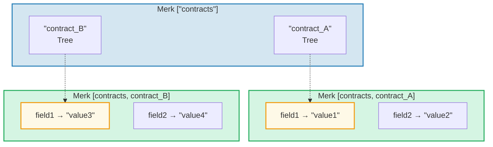
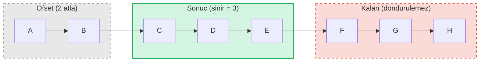

# Sorgu Sistemi

## PathQuery Yapisi

GroveDB sorgulari, bir yolu (nereye bakilacak) bir sorguyla (neyin secilebilecegi) birlestiren `PathQuery` tipini kullanir:

```rust
pub struct PathQuery {
    pub path: Vec<Vec<u8>>,         // Grove'daki baslangic yolu
    pub query: SizedQuery,          // Neyin secilecegi
}

pub struct SizedQuery {
    pub query: Query,               // Secim kriterleri
    pub limit: Option<u16>,         // Maksimum sonuc sayisi
    pub offset: Option<u16>,        // Ilk N sonucu atla
}
```

## Query Tipi

```rust
pub struct Query {
    pub items: Vec<QueryItem>,              // Neyle eslesecek
    pub default_subquery_branch: SubqueryBranch,
    pub conditional_subquery_branches: Option<IndexMap<QueryItem, SubqueryBranch>>,
    pub left_to_right: bool,                // Yineleme yonu
    pub add_parent_tree_on_subquery: bool,  // Ust agac elementini sonuclara dahil et (v2)
}
```

> **`add_parent_tree_on_subquery`** (v2): `true` oldugunda, ust agac elementi (ornegin bir CountTree veya SumTree) sorgu sonuclarina cocuklarinin degerleriyle birlikte dahil edilir. Bu, tek bir sorguda hem toplam degerleri hem de bireysel elemanlari almanizi saglar.

## QueryItem'lar -- Neyin Secilecegi

Her `QueryItem` eslesecek bir anahtar veya aralik belirtir:

```rust
pub enum QueryItem {
    Key(Vec<u8>),                           // Tam anahtar eslesmesi
    Range(Range<Vec<u8>>),                  // Disarida birakan aralik [baslangic..son)
    RangeInclusive(RangeInclusive<Vec<u8>>),// Dahil eden aralik [baslangic..=son]
    RangeFull(RangeFull),                   // Tum anahtarlar
    RangeFrom(RangeFrom<Vec<u8>>),          // [baslangic..)
    RangeTo(RangeTo<Vec<u8>>),              // [..son)
    RangeToInclusive(RangeToInclusive<Vec<u8>>), // [..=son]
    RangeAfter(RangeFrom<Vec<u8>>),         // (baslangic..) baslangic haric
    RangeAfterTo(Range<Vec<u8>>),           // (baslangic..son) her ikisi haric
    RangeAfterToInclusive(RangeInclusive<Vec<u8>>), // (baslangic..=son]
}
```

Ornek sorgular:

Merk agaci (sirali): `alice  bob  carol  dave  eve  frank`

| Sorgu | Secim | Sonuc |
|-------|-------|-------|
| `Key("bob")` | alice **[bob]** carol dave eve frank | bob |
| `RangeInclusive("bob"..="dave")` | alice **[bob carol dave]** eve frank | bob, carol, dave |
| `RangeAfter("carol"..)` | alice bob carol **[dave eve frank]** | dave, eve, frank |
| `RangeFull`, limit=2 | **[alice bob]** carol dave eve frank *(limit nedeniyle durdu)* | alice, bob |
| `RangeFull`, limit=2, sagdan sola | alice bob carol dave **[eve frank]** *(limit nedeniyle durdu)* | frank, eve |

## Alt Sorgular ve Kosullu Dallanmalar

GroveDB sorgularinin gercek gucu **alt sorgulardir** -- bir sorgu bir Tree elementiyle eslestuginde, sorgu otomatik olarak o alt agaca inebilir:



> **PathQuery:** `path: ["contracts"], query: RangeFull`, `default_subquery: Key("field1")` ile
>
> **Yurutme:**
> 1. ["contracts"] uzerinde `RangeFull` → contract_A, contract_B ile eslesir
> 2. Her ikisi de Tree elementi → `Key("field1")` alt sorgusuyla in
> 3. contract_A → "value1", contract_B → "value3"
>
> **Sonuc:** `["value1", "value3"]`

**Kosullu alt sorgular**, hangi anahtarin eslestigine gore farkli alt sorgular uygulamanizi saglar:

```rust
conditional_subquery_branches: Some(indexmap! {
    QueryItem::Key(b"contract_A".to_vec()) => SubqueryBranch {
        subquery: Some(Query { items: vec![Key(b"field1".to_vec())] }),
        ..
    },
    QueryItem::Key(b"contract_B".to_vec()) => SubqueryBranch {
        subquery: Some(Query { items: vec![Key(b"field2".to_vec())] }),
        ..
    },
})
```

Bu, `contract_A`'dan `field1`'i ama `contract_B`'den `field2`'yi alir.

## Boyutlu Sorgular -- Sinir ve Ofset

`SizedQuery` sarimlayicisi sayfalama (pagination) ekler:



> `SizedQuery { query: RangeFull, limit: Some(3), offset: Some(2) }` → Sonuc: **[C, D, E]**

`left_to_right: false` ile birlestirildiginde yineleme tersine doner:

```text
    SizedQuery {
        query: Query { items: [RangeFull], left_to_right: false, .. },
        limit: Some(3),
        offset: None
    }

    Sonuc: [H, G, F]
```

## Sorgu Birlestirme

Birden fazla PathQuery verimlilik icin tek bir sorguya birlestirilebilir. Birlestirme algoritmasi ortak yol oneklerini bulur ve sorgu ogelerini birlestirir:

```text
    Sorgu A: path=["users"], query=Key("alice")
    Sorgu B: path=["users"], query=Key("bob")

    Birlesik: path=["users"], query=items=[Key("alice"), Key("bob")]
```

---
