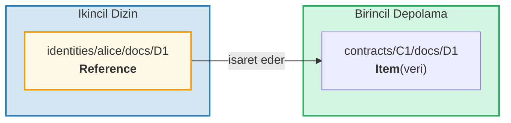
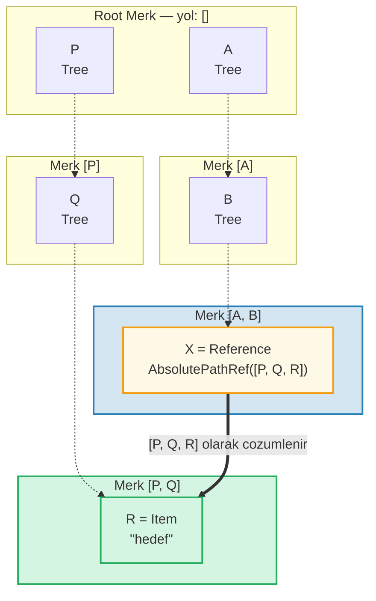
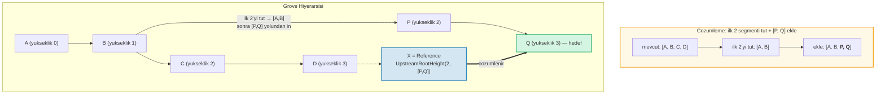
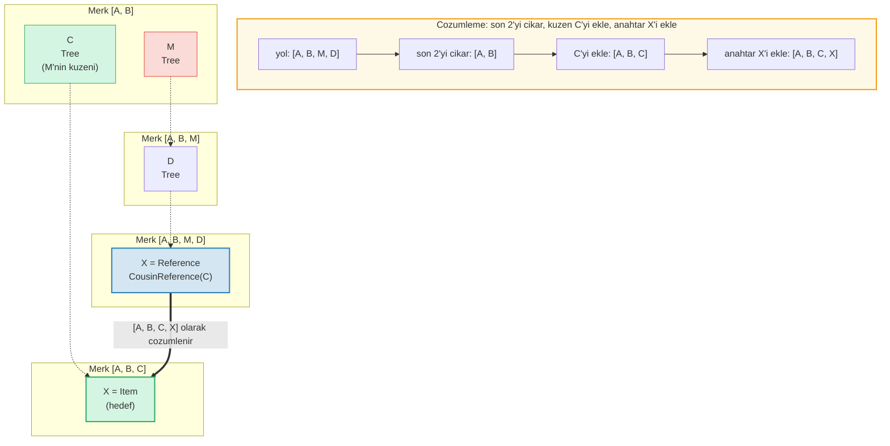
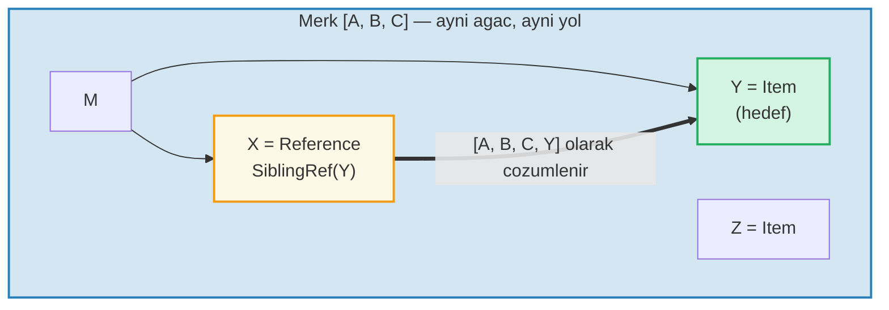
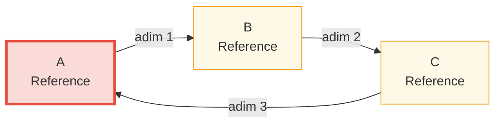

# Referans Sistemi

## Referanslar Neden Var

Hiyerarsik bir veritabaninda, genellikle ayni veriye birden fazla yoldan erisilebilmesi gerekir. Ornegin, belgeler sozlesmelerinin (contract) altinda depolanabilir ama ayni zamanda sahip kimligi (owner identity) ile sorgulanabilir olmalidir. **Referanslar** GroveDB'nin cevaplandirdir -- bir konumdan baskasina isaret eden gostericilerdir, bir dosya sistemindeki sembolik baglantilara (symbolic link) benzerler.



Temel ozellikler:
- Referanslar **kimlik dogrulanabilirdir** -- referansin value_hash'i hem referansin kendisini hem de referans verilen elementi icerir
- Referanslar **zincirlenebilir** -- bir referans baska bir referansa isaret edebilir
- Dongu (cycle) algilamasi sonsuz donguyu onler
- Yapilandirilabilir bir siçrama siniri (hop limit) kaynak tukenmesini onler

## Yedi Referans Tipi

```rust
// grovedb-element/src/reference_path/mod.rs
pub enum ReferencePathType {
    AbsolutePathReference(Vec<Vec<u8>>),
    UpstreamRootHeightReference(u8, Vec<Vec<u8>>),
    UpstreamRootHeightWithParentPathAdditionReference(u8, Vec<Vec<u8>>),
    UpstreamFromElementHeightReference(u8, Vec<Vec<u8>>),
    CousinReference(Vec<u8>),
    RemovedCousinReference(Vec<Vec<u8>>),
    SiblingReference(Vec<u8>),
}
```

Her birini diyagramlarla inceleyelim.

### AbsolutePathReference

En basit tip. Hedefe giden tam yolu depolar:



> X, tam mutlak yol `[P, Q, R]`'i depolar. X nerede bulunursa bulunsun, her zaman ayni hedefe cozumlenir.

### UpstreamRootHeightReference

Mevcut yolun ilk N segmentini tutar, sonra yeni bir yol ekler:



### UpstreamRootHeightWithParentPathAdditionReference

UpstreamRootHeight gibi, ancak mevcut yolun son segmentini yeniden ekler:

```text
    Yol [A, B, C, D, E] anahtari=X'teki referans
    UpstreamRootHeightWithParentPathAdditionReference(2, [P, Q])

    Mevcut yol:      [A, B, C, D, E]
    Ilk 2'yi tut:    [A, B]
    [P, Q] ekle:     [A, B, P, Q]
    Son'u yeniden ekle: [A, B, P, Q, E]   ← orijinal yoldan "E" geri eklenir

    Amac: ust anahtarin korunmasi gereken dizinler icin
```

### UpstreamFromElementHeightReference

Son N segmenti atar, sonra ekler:

```text
    Yol [A, B, C, D] anahtari=X'teki referans
    UpstreamFromElementHeightReference(1, [P, Q])

    Mevcut yol:       [A, B, C, D]
    Son 1'i at:       [A, B, C]
    [P, Q] ekle:      [A, B, C, P, Q]
```

### CousinReference

Yalnizca dogrudan ustu yeni bir anahtarla degistirir:



> "Kuzen", referansin buyuk ebeveyninin kardes alt agacidir. Referans iki seviye yukari cikar, sonra kuzen alt agacina iner.

### RemovedCousinReference

CousinReference gibi ama ustu cok segmentli bir yolla degistirir:

```text
    Yol [A, B, C, D] anahtari=X'teki referans
    RemovedCousinReference([M, N])

    Mevcut yol:    [A, B, C, D]
    Ust C'yi cikar: [A, B]
    [M, N] ekle:   [A, B, M, N]
    Anahtar X'i ekle: [A, B, M, N, X]
```

### SiblingReference

En basit goreli referans -- ayni ust icindeki anahtari degistirir:



> En basit referans tipi. X ve Y ayni Merk agacindaki kardeslerdir -- cozumleme ayni yolu koruyarak sadece anahtari degistirir.

## Referans Takibi ve Siçrama Siniri

GroveDB bir Reference elementiyle karsilastiginda, gercek degeri bulmak icin onu **takip etmelidir**. Referanslar baska referanslara isaret edebildiginden, bu bir dongu icerir:

```rust
// grovedb/src/reference_path.rs
pub const MAX_REFERENCE_HOPS: usize = 10;

pub fn follow_reference(...) -> CostResult<ResolvedReference, Error> {
    let mut hops_left = MAX_REFERENCE_HOPS;
    let mut visited = HashSet::new();

    while hops_left > 0 {
        // Referans yolunu mutlak yola cozumle
        let target_path = current_ref.absolute_qualified_path(...);

        // Dongu kontrolu
        if !visited.insert(target_path.clone()) {
            return Err(Error::CyclicReference);
        }

        // Hedefteki elementi getir
        let element = Element::get(target_path);

        match element {
            Element::Reference(next_ref, ..) => {
                // Hala bir referans -- takip etmeye devam et
                current_ref = next_ref;
                hops_left -= 1;
            }
            other => {
                // Gercek elementi bulduk!
                return Ok(ResolvedReference { element: other, ... });
            }
        }
    }

    Err(Error::ReferenceLimit)  // 10 siçramayi asti
}
```

## Dongu Algilamasi

`visited` HashSet gorulen tum yollari izler. Daha once gordugumuz bir yolla karsilasirsa, bir dongumuz vardir:



> **Dongu algilama izlemesi:**
>
> | Adim | Takip | visited kumesi | Sonuc |
> |------|-------|----------------|-------|
> | 1 | A'dan basla | { A } | A bir Ref → takip et |
> | 2 | A → B | { A, B } | B bir Ref → takip et |
> | 3 | B → C | { A, B, C } | C bir Ref → takip et |
> | 4 | C → A | A zaten visited'da! | **Error::CyclicRef** |
>
> Dongu algilamasi olmadan bu sonsuza kadar dongu yapar. `MAX_REFERENCE_HOPS = 10` da uzun zincirler icin gezinti derinligini sinirlar.

## Merk'te Referanslar -- Birlesik Deger Hash'leri

Bir Reference Merk agacinda depolandiginda, `value_hash`'i hem referans yapisini hem de referans verilen veriyi dogrulamalidir:

```rust
// merk/src/tree/kv.rs
pub fn update_hashes_using_reference_value_hash(
    mut self,
    reference_value_hash: CryptoHash,
) -> CostContext<Self> {
    // Referans elementinin kendi baytlarini hashle
    let actual_value_hash = value_hash(self.value_as_slice());

    // Birlestur: H(referans_baytlari) ⊕ H(referans_verilen_veri)
    let combined = combine_hash(&actual_value_hash, &reference_value_hash);

    self.value_hash = combined;
    self.hash = kv_digest_to_kv_hash(self.key(), self.value_hash());
    // ...
}
```

Bu, referansin kendisini VEYA isaret ettigi veriyi degistirmenin kok hash'i degistirecegi anlamina gelir -- her ikisi de kriptografik olarak baglidir.

---
