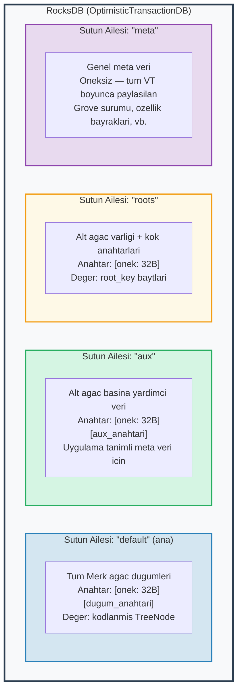
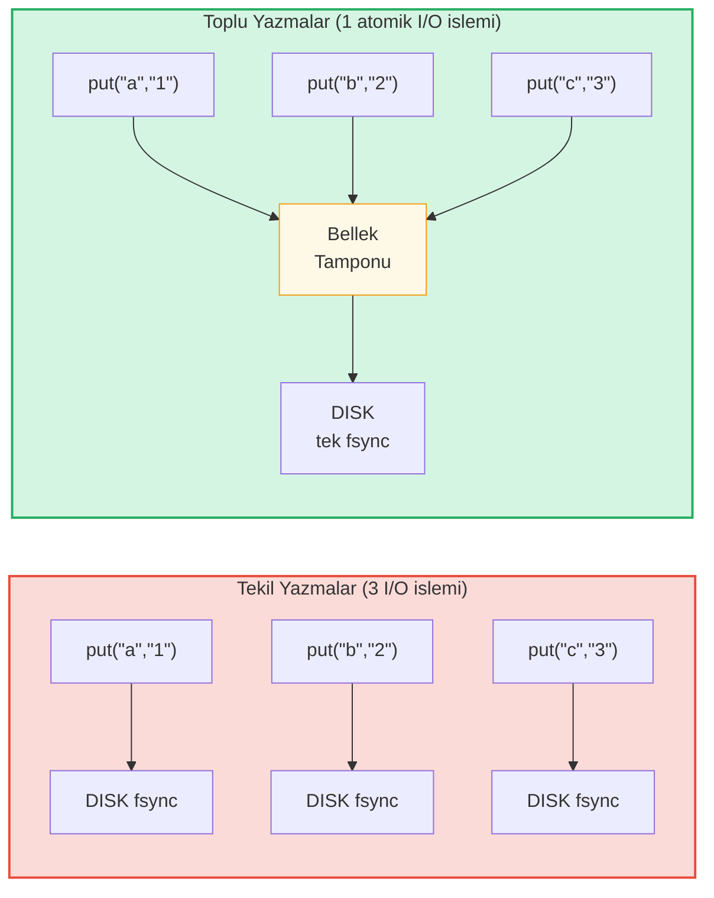

# Depolama Katmani

## OptimisticTransactionDB ile RocksDB

GroveDB, depolama arka plani olarak **RocksDB** kullanir; ozellikle islemleri (transaction) destekleyen `OptimisticTransactionDB` varyantini:

```rust
// storage/src/rocksdb_storage/storage.rs
pub(crate) type Db = OptimisticTransactionDB;
pub(crate) type Tx<'db> = Transaction<'db, Db>;

pub struct RocksDbStorage {
    db: OptimisticTransactionDB,
}
```

**Iyimser islemler** (optimistic transactions), cakisma olmayacagini varsayarak calisir. Iki islem ayni veriyi degistirirse, commit yapan ikincisi basarisiz olur ve yeniden denenebilir. Bu, cakismalarin nadir oldugu is yukleri icin karamsarci kilitlemeden (pessimistic locking) daha verimlidir.

RocksDB secenekleri GroveDB'nin is yuku icin ayarlanmistir:

```rust
lazy_static! {
    static ref DEFAULT_OPTS: rocksdb::Options = {
        let mut opts = rocksdb::Options::default();
        opts.create_if_missing(true);
        opts.increase_parallelism(num_cpus::get() as i32);
        opts.set_allow_mmap_writes(true);
        opts.set_allow_mmap_reads(true);
        opts.create_missing_column_families(true);
        opts.set_atomic_flush(true);
        opts
    };
}
```

## Dort Sutun Ailesi

RocksDB sutun aileleri, tek bir veritabani icinde ayri anahtar-deger ad alanlari gibi calisir. GroveDB dort tane kullanir:



> **Ornek:** "default" SA'daki `[ab3fc2...][6e616d65]` anahtari `TreeNode{key:"name", val:"Al"}`'a eslenir; burada `ab3fc2...`, `Blake3(yol)` ve `6e616d65`, bayt olarak `"name"`'dir.

```rust
pub(crate) const AUX_CF_NAME: &str = "aux";
pub(crate) const ROOTS_CF_NAME: &str = "roots";
pub(crate) const META_CF_NAME: &str = "meta";
// Ana veri varsayilan sutun ailesini kullanir
```

## Onekli Depolama Baglamlari

Her alt agac kendi **onekli depolama baglamini** alir -- tum anahtarlara otomatik olarak 32 baytlik Blake3 onekini ekleyen bir sarimlayici:

```text
    Alt agac yolu: ["identities", "alice"]
    Onek: Blake3(yol) = [0xab, 0x3f, 0xc2, ...]  (32 bayt)

    Alt agac "name" anahtarini "Alice" degeriyle depolarken:

    RocksDB anahtari: [0xab 0x3f 0xc2 ... (32 bayt) | 0x6e 0x61 0x6d 0x65]
                       \_________onek________/        \_____"name"_____/

    RocksDB degeri:   [kodlanmis TreeNode, degeri "Alice"]
```

Baglam tipleri:

```text
    Islem olmadan:
    PrefixedRocksDbImmediateStorageContext
    └── Onekle dogrudan VT'ye okur/yazar

    Islemle:
    PrefixedRocksDbTransactionContext
    └── Onekle bir Transaction uzerinden okur/yazar
```

Her ikisi de `StorageContext` trait'ini uygular:

```rust
pub trait StorageContext<'db> {
    fn get(&self, key: &[u8]) -> CostResult<Option<Vec<u8>>, Error>;
    fn get_aux(&self, key: &[u8]) -> CostResult<Option<Vec<u8>>, Error>;
    fn get_root(&self, key: &[u8]) -> CostResult<Option<Vec<u8>>, Error>;
    fn get_meta(&self, key: &[u8]) -> CostResult<Option<Vec<u8>>, Error>;
    fn put(&self, key: &[u8], value: &[u8], ...) -> CostResult<(), Error>;
    fn put_aux(&self, key: &[u8], value: &[u8], ...) -> CostResult<(), Error>;
    fn put_root(&self, key: &[u8], value: &[u8], ...) -> CostResult<(), Error>;
    fn put_meta(&self, key: &[u8], value: &[u8], ...) -> CostResult<(), Error>;
    fn delete(&self, key: &[u8], ...) -> CostResult<(), Error>;
    // ...
}
```

## Yazma Toplulari ve Islem Modeli

Performans icin GroveDB yazmalari topluluklara biriktirir:



> 3 disk senkronizasyonu karsi 1 disk senkronizasyonu = ~3 kat daha hizli. Toplu yazmalar ayni zamanda **atomiktir** (ya hepsi ya hicbiri).

`StorageBatch`, birlikte bosaltilan (flush) islemleri biriktirir:

```rust
pub struct StorageBatch {
    operations: RefCell<Vec<AbstractBatchOperation>>,
}
```

## Kritik commit_local() Deseni

Islem (transaction) kullanirken uyulmasi gereken kritik bir desen vardir. Bir islem icindeki yazmalar tamponlenir -- commit edilene kadar gorunur degillerdir:

```rust
// DOGRU desen:
{
    let tx = db.start_transaction();
    let storage_ctx = db.get_transactional_storage_context(path, &tx);

    storage_ctx.put(key, value);  // Islem tamponuna yazar

    drop(storage_ctx);            // tx uzerindeki borg'u serbest birak
    tx.commit_local();            // Islemi VT'ye bosalt
}

// YANLIS — veri kaybolur:
{
    let tx = db.start_transaction();
    let storage_ctx = db.get_transactional_storage_context(path, &tx);

    storage_ctx.put(key, value);  // Islem tamponuna yazar

    // tx burada commit_local() olmadan drop ediliyor!
    // Tum yazmalar GERI ALINIR!
}
```

Bu ozellikle onemlidir cunku `storage_ctx` islemi borclenir (borrow). `tx.commit_local()` cagirmadan once `drop(storage_ctx)` yapmaniz gerekir.

---
