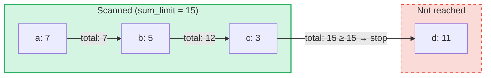

# Truy vấn Tổng hợp Sum (Aggregate Sum Queries)

## Tổng quan

Truy vấn Tổng hợp Sum là một loại truy vấn chuyên biệt được thiết kế cho **SumTrees** trong GroveDB.
Trong khi các truy vấn thông thường truy xuất các phần tử theo khóa hoặc phạm vi, truy vấn tổng hợp sum
duyệt qua các phần tử và tích lũy các giá trị sum cho đến khi đạt đến **giới hạn sum**.

Điều này hữu ích cho các câu hỏi như:
- "Cho tôi các giao dịch cho đến khi tổng lũy kế vượt quá 1000"
- "Những mục nào đóng góp vào 500 đơn vị giá trị đầu tiên trong cây này?"
- "Thu thập các mục sum trong ngân sách N"

## Các khái niệm cốt lõi

### Sự khác biệt so với truy vấn thông thường

| Tính năng | PathQuery | AggregateSumPathQuery |
|-----------|-----------|----------------------|
| **Mục tiêu** | Bất kỳ loại phần tử nào | Các phần tử SumItem / ItemWithSumItem |
| **Điều kiện dừng** | Giới hạn (số lượng) hoặc cuối phạm vi | Giới hạn sum (tổng lũy kế) **và/hoặc** giới hạn mục |
| **Trả về** | Các phần tử hoặc khóa | Các cặp khóa-giá trị sum |
| **Truy vấn con** | Có (đi sâu vào cây con) | Không (một cấp cây duy nhất) |
| **Tham chiếu** | Được giải quyết bởi tầng GroveDB | Tùy chọn theo dõi hoặc bỏ qua |

### Cấu trúc AggregateSumQuery

```rust
pub struct AggregateSumQuery {
    pub items: Vec<QueryItem>,              // Keys or ranges to scan
    pub left_to_right: bool,                // Iteration direction
    pub sum_limit: u64,                     // Stop when running total reaches this
    pub limit_of_items_to_check: Option<u16>, // Max number of matching items to return
}
```

Truy vấn được bọc trong một `AggregateSumPathQuery` để chỉ định vị trí cần tìm trong grove:

```rust
pub struct AggregateSumPathQuery {
    pub path: Vec<Vec<u8>>,                 // Path to the SumTree
    pub aggregate_sum_query: AggregateSumQuery,
}
```

### Giới hạn Sum — Tổng lũy kế

`sum_limit` là khái niệm trung tâm. Khi các phần tử được quét, các giá trị sum của chúng được
tích lũy. Khi tổng lũy kế đạt đến hoặc vượt quá giới hạn sum, việc duyệt sẽ dừng lại:



> **Kết quả:** `[(a, 7), (b, 5), (c, 3)]` — việc duyệt dừng lại vì 7 + 5 + 3 = 15 >= sum_limit

Các giá trị sum âm được hỗ trợ. Một giá trị âm sẽ tăng ngân sách còn lại:

```text
sum_limit = 12, elements: a(10), b(-3), c(5)

a: total = 10, remaining = 2
b: total =  7, remaining = 5  ← negative value gave us more room
c: total = 12, remaining = 0  ← stop

Result: [(a, 10), (b, -3), (c, 5)]
```

## Các tùy chọn truy vấn

Cấu trúc `AggregateSumQueryOptions` điều khiển hành vi truy vấn:

```rust
pub struct AggregateSumQueryOptions {
    pub allow_cache: bool,                              // Use cached reads (default: true)
    pub error_if_intermediate_path_tree_not_present: bool, // Error on missing path (default: true)
    pub error_if_non_sum_item_found: bool,              // Error on non-sum elements (default: true)
    pub ignore_references: bool,                        // Skip references (default: false)
}
```

### Xử lý các phần tử không phải Sum

SumTrees có thể chứa nhiều loại phần tử: `SumItem`, `Item`, `Reference`, `ItemWithSumItem`,
và các loại khác. Mặc định, khi gặp một phần tử không phải sum và không phải tham chiếu sẽ tạo ra lỗi.

Khi `error_if_non_sum_item_found` được đặt thành `false`, các phần tử không phải sum sẽ **được bỏ qua
trong im lặng** mà không tiêu hao một vị trí giới hạn của người dùng:

```text
Tree contents: a(SumItem=7), b(Item), c(SumItem=3)
Query: sum_limit=100, limit_of_items_to_check=2, error_if_non_sum_item_found=false

Scan: a(7) → returned, limit=1
      b(Item) → skipped, limit still 1
      c(3) → returned, limit=0 → stop

Result: [(a, 7), (c, 3)]
```

Lưu ý: Các phần tử `ItemWithSumItem` **luôn luôn** được xử lý (không bao giờ bị bỏ qua), vì chúng
mang giá trị sum.

### Xử lý tham chiếu

Mặc định, các phần tử `Reference` được **theo dõi** — truy vấn giải quyết chuỗi tham chiếu
(tối đa 3 bước trung gian) để tìm giá trị sum của phần tử đích:

```text
Tree contents: a(SumItem=7), ref_b(Reference → a)
Query: sum_limit=100

ref_b is followed → resolves to a(SumItem=7)

Result: [(a, 7), (ref_b, 7)]
```

Khi `ignore_references` là `true`, các tham chiếu được bỏ qua trong im lặng mà không tiêu hao
vị trí giới hạn, tương tự cách các phần tử không phải sum bị bỏ qua.

Chuỗi tham chiếu sâu hơn 3 bước trung gian sẽ tạo ra lỗi `ReferenceLimit`.

## Kiểu kết quả

Các truy vấn trả về một `AggregateSumQueryResult`:

```rust
pub struct AggregateSumQueryResult {
    pub results: Vec<(Vec<u8>, i64)>,       // Key-sum value pairs
    pub hard_limit_reached: bool,           // True if system limit truncated results
}
```

Cờ `hard_limit_reached` cho biết liệu giới hạn quét cứng của hệ thống (mặc định: 1024
phần tử) có bị đạt đến trước khi truy vấn hoàn thành tự nhiên hay không. Khi là `true`, có thể
tồn tại nhiều kết quả hơn ngoài những gì đã được trả về.

## Ba hệ thống giới hạn

Các truy vấn tổng hợp sum có **ba** điều kiện dừng:

| Giới hạn | Nguồn | Đếm gì | Hiệu ứng khi đạt đến |
|----------|-------|---------|----------------------|
| **sum_limit** | Người dùng (truy vấn) | Tổng lũy kế của các giá trị sum | Dừng duyệt |
| **limit_of_items_to_check** | Người dùng (truy vấn) | Các mục khớp được trả về | Dừng duyệt |
| **Giới hạn quét cứng** | Hệ thống (GroveVersion, mặc định 1024) | Tất cả phần tử được quét (bao gồm cả bị bỏ qua) | Dừng duyệt, đặt `hard_limit_reached` |

Giới hạn quét cứng ngăn chặn việc duyệt không giới hạn khi không có giới hạn người dùng nào được đặt.
Các phần tử bị bỏ qua (các mục không phải sum với `error_if_non_sum_item_found=false`, hoặc tham chiếu với
`ignore_references=true`) được tính vào giới hạn quét cứng nhưng **không** tính vào
`limit_of_items_to_check` của người dùng.

## Sử dụng API

### Truy vấn đơn giản

```rust
use grovedb::AggregateSumPathQuery;
use grovedb_merk::proofs::query::AggregateSumQuery;

// "Give me items from this SumTree until the total reaches 1000"
let query = AggregateSumQuery::new(1000, None);
let path_query = AggregateSumPathQuery {
    path: vec![b"my_tree".to_vec()],
    aggregate_sum_query: query,
};

let result = db.query_aggregate_sums(
    &path_query,
    true,   // allow_cache
    true,   // error_if_intermediate_path_tree_not_present
    None,   // transaction
    grove_version,
).unwrap().expect("query failed");

for (key, sum_value) in &result.results {
    println!("{}: {}", String::from_utf8_lossy(key), sum_value);
}
```

### Truy vấn với tùy chọn

```rust
use grovedb::{AggregateSumPathQuery, AggregateSumQueryOptions};
use grovedb_merk::proofs::query::AggregateSumQuery;

// Skip non-sum items and ignore references
let query = AggregateSumQuery::new(1000, Some(50));
let path_query = AggregateSumPathQuery {
    path: vec![b"mixed_tree".to_vec()],
    aggregate_sum_query: query,
};

let result = db.query_aggregate_sums_with_options(
    &path_query,
    AggregateSumQueryOptions {
        error_if_non_sum_item_found: false,  // skip Items, Trees, etc.
        ignore_references: true,              // skip References
        ..AggregateSumQueryOptions::default()
    },
    None,
    grove_version,
).unwrap().expect("query failed");

if result.hard_limit_reached {
    println!("Warning: results may be incomplete (hard limit reached)");
}
```

### Truy vấn theo khóa

Thay vì quét một phạm vi, bạn có thể truy vấn các khóa cụ thể:

```rust
// Check the sum value of specific keys
let query = AggregateSumQuery::new_with_keys(
    vec![b"alice".to_vec(), b"bob".to_vec(), b"carol".to_vec()],
    u64::MAX,  // no sum limit
    None,      // no item limit
);
```

### Truy vấn giảm dần

Duyệt từ khóa cao nhất đến thấp nhất:

```rust
let query = AggregateSumQuery::new_descending(500, Some(10));
// Or: query.left_to_right = false;
```

## Tham chiếu hàm tạo (Constructor Reference)

| Hàm tạo | Mô tả |
|----------|-------|
| `new(sum_limit, limit)` | Toàn bộ phạm vi, tăng dần |
| `new_descending(sum_limit, limit)` | Toàn bộ phạm vi, giảm dần |
| `new_single_key(key, sum_limit)` | Tra cứu một khóa duy nhất |
| `new_with_keys(keys, sum_limit, limit)` | Nhiều khóa cụ thể |
| `new_with_keys_reversed(keys, sum_limit, limit)` | Nhiều khóa, giảm dần |
| `new_single_query_item(item, sum_limit, limit)` | Một QueryItem duy nhất (khóa hoặc phạm vi) |
| `new_with_query_items(items, sum_limit, limit)` | Nhiều QueryItems |

---
