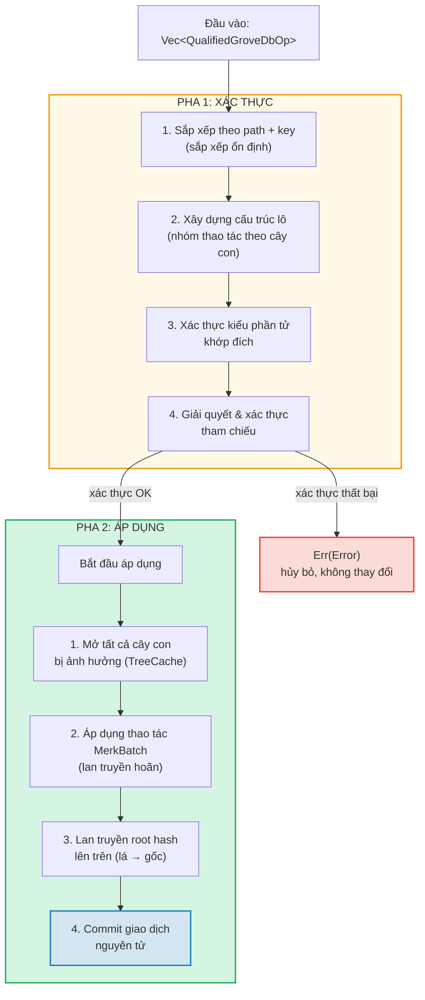
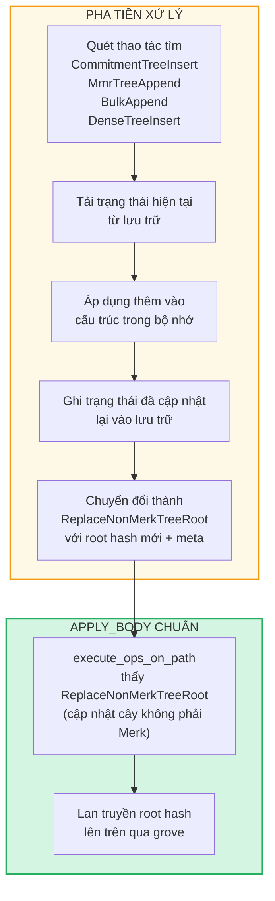

# Thao tác theo lô ở cấp Grove

## Các biến thể GroveOp

Ở cấp GroveDB, các thao tác được biểu diễn dưới dạng `GroveOp`:

```rust
pub enum GroveOp {
    // Thao tác dành cho người dùng:
    InsertOnly { element: Element },
    InsertOrReplace { element: Element },
    Replace { element: Element },
    Patch { element: Element, change_in_bytes: i32 },
    RefreshReference { reference_path_type, max_reference_hop, flags, trust_refresh_reference },
    Delete,
    DeleteTree(TreeType),                          // Tham số hóa theo kiểu cây

    // Thao tác thêm cho cây không phải Merk (dành cho người dùng):
    CommitmentTreeInsert { cmx: [u8; 32], payload: Vec<u8> },
    MmrTreeAppend { value: Vec<u8> },
    BulkAppend { value: Vec<u8> },
    DenseTreeInsert { value: Vec<u8> },

    // Thao tác nội bộ (tạo bởi tiền xử lý/lan truyền, bị từ chối bởi from_ops):
    ReplaceTreeRootKey { hash, root_key, aggregate_data },
    InsertTreeWithRootHash { hash, root_key, flags, aggregate_data },
    ReplaceNonMerkTreeRoot { hash: [u8; 32], meta: NonMerkTreeMeta },
    InsertNonMerkTree { hash, root_key, flags, aggregate_data, meta: NonMerkTreeMeta },
}
```

**NonMerkTreeMeta** mang trạng thái riêng theo kiểu cây qua quá trình xử lý lô:

```rust
pub enum NonMerkTreeMeta {
    CommitmentTree { total_count: u64, chunk_power: u8 },
    MmrTree { mmr_size: u64 },
    BulkAppendTree { total_count: u64, chunk_power: u8 },
    DenseTree { count: u16, height: u8 },
}
```

Mỗi thao tác được bọc trong `QualifiedGroveDbOp` bao gồm đường dẫn:

```rust
pub struct QualifiedGroveDbOp {
    pub path: KeyInfoPath,           // Vị trí trong grove
    pub key: Option<KeyInfo>,        // Khóa nào (None cho thao tác cây chỉ thêm)
    pub op: GroveOp,                 // Làm gì
}
```

> **Lưu ý:** Trường `key` là `Option<KeyInfo>` — nó là `None` cho các thao tác cây chỉ thêm (`CommitmentTreeInsert`, `MmrTreeAppend`, `BulkAppend`, `DenseTreeInsert`) nơi khóa cây là đoạn cuối của `path` thay vào đó.

## Xử lý hai pha

Thao tác theo lô được xử lý trong hai pha:



## TreeCache và lan truyền hoãn

Trong quá trình áp dụng lô, GroveDB sử dụng **TreeCache** để hoãn lan truyền root hash cho đến khi tất cả thao tác trong cây con hoàn thành:

```mermaid
graph TD
    subgraph without["KHÔNG CÓ TreeCache (ngây thơ)"]
        w1["Op 1: Chèn A vào X"]
        w1p["Lan truyền X → cha → gốc"]
        w2["Op 2: Chèn B vào X"]
        w2p["Lan truyền X → cha → gốc"]
        w3["Op 3: Chèn C vào X"]
        w3p["Lan truyền X → cha → gốc"]
        w1 --> w1p --> w2 --> w2p --> w3 --> w3p
    end

    subgraph with_tc["CÓ TreeCache (hoãn)"]
        t1["Op 1: Chèn A vào X<br/>→ đệm"]
        t2["Op 2: Chèn B vào X<br/>→ đệm"]
        t3["Op 3: Chèn C vào X<br/>→ đệm"]
        tp["Lan truyền X → cha → gốc<br/>(đi lên MỘT LẦN)"]
        t1 --> t2 --> t3 --> tp
    end

    style without fill:#fadbd8,stroke:#e74c3c,stroke-width:2px
    style with_tc fill:#d5f5e3,stroke:#27ae60,stroke-width:2px
    style w1p fill:#fadbd8,stroke:#e74c3c
    style w2p fill:#fadbd8,stroke:#e74c3c
    style w3p fill:#fadbd8,stroke:#e74c3c
    style tp fill:#d5f5e3,stroke:#27ae60,stroke-width:2px
```



> **3 lần lan truyền × O(depth)** so với **1 lần lan truyền × O(depth)** = nhanh gấp 3 cho cây con này.

Đây là tối ưu hóa đáng kể khi nhiều thao tác nhắm cùng cây con.

## Thao tác nguyên tử xuyên cây con

Thuộc tính chính của lô GroveDB là **tính nguyên tử xuyên cây con**. Một lô duy nhất có thể sửa đổi phần tử trong nhiều cây con, và hoặc tất cả thay đổi được commit hoặc không gì được commit:

```text
    Lô:
    1. Xóa ["balances", "alice"]       (xóa số dư)
    2. Chèn ["balances", "bob"] = 100   (thêm số dư)
    3. Cập nhật ["identities", "bob", "rev"] = 2  (cập nhật phiên bản)

    Ba cây con bị ảnh hưởng: balances, identities, identities/bob

    Nếu BẤT KỲ thao tác nào thất bại → TẤT CẢ thao tác được cuộn lại
    Nếu TẤT CẢ thành công → TẤT CẢ được commit nguyên tử
```

Bộ xử lý lô xử lý bằng cách:
1. Thu thập tất cả đường dẫn bị ảnh hưởng
2. Mở tất cả cây con cần thiết
3. Áp dụng tất cả thao tác
4. Lan truyền tất cả root hash theo thứ tự phụ thuộc
5. Commit toàn bộ giao dịch

## Tiền xử lý lô cho cây không phải Merk

Các thao tác CommitmentTree, MmrTree, BulkAppendTree, và DenseAppendOnlyFixedSizeTree yêu cầu truy cập ngữ cảnh lưu trữ ngoài Merk, điều không có sẵn bên trong phương thức `execute_ops_on_path` chuẩn (nó chỉ có quyền truy cập Merk). Các thao tác này sử dụng **mẫu tiền xử lý**: trước pha `apply_body` chính, các điểm đầu vào quét thao tác cây không phải Merk và chuyển đổi chúng thành thao tác nội bộ chuẩn.

```rust
pub enum GroveOp {
    // ... thao tác chuẩn ...

    // Thao tác cây không phải Merk (dành cho người dùng):
    CommitmentTreeInsert { cmx: [u8; 32], payload: Vec<u8> },
    MmrTreeAppend { value: Vec<u8> },
    BulkAppend { value: Vec<u8> },
    DenseTreeInsert { value: Vec<u8> },

    // Thao tác nội bộ (tạo bởi tiền xử lý):
    ReplaceNonMerkTreeRoot { hash: [u8; 32], meta: NonMerkTreeMeta },
}
```



**Tại sao cần tiền xử lý?** Hàm `execute_ops_on_path` hoạt động trên một cây Merk con duy nhất và không có quyền truy cập `self.db` hoặc ngữ cảnh lưu trữ rộng hơn. Tiền xử lý tại các điểm đầu vào (`apply_batch_with_element_flags_update`, `apply_partial_batch_with_element_flags_update`) có toàn quyền truy cập cơ sở dữ liệu, nên có thể tải/lưu dữ liệu và sau đó chuyển giao `ReplaceNonMerkTreeRoot` đơn giản cho máy xử lý lô chuẩn.

Mỗi phương thức tiền xử lý tuân theo cùng mẫu:
1. **`preprocess_commitment_tree_ops`** — Tải frontier và BulkAppendTree từ lưu trữ dữ liệu, thêm vào cả hai, lưu lại, chuyển thành `ReplaceNonMerkTreeRoot` với root kết hợp đã cập nhật và meta `CommitmentTree { total_count, chunk_power }`
2. **`preprocess_mmr_tree_ops`** — Tải MMR từ lưu trữ dữ liệu, thêm giá trị, lưu lại, chuyển thành `ReplaceNonMerkTreeRoot` với MMR root đã cập nhật và meta `MmrTree { mmr_size }`
3. **`preprocess_bulk_append_ops`** — Tải BulkAppendTree từ lưu trữ dữ liệu, thêm giá trị (có thể kích hoạt nén chunk), lưu lại, chuyển thành `ReplaceNonMerkTreeRoot` với state root đã cập nhật và meta `BulkAppendTree { total_count, chunk_power }`
4. **`preprocess_dense_tree_ops`** — Tải DenseFixedSizedMerkleTree từ lưu trữ dữ liệu, chèn giá trị tuần tự, tính lại root hash, lưu lại, chuyển thành `ReplaceNonMerkTreeRoot` với root hash đã cập nhật và meta `DenseTree { count, height }`

Thao tác `ReplaceNonMerkTreeRoot` mang root hash mới và enum `NonMerkTreeMeta` để phần tử có thể được tái tạo đầy đủ sau xử lý.

---
