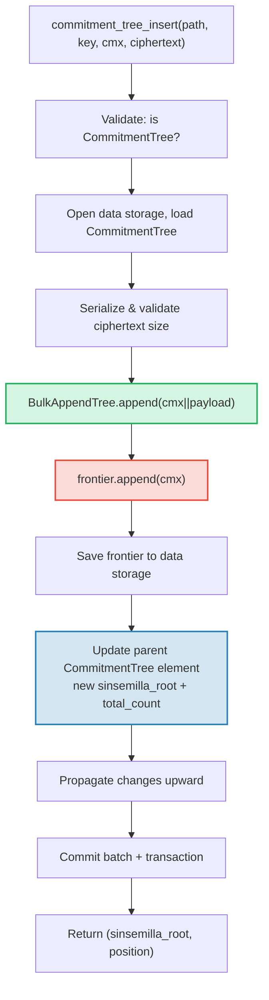

# CommitmentTree -- Anchor cam kết Sinsemilla

**CommitmentTree** là cầu nối của GroveDB giữa lưu trữ xác thực và hệ thống chứng minh không kiến thức (zero-knowledge proof). Nó kết hợp **BulkAppendTree** (Chương 14) cho lưu trữ dữ liệu nén chunk hiệu quả với **frontier Sinsemilla** trong không gian tên data cho anchor tương thích ZK. Giống MmrTree và BulkAppendTree, nó **không có Merk con** -- root hash kết hợp chảy như Merk child hash. Cả mục BulkAppendTree và frontier Sinsemilla đều nằm trong **không gian tên data**.

Chương này đề cập hàm hash Sinsemilla và tại sao nó quan trọng cho mạch zero-knowledge, cấu trúc dữ liệu frontier và tuần tự hóa nhỏ gọn của nó, kiến trúc lưu trữ hai không gian tên, các thao tác GroveDB, tiền xử lý lô, tạo nhân chứng (witness) phía client, và cách chứng minh hoạt động.

## Tại sao cần cây thân thiện ZK?

Cây tiêu chuẩn của GroveDB sử dụng hash Blake3. Blake3 nhanh trong phần mềm, nhưng **tốn kém bên trong mạch zero-knowledge**. Khi người chi tiêu cần chứng minh "Tôi biết một note tại vị trí P trong cây cam kết" mà không tiết lộ P, họ phải đánh giá hàm hash Merkle 32 lần (một lần cho mỗi cấp cây) bên trong mạch ZK.

Sinsemilla (được chỉ định trong ZIP-244 cho giao thức Orchard của Zcash) được thiết kế cho chính xác trường hợp sử dụng này -- nó cung cấp **hash hiệu quả bên trong mạch** trên đường cong elliptic Pallas, một nửa của chu trình đường cong Pasta được sử dụng bởi hệ thống chứng minh Halo 2.

| Thuộc tính | Blake3 | Sinsemilla |
|----------|--------|------------|
| **Chi phí mạch** | ~25.000 ràng buộc mỗi hash | ~800 ràng buộc mỗi hash |
| **Tốc độ phần mềm** | Rất nhanh (~2 GB/s) | Chậm (~10.000 hash/s) |
| **Cấu trúc đại số** | Không có (bitwise) | Thao tác điểm đường cong Pallas |
| **Mục đích chính** | Hash chung, cây Merkle | Chứng minh Merkle trong mạch |
| **Sử dụng bởi** | Cây Merk GroveDB, MMR, Bulk | Giao thức che chắn Orchard |
| **Kích thước đầu ra** | 32 byte | 32 byte (phần tử trường Pallas) |

CommitmentTree sử dụng Sinsemilla cho cây Merkle mà mạch ZK suy luận, trong khi vẫn sử dụng Blake3 cho phân cấp Merk của GroveDB phía trên. Các mục được chèn vào cây được lưu qua BulkAppendTree trong không gian tên data (nén chunk, truy xuất được theo vị trí) và đồng thời được thêm vào frontier Sinsemilla (tạo anchor có thể chứng minh ZK).

## Kiến trúc không gian tên data

CommitmentTree lưu **tất cả dữ liệu trong không gian tên data** tại cùng đường dẫn cây con. Giống MmrTree và BulkAppendTree, nó **không có Merk con** (không có trường `root_key` -- root đặc trưng theo kiểu chảy như Merk child hash). Mục BulkAppendTree và frontier Sinsemilla cùng tồn tại trong không gian tên data sử dụng tiền tố khóa riêng biệt:

```text
┌──────────────────────────────────────────────────────────────┐
│                       CommitmentTree                          │
│                                                               │
│  ┌─────────────────────────────────────────────────────────┐  │
│  │  Data Namespace                                         │  │
│  │                                                         │  │
│  │  BulkAppendTree storage (Chapter 14):                   │  │
│  │    Buffer entries → chunk blobs → chunk MMR             │  │
│  │    value = cmx (32 bytes) || ciphertext (216 bytes)     │  │
│  │                                                         │  │
│  │  Sinsemilla Frontier (~1KB):                            │  │
│  │    key: b"__ct_data__" (COMMITMENT_TREE_DATA_KEY)       │  │
│  │    Depth-32 incremental Merkle tree                     │  │
│  │    Stores only the rightmost path (leaf + ommers)       │  │
│  │    O(1) append, O(1) root computation                   │  │
│  │    Produces Orchard-compatible Anchor for ZK proofs     │  │
│  └─────────────────────────────────────────────────────────┘  │
│                                                               │
│  sinsemilla_root embedded in Element bytes                    │
│    → flows through Merk value_hash → GroveDB state root      │
└──────────────────────────────────────────────────────────────┘
```

**Tại sao hai cấu trúc?** BulkAppendTree cung cấp lưu trữ và truy xuất hiệu quả, nén chunk cho hàng triệu note được mã hóa tiềm năng. Frontier Sinsemilla cung cấp anchor tương thích ZK có thể chứng minh bên trong mạch Halo 2. Cả hai được cập nhật đồng bộ mỗi lần thêm.

So sánh với các kiểu cây không chuẩn khác:

| | CommitmentTree | MmrTree | BulkAppendTree |
|---|---|---|---|
| **Merk con** | Không | Không | Không |
| **Không gian tên data** | Mục BulkAppendTree + frontier | Nút MMR | Buffer + chunk + MMR |
| **Không gian tên aux** | -- | -- | -- |
| **Truy vấn mục** | Qua chứng minh V1 | Qua chứng minh V1 | Qua chứng minh V1 |
| **Hàm hash** | Sinsemilla + Blake3 | Blake3 | Blake3 |

## Frontier Sinsemilla

Frontier là cây Merkle gia tăng (incremental) độ sâu 32, được triển khai bởi kiểu `Frontier<MerkleHashOrchard, 32>` của crate `incrementalmerkletree`. Thay vì lưu tất cả 2^32 lá có thể, nó chỉ lưu thông tin cần thiết để **thêm lá tiếp theo và tính root hiện tại**: lá bên phải nhất và các ommer (hash anh em cần cho tính root).

```text
                         root (level 32)
                        /               \
                      ...               ...
                     /                     \
                  (level 2)             (level 2)
                  /     \               /     \
              (level 1) (level 1)   (level 1)  ?
              /    \    /    \      /    \
             L0    L1  L2    L3   L4    ?     ← frontier lưu L4
                                              + ommer tại các cấp
                                              nơi anh em trái tồn tại
```

Frontier lưu:
- **leaf**: giá trị được thêm gần nhất (phần tử trường Pallas)
- **ommers**: hash anh em trái tại mỗi cấp nơi đường dẫn frontier đi phải (tối đa 32 ommer cho cây độ sâu 32)
- **position**: vị trí lá chỉ mục từ 0

Thuộc tính chính:
- **O(1) thêm**: chèn lá mới, cập nhật ommer, tính lại root
- **O(1) root**: duyệt ommer đã lưu từ lá đến root
- **Kích thước hằng ~1KB**: bất kể đã thêm bao nhiêu lá
- **Xác định**: hai frontier có cùng chuỗi thêm tạo cùng root

Hằng số `EMPTY_SINSEMILLA_ROOT` là root của cây độ sâu 32 rỗng, tính trước bằng `MerkleHashOrchard::empty_root(Level::from(32)).to_bytes()`:

```text
0xae2935f1dfd8a24aed7c70df7de3a668eb7a49b1319880dde2bbd9031ae5d82f
```

## Cách thêm hoạt động -- Chuỗi Ommer (Ommer Cascade)

Khi cam kết mới được thêm tại vị trí N, số ommer phải cập nhật bằng `trailing_ones(N)` -- số bit 1 ở cuối trong biểu diễn nhị phân của N. Đây là cùng mẫu như chuỗi hợp nhất MMR (mục 13.4), nhưng hoạt động trên ommer thay vì đỉnh.

**Ví dụ chi tiết -- thêm 4 lá:**

```text
Position 0 (binary: 0, trailing_ones: 0):
  frontier = { leaf: L0, ommers: [], position: 0 }
  Sinsemilla hashes: 32 (root computation) + 0 (no ommer merges) = 32

Position 1 (binary: 1, trailing_ones: 0 of PREVIOUS position 0):
  Before: position 0 has trailing_ones = 0
  frontier = { leaf: L1, ommers: [H(L0,L1) at level 1], position: 1 }
  Sinsemilla hashes: 32 + 0 = 32

Position 2 (binary: 10, trailing_ones: 0 of PREVIOUS position 1):
  Before: position 1 has trailing_ones = 1
  frontier = { leaf: L2, ommers: [level1_hash], position: 2 }
  Sinsemilla hashes: 32 + 1 = 33

Position 3 (binary: 11, trailing_ones: 0 of PREVIOUS position 2):
  Before: position 2 has trailing_ones = 0
  frontier = { leaf: L3, ommers: [level1_hash, level2_hash], position: 3 }
  Sinsemilla hashes: 32 + 0 = 32
```

**Tổng hash Sinsemilla** mỗi lần thêm là:

```text
32 (tính root luôn duyệt cả 32 cấp)
+ trailing_ones(current_position)  (chuỗi ommer)
```

Trung bình, `trailing_ones` là ~1 (phân phối hình học), nên chi phí trung bình là **~33 hash Sinsemilla mỗi lần thêm**. Trường hợp xấu nhất (tại vị trí 2^32 - 1, nơi tất cả bit đều là 1) là **64 hash**.

## Định dạng tuần tự hóa Frontier

Frontier được lưu trong data storage tại khóa `b"__ct_data__"`. Định dạng truyền tải là:

```text
┌──────────────────────────────────────────────────────────────────┐
│ has_frontier: u8                                                  │
│   0x00 → cây rỗng (không có trường tiếp theo)                    │
│   0x01 → không rỗng (các trường theo sau)                        │
├──────────────────────────────────────────────────────────────────┤
│ position: u64 BE (8 bytes)      — vị trí lá chỉ mục từ 0        │
├──────────────────────────────────────────────────────────────────┤
│ leaf: [u8; 32]                  — byte phần tử trường Pallas     │
├──────────────────────────────────────────────────────────────────┤
│ ommer_count: u8                 — số ommer (0..=32)              │
├──────────────────────────────────────────────────────────────────┤
│ ommers: [ommer_count × 32 bytes] — phần tử trường Pallas        │
└──────────────────────────────────────────────────────────────────┘
```

**Phân tích kích thước:**

| Trạng thái | Kích thước | Chi tiết |
|-------|------|-----------|
| Rỗng | 1 byte | chỉ cờ `0x00` |
| 1 lá, 0 ommer | 42 byte | 1 + 8 + 32 + 1 |
| ~16 ommer (trung bình) | 554 byte | 1 + 8 + 32 + 1 + 16x32 |
| 32 ommer (tối đa) | 1.066 byte | 1 + 8 + 32 + 1 + 32x32 |

Kích thước frontier bị giới hạn bởi ~1,1KB bất kể đã thêm bao nhiêu triệu cam kết. Điều này làm chu trình tải->sửa->lưu rất rẻ (1 seek để đọc, 1 seek để ghi).

## Biểu diễn Element

```rust
CommitmentTree(
    u64,                  // total_count: số mục đã thêm
    u8,                   // chunk_power: chiều cao cây dày đặc cho buffer BulkAppendTree
    Option<ElementFlags>, // flags: metadata tùy chọn
)
```

Tham số `chunk_power` điều khiển chiều cao cây dày đặc của buffer BulkAppendTree; `chunk_power` phải nằm trong phạm vi 1..=16 (xem mục 14.1 và mục 16).

**Định danh kiểu:**

| Định danh | Giá trị |
|---|---|
| Element discriminant | 11 |
| `TreeType` | `CommitmentTree = 7` |
| `ElementType` | 11 |
| `COMMITMENT_TREE_COST_SIZE` | 12 byte (8 total_count + 1 chunk_power + 1 discriminant + 2 overhead) |

Root Sinsemilla KHÔNG được lưu trong Element. Nó chảy như Merk child hash qua cơ chế `insert_subtree`. Khi Merk cha tính `combined_value_hash`, root dẫn xuất từ Sinsemilla được bao gồm như child hash:

```text
combined_value_hash = blake3(value_hash || child_hash)
                                           ↑ sinsemilla/BulkAppendTree combined root
```

Điều này có nghĩa bất kỳ thay đổi nào đến frontier Sinsemilla tự động lan truyền qua phân cấp Merk của GroveDB đến state root.

**Phương thức constructor:**

| Phương thức | Tạo ra |
|---|---|
| `Element::empty_commitment_tree(chunk_power)` | Cây rỗng, count=0, không cờ |
| `Element::empty_commitment_tree_with_flags(chunk_power, flags)` | Cây rỗng với cờ |
| `Element::new_commitment_tree(total_count, chunk_power, flags)` | Tất cả trường rõ ràng |

## Kiến trúc lưu trữ

CommitmentTree lưu tất cả dữ liệu trong một **không gian tên data** duy nhất tại đường dẫn cây con. Mục BulkAppendTree và frontier Sinsemilla cùng tồn tại trong cùng cột sử dụng tiền tố khóa riêng biệt. Không sử dụng không gian tên aux.

```text
┌──────────────────────────────────────────────────────────────────┐
│  Data Namespace (tất cả lưu trữ CommitmentTree)                   │
│                                                                   │
│  Khóa lưu trữ BulkAppendTree (xem §14.7):                        │
│    b"m" || pos (u64 BE)  → blob nút MMR                          │
│    b"b" || index (u64 BE)→ mục buffer (cmx || ciphertext)         │
│    b"e" || chunk (u64 BE)→ blob chunk (buffer đã nén)             │
│    b"M"                  → metadata BulkAppendTree                │
│                                                                   │
│  Frontier Sinsemilla:                                             │
│    b"__ct_data__"        → CommitmentFrontier tuần tự hóa (~1KB)  │
│                                                                   │
│  Không có nút Merk — đây là cây không phải Merk.                  │
│  Dữ liệu được xác thực qua state_root của BulkAppendTree (Blake3).│
│  Root Sinsemilla xác thực tất cả giá trị cmx qua đường cong Pallas.│
└──────────────────────────────────────────────────────────────────┘
```

**Mẫu tải->sửa->lưu**: Mọi thao tác thay đổi tải frontier từ data storage, sửa trong bộ nhớ, và ghi lại. Vì frontier tối đa ~1KB, đây là cặp thao tác I/O không tốn kém (1 seek để đọc, 1 seek để ghi). Đồng thời, BulkAppendTree được tải, thêm vào, và lưu.

**Lan truyền root hash**: Khi một mục được chèn, hai thứ thay đổi:
1. Trạng thái BulkAppendTree thay đổi (mục mới trong buffer hoặc nén chunk)
2. Root Sinsemilla thay đổi (cam kết mới trong frontier)

Cả hai được nắm bắt trong element `CommitmentTree` đã cập nhật. Hash nút Merk cha trở thành:

```text
combined_hash = combine_hash(
    value_hash(element_bytes),    ← bao gồm total_count + chunk_power
    child_hash(combined_root)     ← sinsemilla/BulkAppendTree combined root
)
```

Giống MmrTree và BulkAppendTree, root đặc trưng theo kiểu chảy như Merk child hash. Tất cả xác thực dữ liệu chảy qua ràng buộc child hash này.

**Hệ quả lưu trữ dữ liệu không phải Merk**: Vì không gian tên data chứa khóa BulkAppendTree (không phải nút Merk), các thao tác duyệt lưu trữ như phần tử Merk -- như `find_subtrees`, `is_empty_tree`, và `verify_merk_and_submerks` -- phải xử lý trường hợp đặc biệt CommitmentTree (và các kiểu cây không phải Merk khác). Helper `uses_non_merk_data_storage()` trên cả `Element` và `TreeType` xác định các kiểu cây này. Thao tác xóa xóa không gian tên data trực tiếp thay vì duyệt nó, và verify_grovedb bỏ qua đệ quy sub-merk cho các kiểu này.

## Các thao tác GroveDB

CommitmentTree cung cấp bốn thao tác. Thao tác chèn là generic trên `M: MemoSize` (từ crate `orchard`), điều khiển xác thực kích thước payload ciphertext. Mặc định `M = DashMemo` cho payload 216 byte (32 epk + 104 enc + 80 out).

```rust
// Chèn một cam kết (typed) — trả về (sinsemilla_root, position)
// M điều khiển xác thực kích thước ciphertext
db.commitment_tree_insert::<_, _, M>(path, key, cmx, ciphertext, tx, version)

// Chèn một cam kết (byte thô) — xác thực payload.len() == ciphertext_payload_size::<DashMemo>()
db.commitment_tree_insert_raw(path, key, cmx, payload_vec, tx, version)

// Lấy Orchard Anchor hiện tại
db.commitment_tree_anchor(path, key, tx, version)

// Truy xuất giá trị theo vị trí toàn cục
db.commitment_tree_get_value(path, key, position, tx, version)

// Lấy số mục hiện tại
db.commitment_tree_count(path, key, tx, version)
```

`commitment_tree_insert` typed chấp nhận `TransmittedNoteCiphertext<M>` và tuần tự hóa nội bộ. `commitment_tree_insert_raw` (pub(crate)) chấp nhận `Vec<u8>` và được sử dụng bởi tiền xử lý lô nơi payload đã được tuần tự hóa.

### commitment_tree_insert

Thao tác chèn cập nhật cả BulkAppendTree và frontier Sinsemilla trong một thao tác nguyên tử duy nhất:

```text
Bước 1: Xác thực element tại path/key là CommitmentTree
        → trích xuất total_count, chunk_power, flags

Bước 2: Xây dựng ct_path = path ++ [key]

Bước 3: Mở ngữ cảnh data storage tại ct_path
        Tải CommitmentTree (frontier + BulkAppendTree)
        Tuần tự hóa ciphertext → xác thực kích thước payload khớp M
        Thêm cmx||ciphertext vào BulkAppendTree
        Thêm cmx vào frontier Sinsemilla → lấy sinsemilla_root mới
        Theo dõi chi phí hash Blake3 + Sinsemilla

Bước 4: Lưu frontier đã cập nhật vào data storage

Bước 5: Mở Merk cha tại path
        Ghi element CommitmentTree đã cập nhật:
          total_count mới, cùng chunk_power, cùng flags
        Child hash = combined_root (sinsemilla + bulk state)

Bước 6: Lan truyền thay đổi từ cha lên qua phân cấp Merk

Bước 7: Commit lô lưu trữ và giao dịch cục bộ
        Trả về (sinsemilla_root, position)
```



> **Đỏ** = thao tác Sinsemilla. **Xanh lá** = thao tác BulkAppendTree. **Xanh dương** = cập nhật element cầu nối cả hai.

### commitment_tree_anchor

Thao tác anchor là truy vấn chỉ đọc:

```text
Bước 1: Xác thực element tại path/key là CommitmentTree
Bước 2: Xây dựng ct_path = path ++ [key]
Bước 3: Tải frontier từ data storage
Bước 4: Trả về frontier.anchor() dạng orchard::tree::Anchor
```

Kiểu `Anchor` là biểu diễn gốc Orchard của root Sinsemilla, phù hợp để truyền trực tiếp đến `orchard::builder::Builder` khi xây dựng chứng minh ủy quyền chi tiêu.

### commitment_tree_get_value

Truy xuất giá trị đã lưu (cmx || payload) theo vị trí toàn cục:

```text
Bước 1: Xác thực element tại path/key là CommitmentTree
        → trích xuất total_count, chunk_power
Bước 2: Xây dựng ct_path = path ++ [key]
Bước 3: Mở ngữ cảnh data storage, bọc trong CachedBulkStore
Bước 4: Tải BulkAppendTree, gọi get_value(position)
Bước 5: Trả về Option<Vec<u8>>
```

Theo cùng mẫu như `bulk_get_value` (mục 14.9) -- BulkAppendTree trong suốt truy xuất từ buffer hoặc chunk blob đã nén tùy thuộc vị trí rơi vào đâu.

### commitment_tree_count

Trả về tổng số mục đã thêm vào cây:

```text
Bước 1: Đọc element tại path/key
Bước 2: Xác minh là CommitmentTree
Bước 3: Trả về total_count từ trường element
```

Đây là đọc trường element đơn giản -- không cần truy cập lưu trữ ngoài Merk cha.

## Thao tác theo lô

CommitmentTree hỗ trợ chèn theo lô qua biến thể `GroveOp::CommitmentTreeInsert`:

```rust
GroveOp::CommitmentTreeInsert {
    cmx: [u8; 32],      // cam kết note đã trích xuất
    payload: Vec<u8>,    // ciphertext tuần tự hóa (216 byte cho DashMemo)
}
```

Hai constructor tạo thao tác này:

```rust
// Constructor thô -- người gọi tuần tự hóa payload thủ công
QualifiedGroveDbOp::commitment_tree_insert_op(path, cmx, payload_vec)

// Constructor typed -- tuần tự hóa TransmittedNoteCiphertext<M> nội bộ
QualifiedGroveDbOp::commitment_tree_insert_op_typed::<M>(path, cmx, &ciphertext)
```

Nhiều lần chèn nhắm cùng cây được cho phép trong một lô duy nhất. Vì `execute_ops_on_path` không có quyền truy cập data storage, tất cả thao tác CommitmentTree phải được tiền xử lý trước `apply_body`.

**Đường ống tiền xử lý** (`preprocess_commitment_tree_ops`):

```text
Đầu vào: [CTInsert{cmx1}, Insert{...}, CTInsert{cmx2}, CTInsert{cmx3}]
                                       ↑ cùng (path,key) với cmx1

Bước 1: Nhóm thao tác CommitmentTreeInsert theo (path, key)
        group_1: [cmx1, cmx2, cmx3]

Bước 2: Cho mỗi nhóm:
        a. Đọc element hiện có → xác minh CommitmentTree, trích xuất chunk_power
        b. Mở ngữ cảnh lưu trữ giao dịch tại ct_path
        c. Tải CommitmentTree từ data storage (frontier + BulkAppendTree)
        d. Cho mỗi (cmx, payload):
           - ct.append_raw(cmx, payload) — xác thực kích thước, thêm vào cả hai
        e. Lưu frontier đã cập nhật vào data storage

Bước 3: Thay thế tất cả thao tác CTInsert bằng một ReplaceNonMerkTreeRoot mỗi nhóm
        mang: hash=bulk_state_root (combined root),
              meta=NonMerkTreeMeta::CommitmentTree {
                  total_count: new_count,
                  chunk_power,
              }

Đầu ra: [ReplaceNonMerkTreeRoot{...}, Insert{...}]
```

Thao tác CommitmentTreeInsert đầu tiên trong mỗi nhóm được thay thế bởi `ReplaceNonMerkTreeRoot`; các thao tác tiếp theo cho cùng (path, key) bị bỏ. Máy xử lý lô chuẩn sau đó xử lý cập nhật element và lan truyền root hash.

## MemoSize Generic và xử lý Ciphertext

Struct `CommitmentTree<S, M>` là generic trên `M: MemoSize` (từ crate `orchard`). Điều này điều khiển kích thước ciphertext note mã hóa được lưu cùng mỗi cam kết.

```rust
pub struct CommitmentTree<S, M: MemoSize = DashMemo> {
    frontier: CommitmentFrontier,
    pub bulk_tree: BulkAppendTree<S>,
    _memo: PhantomData<M>,
}
```

Mặc định `M = DashMemo` có nghĩa mã hiện có không quan tâm kích thước memo (như `verify_grovedb`, `commitment_tree_anchor`, `commitment_tree_count`) hoạt động mà không cần chỉ định `M`.

**Định dạng mục lưu trữ**: Mỗi mục trong BulkAppendTree là `cmx (32 byte) || ciphertext_payload`, trong đó bố cục payload là:

```text
epk_bytes (32) || enc_ciphertext (thay đổi theo M) || out_ciphertext (80)
```

Cho `DashMemo`: `32 + 104 + 80 = 216 byte` payload, nên mỗi mục là `32 + 216 = 248 byte` tổng.

**Helper tuần tự hóa** (hàm công khai):

| Hàm | Mô tả |
|----------|-------------|
| `ciphertext_payload_size::<M>()` | Kích thước payload mong đợi cho `MemoSize` cho trước |
| `serialize_ciphertext::<M>(ct)` | Tuần tự hóa `TransmittedNoteCiphertext<M>` thành byte |
| `deserialize_ciphertext::<M>(data)` | Giải tuần tự hóa byte lại thành `TransmittedNoteCiphertext<M>` |

**Xác thực payload**: Phương thức `append_raw()` xác thực rằng `payload.len() == ciphertext_payload_size::<M>()` và trả về `CommitmentTreeError::InvalidPayloadSize` khi không khớp. Phương thức typed `append()` tuần tự hóa nội bộ, nên kích thước luôn đúng theo thiết kế.

## Tạo nhân chứng phía client (Client-Side Witness Generation)

Crate `grovedb-commitment-tree` cung cấp **cây phía client** cho ví (wallet) và môi trường thử nghiệm cần tạo đường dẫn nhân chứng Merkle để chi tiêu note. Bật feature `client` để sử dụng:

```toml
grovedb-commitment-tree = { version = "4", features = ["client"] }
```

```rust
pub struct ClientMemoryCommitmentTree {
    inner: ShardTree<MemoryShardStore<MerkleHashOrchard, u32>, 32, 4>,
}
```

`ClientMemoryCommitmentTree` bọc `ShardTree` -- cây cam kết đầy đủ (không chỉ frontier) giữ toàn bộ lịch sử trong bộ nhớ. Điều này cho phép tạo đường dẫn xác thực cho bất kỳ lá được đánh dấu nào, điều mà frontier đơn lẻ không làm được.

**API:**

| Phương thức | Mô tả |
|---|---|
| `new(max_checkpoints)` | Tạo cây rỗng với giới hạn lưu checkpoint |
| `append(cmx, retention)` | Thêm cam kết với chính sách lưu giữ |
| `checkpoint(id)` | Tạo checkpoint tại trạng thái hiện tại |
| `max_leaf_position()` | Vị trí lá được thêm gần nhất |
| `witness(position, depth)` | Tạo `MerklePath` để chi tiêu note |
| `anchor()` | Root hiện tại dạng `orchard::tree::Anchor` |

**Chính sách lưu giữ** (retention) điều khiển lá nào có thể tạo nhân chứng sau:

| Retention | Ý nghĩa |
|---|---|
| `Retention::Ephemeral` | Lá không thể tạo nhân chứng (note của người khác) |
| `Retention::Marked` | Lá có thể tạo nhân chứng (note của bạn) |
| `Retention::Checkpoint { id, marking }` | Tạo checkpoint, tùy chọn đánh dấu |

**So sánh Server và Client:**

| | `CommitmentFrontier` (server) | `ClientMemoryCommitmentTree` (client) | `ClientPersistentCommitmentTree` (sqlite) |
|---|---|---|---|
| **Lưu trữ** | Frontier ~1KB trong data storage | Cây đầy đủ trong bộ nhớ | Cây đầy đủ trong SQLite |
| **Có thể tạo nhân chứng** | Không | Có (chỉ lá được đánh dấu) | Có (chỉ lá được đánh dấu) |
| **Có thể tính anchor** | Có | Có | Có |
| **Anchor khớp** | Cùng chuỗi → cùng anchor | Cùng chuỗi → cùng anchor | Cùng chuỗi → cùng anchor |
| **Tồn tại qua khởi động lại** | Có (GroveDB data storage) | Không (mất khi drop) | Có (cơ sở dữ liệu SQLite) |
| **Trường hợp sử dụng** | Theo dõi anchor phía server GroveDB | Thử nghiệm, ví tạm thời | Ví sản xuất |
| **Cờ feature** | `server` | `client` | `sqlite` |

Cả ba tạo **anchor giống hệt nhau** cho cùng chuỗi thêm. Điều này được xác minh bởi bài kiểm thử `test_frontier_and_client_same_root`.

### Client lưu trữ -- Tạo nhân chứng sao lưu SQLite

`ClientMemoryCommitmentTree` trong bộ nhớ mất tất cả trạng thái khi drop. Cho ví sản xuất phải tồn tại qua khởi động lại mà không cần quét lại toàn bộ blockchain, crate cung cấp `ClientPersistentCommitmentTree` sao lưu bởi SQLite. Bật feature `sqlite`:

```toml
grovedb-commitment-tree = { version = "4", features = ["sqlite"] }
```

```rust
pub struct ClientPersistentCommitmentTree {
    inner: ShardTree<SqliteShardStore, 32, 4>,
}
```

**Ba chế độ constructor:**

| Constructor | Mô tả |
|---|---|
| `open(conn, max_checkpoints)` | Nhận quyền sở hữu `rusqlite::Connection` hiện có |
| `open_on_shared_connection(arc, max_checkpoints)` | Chia sẻ `Arc<Mutex<Connection>>` với các thành phần khác |
| `open_path(path, max_checkpoints)` | Tiện ích -- mở/tạo DB SQLite tại đường dẫn cho trước |

Các constructor tự cung cấp kết nối (`open`, `open_on_shared_connection`) cho phép ví sử dụng **cơ sở dữ liệu hiện có** cho lưu trữ cây cam kết. `SqliteShardStore` tạo bảng với tiền tố `commitment_tree_`, nên cộng tồn tại an toàn với các bảng ứng dụng khác.

**API** giống hệt `ClientMemoryCommitmentTree`:

| Phương thức | Mô tả |
|---|---|
| `append(cmx, retention)` | Thêm cam kết với chính sách lưu giữ |
| `checkpoint(id)` | Tạo checkpoint tại trạng thái hiện tại |
| `max_leaf_position()` | Vị trí lá được thêm gần nhất |
| `witness(position, depth)` | Tạo `MerklePath` để chi tiêu note |
| `anchor()` | Root hiện tại dạng `orchard::tree::Anchor` |

**Schema SQLite** (4 bảng, tạo tự động):

```sql
commitment_tree_shards                -- Dữ liệu shard (cây có thể cắt tỉa tuần tự hóa)
commitment_tree_cap                   -- Cap cây (một dòng, đỉnh của shard tree)
commitment_tree_checkpoints           -- Metadata checkpoint (vị trí hoặc rỗng)
commitment_tree_checkpoint_marks_removed  -- Đánh dấu bị xóa mỗi checkpoint
```

**Ví dụ lưu trữ:**

```rust
use grovedb_commitment_tree::{ClientPersistentCommitmentTree, Retention, Position};

// Phiên đầu tiên: thêm note và đóng
let mut tree = ClientPersistentCommitmentTree::open_path("wallet.db", 100)?;
tree.append(cmx_0, Retention::Marked)?;
tree.append(cmx_1, Retention::Ephemeral)?;
let anchor_before = tree.anchor()?;
drop(tree);

// Phiên thứ hai: mở lại, trạng thái được bảo toàn
let tree = ClientPersistentCommitmentTree::open_path("wallet.db", 100)?;
let anchor_after = tree.anchor()?;
assert_eq!(anchor_before, anchor_after);  // cùng anchor, không cần quét lại
```

**Ví dụ kết nối chia sẻ** (cho ví có cơ sở dữ liệu SQLite hiện có):

```rust
use std::sync::{Arc, Mutex};
use grovedb_commitment_tree::rusqlite::Connection;

let conn = Arc::new(Mutex::new(Connection::open("wallet.db")?));
// conn cũng được sử dụng bởi các thành phần ví khác...
let mut tree = ClientPersistentCommitmentTree::open_on_shared_connection(
    conn.clone(), 100
)?;
```

Crate `grovedb-commitment-tree` re-export `rusqlite` dưới cờ feature `sqlite`, nên người dùng downstream không cần thêm `rusqlite` như dependency riêng.

**Nội bộ SqliteShardStore:**

`SqliteShardStore` triển khai tất cả 18 phương thức của trait `ShardStore`. Shard tree được tuần tự hóa bằng định dạng nhị phân nhỏ gọn:

```text
Nil:    [0x00]                                     — 1 byte
Leaf:   [0x01][hash: 32][flags: 1]                 — 34 byte
Parent: [0x02][has_ann: 1][ann?: 32][left][right]  — de quy
```

`LocatedPrunableTree` thêm tiền tố địa chỉ: `[level: 1][index: 8][tree_bytes]`.

Enum `ConnectionHolder` trừu tượng qua kết nối sở hữu và chia sẻ:

```rust
enum ConnectionHolder {
    Owned(Connection),                    // truy cập độc quyền
    Shared(Arc<Mutex<Connection>>),       // chia sẻ với các thành phần khác
}
```

Tất cả thao tác cơ sở dữ liệu lấy kết nối qua helper `with_conn` xử lý trong suốt cả hai chế độ, chỉ khóa mutex khi chia sẻ.

## Tích hợp chứng minh

CommitmentTree hỗ trợ hai đường chứng minh:

**1. Chứng minh anchor Sinsemilla (đường ZK):**

```text
GroveDB root hash
  ↓ Chứng minh Merk (V0, chuẩn)
Nút Merk cha
  ↓ value_hash bao gồm byte element CommitmentTree
Byte element CommitmentTree
  ↓ chứa trường sinsemilla_root
Root Sinsemilla (Orchard Anchor)
  ↓ Chứng minh ZK (mạch Halo 2, ngoài chuỗi)
Cam kết note tại vị trí P
```

1. Chứng minh Merk cha cho thấy element `CommitmentTree` tồn tại tại path/key được tuyên bố, với byte cụ thể.
2. Byte đó bao gồm trường `sinsemilla_root`.
3. Client (ví) độc lập xây dựng nhân chứng Merkle trong cây Sinsemilla sử dụng `ClientMemoryCommitmentTree::witness()` (thử nghiệm) hoặc `ClientPersistentCommitmentTree::witness()` (sản xuất, sao lưu SQLite).
4. Mạch ZK xác minh nhân chứng so với anchor (sinsemilla_root).

**2. Chứng minh truy xuất mục (đường V1):**

Các mục riêng lẻ (cmx || payload) có thể được truy vấn theo vị trí và chứng minh sử dụng chứng minh V1 (mục 9.6), cùng cơ chế được sử dụng bởi BulkAppendTree độc lập. Chứng minh V1 bao gồm đường xác thực BulkAppendTree cho vị trí được yêu cầu, chuỗi đến chứng minh Merk cha cho element CommitmentTree.

## Theo dõi chi phí

CommitmentTree giới thiệu trường chi phí riêng cho thao tác Sinsemilla:

```rust
pub struct OperationCost {
    pub seek_count: u32,
    pub storage_cost: StorageCost,
    pub storage_loaded_bytes: u64,
    pub hash_node_calls: u32,
    pub sinsemilla_hash_calls: u32,   // ← trường mới cho CommitmentTree
}
```

Truong `sinsemilla_hash_calls` tach biet voi `hash_node_calls` vi hash Sinsemilla ton kem dang ke hon Blake3 ca ve thoi gian CPU va chi phi mach ZK.

**Chi phi moi lan them:**

| Thanh phan | Truong hop trung binh | Truong hop xau nhat |
|---|---|---|
| Hash Sinsemilla | 33 (32 root + 1 ommer tb) | 64 (32 root + 32 ommer) |
| I/O seek frontier | 2 (get + put) | 2 |
| Byte frontier tai | 554 (~16 ommer) | 1.066 (32 ommer) |
| Byte frontier ghi | 554 | 1.066 |
| Hash BulkAppendTree | ~5 Blake3 (trung binh, xem §14.15) | O(chunk_size) khi nen |
| I/O BulkAppendTree | 2-3 seek (metadata + buffer) | +2 khi nen chunk |

**Hang so uoc tinh chi phi** (tu `average_case_costs.rs` va `worst_case_costs.rs`):

```rust
// Truong hop trung binh
const AVG_FRONTIER_SIZE: u32 = 554;    // ~16 ommer
const AVG_SINSEMILLA_HASHES: u32 = 33; // 32 cap root + 1 ommer trung binh

// Truong hop xau nhat
const MAX_FRONTIER_SIZE: u32 = 1066;   // 32 ommer (do sau toi da)
const MAX_SINSEMILLA_HASHES: u32 = 64; // 32 cap root + 32 ommer
```

Chi phi thanh phan BulkAppendTree duoc theo doi cung chi phi Sinsemilla, ket hop ca hash Blake3 (tu thao tac buffer/chunk BulkAppendTree) va hash Sinsemilla (tu them frontier) vao mot `OperationCost` duy nhat.

## Phan cap khoa Orchard va Re-export

Crate `grovedb-commitment-tree` re-export toan bo API Orchard can thiet de xay dung va xac minh giao dich che chan. Dieu nay cho phep ma Platform import moi thu tu mot crate duy nhat.

**Cac kieu quan ly khoa:**

```text
SpendingKey
  ├── SpendAuthorizingKey → SpendValidatingKey
  └── FullViewingKey
        ├── IncomingViewingKey (giai ma note nhan duoc)
        ├── OutgoingViewingKey (giai ma note da gui)
        └── Address (= PaymentAddress, tao dia chi nguoi nhan)
```

**Cac kieu note:**

| Kieu | Muc dich |
|---|---|
| `Note` | Note day du voi gia tri, nguoi nhan, su ngau nhien |
| `ExtractedNoteCommitment` | `cmx` trich tu note (32 byte) |
| `Nullifier` | The duy nhat danh dau note da chi tieu |
| `Rho` | Dau vao tao nullifier (lien ket chi tieu den note truoc) |
| `NoteValue` | Gia tri note 64-bit |
| `ValueCommitment` | Cam ket Pedersen den gia tri note |

**Cac kieu chung minh va bundle:**

| Kieu | Muc dich |
|---|---|
| `ProvingKey` | Khoa chung minh Halo 2 cho mach Orchard |
| `VerifyingKey` | Khoa xac minh Halo 2 cho mach Orchard |
| `BatchValidator` | Xac minh theo lo nhieu Orchard bundle |
| `Bundle<T, V>` | Tap hop Action tao thanh chuyen che chan |
| `Action` | Cap chi tieu/dau ra don trong bundle |
| `Authorized` | Trang thai uy quyen bundle (chu ky + chung minh ZK) |
| `Flags` | Co bundle (chi tieu cho phep, dau ra cho phep) |
| `Proof` | Chung minh Halo 2 trong bundle da uy quyen |

**Cac kieu builder:**

| Kieu | Muc dich |
|---|---|
| `Builder` | Xay dung Orchard bundle tu chi tieu va dau ra |
| `BundleType` | Cau hinh chien luoc padding cho bundle |

**Cac kieu cay:**

| Kieu | Muc dich |
|---|---|
| `Anchor` | Root Sinsemilla dang kieu Orchard goc |
| `MerkleHashOrchard` | Nut hash Sinsemilla trong cay cam ket |
| `MerklePath` | Duong xac thuc 32 cap cho tao nhan chung |

## Tep trien khai

| Tep | Muc dich |
|------|---------|
| `grovedb-commitment-tree/src/lib.rs` | Struct `CommitmentFrontier`, tuan tu hoa, `EMPTY_SINSEMILLA_ROOT`, re-export |
| `grovedb-commitment-tree/src/commitment_tree/mod.rs` | Struct `CommitmentTree<S, M>`, them typed/tho, helper ser/de ciphertext |
| `grovedb-commitment-tree/src/commitment_frontier/mod.rs` | `CommitmentFrontier` (frontier Sinsemilla boc `Frontier`) |
| `grovedb-commitment-tree/src/error.rs` | `CommitmentTreeError` (bao gom `InvalidPayloadSize`) |
| `grovedb-commitment-tree/src/client/mod.rs` | `ClientMemoryCommitmentTree`, tao nhan chung trong bo nho |
| `grovedb-commitment-tree/src/client/sqlite_store.rs` | `SqliteShardStore`, impl `ShardStore` tren SQLite, tuan tu hoa cay |
| `grovedb-commitment-tree/src/client/client_persistent_commitment_tree.rs` | `ClientPersistentCommitmentTree`, tao nhan chung sao luu SQLite |
| `grovedb-commitment-tree/Cargo.toml` | Co feature: `server`, `client`, `sqlite` |
| `grovedb-element/src/element/mod.rs` | Bien the `Element::CommitmentTree` (3 truong: `u64, u8, Option<ElementFlags>`) |
| `grovedb-element/src/element/constructor.rs` | `empty_commitment_tree(chunk_power)`, `new_commitment_tree_with_all()` |
| `grovedb-element/src/element/helpers.rs` | Helper `uses_non_merk_data_storage()` |
| `merk/src/tree_type/costs.rs` | `COMMITMENT_TREE_COST_SIZE = 12` |
| `merk/src/tree_type/mod.rs` | `TreeType::CommitmentTree = 7`, `uses_non_merk_data_storage()` |
| `grovedb/src/operations/commitment_tree.rs` | Thao tac GroveDB: chen typed, chen tho, anchor, get_value, count, tien xu ly lo |
| `grovedb/src/operations/delete/mod.rs` | Xu ly xoa kieu cay khong phai Merk |
| `grovedb/src/batch/mod.rs` | `GroveOp::CommitmentTreeInsert`, constructor `commitment_tree_insert_op_typed` |
| `grovedb/src/batch/estimated_costs/average_case_costs.rs` | Mo hinh chi phi truong hop trung binh |
| `grovedb/src/batch/estimated_costs/worst_case_costs.rs` | Mo hinh chi phi truong hop xau nhat |
| `grovedb/src/tests/commitment_tree_tests.rs` | 32 bai kiem thu tich hop |

## So sanh voi cac kieu cay khac

| | CommitmentTree | MmrTree | BulkAppendTree | DenseTree |
|---|---|---|---|---|
| **Element discriminant** | 11 | 12 | 13 | 14 |
| **TreeType** | 7 | 8 | 9 | 10 |
| **Co Merk con** | Khong | Khong | Khong | Khong |
| **Khong gian ten data** | Muc BulkAppendTree + frontier Sinsemilla | Nut MMR | Buffer + chunk + MMR | Gia tri theo vi tri |
| **Ham hash** | Sinsemilla + Blake3 | Blake3 | Blake3 | Blake3 |
| **Kieu chung minh** | V1 (Bulk) + ZK (Sinsemilla) | V1 (chung minh MMR) | V1 (chung minh Bulk) | V1 (chung minh DenseTree) |
| **Hash moi lan them** | ~33 Sinsemilla + ~5 Blake3 | ~2 Blake3 | ~5 Blake3 (trung binh) | O(n) Blake3 |
| **Kich thuoc chi phi** | 12 byte | 11 byte | 12 byte | 6 byte |
| **Dung luong** | Khong gioi han | Khong gioi han | Khong gioi han | Co dinh (2^h - 1) |
| **Than thien ZK** | Co (Halo 2) | Khong | Khong | Khong |
| **Nen chunk** | Co (chunk_power cau hinh duoc) | Khong | Co | Khong |
| **Truong hop su dung** | Cam ket note che chan | Nhat ky su kien/giao dich | Nhat ky so luong lon thong luong cao | Cau truc nho dung luong co dinh |

Chon CommitmentTree khi ban can anchor co the chung minh ZK cho giao thuc che chan voi luu tru nen chunk hieu qua. Chon MmrTree khi ban can nhat ky chi them don gian voi chung minh la rieng le. Chon BulkAppendTree khi ban can truy van pham vi thong luong cao voi anh chup dua tren chunk. Chon DenseAppendOnlyFixedSizeTree khi ban can cau truc nho gon, dung luong co dinh noi moi vi tri luu gia tri va root hash luon duoc tinh lai ngay lap tuc.

---
