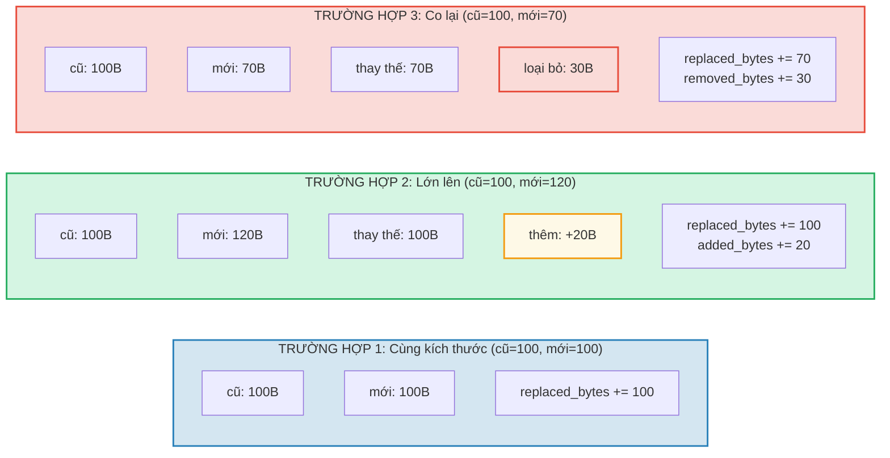

# Theo dõi chi phí

## Cấu trúc OperationCost

Mọi thao tác trong GroveDB đều tích lũy chi phí, được đo bằng tài nguyên tính toán:

```rust
// costs/src/lib.rs
pub struct OperationCost {
    pub seek_count: u32,              // Số lần tìm kiếm lưu trữ
    pub storage_cost: StorageCost,    // Byte được thêm/thay thế/xóa
    pub storage_loaded_bytes: u64,    // Byte đọc từ đĩa
    pub hash_node_calls: u32,         // Số thao tác băm Blake3
    pub sinsemilla_hash_calls: u32,   // Số thao tác băm Sinsemilla (thao tác đường cong elliptic)
}
```

> **Số lần gọi hash Sinsemilla** theo dõi các thao tác hash đường cong elliptic cho anchor CommitmentTree. Chúng đáng kể tốn kém hơn hash nút Blake3.

Chi phí lưu trữ được chia nhỏ hơn:

```rust
// costs/src/storage_cost/mod.rs
pub struct StorageCost {
    pub added_bytes: u32,                   // Dữ liệu mới được ghi
    pub replaced_bytes: u32,                // Dữ liệu hiện có bị ghi đè
    pub removed_bytes: StorageRemovedBytes, // Dữ liệu được giải phóng
}
```

## Mẫu CostContext

Tất cả thao tác trả về kết quả được bọc trong `CostContext`:

```rust
pub struct CostContext<T> {
    pub value: T,               // Kết quả thao tác
    pub cost: OperationCost,    // Tài nguyên đã tiêu thụ
}

pub type CostResult<T, E> = CostContext<Result<T, E>>;
```

Điều này tạo ra mẫu theo dõi chi phí **monadic** — chi phí chảy qua chuỗi thao tác tự động:

```rust
// Mở kết quả, thêm chi phí vào bộ tích lũy
let result = expensive_operation().unwrap_add_cost(&mut total_cost);

// Xâu chuỗi thao tác, tích lũy chi phí
let final_result = op1()
    .flat_map(|x| op2(x))      // Chi phí từ op1 + op2
    .flat_map(|y| op3(y));      // + chi phí từ op3
```

## Macro cost_return_on_error!

Mẫu phổ biến nhất trong mã GroveDB là macro `cost_return_on_error!`, hoạt động như `?` nhưng bảo toàn chi phí khi trả về sớm:

```rust
macro_rules! cost_return_on_error {
    ( &mut $cost:ident, $($body:tt)+ ) => {
        {
            let result_with_cost = { $($body)+ };
            let result = result_with_cost.unwrap_add_cost(&mut $cost);
            match result {
                Ok(x) => x,
                Err(e) => return Err(e).wrap_with_cost($cost),
            }
        }
    };
}
```

Trong thực tế:

```rust
fn insert_element(&self, path: &[&[u8]], key: &[u8], element: Element) -> CostResult<(), Error> {
    let mut cost = OperationCost::default();

    // Mỗi lần gọi macro thêm chi phí thao tác vào `cost`
    // và trả về giá trị Ok (hoặc trả về sớm với chi phí tích lũy khi Err)
    let merk = cost_return_on_error!(&mut cost, self.open_merk(path));
    cost_return_on_error!(&mut cost, merk.insert(key, element));
    cost_return_on_error!(&mut cost, self.propagate_changes(path));

    Ok(()).wrap_with_cost(cost)
    // `cost` giờ chứa tổng chi phí của cả ba thao tác
}
```

## Phân tích chi phí lưu trữ

Khi một giá trị được cập nhật, chi phí phụ thuộc vào giá trị mới lớn hơn, nhỏ hơn, hay bằng kích thước cũ:



## Chi phí thao tác hash

Chi phí hash được đo bằng "số lần gọi hash nút" — số lần nén khối Blake3:

| Thao tác | Kích thước đầu vào | Số lần gọi hash |
|-----------|-----------|------------|
| `value_hash(nhỏ)` | < 64 byte | 1 |
| `value_hash(trung bình)` | 64-127 byte | 2 |
| `kv_hash` | key + value_hash | thay đổi |
| `node_hash` | 96 byte (3 × 32) | 2 (luôn luôn) |
| `combine_hash` | 64 byte (2 × 32) | 1 (luôn luôn) |
| `node_hash_with_count` | 104 byte (3 × 32 + 8) | 2 (luôn luôn) |
| Sinsemilla (CommitmentTree) | Thao tác EC đường cong Pallas | theo dõi riêng qua `sinsemilla_hash_calls` |

Công thức chung cho Blake3:

```text
hash_calls = 1 + (input_bytes - 1) / 64
```

## Ước tính trường hợp xấu nhất và trung bình

GroveDB cung cấp các hàm để **ước tính** chi phí thao tác trước khi thực thi. Điều này rất quan trọng cho tính toán phí blockchain — bạn cần biết chi phí trước khi cam kết trả.

```rust
// Chi phí trường hợp xấu nhất để đọc một nút
pub fn add_worst_case_get_merk_node(
    cost: &mut OperationCost,
    not_prefixed_key_len: u32,
    max_element_size: u32,
    node_type: NodeType,
) {
    cost.seek_count += 1;  // Một lần tìm kiếm đĩa
    cost.storage_loaded_bytes +=
        TreeNode::worst_case_encoded_tree_size(
            not_prefixed_key_len, max_element_size, node_type
        ) as u64;
}

// Chi phí lan truyền trường hợp xấu nhất
pub fn add_worst_case_merk_propagate(
    cost: &mut OperationCost,
    input: &WorstCaseLayerInformation,
) {
    let levels = match input {
        MaxElementsNumber(n) => ((*n + 1) as f32).log2().ceil() as u32,
        NumberOfLevels(n) => *n,
    };
    let mut nodes_updated = levels;

    // Phép quay AVL có thể cập nhật thêm nút
    if levels > 2 {
        nodes_updated += 2;  // Tối đa 2 nút thêm cho phép quay
    }

    cost.storage_cost.replaced_bytes += nodes_updated * MERK_BIGGEST_VALUE_SIZE;
    cost.storage_loaded_bytes +=
        nodes_updated as u64 * (MERK_BIGGEST_VALUE_SIZE + MERK_BIGGEST_KEY_SIZE) as u64;
    cost.seek_count += nodes_updated;
    cost.hash_node_calls += nodes_updated * 2;
}
```

Các hằng số được sử dụng:

```rust
pub const MERK_BIGGEST_VALUE_SIZE: u32 = u16::MAX as u32;  // 65535
pub const MERK_BIGGEST_KEY_SIZE: u32 = 256;
```

---
