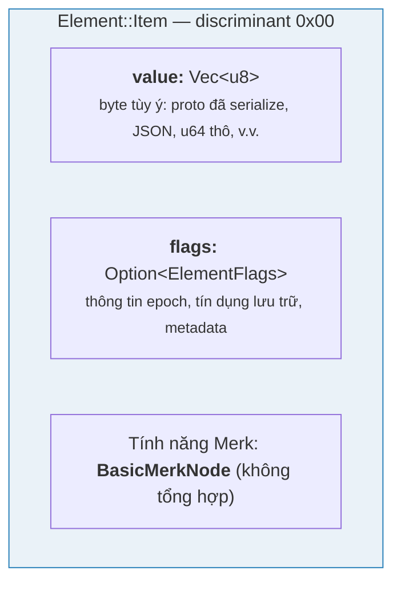
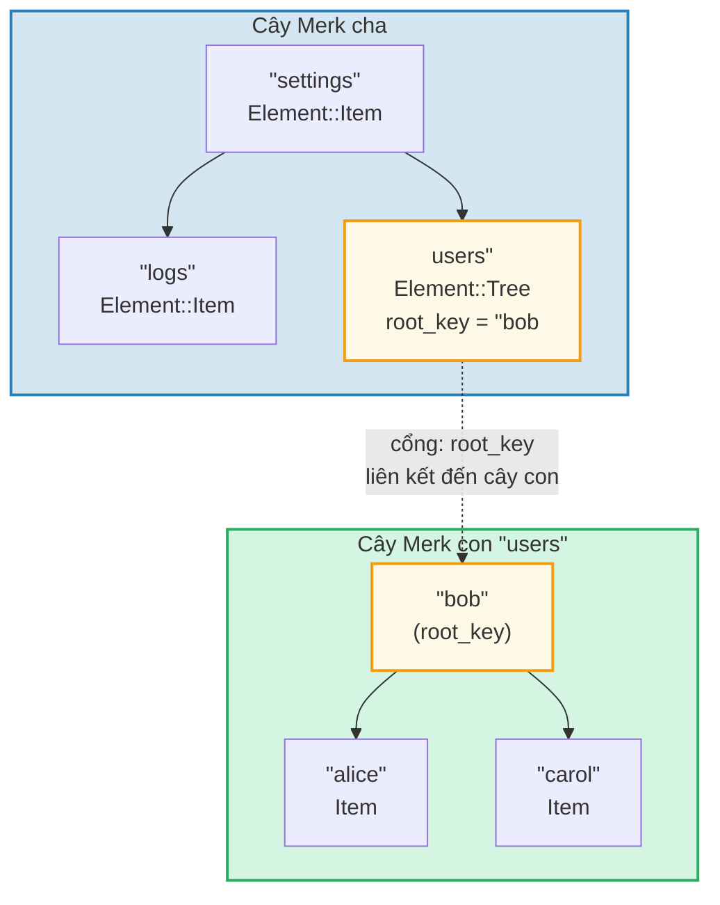
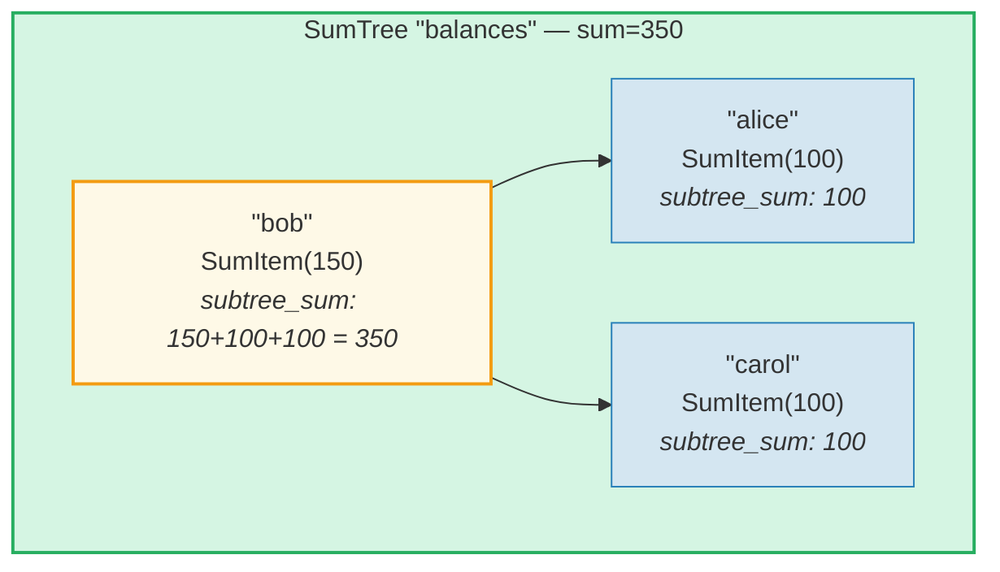
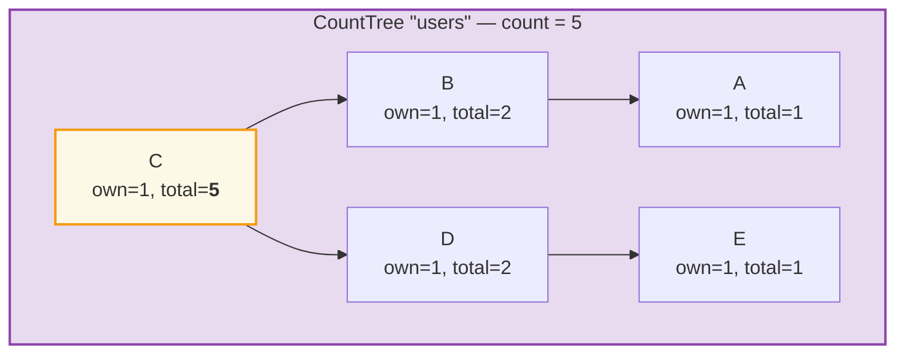
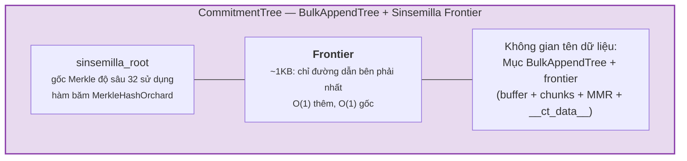

# Hệ thống Element

Trong khi Merk xử lý các cặp khóa-giá trị thô, GroveDB hoạt động ở mức cao hơn
sử dụng **Element** — các giá trị có kiểu mang ý nghĩa ngữ nghĩa. Mọi giá trị
lưu trong GroveDB đều là một Element.

## Enum Element

```rust
// grovedb-element/src/element/mod.rs
pub enum Element {
    Item(Vec<u8>, Option<ElementFlags>),                                    // [0]
    Reference(ReferencePathType, MaxReferenceHop, Option<ElementFlags>),    // [1]
    Tree(Option<Vec<u8>>, Option<ElementFlags>),                           // [2]
    SumItem(SumValue, Option<ElementFlags>),                               // [3]
    SumTree(Option<Vec<u8>>, SumValue, Option<ElementFlags>),              // [4]
    BigSumTree(Option<Vec<u8>>, BigSumValue, Option<ElementFlags>),        // [5]
    CountTree(Option<Vec<u8>>, CountValue, Option<ElementFlags>),          // [6]
    CountSumTree(Option<Vec<u8>>, CountValue, SumValue, Option<ElementFlags>), // [7]
    ProvableCountTree(Option<Vec<u8>>, CountValue, Option<ElementFlags>),  // [8]
    ItemWithSumItem(Vec<u8>, SumValue, Option<ElementFlags>),              // [9]
    ProvableCountSumTree(Option<Vec<u8>>, CountValue, SumValue,
                         Option<ElementFlags>),                            // [10]
    CommitmentTree(u64, u8, Option<ElementFlags>),                         // [11]
    MmrTree(u64, Option<ElementFlags>),                                    // [12]
    BulkAppendTree(u64, u8, Option<ElementFlags>),                         // [13]
    DenseAppendOnlyFixedSizeTree(u16, u8, Option<ElementFlags>),           // [14]
}
```

Các số phân biệt (discriminant, hiển thị trong ngoặc vuông) được sử dụng trong quá trình serialize (tuần tự hóa).

Các bí danh kiểu được sử dụng xuyên suốt:

```rust
pub type ElementFlags = Vec<u8>;        // Metadata tùy ý cho mỗi phần tử
pub type MaxReferenceHop = Option<u8>;  // Giới hạn bước nhảy tùy chọn cho tham chiếu
pub type SumValue = i64;                // Tổng có dấu 64-bit
pub type BigSumValue = i128;            // Tổng có dấu 128-bit
pub type CountValue = u64;              // Số đếm không dấu 64-bit
```

## Item — Lưu trữ khóa-giá trị cơ bản

Phần tử đơn giản nhất. Lưu trữ byte tùy ý:

```rust
Element::Item(value: Vec<u8>, flags: Option<ElementFlags>)
```



Hàm tạo:

```rust
Element::new_item(b"hello world".to_vec())
Element::new_item_with_flags(b"data".to_vec(), Some(vec![0x01, 0x02]))
```

Item tham gia tổng hợp: trong SumTree, Item đóng góp tổng mặc định là 0.
SumItem đóng góp giá trị tường minh của nó.

## Tree — Thùng chứa cho cây con

Phần tử Tree là một **cổng** (portal) đến cây Merk khác. Nó lưu trữ root key
(khóa gốc) của cây con (nếu có):

```rust
Element::Tree(root_key: Option<Vec<u8>>, flags: Option<ElementFlags>)
```



> Phần tử Tree trong Merk cha lưu trữ `root_key` của cây Merk con. Điều này tạo ra một **cổng** — liên kết từ cây Merk này sang cây Merk khác.

Khi cây trống, `root_key` là `None`. Hàm tạo `Element::empty_tree()` tạo ra
`Element::Tree(None, None)`.

## SumItem / SumTree — Tổng hợp

**SumTree** tự động duy trì tổng các đóng góp tổng của tất cả các con trực tiếp:

```rust
Element::SumTree(root_key: Option<Vec<u8>>, sum: SumValue, flags: Option<ElementFlags>)
Element::SumItem(value: SumValue, flags: Option<ElementFlags>)
```



> **Công thức tổng hợp:** `node_sum = own_value + left_child_sum + right_child_sum`
> Bob: 150 + 100 (alice) + 100 (carol) = **350**. Tổng gốc (350) được lưu trong phần tử SumTree của cha.

Tổng được duy trì ở tầng Merk thông qua kiểu tính năng `TreeFeatureType::SummedMerkNode(i64)`. Trong quá trình lan truyền cây, dữ liệu tổng hợp của mỗi nút được tính lại:

```text
aggregate_sum = own_sum + left_child_sum + right_child_sum
```

## CountTree, CountSumTree, BigSumTree

Các kiểu cây tổng hợp bổ sung:

| Kiểu Element | Kiểu tính năng Merk | Tổng hợp |
|---|---|---|
| `CountTree` | `CountedMerkNode(u64)` | Số lượng phần tử |
| `CountSumTree` | `CountedSummedMerkNode(u64, i64)` | Cả số đếm và tổng |
| `BigSumTree` | `BigSummedMerkNode(i128)` | Tổng 128-bit cho giá trị lớn |
| `ProvableCountTree` | `ProvableCountedMerkNode(u64)` | Số đếm được nhúng vào hash |
| `ProvableCountSumTree` | `ProvableCountedSummedMerkNode(u64, i64)` | Số đếm trong hash + tổng |

**ProvableCountTree** đặc biệt: số đếm của nó được bao gồm trong phép tính `node_hash` (qua `node_hash_with_count`), nên bằng chứng (proof) có thể xác minh số đếm mà không cần tiết lộ bất kỳ giá trị nào.

## Serialize Element

Element được serialize bằng **bincode** với thứ tự byte big-endian:

```rust
pub fn serialize(&self, grove_version: &GroveVersion) -> Result<Vec<u8>, ElementError> {
    let config = config::standard().with_big_endian().with_no_limit();
    bincode::encode_to_vec(self, config)
}
```

Byte đầu tiên là **discriminant**, cho phép phát hiện kiểu O(1):

```rust
pub fn from_serialized_value(value: &[u8]) -> Option<ElementType> {
    match value.first()? {
        0 => Some(ElementType::Item),
        1 => Some(ElementType::Reference),
        2 => Some(ElementType::Tree),
        3 => Some(ElementType::SumItem),
        // ... v.v.
    }
}
```

## TreeFeatureType và luồng dữ liệu tổng hợp

Enum `TreeFeatureType` bắc cầu giữa Element của GroveDB và nút Merk:

```rust
pub enum TreeFeatureType {
    BasicMerkNode,                              // Không tổng hợp
    SummedMerkNode(i64),                       // Tổng hợp tổng
    BigSummedMerkNode(i128),                   // Tổng lớn
    CountedMerkNode(u64),                      // Đếm
    CountedSummedMerkNode(u64, i64),           // Đếm + tổng
    ProvableCountedMerkNode(u64),              // Đếm trong hash
    ProvableCountedSummedMerkNode(u64, i64),   // Đếm trong hash + tổng
}
```

Dữ liệu tổng hợp chảy **lên trên** qua cây:



> **Bảng tổng hợp:** Tổng hợp mỗi nút = own(1) + left_aggregate + right_aggregate
>
> | Nút | own | left_agg | right_agg | tổng |
> |------|-----|----------|-----------|-------|
> | A | 1 | 0 | 0 | 1 |
> | B | 1 | 1 (A) | 0 | 2 |
> | E | 1 | 0 | 0 | 1 |
> | D | 1 | 0 | 1 (E) | 2 |
> | C | 1 | 2 (B) | 2 (D) | **5** (gốc) |

Số đếm tại mỗi nút đại diện cho tổng số đếm trong cây con gốc tại nút đó, bao gồm chính nó. Số đếm của nút gốc là tổng cho toàn bộ cây.

Enum `AggregateData` mang thông tin này qua hệ thống Link:

```rust
pub enum AggregateData {
    NoAggregateData,
    Sum(i64),
    BigSum(i128),
    Count(u64),
    CountAndSum(u64, i64),
    ProvableCount(u64),
    ProvableCountAndSum(u64, i64),
}
```

## CommitmentTree — Cây cam kết Sinsemilla

**CommitmentTree** cung cấp cây Merkle Sinsemilla độ sâu 32 để theo dõi
anchor (mỏ neo) cam kết ghi chú, như được sử dụng trong giao thức bảo mật Orchard
của Zcash. Nó bọc `incrementalmerkletree::Frontier<MerkleHashOrchard, 32>` để thêm
O(1) và tính gốc O(1):

```rust
Element::CommitmentTree(
    total_count: u64,               // Số cam kết đã thêm
    chunk_power: u8,                // Kích thước nén BulkAppendTree (chunk_size = 2^chunk_power)
    flags: Option<ElementFlags>,
)                                   // discriminant [11]
```

> **Lưu ý:** Root hash (băm gốc) frontier Sinsemilla KHÔNG được lưu trong Element.
> Nó được lưu trữ trong bộ lưu trữ dữ liệu và chảy qua cơ chế child hash (băm con)
> của Merk (tham số `subtree_root_hash` của `insert_subtree`). Bất kỳ thay đổi nào
> đối với frontier tự động lan truyền lên qua hệ thống phân cấp Merk của GroveDB.



**Kiến trúc:**
- *Frontier* (đường dẫn bên phải nhất của cây Merkle, kích thước hằng ~1KB) được
  lưu trong **không gian tên dữ liệu**, với khóa `COMMITMENT_TREE_DATA_KEY`
- Dữ liệu ghi chú thực (`cmx || ciphertext`) được lưu qua **BulkAppendTree**
  trong **không gian tên dữ liệu** — nén theo chunk, truy xuất theo vị trí
- Anchor lịch sử được Platform theo dõi trong một cây chứng minh riêng
- Root Sinsemilla KHÔNG được lưu trong Element — nó chảy như child hash
  của Merk qua hệ thống phân cấp hash của GroveDB

**Các thao tác:**
- `commitment_tree_insert(path, key, cmx, ciphertext, tx)` — Thêm có kiểu
  nhận `TransmittedNoteCiphertext<M>`; trả về `(new_root, position)`
- `commitment_tree_anchor(path, key, tx)` — Lấy Orchard Anchor hiện tại
- `commitment_tree_get_value(path, key, position, tx)` — Truy xuất giá trị theo vị trí
- `commitment_tree_count(path, key, tx)` — Lấy tổng số mục

**Generic MemoSize:** `CommitmentTree<S, M: MemoSize = DashMemo>` xác thực rằng
tải trọng ciphertext khớp với kích thước mong đợi cho `M`. Cho Dash (memo 36 byte):
`epk_bytes (32) + enc_ciphertext (104) + out_ciphertext (80) = 216 byte`.

**Theo dõi chi phí:** Các thao tác hash Sinsemilla được theo dõi qua
`cost.sinsemilla_hash_calls`. Tính gốc luôn duyệt 32 tầng.
Việc hợp nhất ommer tầng xuống theo `trailing_ones()` của vị trí trước đó.
Các thao tác BulkAppendTree thêm chi phí hash Blake3.

## MmrTree — Dãy núi Merkle

**MmrTree** lưu trữ dữ liệu trong Merkle Mountain Range (MMR, Dãy núi Merkle) chỉ
thêm vào (append-only) sử dụng hàm băm Blake3. Các nút MMR được lưu trong cột **data**
(giống như nút Merk), không phải trong cây Merk con. Xem **[Chương 13](#chapter-13-the-mmr-tree--append-only-authenticated-logs)**
để tìm hiểu chi tiết về cách MMR hoạt động, cách chúng lấp đầy, cách bằng chứng
được tạo và xác minh, và cách MmrTree tích hợp với GroveDB.

```rust
Element::MmrTree(
    mmr_size: u64,                  // Kích thước MMR nội bộ (nút, không phải lá)
    flags: Option<ElementFlags>,
)                                   // discriminant [12]
```

> **Lưu ý:** Root hash MMR KHÔNG được lưu trong Element. Nó chảy như child hash
> của Merk qua tham số `subtree_root_hash` của `insert_subtree`.

**Thao tác:** `mmr_tree_append`, `mmr_tree_root_hash`, `mmr_tree_get_value`,
`mmr_tree_leaf_count`. **Bằng chứng:** Bằng chứng V1 (xem mục 9.6 và 13.9).

## BulkAppendTree — Cấu trúc chỉ thêm hai tầng

**BulkAppendTree** kết hợp bộ đệm (buffer) cây Merkle dày đặc với MMR cấp chunk
để thêm hiệu suất cao với truy vấn phạm vi có thể chứng minh. Đây là cây không
phải Merk — dữ liệu nằm trong **không gian tên dữ liệu**, không phải trong cây
Merk con. Xem **[Chương 14](#chapter-14-the-bulkappendtree--high-throughput-append-only-storage)**
để tìm hiểu chi tiết về kiến trúc hai tầng, nén chunk, tạo bằng chứng, xác minh,
và tích hợp GroveDB.

```rust
Element::BulkAppendTree(
    total_count: u64,               // Tổng giá trị đã thêm
    chunk_power: u8,                // Chiều cao cây dày đặc (dung lượng buffer = 2^chunk_power - 1)
    flags: Option<ElementFlags>,
)                                   // discriminant [13]
```

> **Lưu ý:** State root (`blake3("bulk_state" || mmr_root || dense_tree_root)`)
> KHÔNG được lưu trong Element. Nó chảy như child hash của Merk qua tham số
> `subtree_root_hash` của `insert_subtree`.

**Thao tác:** `bulk_append`, `bulk_get_value`, `bulk_get_chunk`,
`bulk_get_buffer`, `bulk_count`, `bulk_chunk_count`.
**Bằng chứng:** Bằng chứng phạm vi V1 (xem mục 9.6 và 14.10).

## DenseAppendOnlyFixedSizeTree — Lưu trữ dày đặc cố định dung lượng

**DenseAppendOnlyFixedSizeTree** là cây nhị phân đầy đủ có chiều cao cố định *h*
trong đó mọi nút (nội bộ và lá) lưu trữ giá trị dữ liệu. Các vị trí được lấp đầy
theo thứ tự tầng (BFS). Root hash được tính lại trực tiếp — không có hash trung gian
nào được lưu trữ. Xem **[Chương 16](#chapter-16-the-denseappendonlyfixedsizetree--dense-fixed-capacity-merkle-storage)**
để tìm hiểu chi tiết.

```rust
Element::DenseAppendOnlyFixedSizeTree(
    count: u16,                     // Số giá trị đã lưu (tối đa 65.535)
    height: u8,                     // Chiều cao cây (1..=16, bất biến), dung lượng = 2^h - 1
    flags: Option<ElementFlags>,
)                                   // discriminant [14]
```

> **Lưu ý:** Root hash KHÔNG được lưu trong Element — nó được tính lại trực tiếp
> và chảy như child hash của Merk. Trường `count` là `u16` (không phải u64), giới
> hạn cây ở 65.535 vị trí. Chiều cao bị giới hạn ở 1..=16.

**Thao tác:** `dense_tree_insert`, `dense_tree_get`, `dense_tree_root_hash`,
`dense_tree_count`.
**Bằng chứng:** Chỉ cấp phần tử (chưa có bằng chứng subquery).

## Cây không phải Merk — Các mẫu chung

CommitmentTree, MmrTree, BulkAppendTree, và DenseAppendOnlyFixedSizeTree chia sẻ một
mẫu kiến trúc chung phân biệt chúng với các kiểu cây dựa trên Merk (Tree, SumTree,
CountTree, v.v.):

| Thuộc tính | Cây dựa trên Merk | Cây không phải Merk |
|----------|-----------------|-------------------|
| Cây Merk con | Có (`root_key = Some(...)`) | Không (không có trường root_key) |
| Lưu trữ dữ liệu | Cặp khóa-giá trị Merk | Blob cột dữ liệu (khóa không phải Merk) |
| Ràng buộc root hash | `combine_hash(elem_hash, child_root_hash)` | `combine_hash(elem_hash, type_specific_root)` |
| Root riêng theo kiểu | Được duy trì bởi Merk AVL | Chảy như child hash của Merk (KHÔNG trong byte element) |
| Định dạng bằng chứng | V0 (Merk từng tầng) | V1 (bằng chứng riêng theo kiểu) |
| TreeFeatureType | BasicMerkNode (không tổng hợp) | BasicMerkNode |

> **Ghi chú về cột lưu trữ:** Cả bốn kiểu cây không phải Merk (MmrTree,
> CommitmentTree, BulkAppendTree, DenseAppendOnlyFixedSizeTree) lưu dữ liệu
> của chúng trong cột **data** sử dụng khóa không phải Merk. CommitmentTree
> lưu frontier Sinsemilla bên cạnh các mục BulkAppendTree trong cùng cột
> **data** (khóa `b"__ct_data__"`).

Root riêng theo kiểu (sinsemilla root, MMR root, state root, hoặc dense tree root hash) KHÔNG
được lưu trong Element. Thay vào đó, nó chảy như **child hash** của Merk qua tham
số `subtree_root_hash` của `insert_subtree`. `combined_value_hash` của Merk trở
thành `combine_hash(value_hash(element_bytes), type_specific_root)`. Bất kỳ thay
đổi nào đối với root riêng theo kiểu sẽ thay đổi child hash, rồi thay đổi
combined_value_hash, rồi lan truyền lên qua hệ thống phân cấp hash của GroveDB —
duy trì tính toàn vẹn mật mã.

---
