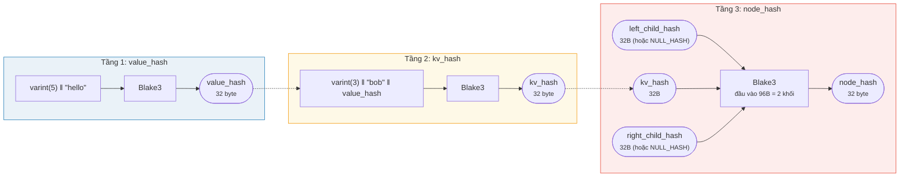
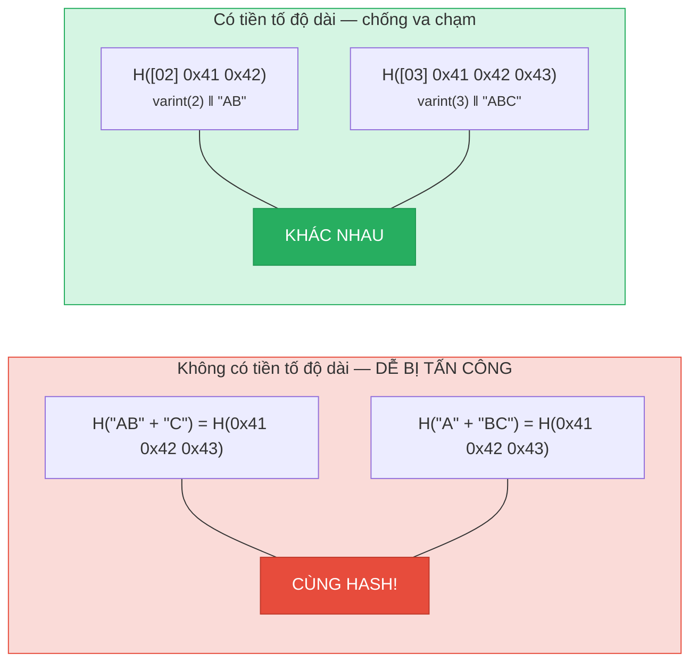
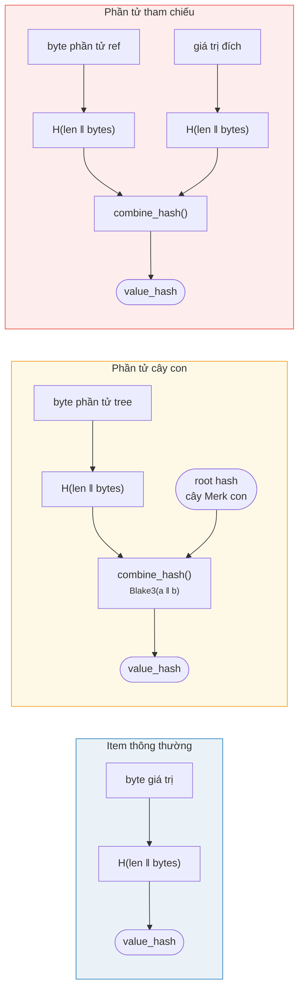

# Hàm băm — Tính toàn vẹn mật mã

Mọi nút trong cây Merk đều được băm để tạo ra **root hash** (băm gốc) — một giá trị
32 byte duy nhất xác thực toàn bộ nội dung cây. Bất kỳ thay đổi nào đối với khóa,
giá trị, hoặc mối quan hệ cấu trúc nào đều sẽ tạo ra root hash khác.

## Hệ thống phân cấp hash ba tầng

Merk sử dụng sơ đồ băm ba tầng, từ trong ra ngoài:

Ví dụ: key = `"bob"` (3 byte), value = `"hello"` (5 byte):



> GỐC của cây = `node_hash` của nút gốc — xác thực **mọi** khóa, giá trị và mối quan hệ cấu trúc. Các nút con vắng mặt sử dụng `NULL_HASH = [0x00; 32]`.

### Tầng 1: value_hash

```rust
// merk/src/tree/hash.rs
pub fn value_hash(value: &[u8]) -> CostContext<CryptoHash> {
    let mut hasher = blake3::Hasher::new();
    let val_length = value.len().encode_var_vec();  // Mã hóa varint
    hasher.update(val_length.as_slice());
    hasher.update(value);
    // ...
}
```

Độ dài của giá trị được **mã hóa varint** và thêm vào đầu. Điều này rất quan trọng
cho khả năng chống va chạm (collision resistance) — nếu không có nó,
`H("AB" ‖ "C")` sẽ bằng `H("A" ‖ "BC")`.

### Tầng 2: kv_hash

```rust
pub fn kv_hash(key: &[u8], value: &[u8]) -> CostContext<CryptoHash> {
    let mut hasher = blake3::Hasher::new();
    let key_length = key.len().encode_var_vec();
    hasher.update(key_length.as_slice());
    hasher.update(key);
    let vh = value_hash(value);
    hasher.update(vh.as_slice());  // Hash lồng nhau
    // ...
}
```

Điều này ràng buộc khóa với giá trị. Để xác minh bằng chứng, cũng có biến thể
nhận value_hash đã tính trước:

```rust
pub fn kv_digest_to_kv_hash(key: &[u8], value_hash: &CryptoHash) -> CostContext<CryptoHash>
```

Biến thể này được sử dụng khi bên xác minh đã có value_hash (ví dụ: cho cây con
nơi value_hash là hash kết hợp).

### Tầng 3: node_hash

```rust
pub fn node_hash(
    kv: &CryptoHash,
    left: &CryptoHash,
    right: &CryptoHash,
) -> CostContext<CryptoHash> {
    let mut hasher = blake3::Hasher::new();
    hasher.update(kv);       // 32 byte
    hasher.update(left);     // 32 byte
    hasher.update(right);    // 32 byte — tổng 96 byte
    // Luôn chính xác 2 thao tác hash (96 byte / khối 64 byte = 2)
}
```

Nếu một nút con vắng mặt, hash của nó là **NULL_HASH** — 32 byte zero:

```rust
pub const NULL_HASH: CryptoHash = [0; HASH_LENGTH];  // [0u8; 32]
```

## Blake3 là hàm băm

GroveDB sử dụng **Blake3** cho tất cả việc băm. Các thuộc tính chính:

- **Đầu ra 256-bit** (32 byte)
- **Kích thước khối**: 64 byte
- **Tốc độ**: nhanh hơn SHA-256 ~3 lần trên phần cứng hiện đại
- **Streaming**: Có thể nạp dữ liệu dần dần

Chi phí thao tác hash được tính dựa trên số khối 64 byte được xử lý:

```rust
let hashes = 1 + (hasher.count() - 1) / 64;  // Số thao tác hash
```

## Mã hóa tiền tố độ dài cho khả năng chống va chạm

Mọi đầu vào có độ dài thay đổi đều được thêm tiền tố độ dài bằng **mã hóa varint**:



> **Đầu vào value_hash**: `[varint(value.len)] [byte giá trị]`
> **Đầu vào kv_hash**: `[varint(key.len)] [byte khóa] [value_hash: 32 byte]`

Nếu không có tiền tố độ dài, kẻ tấn công có thể tạo ra các cặp khóa-giá trị
khác nhau nhưng băm ra cùng một digest. Tiền tố độ dài khiến điều này trở nên
không khả thi về mặt mật mã.

## Hàm băm kết hợp cho các phần tử đặc biệt

Đối với **cây con** và **tham chiếu** (reference), `value_hash` không đơn giản là
`H(value)`. Thay vào đó, nó là một **hash kết hợp** ràng buộc phần tử với đích
của nó:



> **Cây con:** ràng buộc root hash của cây Merk con vào cây cha. **Tham chiếu:** ràng buộc cả đường dẫn tham chiếu VÀ giá trị đích. Thay đổi bất kỳ cái nào cũng thay đổi root hash.

Hàm `combine_hash`:

```rust
pub fn combine_hash(hash_one: &CryptoHash, hash_two: &CryptoHash) -> CostContext<CryptoHash> {
    let mut hasher = blake3::Hasher::new();
    hasher.update(hash_one);   // 32 byte
    hasher.update(hash_two);   // 32 byte — tổng 64 byte, chính xác 1 thao tác hash
    // ...
}
```

Đây là thứ cho phép GroveDB xác thực toàn bộ hệ thống phân cấp thông qua một root hash duy nhất — mỗi value_hash của cây cha cho phần tử cây con đều bao gồm root hash của cây con.

## Hàm băm tổng hợp cho ProvableCountTree

Các nút `ProvableCountTree` bao gồm số đếm tổng hợp trong node hash:

```rust
pub fn node_hash_with_count(
    kv: &CryptoHash,
    left: &CryptoHash,
    right: &CryptoHash,
    count: u64,
) -> CostContext<CryptoHash> {
    let mut hasher = blake3::Hasher::new();
    hasher.update(kv);                        // 32 byte
    hasher.update(left);                      // 32 byte
    hasher.update(right);                     // 32 byte
    hasher.update(&count.to_be_bytes());      // 8 byte — tổng 104 byte
    // Vẫn chính xác 2 thao tác hash (104 < 128 = 2 × 64)
}
```

Điều này có nghĩa là bằng chứng về số đếm không yêu cầu tiết lộ dữ liệu thực — số đếm được nhúng vào cam kết mật mã (cryptographic commitment).

---
