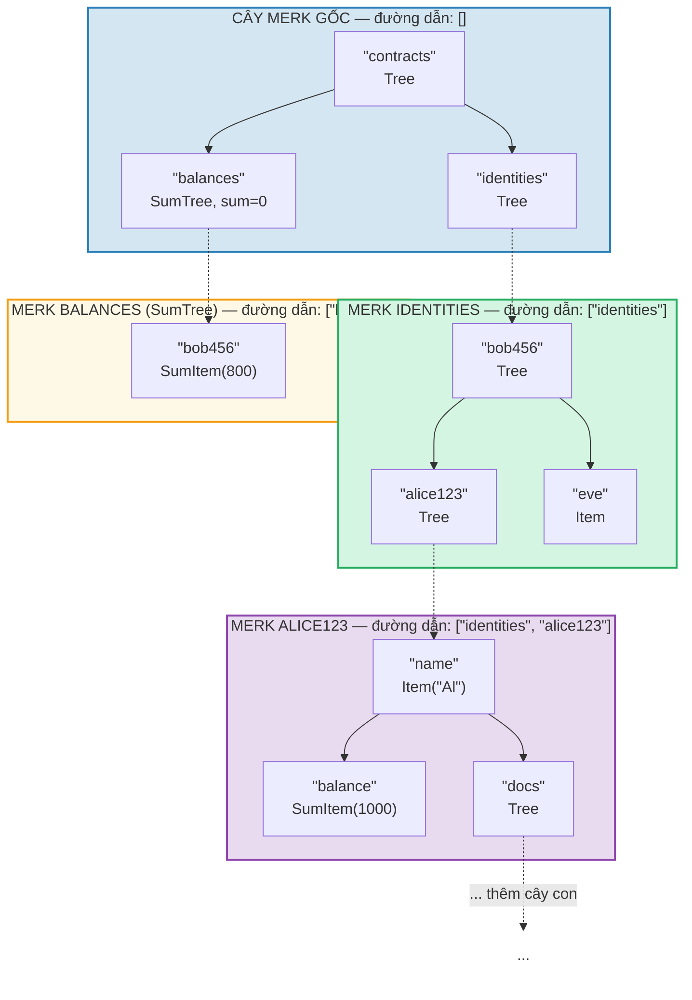
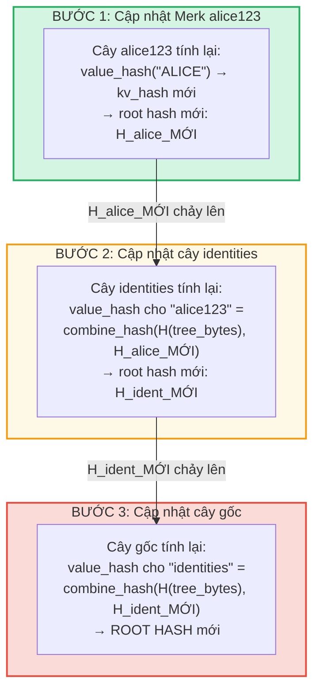
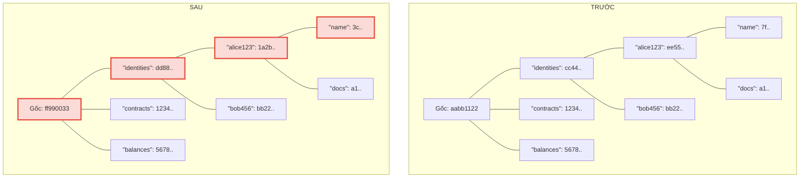
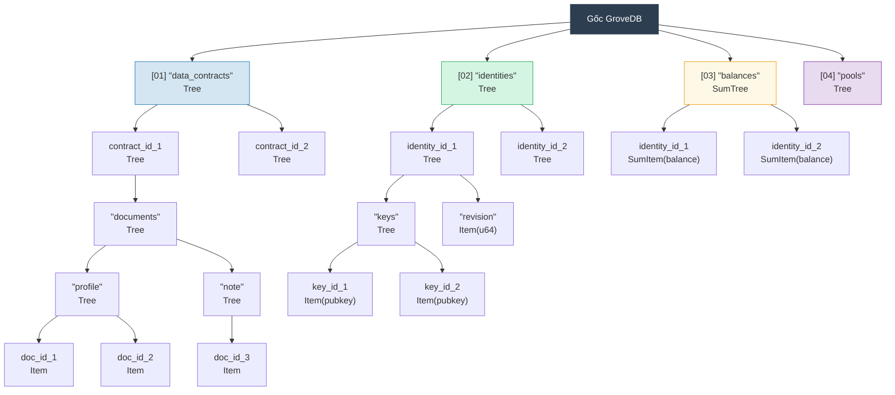

# Grove phân cấp — Cây chứa cây

## Cách cây con lồng nhau bên trong cây cha

Tính năng định nghĩa của GroveDB là cây Merk có thể chứa các phần tử mà bản thân chúng cũng là cây Merk. Điều này tạo ra một **không gian tên phân cấp**:



> Mỗi ô màu là một cây Merk riêng biệt. Các mũi tên nét đứt đại diện cho liên kết cổng từ phần tử Tree đến cây Merk con. Đường dẫn đến mỗi Merk được hiển thị trong nhãn.

## Hệ thống địa chỉ đường dẫn

Mọi phần tử trong GroveDB được xác định bằng **đường dẫn** (path) — một chuỗi chuỗi byte điều hướng từ gốc qua các cây con đến khóa đích:

```text
    Đường dẫn: ["identities", "alice123", "name"]

    Bước 1: Trong cây gốc, tra cứu "identities" → phần tử Tree
    Bước 2: Mở cây con identities, tra cứu "alice123" → phần tử Tree
    Bước 3: Mở cây con alice123, tra cứu "name" → Item("Alice")
```

Đường dẫn được biểu diễn dưới dạng `Vec<Vec<u8>>` hoặc sử dụng kiểu `SubtreePath` để thao tác hiệu quả mà không cần cấp phát:

```rust
// Đường dẫn đến phần tử (tất cả các đoạn trừ đoạn cuối)
let path: &[&[u8]] = &[b"identities", b"alice123"];
// Khóa trong cây con cuối
let key: &[u8] = b"name";
```

## Tạo tiền tố Blake3 để cách ly lưu trữ

Mỗi cây con trong GroveDB có **không gian tên lưu trữ cách ly** riêng trong RocksDB. Không gian tên được xác định bằng cách băm đường dẫn với Blake3:

```rust
pub type SubtreePrefix = [u8; 32];

// Tiền tố được tính bằng cách băm các đoạn đường dẫn
// storage/src/rocksdb_storage/storage.rs
```

Ví dụ:

```text
    Đường dẫn: ["identities", "alice123"]
    Tiền tố: Blake3(["identities", "alice123"]) = [0xab, 0x3f, ...]  (32 byte)

    Trong RocksDB, khóa của cây con này được lưu dưới dạng:
    [tiền tố: 32 byte][khóa_gốc]

    Vậy "name" trong cây con này trở thành:
    [0xab, 0x3f, ...][0x6e, 0x61, 0x6d, 0x65]  ("name")
```

Điều này đảm bảo:
- Không có va chạm khóa giữa các cây con (tiền tố 32 byte = cách ly 256-bit)
- Tính toán tiền tố hiệu quả (một lần băm Blake3 trên byte đường dẫn)
- Dữ liệu cây con nằm gần nhau trong RocksDB để hiệu quả cache

## Lan truyền Root Hash qua hệ thống phân cấp

Khi một giá trị thay đổi sâu trong grove, thay đổi phải **lan truyền lên trên** để cập nhật root hash:

```text
    Thay đổi: Cập nhật "name" thành "ALICE" trong identities/alice123/

    Bước 1: Cập nhật giá trị trong cây Merk alice123
            → cây alice123 nhận root hash mới: H_alice_new

    Bước 2: Cập nhật phần tử "alice123" trong cây identities
            → value_hash của cây identities cho "alice123" =
              combine_hash(H(tree_element_bytes), H_alice_new)
            → cây identities nhận root hash mới: H_ident_new

    Bước 3: Cập nhật phần tử "identities" trong cây gốc
            → value_hash của cây gốc cho "identities" =
              combine_hash(H(tree_element_bytes), H_ident_new)
            → ROOT HASH thay đổi
```



**Trước và Sau** — các nút đã thay đổi được đánh dấu đỏ:



> Chỉ các nút trên đường dẫn từ giá trị đã thay đổi lên đến gốc mới được tính lại. Các nút anh em và nhánh khác vẫn không thay đổi.

Quá trình lan truyền được triển khai bởi `propagate_changes_with_transaction`, đi
lên đường dẫn từ cây con đã sửa đổi đến gốc, cập nhật hash phần tử của mỗi cha
dọc đường.

## Ví dụ cấu trúc Grove đa tầng

Đây là ví dụ hoàn chỉnh cho thấy cách Dash Platform cấu trúc trạng thái:



Mỗi ô là một cây Merk riêng biệt, được xác thực hoàn toàn lên đến một root hash duy nhất mà các validator đồng thuận.

---
