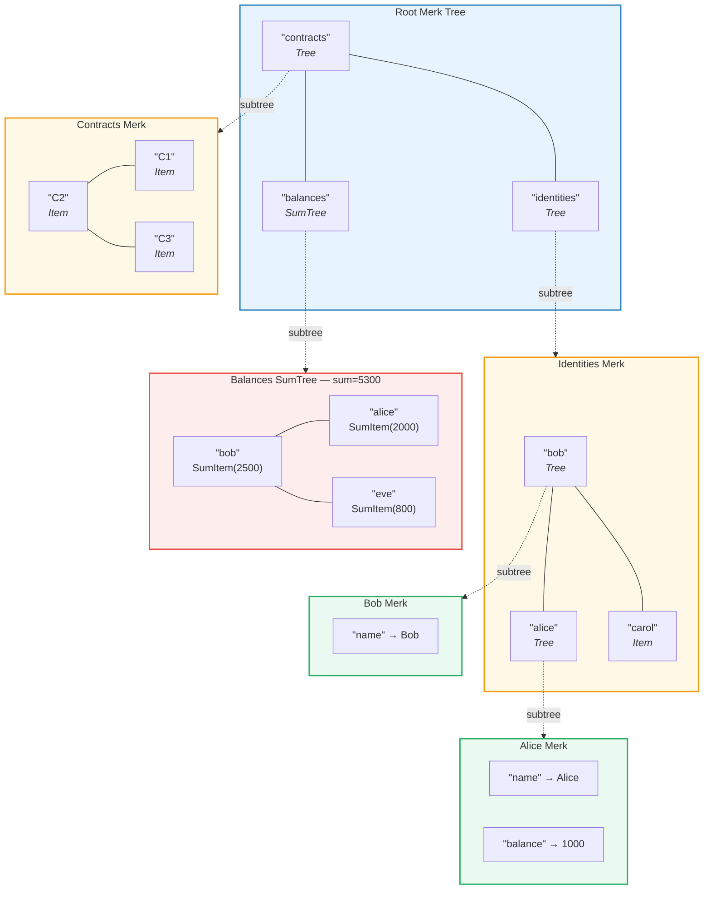
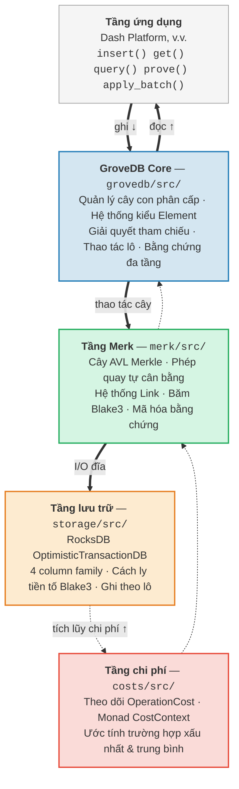

# Giới thiệu — GroveDB là gì?

## Ý tưởng cốt lõi

GroveDB là một **cấu trúc dữ liệu xác thực phân cấp** — về bản chất là một *grove*
(rừng cây, tức cây chứa cây) được xây dựng trên các cây AVL Merkle. Mỗi nút trong
cơ sở dữ liệu là một phần của cây được xác thực bằng mật mã, và mỗi cây có thể chứa
các cây con khác, tạo thành một hệ thống phân cấp sâu của trạng thái có thể kiểm chứng.

> Mỗi ô màu là một **cây Merk riêng biệt**. Các mũi tên nét đứt thể hiện mối quan hệ cây con — một phần tử Tree trong cây cha chứa root key (khóa gốc) của cây Merk con.

Trong cơ sở dữ liệu truyền thống, bạn có thể lưu trữ dữ liệu trong một kho
khóa-giá trị phẳng với một cây Merkle duy nhất ở trên để xác thực. GroveDB áp dụng
một cách tiếp cận khác: nó lồng các cây Merkle bên trong các cây Merkle. Điều này
mang lại cho bạn:

1. **Chỉ mục thứ cấp hiệu quả** — truy vấn theo bất kỳ đường dẫn nào, không chỉ khóa chính
2. **Bằng chứng mật mã nhỏ gọn** — chứng minh sự tồn tại (hoặc vắng mặt) của bất kỳ dữ liệu nào
3. **Dữ liệu tổng hợp** — các cây có thể tự động tính tổng, đếm, hoặc tổng hợp
   các phần tử con của chúng
4. **Thao tác nguyên tử xuyên cây** — các thao tác theo lô trải rộng trên nhiều cây con

## Tại sao GroveDB tồn tại

GroveDB được thiết kế cho **Dash Platform**, một nền tảng ứng dụng phi tập trung
nơi mà mọi phần trạng thái phải:

- **Được xác thực**: Bất kỳ nút mạng nào cũng có thể chứng minh bất kỳ phần trạng thái nào cho máy khách nhẹ (light client)
- **Tất định**: Mọi nút mạng tính toán chính xác cùng một root hash (băm gốc) trạng thái
- **Hiệu quả**: Các thao tác phải hoàn thành trong giới hạn thời gian khối
- **Có thể truy vấn**: Ứng dụng cần các truy vấn phong phú, không chỉ tra cứu khóa

Các cách tiếp cận truyền thống có hạn chế:

| Cách tiếp cận | Vấn đề |
|----------|---------|
| Cây Merkle thuần | Chỉ hỗ trợ tra cứu khóa, không có truy vấn phạm vi |
| Ethereum MPT | Tái cân bằng tốn kém, kích thước bằng chứng lớn |
| Khóa-giá trị phẳng + cây đơn | Không có truy vấn phân cấp, một bằng chứng bao phủ mọi thứ |
| B-tree | Không tự nhiên Merkle hóa, xác thực phức tạp |

GroveDB giải quyết những vấn đề này bằng cách kết hợp **đảm bảo cân bằng đã được chứng minh của cây AVL** với **lồng ghép phân cấp** và **hệ thống kiểu phần tử phong phú**.

## Tổng quan kiến trúc

GroveDB được tổ chức thành các tầng riêng biệt, mỗi tầng có trách nhiệm rõ ràng:

Dữ liệu chảy **xuống** qua các tầng này trong quá trình ghi và **lên** trong quá trình đọc. Mỗi thao tác tích lũy chi phí khi đi qua ngăn xếp, cho phép tính toán
tài nguyên chính xác.

---
