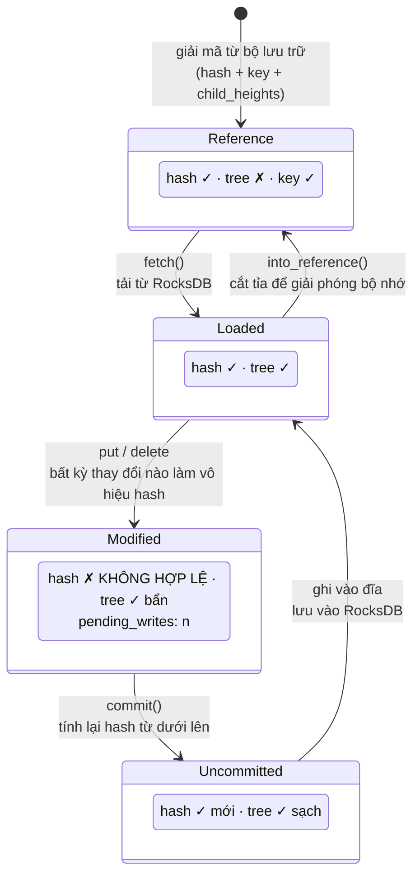
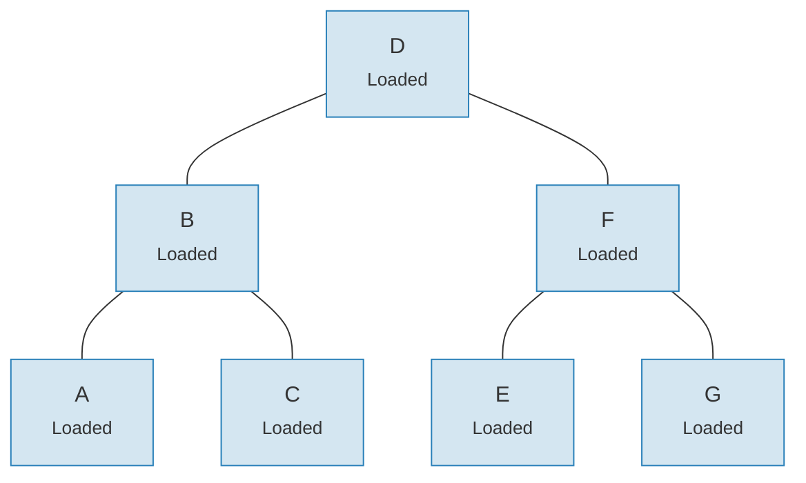
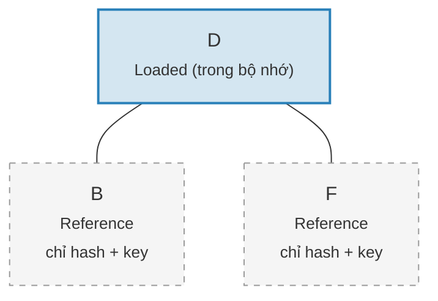

# Hệ thống Link — Kiến trúc tải dữ liệu lười

Việc tải toàn bộ cây Merk vào bộ nhớ sẽ cực kỳ tốn kém đối với các cây lớn. Hệ thống Link giải quyết vấn đề này bằng cách biểu diễn các kết nối con ở bốn trạng thái khác nhau, cho phép **tải dữ liệu lười** (lazy loading) — các nút con chỉ được lấy từ bộ lưu trữ khi thực sự cần thiết.

## Bốn trạng thái Link

```rust
// merk/src/tree/link.rs
pub enum Link {
    Reference {                    // Đã cắt tỉa: chỉ có metadata, không có cây trong bộ nhớ
        hash: CryptoHash,
        child_heights: (u8, u8),
        key: Vec<u8>,
        aggregate_data: AggregateData,
    },
    Modified {                     // Mới thay đổi, hash chưa được tính toán
        pending_writes: usize,
        child_heights: (u8, u8),
        tree: TreeNode,
    },
    Uncommitted {                  // Đã hash nhưng chưa lưu vào bộ lưu trữ
        hash: CryptoHash,
        child_heights: (u8, u8),
        tree: TreeNode,
        aggregate_data: AggregateData,
    },
    Loaded {                       // Đã tải đầy đủ từ bộ lưu trữ
        hash: CryptoHash,
        child_heights: (u8, u8),
        tree: TreeNode,
        aggregate_data: AggregateData,
    },
}
```

## Sơ đồ chuyển đổi trạng thái



## Mỗi trạng thái lưu trữ gì

| Trạng thái | Hash? | Cây trong bộ nhớ? | Mục đích |
|-------|-------|-----------------|---------|
| **Reference** | Có | Không | Biểu diễn nhỏ gọn trên đĩa. Chỉ lưu key, hash, chiều cao con và dữ liệu tổng hợp. |
| **Modified** | Không | Có | Sau bất kỳ thay đổi nào. Theo dõi số lượng `pending_writes` để tối ưu hóa lô. |
| **Uncommitted** | Có | Có | Sau khi tính hash nhưng trước khi ghi vào lưu trữ. Trạng thái trung gian trong quá trình commit. |
| **Loaded** | Có | Có | Đã được hiện thực hóa đầy đủ. Sẵn sàng cho đọc hoặc sửa đổi tiếp. |

Trường `pending_writes` trong `Modified` đáng chú ý:

```rust
// Được tính là: 1 + left_pending_writes + right_pending_writes
pending_writes: 1 + tree.child_pending_writes(true)
                  + tree.child_pending_writes(false),
```

Số đếm này giúp giai đoạn commit quyết định cách sắp xếp thứ tự ghi để đạt
hiệu suất tối ưu.

## Mẫu Fetch Callback

Hệ thống Link sử dụng **trait Fetch** để trừu tượng hóa cách tải các nút con:

```rust
pub trait Fetch {
    fn fetch(
        &self,
        link: &Link,
        value_defined_cost_fn: Option<&impl Fn(&[u8], &GroveVersion) -> Option<ValueDefinedCostType>>,
        grove_version: &GroveVersion,
    ) -> CostResult<TreeNode, Error>;
}
```

Các triển khai fetch khác nhau phục vụ các mục đích khác nhau:

- **StorageFetch**: Tải từ RocksDB (đường dẫn thông thường)
- **PanicSource**: Dùng trong test, nơi fetch không bao giờ nên xảy ra
- **MockSource**: Trả về dữ liệu test có kiểm soát

Mẫu này cho phép các thao tác cây **không phụ thuộc vào bộ lưu trữ** — cùng
một logic cân bằng và thay đổi hoạt động bất kể dữ liệu đến từ đâu.

## Mẫu Walker

`Walker` bọc một `TreeNode` với nguồn `Fetch`, cung cấp duyệt cây an toàn
với tải lười tự động (`merk/src/tree/walk/mod.rs`):

```rust
pub struct Walker<S: Fetch + Sized + Clone> {
    tree: Owner<TreeNode>,
    source: S,
}
```

Walker cung cấp ba thao tác chính:

**walk()** — Tách một con, biến đổi nó, và gắn lại:

```rust
pub fn walk<F, T>(self, left: bool, f: F, ...) -> CostResult<Self, Error>
where
    F: FnOnce(Option<Self>) -> CostResult<Option<T>, Error>,
    T: Into<TreeNode>,
```

**detach()** — Gỡ một con, tải nó từ bộ lưu trữ nếu cần:

```rust
pub fn detach(self, left: bool, ...) -> CostResult<(Self, Option<Self>), Error>
```

Nếu con là `Link::Reference` (đã cắt tỉa), detach sẽ gọi `fetch()` để tải
nó trước. Nếu con đã trong bộ nhớ (`Modified`, `Uncommitted`, `Loaded`),
nó chỉ đơn giản lấy quyền sở hữu.

**attach()** — Kết nối một con với cha:

```rust
pub fn attach(self, left: bool, maybe_child: Option<Self>) -> Self
```

Gắn luôn tạo ra `Link::Modified` vì mối quan hệ cha-con đã thay đổi.

## Hiệu quả bộ nhớ thông qua cắt tỉa

Sau khi commit các thay đổi, cây có thể **cắt tỉa** (prune) các cây con đã tải
trở lại `Link::Reference`, giải phóng bộ nhớ trong khi giữ lại hash cần thiết
cho việc tạo bằng chứng:

**Trước khi cắt tỉa** — tất cả 7 nút trong bộ nhớ:



**Sau khi cắt tỉa** — chỉ gốc trong bộ nhớ, các con là `Link::Reference` (chỉ hash + key):



> **Link::Loaded** giữ `hash + child_heights + tree (TreeNode)`. **Link::Reference** chỉ giữ `hash + child_heights + key` — TreeNode được giải phóng khỏi bộ nhớ.

Phép biến đổi rất đơn giản:

```rust
pub fn into_reference(self) -> Link {
    Link::Reference {
        hash: self.hash(),
        child_heights: self.child_heights(),
        key: self.key().to_vec(),
        aggregate_data: self.aggregate_data(),
    }
}
```

Điều này rất quan trọng để giữ mức sử dụng bộ nhớ có giới hạn trong các cây lớn — chỉ các nút đang được truy cập tích cực mới cần trong bộ nhớ.

---
