# Cây Merk — Cây AVL Merkle

Cây Merk là khối xây dựng cơ bản của GroveDB. Mỗi cây con trong grove là một cây
Merk — một cây tìm kiếm nhị phân tự cân bằng, trong đó mọi nút đều được băm bằng
mật mã, tạo ra một hash gốc (root hash) duy nhất xác thực toàn bộ nội dung của cây.

## Nút Merk là gì?

Khác với nhiều cách triển khai cây Merkle nơi dữ liệu chỉ nằm ở các lá, trong
cây Merk **mọi nút đều lưu trữ một cặp khóa-giá trị**. Điều này có nghĩa là không
có nút nội bộ "rỗng" — cây vừa là cấu trúc tìm kiếm vừa là kho dữ liệu cùng lúc.

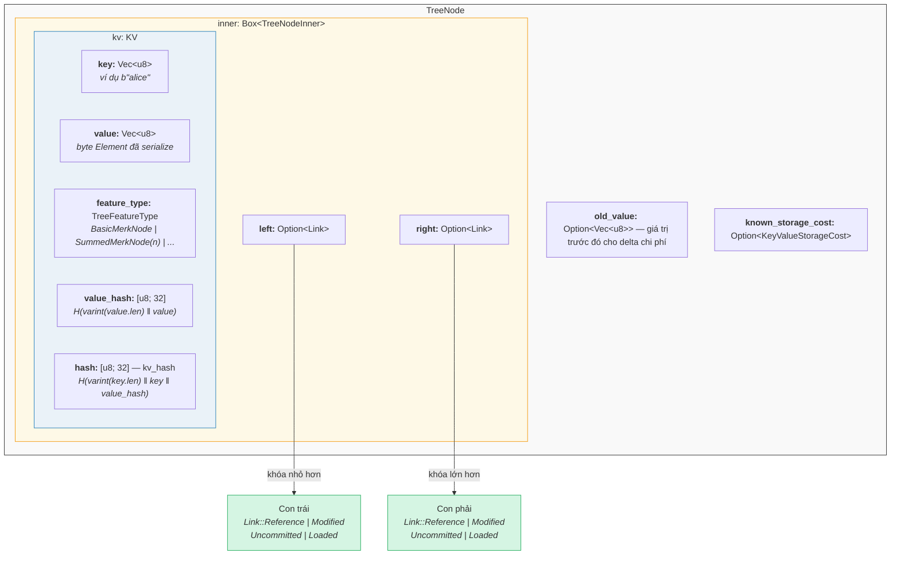

Trong mã nguồn (`merk/src/tree/mod.rs`):

```rust
pub struct TreeNode {
    pub(crate) inner: Box<TreeNodeInner>,
    pub(crate) old_value: Option<Vec<u8>>,        // Giá trị trước đó cho theo dõi chi phí
    pub(crate) known_storage_cost: Option<KeyValueStorageCost>,
}

pub struct TreeNodeInner {
    pub(crate) left: Option<Link>,    // Con trái (khóa nhỏ hơn)
    pub(crate) right: Option<Link>,   // Con phải (khóa lớn hơn)
    pub(crate) kv: KV,               // Dữ liệu khóa-giá trị
}
```

`Box<TreeNodeInner>` giữ nút trên heap, điều này rất quan trọng vì các liên kết con
có thể đệ quy chứa toàn bộ các thể hiện `TreeNode`.

## Cấu trúc KV

Struct `KV` chứa cả dữ liệu thô và các digest mật mã
(`merk/src/tree/kv.rs`):

```rust
pub struct KV {
    pub(super) key: Vec<u8>,                        // Khóa tra cứu
    pub(super) value: Vec<u8>,                      // Giá trị được lưu trữ
    pub(super) feature_type: TreeFeatureType,       // Hành vi tổng hợp
    pub(crate) value_defined_cost: Option<ValueDefinedCostType>,
    pub(super) hash: CryptoHash,                    // kv_hash
    pub(super) value_hash: CryptoHash,              // H(value)
}
```

Hai điểm quan trọng:

1. **Khóa không được lưu trên đĩa như một phần của nút mã hóa.** Chúng được lưu
   như khóa RocksDB. Khi một nút được giải mã từ lưu trữ, khóa được đưa vào từ
   bên ngoài. Điều này tránh trùng lặp byte khóa.

2. **Hai trường hash được duy trì.** `value_hash` là `H(value)` và `hash` (kv_hash)
   là `H(key, value_hash)`. Việc giữ cả hai cho phép hệ thống bằng chứng (proof system)
   chọn lượng thông tin cần tiết lộ.

## Bản chất bán cân bằng — Cách AVL "lắc lư"

Cây Merk là một **cây AVL** — cây tìm kiếm nhị phân tự cân bằng kinh điển được
phát minh bởi Adelson-Velsky và Landis. Bất biến chính là:

> Đối với mọi nút, chênh lệch chiều cao giữa cây con trái và phải tối đa là 1.

Điều này được biểu diễn bằng **hệ số cân bằng** (balance factor):

```text
balance_factor = right_height - left_height
```

Giá trị hợp lệ: **{-1, 0, 1}**

```rust
// merk/src/tree/mod.rs
pub const fn balance_factor(&self) -> i8 {
    let left_height = self.child_height(true) as i8;
    let right_height = self.child_height(false) as i8;
    right_height - left_height
}
```

Nhưng đây là điểm tinh tế: trong khi mỗi nút riêng lẻ chỉ có thể nghiêng một tầng,
những độ nghiêng này có thể **tích lũy** qua cây. Đó là lý do chúng ta gọi nó là
"bán cân bằng" — cây không hoàn toàn cân bằng như một cây nhị phân đầy đủ.

Xem xét một cây có 10 nút. Một cây cân bằng hoàn hảo sẽ có chiều cao 4
(⌈log₂(10+1)⌉). Nhưng một cây AVL có thể có chiều cao 5:

**Cân bằng hoàn hảo (chiều cao 4)** — mọi tầng đều đầy:

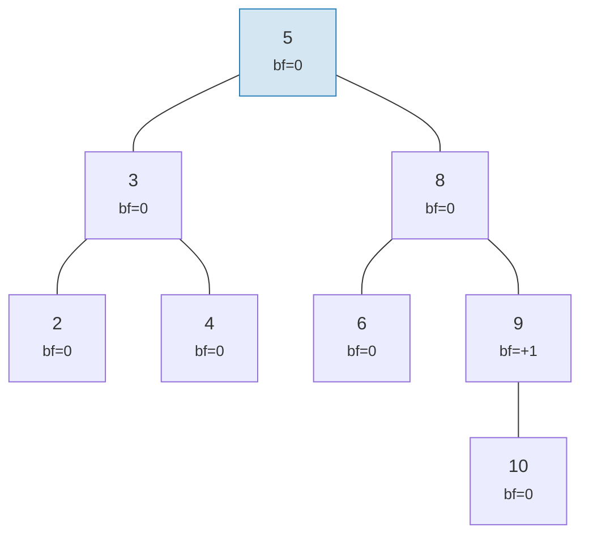

**"Lắc lư" hợp lệ AVL (chiều cao 5)** — mỗi nút nghiêng tối đa 1, nhưng nó tích lũy:

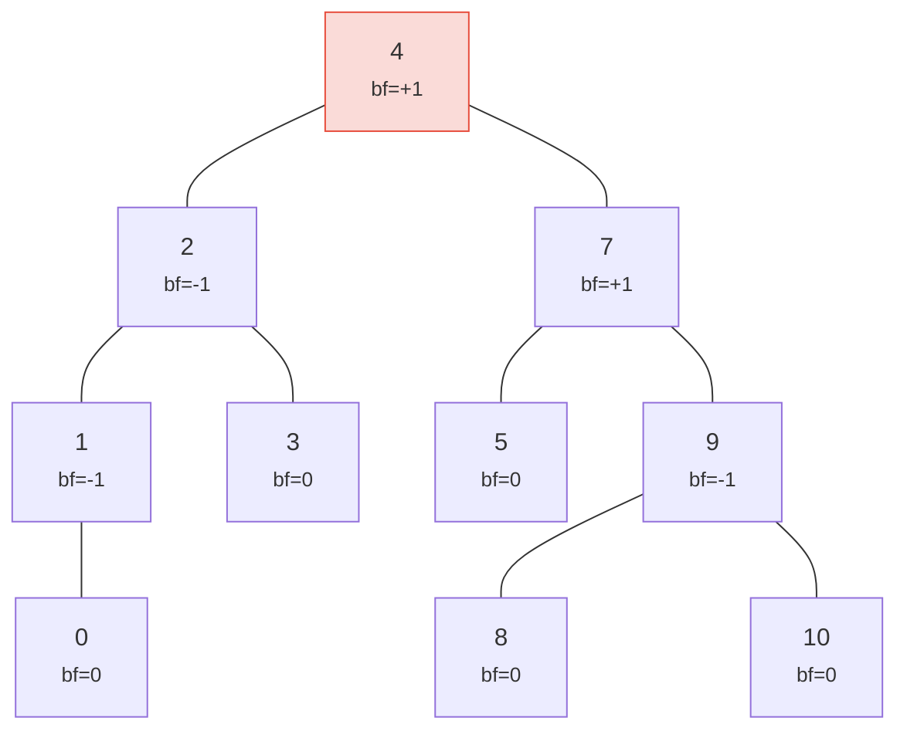

> Chiều cao 5 so với 4 hoàn hảo — đó là "độ lắc lư". Trường hợp xấu nhất: h ≤ 1.44 × log₂(n+2).

Cả hai cây đều là cây AVL hợp lệ! Chiều cao trường hợp xấu nhất của cây AVL là:

```text
h ≤ 1.4404 × log₂(n + 2) − 0.3277
```

Vậy với **n = 1.000.000** nút:
- Cân bằng hoàn hảo: chiều cao 20
- Trường hợp xấu nhất AVL: chiều cao ≈ 29

Mức tăng ~44% này là cái giá của các quy tắc phép quay đơn giản của AVL. Trong thực
tế, các phép chèn ngẫu nhiên tạo ra cây gần với cân bằng hoàn hảo hơn nhiều.

Đây là hình dáng của cây hợp lệ và không hợp lệ:

**HỢP LỆ** — tất cả hệ số cân bằng thuộc {-1, 0, +1}:

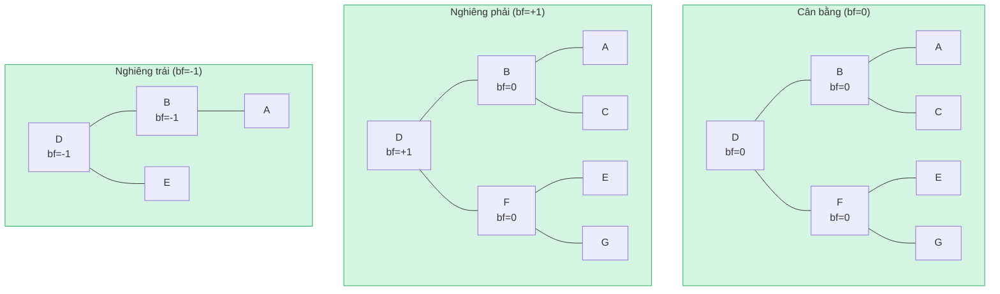

**KHÔNG HỢP LỆ** — hệ số cân bằng = +2 (cần phép quay!):

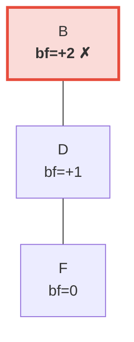

> Cây con phải cao hơn cây con trái (vốn trống) 2 tầng. Điều này kích hoạt **phép quay trái** để khôi phục bất biến AVL.

## Phép quay — Khôi phục cân bằng

Khi một phép chèn hoặc xóa khiến hệ số cân bằng đạt ±2, cây phải được
**quay** để khôi phục bất biến AVL. Có bốn trường hợp, có thể rút gọn thành
hai phép toán cơ bản.

### Phép quay trái đơn

Sử dụng khi một nút **nặng bên phải** (bf = +2) và con phải của nó
**nặng bên phải hoặc cân bằng** (bf ≥ 0):

**Trước** (bf=+2):

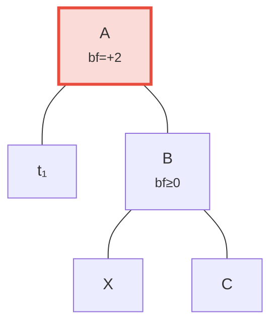

**Sau** phép quay trái — B được đưa lên làm gốc:

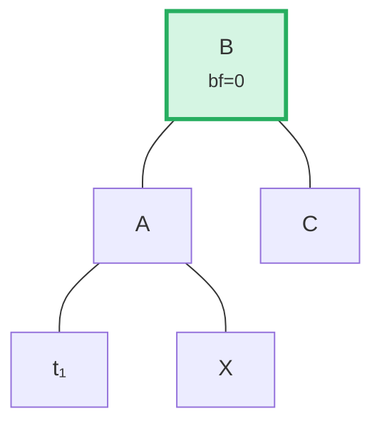

> **Các bước:** (1) Tách B khỏi A. (2) Tách X (con trái của B). (3) Gắn X làm con phải của A. (4) Gắn A làm con trái của B. Cây con gốc tại B giờ đã cân bằng.

Trong mã nguồn (`merk/src/tree/ops.rs`):

```rust
fn rotate<V>(self, left: bool, ...) -> CostResult<Self, Error> {
    // Tách con ở phía nặng
    let (tree, child) = self.detach_expect(left, ...);
    // Tách cháu từ phía đối diện của con
    let (child, maybe_grandchild) = child.detach(!left, ...);

    // Gắn cháu vào gốc ban đầu
    tree.attach(left, maybe_grandchild)
        .maybe_balance(...)
        .flat_map_ok(|tree| {
            // Gắn gốc ban đầu làm con của nút được đưa lên
            child.attach(!left, Some(tree))
                .maybe_balance(...)
        })
}
```

Lưu ý cách `maybe_balance` được gọi đệ quy — bản thân phép quay có thể tạo ra
sự mất cân bằng mới cần điều chỉnh thêm.

### Phép quay kép (Trái-Phải)

Sử dụng khi một nút **nặng bên trái** (bf = -2) nhưng con trái của nó
**nặng bên phải** (bf > 0). Một phép quay đơn sẽ không sửa được:

**Bước 0: Trước** — C nặng bên trái (bf=-2) nhưng con trái A nghiêng phải (bf=+1). Phép quay đơn sẽ không sửa được:

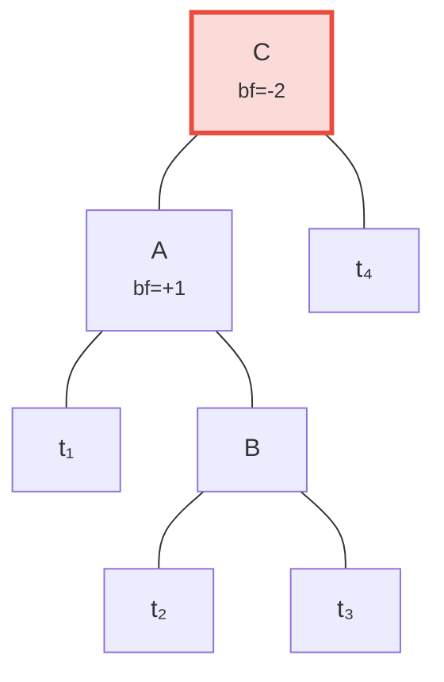

**Bước 1: Quay trái con A** — giờ cả C và B đều nghiêng trái, có thể sửa bằng phép quay đơn:

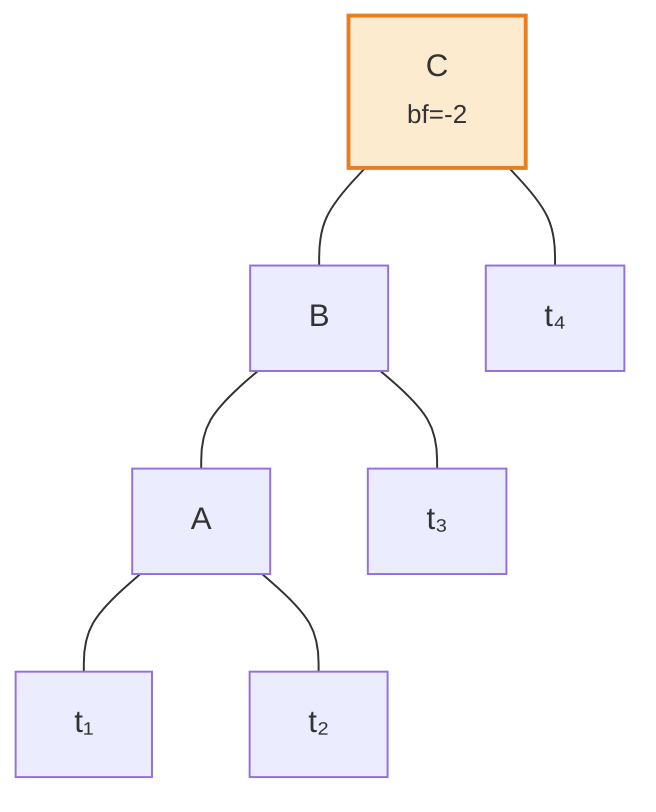

**Bước 2: Quay phải gốc C** — đã cân bằng!

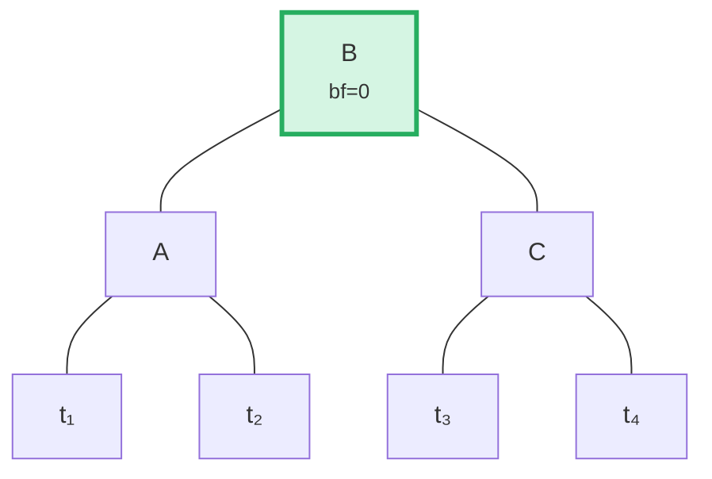

Thuật toán phát hiện trường hợp này bằng cách so sánh hướng nghiêng của cha với
hệ số cân bằng của con:

```rust
fn maybe_balance<V>(self, ...) -> CostResult<Self, Error> {
    let balance_factor = self.balance_factor();
    if balance_factor.abs() <= 1 {
        return Ok(self);  // Đã cân bằng
    }

    let left = balance_factor < 0;  // true nếu nặng bên trái

    // Cần quay kép khi con nghiêng ngược hướng cha
    let tree = if left == (self.tree().link(left).unwrap().balance_factor() > 0) {
        // Phép quay đầu tiên: quay con theo hướng ngược
        self.walk_expect(left, |child|
            child.rotate(!left, ...).map_ok(Some), ...
        )
    } else {
        self
    };

    // Phép quay thứ hai (hoặc duy nhất)
    tree.rotate(left, ...)
}
```

## Thao tác theo lô — Xây dựng và Áp dụng

Thay vì chèn từng phần tử một, Merk hỗ trợ các thao tác theo lô (batch) áp dụng
nhiều thay đổi trong một lượt. Điều này rất quan trọng cho hiệu suất: một lô
N thao tác trên cây M phần tử mất **O((M + N) log(M + N))** thời gian, so với
O(N log M) cho các phép chèn tuần tự.

### Kiểu MerkBatch

```rust
type MerkBatch<K> = [(K, Op)];

enum Op {
    Put(Vec<u8>, TreeFeatureType),  // Chèn hoặc cập nhật với giá trị và kiểu tính năng
    PutWithSpecializedCost(...),     // Chèn với chi phí được xác định trước
    PutCombinedReference(...),       // Chèn tham chiếu với hash kết hợp
    Replace(Vec<u8>, TreeFeatureType),
    Patch { .. },                    // Cập nhật giá trị một phần
    Delete,                          // Xóa khóa
    DeleteLayered,                   // Xóa với chi phí phân tầng
    DeleteMaybeSpecialized,          // Xóa với chi phí chuyên biệt tùy chọn
}
```

### Chiến lược 1: build() — Xây dựng từ đầu

Khi cây trống, `build()` xây dựng cây cân bằng trực tiếp từ lô đã sắp xếp
bằng thuật toán **chia tại trung vị** (median-split):

Lô đầu vào (đã sắp xếp): `[A, B, C, D, E, F, G]` — chọn phần tử giữa (D) làm gốc, đệ quy trên mỗi nửa:

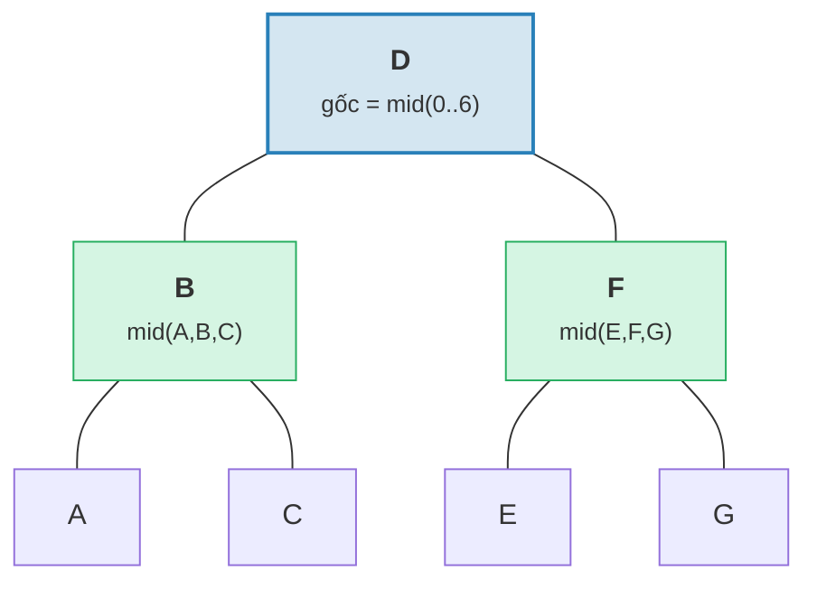

> Kết quả: cây cân bằng hoàn hảo với chiều cao = 3 = ⌈log₂(7)⌉.

```rust
fn build(batch: &MerkBatch<K>, ...) -> CostResult<Option<TreeNode>, Error> {
    let mid_index = batch.len() / 2;
    let (mid_key, mid_op) = &batch[mid_index];

    // Tạo nút gốc từ phần tử giữa
    let mid_tree = TreeNode::new(mid_key.clone(), value.clone(), None, feature_type)?;

    // Đệ quy xây dựng cây con trái và phải
    let left = Self::build(&batch[..mid_index], ...);
    let right = Self::build(&batch[mid_index + 1..], ...);

    // Gắn các con
    mid_tree.attach(true, left).attach(false, right)
}
```

Điều này tạo ra cây có chiều cao ⌈log₂(n)⌉ — cân bằng hoàn hảo.

### Chiến lược 2: apply_sorted() — Trộn vào cây hiện có

Khi cây đã có dữ liệu, `apply_sorted()` sử dụng **tìm kiếm nhị phân** để tìm
vị trí của mỗi thao tác trong lô, sau đó đệ quy áp dụng các thao tác lên
cây con trái và phải:

Cây hiện có với lô `[(B, Put), (F, Delete)]`:

Tìm kiếm nhị phân: B < D (đi trái), F > D (đi phải).

**Trước:**
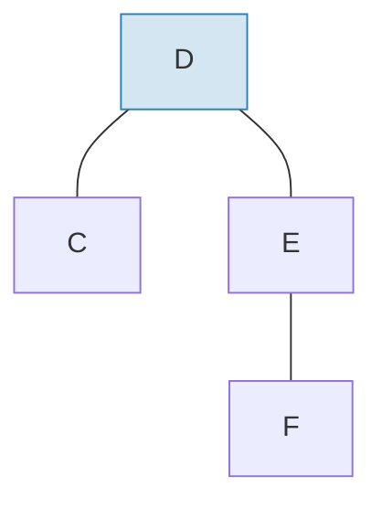

**Sau** khi áp dụng lô và tái cân bằng:
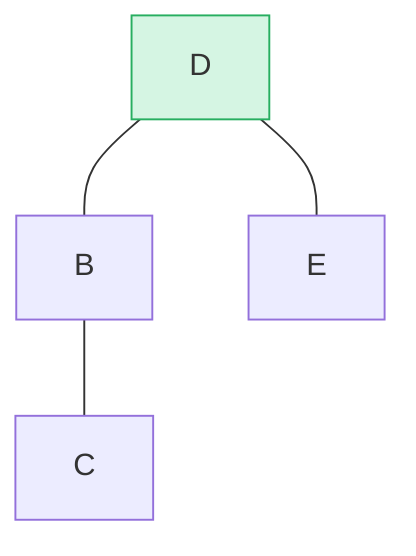

> B được chèn làm cây con trái, F bị xóa khỏi cây con phải. `maybe_balance()` xác nhận bf(D) = 0.

```rust
fn apply_sorted(self, batch: &MerkBatch<K>, ...) -> CostResult<...> {
    let search = batch.binary_search_by(|(key, _)| key.cmp(self.tree().key()));

    match search {
        Ok(index) => {
            // Khóa khớp với nút này — áp dụng thao tác trực tiếp
            // (Put thay thế giá trị, Delete xóa nút)
        }
        Err(mid) => {
            // Khóa không tìm thấy — mid là điểm chia
            // Đệ quy trên left_batch[..mid] và right_batch[mid..]
        }
    }

    self.recurse(batch, mid, exclusive, ...)
}
```

Phương thức `recurse` chia lô và đi sang trái và phải:

```rust
fn recurse(self, batch: &MerkBatch<K>, mid: usize, ...) {
    let left_batch = &batch[..mid];
    let right_batch = &batch[mid..];  // hoặc mid+1 nếu exclusive

    // Áp dụng lô trái lên cây con trái
    let tree = self.walk(true, |maybe_left| {
        Self::apply_to(maybe_left, left_batch, ...)
    });

    // Áp dụng lô phải lên cây con phải
    let tree = tree.walk(false, |maybe_right| {
        Self::apply_to(maybe_right, right_batch, ...)
    });

    // Tái cân bằng sau sửa đổi
    tree.maybe_balance(...)
}
```

### Xóa nút

Khi xóa một nút có hai con, Merk đưa lên **nút biên** (edge node) từ cây con
cao hơn. Điều này giảm thiểu khả năng cần phép quay bổ sung:

**Trước** — xóa D (có hai con, chiều cao cây con phải ≥ trái):

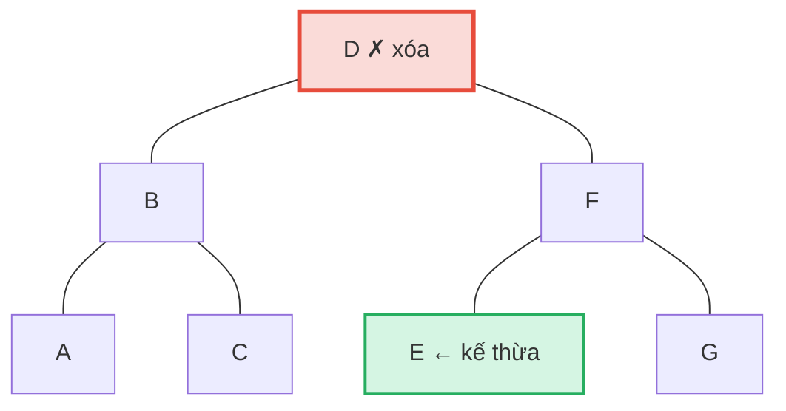

**Sau** — E (nút trái nhất trong cây con phải = nút kế thừa theo thứ tự) được đưa lên vị trí của D:

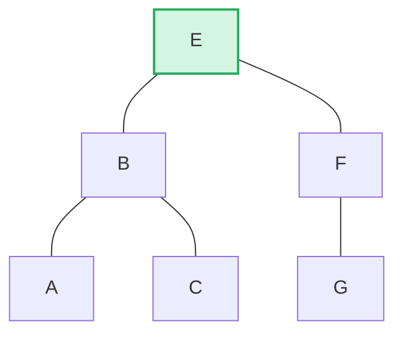

> **Quy tắc:** Nếu chiều cao trái > phải → đưa lên nút biên phải của cây con trái. Nếu chiều cao phải ≥ trái → đưa lên nút biên trái của cây con phải. Điều này giảm thiểu việc tái cân bằng sau xóa.

```rust
pub fn remove(self, ...) -> CostResult<Option<Self>, Error> {
    let has_left = tree.link(true).is_some();
    let has_right = tree.link(false).is_some();
    let left = tree.child_height(true) > tree.child_height(false);

    if has_left && has_right {
        // Hai con: đưa lên nút biên của con cao hơn
        let (tree, tall_child) = self.detach_expect(left, ...);
        let (_, short_child) = tree.detach_expect(!left, ...);
        tall_child.promote_edge(!left, short_child, ...)
    } else if has_left || has_right {
        // Một con: đưa lên trực tiếp
        self.detach_expect(left, ...).1
    } else {
        // Nút lá: chỉ cần xóa
        None
    }
}
```

---
