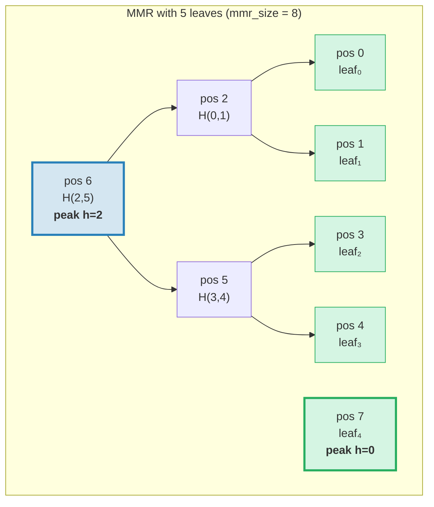
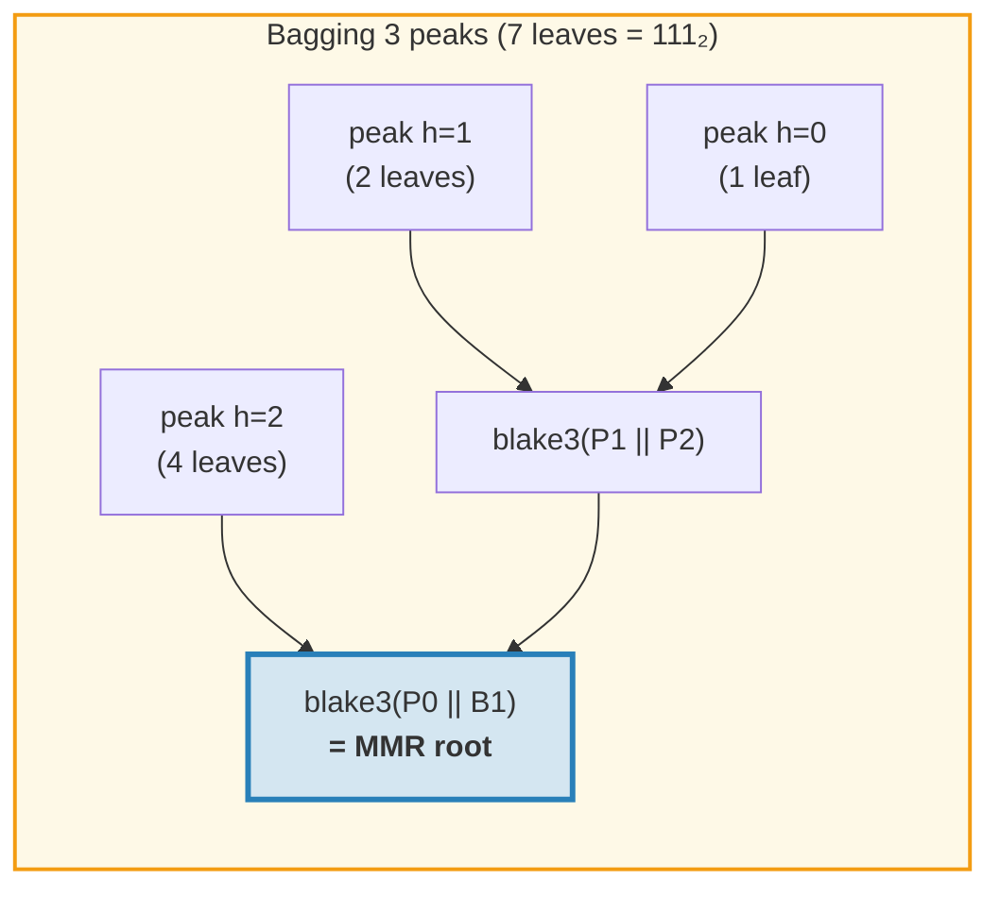
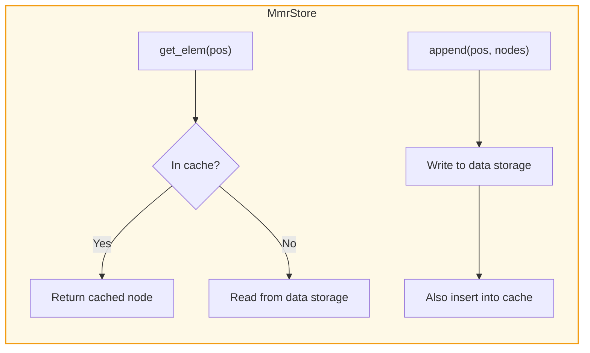
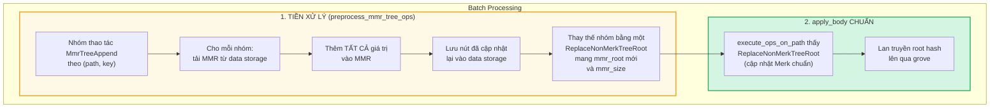
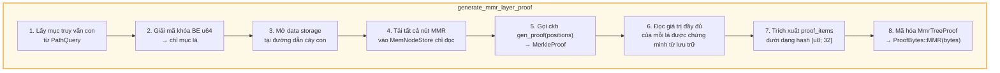
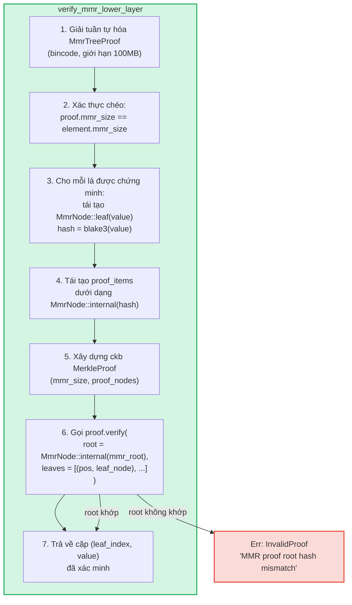

# Cây MMR -- Nhật ký xác thực chỉ thêm

**MmrTree** là cấu trúc dữ liệu xác thực chỉ thêm (append-only) của GroveDB, được xây dựng trên Merkle Mountain Range (MMR) với hash Blake3. Trong khi cây Merk AVL (Chương 2) xuất sắc trong các thao tác khóa-giá trị ngẫu nhiên với cập nhật O(log N), MMR được xây dựng chuyên biệt cho trường hợp chỉ thêm: không có phép quay, chi phí hash O(1) trung bình mỗi lần thêm, và mẫu I/O tuần tự.

Chương này đi sâu vào cấu trúc dữ liệu MMR -- cách nó phát triển, cách các nút được lưu trữ, cách các lần thêm lan truyền, và cách hệ thống chứng minh cho phép bất kỳ bên thứ ba nào xác minh rằng một giá trị cụ thể đã được thêm tại một vị trí cụ thể.

## Tại sao cần kiểu cây riêng?

Cây Merk tiêu chuẩn của GroveDB xử lý dữ liệu khóa-giá trị có thứ tự tốt, nhưng nhật ký chỉ thêm có yêu cầu khác:

| Thuộc tính | Cây AVL Merk | MMR |
|----------|--------------|-----|
| Thao tác | Chèn, cập nhật, xóa | Chỉ thêm |
| Tái cân bằng | O(log N) phép quay mỗi lần ghi | Không có |
| Mẫu I/O | Ngẫu nhiên (tái cân bằng chạm nhiều nút) | Tuần tự (nút mới luôn ở cuối) |
| Tổng hash cho N lần chèn | O(N log N) | O(N) |
| Cấu trúc | Xác định bởi thứ tự chèn | Xác định chỉ bởi số lá |
| Chứng minh | Đường dẫn từ gốc đến lá | Hash anh em + hash đỉnh |

Cho các trường hợp sử dụng như nhật ký giao dịch (transaction log), luồng sự kiện (event stream), hoặc bất kỳ dữ liệu tăng đơn điệu nào, MMR hoàn toàn tốt hơn: đơn giản hơn, nhanh hơn, và dễ dự đoán hơn.

## Cấu trúc dữ liệu MMR

MMR là một **rừng cây nhị phân hoàn hảo** (gọi là "đỉnh" -- peak) phát triển từ trái sang phải. Mỗi đỉnh là một cây nhị phân hoàn chỉnh có chiều cao *h* nào đó, chứa chính xác 2^h lá.

Ý tưởng chính: **biểu diễn nhị phân của số lá xác định cấu trúc đỉnh**. Mỗi bit 1 trong dạng nhị phân tương ứng với một đỉnh:

```text
Leaf count    Binary    Peaks
─────────     ──────    ─────
1             1         one peak h=0
2             10        one peak h=1
3             11        peaks h=1, h=0
4             100       one peak h=2
5             101       peaks h=2, h=0
6             110       peaks h=2, h=1
7             111       peaks h=2, h=1, h=0
8             1000      one peak h=3
```

Điều này có nghĩa cấu trúc MMR được xác định hoàn toàn bởi một số duy nhất -- số lá. Hai MMR có cùng số lá luôn có cùng hình dạng, bất kể giá trị nào đã được thêm.

## Cách MMR được lấp đầy

Mỗi nút trong MMR có một **vị trí** (position, chỉ mục từ 0). Lá và nút bên trong được xen kẽ theo mẫu cụ thể. Đây là sự phát triển từng bước:

**Sau 1 lá (mmr_size = 1):**
```text
pos:  0
      leaf₀        ← một đỉnh tại chiều cao 0
```

**Sau 2 lá (mmr_size = 3):**
```text
pos:     2          ← nút bên trong: blake3(leaf₀.hash || leaf₁.hash)
        / \
       0   1        ← lá

Một đỉnh tại chiều cao 1. Vị trí 0 và 1 là lá, vị trí 2 là nút bên trong.
```
Khi leaf₁ được thêm, nó tạo một đỉnh chiều cao 0. Nhưng đã có sẵn một đỉnh chiều cao 0 (leaf₀), nên chúng **hợp nhất** thành đỉnh chiều cao 1.

**Sau 3 lá (mmr_size = 4):**
```text
pos:     2     3    ← đỉnh h=1, đỉnh h=0
        / \
       0   1

Hai đỉnh. Không hợp nhất — chiều cao 1 và 0 khác nhau.
(Nhị phân: 3 = 11₂ → một đỉnh cho mỗi bit 1)
```

**Sau 4 lá (mmr_size = 7):**
```text
pos:         6              ← nút bên trong: hợp nhất nút 2 và 5
           /   \
         2       5          ← nút bên trong
        / \     / \
       0   1   3   4        ← lá

Một đỉnh tại chiều cao 2.
```
Đây là nơi mọi thứ trở nên thú vị. Thêm leaf₃ (vị trí 4) tạo node₅ (hợp nhất vị trí 3 và 4). Nhưng bây giờ node₅ (chiều cao 1) và node₂ (chiều cao 1) là hai đỉnh liền kề cùng chiều cao, nên chúng hợp nhất thành node₆. **Một chuỗi hai lần hợp nhất từ một lần thêm duy nhất.**

**Sau 5 lá (mmr_size = 8):**
```text
pos:         6         7    ← đỉnh h=2, đỉnh h=0
           /   \
         2       5
        / \     / \
       0   1   3   4

Hai đỉnh. (Nhị phân: 5 = 101₂)
```

**Sau 7 lá (mmr_size = 11):**
```text
pos:         6         10    ← đỉnh h=2, đỉnh h=1, đỉnh h=0
           /   \      / \
         2       5   8   9    7
        / \     / \
       0   1   3   4

Ba đỉnh. (Nhị phân: 7 = 111₂)
```

**Sau 8 lá (mmr_size = 15):**
```text
pos:              14                     ← đỉnh duy nhất h=3
               /      \
            6            13
          /   \        /    \
        2       5    9       12
       / \     / \  / \     / \
      0   1   3  4 7   8  10  11

Một đỉnh tại chiều cao 3. Ba lần hợp nhất liên tiếp từ việc thêm leaf₇.
```



> **Xanh dương** = đỉnh (gốc của cây con nhị phân hoàn hảo). **Xanh lá** = nút lá.

## Chuỗi hợp nhất (Merge Cascade)

Khi một lá mới được thêm, nó có thể kích hoạt một chuỗi hợp nhất. Số lần hợp nhất bằng số **bit 1 ở cuối** (trailing 1-bits) trong biểu diễn nhị phân của số lá hiện tại:

| Số lá (trước khi thêm) | Nhị phân | bit 1 ở cuối | Hợp nhất | Tổng hash |
|--------------------------|--------|-------------|--------|--------------|
| 0 | `0` | 0 | 0 | 1 (chỉ lá) |
| 1 | `1` | 1 | 1 | 2 |
| 2 | `10` | 0 | 0 | 1 |
| 3 | `11` | 2 | 2 | 3 |
| 4 | `100` | 0 | 0 | 1 |
| 5 | `101` | 1 | 1 | 2 |
| 6 | `110` | 0 | 0 | 1 |
| 7 | `111` | 3 | 3 | 4 |

**Tổng hash mỗi lần thêm** = `1 + trailing_ones(leaf_count)`:
- 1 hash cho bản thân lá: `blake3(value)`
- N hash cho chuỗi hợp nhất: `blake3(left.hash || right.hash)` cho mỗi lần hợp nhất

Đây là cách GroveDB theo dõi chi phí hash cho mỗi lần thêm. Triển khai:
```rust
pub fn hash_count_for_push(leaf_count: u64) -> u32 {
    1 + leaf_count.trailing_ones()
}
```

## Kích thước MMR so với số lá

MMR lưu cả lá và nút bên trong trong không gian vị trí phẳng, nên `mmr_size` luôn lớn hơn số lá. Mối quan hệ chính xác là:

```text
mmr_size = 2 * leaf_count - popcount(leaf_count)
```

trong đó `popcount` là số bit 1 (tức là số đỉnh). Mỗi nút bên trong hợp nhất hai cây con, giảm số nút đi một cho mỗi lần hợp nhất.

Tính toán ngược -- số lá từ mmr_size -- sử dụng vị trí các đỉnh:

```rust
fn mmr_size_to_leaf_count(mmr_size: u64) -> u64 {
    // Mỗi đỉnh tại chiều cao h chứa 2^h lá
    get_peaks(mmr_size).iter()
        .map(|&peak_pos| 1u64 << pos_height_in_tree(peak_pos))
        .sum()
}
```

| mmr_size | leaf_count | peaks (đỉnh) |
|----------|-----------|-------|
| 0 | 0 | (rỗng) |
| 1 | 1 | h=0 |
| 3 | 2 | h=1 |
| 4 | 3 | h=1, h=0 |
| 7 | 4 | h=2 |
| 8 | 5 | h=2, h=0 |
| 10 | 6 | h=2, h=1 |
| 11 | 7 | h=2, h=1, h=0 |
| 15 | 8 | h=3 |

GroveDB lưu `mmr_size` trong Element (không phải số lá) vì thư viện ckb MMR sử dụng vị trí nội bộ. Thao tác `mmr_tree_leaf_count` tính số lá tức thì.

## Root Hash MMR -- Đóng gói các đỉnh (Bagging the Peaks)

MMR có nhiều đỉnh (một cho mỗi bit 1 trong số lá). Để tạo ra một root hash 32 byte duy nhất, các đỉnh được **"đóng gói"** từ phải sang trái:

```text
root = bag_rhs_peaks(peaks):
    bắt đầu với đỉnh bên phải nhất
    gấp sang trái: blake3(left_peak || accumulated_right)
```

Với 1 đỉnh, root chỉ là hash của đỉnh đó. Với 3 đỉnh:



> Root hash thay đổi với **mỗi** lần thêm, ngay cả khi không có hợp nhất nào xảy ra, vì đỉnh bên phải nhất thay đổi và phải tính lại đóng gói.

## Cấu trúc nút và tuần tự hóa

Mỗi nút MMR là một `MmrNode`:

```rust
struct MmrNode {
    hash: [u8; 32],           // Blake3 hash
    value: Option<Vec<u8>>,   // Some cho lá, None cho nút bên trong
}
```

**Nút lá:** `hash = blake3(value_bytes)`, `value = Some(value_bytes)`
**Nút bên trong:** `hash = blake3(left.hash || right.hash)`, `value = None`

Hàm hợp nhất đơn giản -- nối hai hash 32 byte và Blake3 kết quả:

```rust
fn blake3_merge(left: &[u8; 32], right: &[u8; 32]) -> [u8; 32] {
    let mut input = [0u8; 64];
    input[..32].copy_from_slice(left);
    input[32..].copy_from_slice(right);
    *blake3::hash(&input).as_bytes()
}
```

> **Lưu ý về PartialEq:** `MmrNode` triển khai `PartialEq` bằng cách so sánh **chỉ trường hash**, không phải value. Điều này rất quan trọng cho xác minh chứng minh: trình xác minh ckb so sánh root được tái tạo (value = None) với root mong đợi. Nếu PartialEq so sánh trường value, chứng minh MMR một lá sẽ luôn thất bại vì lá có `value: Some(...)` nhưng tái tạo root tạo ra `value: None`.

**Định dạng tuần tự hóa:**
```text
Internal: [0x00] [hash: 32 bytes]                                = 33 bytes
Leaf:     [0x01] [hash: 32 bytes] [value_len: 4 BE] [value...]   = 37 + len bytes
```

Byte cờ phân biệt nút bên trong với lá. Giải tuần tự hóa xác thực độ dài chính xác -- không cho phép byte thừa ở cuối.

## Kiến trúc lưu trữ

MmrTree lưu các nút trong cột **data** (cùng column family được sử dụng bởi nút Merk), không phải trong cây con Merk. Element không có trường `root_key` -- root hash MMR chảy như **child hash** của Merk qua `insert_subtree(subtree_root_hash)`, xác thực trạng thái MMR.

**Khóa lưu trữ** dựa trên vị trí:
```text
key = 'm' || position_as_be_u64    (9 byte: tiền tố + u64 BE)
```

Vì vậy vị trí 42 được lưu tại khóa `[0x6D, 0x00, 0x00, 0x00, 0x00, 0x00, 0x00, 0x00, 0x2A]`.

Tra cứu lá *i* yêu cầu tính vị trí MMR trước: `pos = leaf_index_to_pos(i)`, sau đó đọc khóa data `m{pos}`.

**Bộ nhớ đệm ghi xuyên suốt (write-through cache):** Trong quá trình thêm, các nút mới ghi phải đọc được ngay lập tức cho các hợp nhất tiếp theo trong cùng lần thêm. Vì lưu trữ giao dịch của GroveDB hoãn ghi vào lô (chúng không hiển thị cho đọc cho đến khi commit), adapter `MmrStore` bọc ngữ cảnh lưu trữ với bộ nhớ đệm `HashMap` trong bộ nhớ:



Điều này đảm bảo khi thêm leaf₃ kích hoạt chuỗi hợp nhất (tạo nút bên trong tại vị trí 5 và 6), node₅ có sẵn ngay lập tức khi tính node₆, mặc dù node₅ chưa được commit vào RocksDB.

**Lan truyền root hash đến state root của GroveDB:**

```text
combined_value_hash = blake3(
    blake3(varint(len) || element_bytes),   ← value_hash từ Element tuần tự hóa
    mmr_root_hash                           ← child_hash = root đặc trưng theo kiểu
)
```

Root hash MMR chảy như Merk child hash qua `insert_subtree`. Bất kỳ thay đổi nào đến trạng thái MMR tạo ra `combined_value_hash` khác, lan truyền lên qua phân cấp Merk cha cho đến state root của GroveDB.

## Các thao tác GroveDB

MmrTree cung cấp bốn thao tác:

```rust
// Thêm một giá trị — trả về (new_mmr_root, leaf_index)
db.mmr_tree_append(path, key, value, tx, version)

// Đọc root hash hiện tại (từ Element, không cần truy cập lưu trữ)
db.mmr_tree_root_hash(path, key, tx, version)

// Lấy giá trị lá theo chỉ mục 0-based
db.mmr_tree_get_value(path, key, leaf_index, tx, version)

// Lấy số lá đã thêm
db.mmr_tree_leaf_count(path, key, tx, version)
```

### Luồng thêm (Append Flow)

Thao tác thêm phức tạp nhất, thực hiện 8 bước:

```mermaid
graph TD
    subgraph append["mmr_tree_append(path, key, value, tx)"]
        A1["1. Đọc Element tại path/key<br/>→ lấy mmr_size, flags"]
        A2["2. Mở data storage tại<br/>cây con path/key"]
        A3["3. Tạo MmrNode::leaf(value)<br/>hash = blake3(value)"]
        A4["4. Thêm lá vào ckb MMR<br/>→ hợp nhất liên tiếp ghi<br/>nút bên trong mới"]
        A5["5. Commit → đẩy nút mới<br/>vào lưu trữ"]
        A6["6. Đóng gói đỉnh → mmr_root mới"]
        A7["7. Cập nhật Element với<br/>mmr_root và mmr_size mới"]
        A8["8. Lan truyền thay đổi lên<br/>qua phân cấp Merk<br/>GroveDB + commit tx"]

        A1 --> A2 --> A3 --> A4 --> A5 --> A6 --> A7 --> A8
    end

    style append fill:#d5f5e3,stroke:#27ae60,stroke-width:2px
    style A6 fill:#d4e6f1,stroke:#2980b9,stroke-width:2px
```



Bước 4 có thể ghi 1 nút (chỉ lá) hoặc 1 + N nút (lá + N nút hợp nhất bên trong). Bước 5 gọi `mmr.commit()` đẩy MemStore của ckb vào MmrStore. Bước 7 gọi `insert_subtree` với root MMR mới làm child hash (qua `subtree_root_hash`), vì MmrTree không có Merk con.

### Thao tác đọc

`mmr_tree_root_hash` tính root từ dữ liệu MMR trong lưu trữ.
`mmr_tree_leaf_count` tính số lá từ `mmr_size` trong Element. Không cần truy cập lưu trữ dữ liệu.

`mmr_tree_get_value` tính `pos = leaf_index_to_pos(leaf_index)`, đọc mục data storage đơn lẻ tại `m{pos}`, giải tuần tự hóa `MmrNode`, và trả về `node.value`.

## Thao tác theo lô

Nhiều lần thêm MMR có thể được đưa vào lô bằng `GroveOp::MmrTreeAppend { value }`. Vì hàm lô chuẩn `execute_ops_on_path` chỉ có quyền truy cập Merk (không phải ngữ cảnh lưu trữ của MMR), các lần thêm MMR sử dụng **pha tiền xử lý**:



Ví dụ: Một lô với 3 lần thêm vào cùng MMR:
```rust
vec![
    QualifiedGroveDbOp { path: p, key: k, op: MmrTreeAppend { value: v1 } },
    QualifiedGroveDbOp { path: p, key: k, op: MmrTreeAppend { value: v2 } },
    QualifiedGroveDbOp { path: p, key: k, op: MmrTreeAppend { value: v3 } },
]
```

Tiền xử lý tải MMR một lần, thêm v1, v2, v3 (tạo tất cả nút trung gian), lưu mọi thứ vào data storage, sau đó phát ra một `ReplaceNonMerkTreeRoot` duy nhất với `mmr_root` và `mmr_size` cuối cùng. Máy xử lý lô chuẩn xử lý phần còn lại.

## Tạo chứng minh

Chứng minh MMR là **chứng minh V1** -- chúng sử dụng biến thể `ProofBytes::MMR` trong cấu trúc chứng minh phân lớp (xem mục 9.6). Chứng minh cho thấy các giá trị lá cụ thể tồn tại tại các vị trí cụ thể trong MMR, và hash của chúng nhất quán với `mmr_root` được lưu trong phần tử cha.

### Mã hóa truy vấn

Khóa truy vấn mã hóa vị trí dưới dạng **byte u64 big-endian**. Điều này bảo toàn thứ tự sắp xếp từ vựng (vì mã hóa BE là đơn điệu), cho phép tất cả biến thể `QueryItem` chuẩn hoạt động:

```text
QueryItem::Key([0,0,0,0,0,0,0,5])            → chỉ mục lá 5
QueryItem::RangeInclusive([..2]..=[..7])      → chỉ mục lá [2, 3, 4, 5, 6, 7]
QueryItem::RangeFrom([..10]..)                → chỉ mục lá [10, 11, ..., N-1]
QueryItem::RangeFull                          → tất cả lá [0..leaf_count)
```

Giới hạn an toàn **10.000.000 chỉ mục** ngăn cạn kiệt bộ nhớ từ truy vấn phạm vi không giới hạn. MMR rỗng (không có lá) trả về chứng minh rỗng.

### Cấu trúc MmrTreeProof

```rust
struct MmrTreeProof {
    mmr_size: u64,                 // Kích thước MMR tại thời điểm chứng minh
    leaves: Vec<(u64, Vec<u8>)>,   // (leaf_index, value) cho mỗi lá được chứng minh
    proof_items: Vec<[u8; 32]>,    // Hash anh em/đỉnh cho xác minh
}
```

`proof_items` chứa tập hash tối thiểu cần thiết để tái tạo đường dẫn từ các lá được chứng minh lên root MMR. Đây là các nút anh em tại mỗi cấp và hash đỉnh không liên quan.

### Luồng tạo



Bước 4 sử dụng `MemNodeStore` -- BTreeMap chỉ đọc tải trước tất cả nút MMR từ data storage. Bộ tạo chứng minh ckb cần truy cập ngẫu nhiên, nên tất cả nút phải ở trong bộ nhớ.

Bước 5 là nơi thư viện ckb thực hiện phần nặng: cho kích thước MMR và các vị trí cần chứng minh, nó xác định hash anh em và đỉnh nào cần thiết.

### Ví dụ chi tiết

**Chứng minh lá 2 trong MMR 5 lá (mmr_size = 8):**

```text
Cấu trúc MMR:
pos:         6         7
           /   \
         2       5
        / \     / \
       0   1   3   4

Chỉ mục lá 2 → vị trí MMR 3

Để xác minh lá tại vị trí 3:
  1. Hash giá trị: leaf_hash = blake3(value)
  2. Anh em tại vị trí 4:  node₅ = blake3(leaf_hash || proof[pos 4])
  3. Anh em tại vị trí 2:  node₆ = blake3(proof[pos 2] || node₅)
  4. Đỉnh tại vị trí 7:     root  = bag(node₆, proof[pos 7])
  5. So sánh: root == mmr_root mong đợi ✓

proof_items = [hash(pos 4), hash(pos 2), hash(pos 7)]
leaves = [(2, original_value_bytes)]
```

Kích thước chứng minh cho ví dụ này là: 3 hash (96 byte) + 1 giá trị lá + metadata. Nói chung, chứng minh K lá từ MMR N lá yêu cầu O(K * log N) hash anh em.

## Xác minh chứng minh

Xác minh là **thuần túy** -- không cần truy cập cơ sở dữ liệu. Trình xác minh chỉ cần byte chứng minh và root hash MMR mong đợi (được trích xuất từ phần tử cha đã được chứng minh trong lớp Merk phía trên).

### Các bước xác minh



Hàm `MerkleProof::verify` của ckb tái tạo root từ các lá và proof items, sau đó so sánh (sử dụng `PartialEq`, chỉ kiểm tra hash) với root mong đợi.

### Chuỗi tin cậy

Chuỗi đầy đủ từ state root của GroveDB đến giá trị lá đã xác minh:

```text
GroveDB state_root (đã biết/tin cậy)
│
├─ Chứng minh Merk V0 lớp 0: chứng minh cây con tồn tại tại gốc
│   └─ root_hash khớp state_root ✓
│
├─ Chứng minh Merk V0 lớp 1: chứng minh phần tử MmrTree tại path/key
│   └─ Nút KVValueHash: element_bytes chứa mmr_root
│   └─ combined_hash = combine_hash(H(element_bytes), mmr_root)
│   └─ root_hash khớp lớp cha ✓
│
└─ Chứng minh MMR V1: chứng minh giá trị lá nằm trong MMR
    └─ Tái tạo đường dẫn từ lá qua anh em đến đỉnh
    └─ Đóng gói đỉnh → root được tái tạo
    └─ root được tái tạo == mmr_root từ element_bytes ✓
    └─ Kết quả: leaf₂ = [byte giá trị đã xác minh]
```

### Thuộc tính bảo mật

- **Xác thực chéo mmr_size:** `mmr_size` của chứng minh phải khớp `mmr_size` của element. Sự không khớp cho thấy chứng minh được tạo từ trạng thái khác và bị từ chối.
- **Giới hạn kích thước Bincode:** Giải tuần tự hóa sử dụng giới hạn 100MB để ngăn header độ dài giả tạo gây phân bổ bộ nhớ lớn.
- **Tính toán giới hạn:** Mỗi lá được chứng minh giảm giới hạn truy vấn tổng thể đi 1 bằng `saturating_sub` để ngăn tràn số.
- **Trả về child hash:** Trình xác minh trả về root MMR đã tính toán làm child hash cho tính toán combine_hash trong lớp cha.
- **Từ chối V0:** Cố gắng truy vấn con vào MmrTree với chứng minh V0 trả về `Error::NotSupported`. Chỉ chứng minh V1 mới có thể đi sâu vào cây không phải Merk.

## Theo dõi chi phí

Các thao tác MMR theo dõi chi phí chính xác:

| Thao tác | Số lần gọi hash | Thao tác lưu trữ |
|-----------|-----------|-------------------|
| Thêm 1 lá | `1 + trailing_ones(leaf_count)` | 1 ghi lá + N ghi bên trong |
| Root hash | 0 (lưu trong Element) | 1 đọc Element |
| Lấy giá trị | 0 | 1 đọc Element + 1 đọc data |
| Số lá | 0 | 1 đọc Element |

Công thức hash `1 + trailing_ones(N)` cho số lần gọi Blake3 chính xác: 1 cho hash lá, cộng thêm một hash hợp nhất cho mỗi cấp chuỗi.

**Phân tích trung bình:** Qua N lần thêm, tổng số hash là:

```text
Σ (1 + trailing_ones(i)) for i = 0..N-1
= N + Σ trailing_ones(i) for i = 0..N-1
= N + (N - popcount(N))
≈ 2N
```

Vậy chi phí trung bình mỗi lần thêm xấp xỉ **2 lần gọi hash Blake3** -- hằng số và không phụ thuộc kích thước cây. So sánh với cây Merk AVL nơi mỗi lần chèn yêu cầu O(log N) hash cho đường dẫn cộng thêm hash phép quay tiềm năng.

**Chi phí lưu trữ:** Mỗi lần thêm ghi 1 nút lá (37 + value_len byte) cộng 0 đến log₂(N) nút bên trong (33 byte mỗi nút). Ghi lưu trữ trung bình mỗi lần thêm xấp xỉ 33 + 37 + value_len byte = 70 + value_len byte.

## Tệp triển khai

| Tệp | Mục đích |
|------|---------|
| `grovedb-mmr/src/node.rs` | Struct `MmrNode`, hợp nhất Blake3, tuần tự hóa |
| `grovedb-mmr/src/grove_mmr.rs` | Wrapper `GroveMmr` quanh ckb MMR |
| `grovedb-mmr/src/util.rs` | `mmr_node_key`, `hash_count_for_push`, `mmr_size_to_leaf_count` |
| `grovedb-mmr/src/proof.rs` | Tạo và xác minh `MmrTreeProof` |
| `grovedb-mmr/src/dense_merkle.rs` | Root cây Merkle dày đặc (dùng bởi BulkAppendTree) |
| `grovedb/src/operations/mmr_tree.rs` | Thao tác GroveDB + adapter `MmrStore` + tiền xử lý lô |
| `grovedb/src/operations/proof/generate.rs` | Tạo chứng minh V1: `generate_mmr_layer_proof`, `query_items_to_leaf_indices` |
| `grovedb/src/operations/proof/verify.rs` | Xác minh chứng minh V1: `verify_mmr_lower_layer` |
| `grovedb/src/tests/mmr_tree_tests.rs` | 28 bài kiểm thử tích hợp |

## So sánh với các cấu trúc xác thực khác

| | MMR (MmrTree) | Merk AVL (Tree) | Sinsemilla (CommitmentTree) |
|---|---|---|---|
| **Trường hợp sử dụng** | Nhật ký chỉ thêm | Kho khóa-giá trị | Cam kết thân thiện ZK |
| **Hàm hash** | Blake3 | Blake3 | Sinsemilla (đường cong Pallas) |
| **Thao tác** | Thêm, đọc theo chỉ mục | Chèn, cập nhật, xóa, truy vấn | Thêm, nhân chứng |
| **Hash trung bình/lần ghi** | ~2 | O(log N) | ~33 (32 cấp + ommer) |
| **Kiểu chứng minh** | V1 (hash anh em MMR) | V0 (chứng minh đường dẫn Merk) | Nhân chứng (đường xác thực Merkle) |
| **Thân thiện ZK** | Không | Không | Có (mạch Halo 2) |
| **Tái cân bằng** | Không có | Phép quay AVL | Không có |
| **Hỗ trợ xóa** | Không | Có | Không |

---
