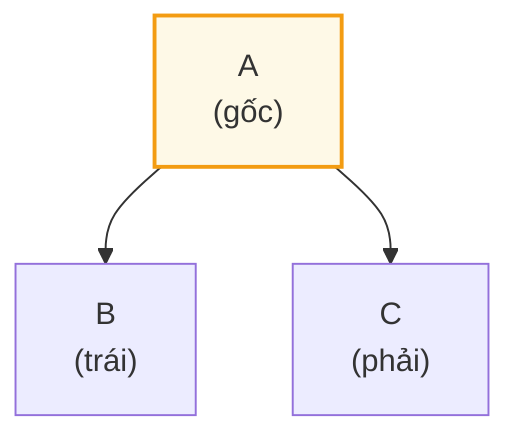
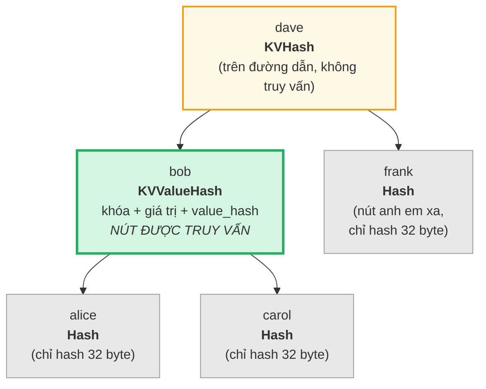
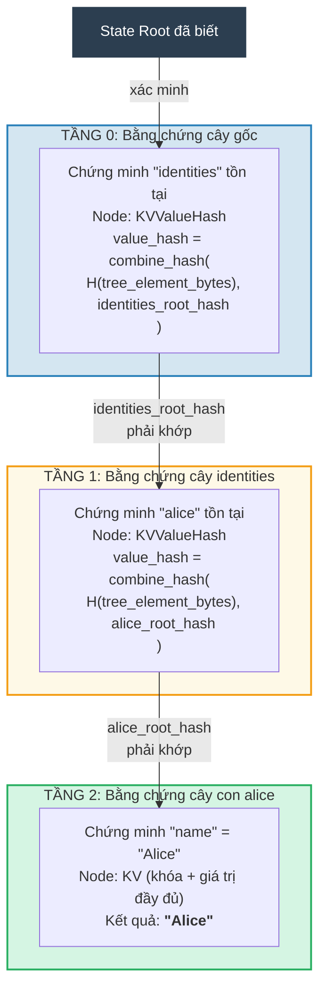
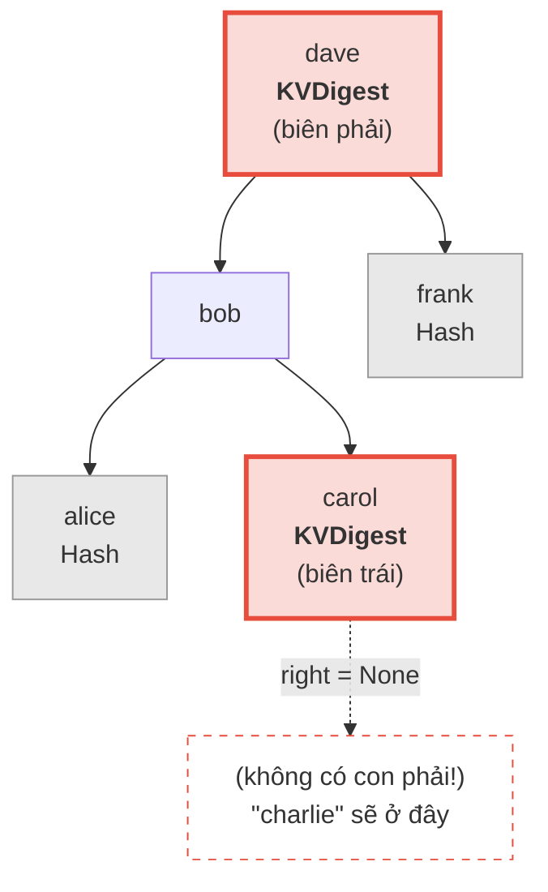
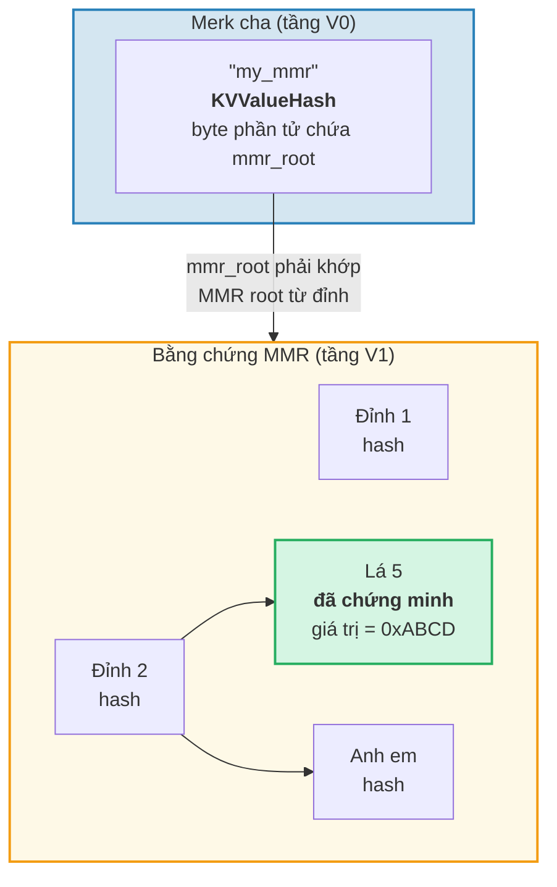
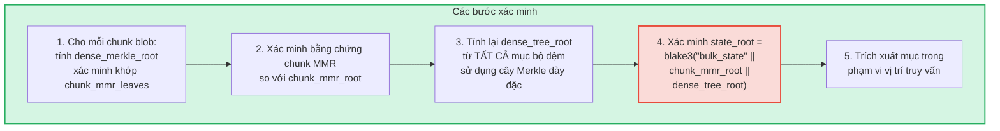
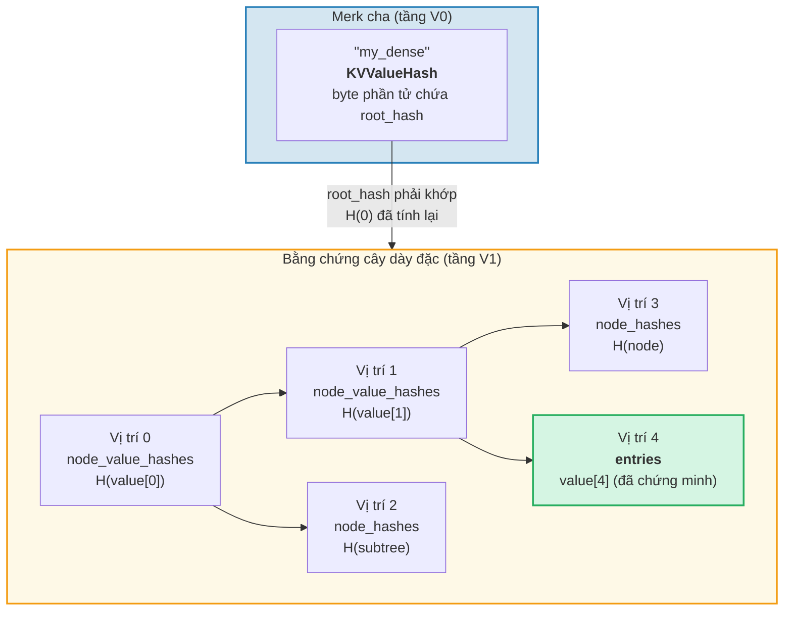

# Hệ thống chứng minh

Hệ thống chứng minh (proof system) của GroveDB cho phép bất kỳ bên nào xác minh tính đúng đắn của kết quả truy vấn mà không cần toàn bộ cơ sở dữ liệu. Bằng chứng (proof) là biểu diễn nhỏ gọn của cấu trúc cây liên quan, cho phép tái tạo root hash.

## Các thao tác bằng chứng dựa trên ngăn xếp

Bằng chứng được mã hóa dưới dạng chuỗi **thao tác** tái tạo cây bộ phận bằng máy ngăn xếp (stack machine):

```rust
// merk/src/proofs/mod.rs
pub enum Op {
    Push(Node),        // Đẩy một nút lên ngăn xếp (thứ tự khóa tăng dần)
    PushInverted(Node),// Đẩy một nút (thứ tự khóa giảm dần)
    Parent,            // Lấy cha, lấy con → gắn con làm BÊN TRÁI của cha
    Child,             // Lấy con, lấy cha → gắn con làm BÊN PHẢI của cha
    ParentInverted,    // Lấy cha, lấy con → gắn con làm BÊN PHẢI của cha
    ChildInverted,     // Lấy con, lấy cha → gắn con làm BÊN TRÁI của cha
}
```

Thực thi sử dụng ngăn xếp:

Các thao tác proof: `Push(B), Push(A), Parent, Push(C), Child`

| Bước | Thao tác | Ngăn xếp (đỉnh→phải) | Hành động |
|------|-----------|-------------------|--------|
| 1 | Push(B) | [ B ] | Đẩy B lên ngăn xếp |
| 2 | Push(A) | [ B , A ] | Đẩy A lên ngăn xếp |
| 3 | Parent | [ A{left:B} ] | Lấy A (cha), lấy B (con), B → TRÁI của A |
| 4 | Push(C) | [ A{left:B} , C ] | Đẩy C lên ngăn xếp |
| 5 | Child | [ A{left:B, right:C} ] | Lấy C (con), lấy A (cha), C → PHẢI của A |

Kết quả cuối — một cây trên ngăn xếp:



> Bên xác minh tính `node_hash(A) = Blake3(kv_hash_A || node_hash_B || node_hash_C)` và kiểm tra nó khớp với root hash mong đợi.

Đây là hàm `execute` (`merk/src/proofs/tree.rs`):

```rust
pub fn execute<I, F>(ops: I, collapse: bool, mut visit_node: F) -> CostResult<Tree, Error>
where
    I: IntoIterator<Item = Result<Op, Error>>,
    F: FnMut(&Node) -> Result<(), Error>,
{
    let mut stack: Vec<Tree> = Vec::with_capacity(32);

    for op in ops {
        match op? {
            Op::Parent => {
                let (mut parent, child) = (try_pop(&mut stack), try_pop(&mut stack));
                parent.left = Some(Child { tree: Box::new(child), hash: child.hash() });
                stack.push(parent);
            }
            Op::Child => {
                let (child, mut parent) = (try_pop(&mut stack), try_pop(&mut stack));
                parent.right = Some(Child { tree: Box::new(child), hash: child.hash() });
                stack.push(parent);
            }
            Op::Push(node) => {
                visit_node(&node)?;
                stack.push(Tree::from(node));
            }
            // ... Các biến thể Inverted hoán đổi trái/phải
        }
    }
    // Mục cuối cùng trên ngăn xếp là gốc
}
```

## Các kiểu nút trong bằng chứng

Mỗi `Push` mang theo `Node` chứa vừa đủ thông tin để xác minh:

```rust
pub enum Node {
    // Thông tin tối thiểu — chỉ hash. Dùng cho nút anh em xa.
    Hash(CryptoHash),

    // KV hash cho nút trên đường dẫn nhưng không được truy vấn.
    KVHash(CryptoHash),

    // Khóa-giá trị đầy đủ cho mục được truy vấn.
    KV(Vec<u8>, Vec<u8>),

    // Khóa, giá trị và value_hash đã tính trước.
    // Dùng cho cây con nơi value_hash = combine_hash(...)
    KVValueHash(Vec<u8>, Vec<u8>, CryptoHash),

    // KV với kiểu tính năng — cho ProvableCountTree hoặc khôi phục chunk.
    KVValueHashFeatureType(Vec<u8>, Vec<u8>, CryptoHash, TreeFeatureType),

    // Tham chiếu: khóa, giá trị đã dereference, hash phần tử tham chiếu.
    KVRefValueHash(Vec<u8>, Vec<u8>, CryptoHash),

    // Cho mục trong ProvableCountTree.
    KVCount(Vec<u8>, Vec<u8>, u64),

    // KV hash + số đếm cho nút ProvableCountTree không được truy vấn.
    KVHashCount(CryptoHash, u64),

    // Tham chiếu trong ProvableCountTree.
    KVRefValueHashCount(Vec<u8>, Vec<u8>, CryptoHash, u64),

    // Cho bằng chứng biên/vắng mặt trong ProvableCountTree.
    KVDigestCount(Vec<u8>, CryptoHash, u64),

    // Khóa + value_hash cho bằng chứng vắng mặt (cây thông thường).
    KVDigest(Vec<u8>, CryptoHash),
}
```

Lựa chọn kiểu Node xác định thông tin bên xác minh cần:

**Truy vấn: "Lấy giá trị cho khóa 'bob'"**



> Xanh = nút được truy vấn (dữ liệu đầy đủ được tiết lộ). Vàng = trên đường dẫn (chỉ kv_hash). Xám = nút anh em (chỉ node hash 32 byte).

Mã hóa thành các thao tác proof:

| # | Thao tác | Hiệu ứng |
|---|----|----|
| 1 | Push(Hash(alice_node_hash)) | Đẩy hash alice |
| 2 | Push(KVValueHash("bob", value, value_hash)) | Đẩy bob với dữ liệu đầy đủ |
| 3 | Parent | alice trở thành con trái của bob |
| 4 | Push(Hash(carol_node_hash)) | Đẩy hash carol |
| 5 | Child | carol trở thành con phải của bob |
| 6 | Push(KVHash(dave_kv_hash)) | Đẩy kv_hash của dave |
| 7 | Parent | cây con bob trở thành bên trái của dave |
| 8 | Push(Hash(frank_node_hash)) | Đẩy hash frank |
| 9 | Child | frank trở thành con phải của dave |

## Tạo bằng chứng đa tầng

Vì GroveDB là cây chứa cây, bằng chứng trải rộng nhiều tầng. Mỗi tầng chứng minh phần liên quan của một cây Merk, và các tầng được kết nối bởi cơ chế combined value_hash:

**Truy vấn:** `Lấy ["identities", "alice", "name"]`



> **Chuỗi tin cậy:** `state_root đã biết → xác minh Tầng 0 → xác minh Tầng 1 → xác minh Tầng 2 → "Alice"`. Root hash tái tạo của mỗi tầng phải khớp value_hash từ tầng trên.

Bên xác minh kiểm tra từng tầng, xác nhận rằng:
1. Bằng chứng tầng tái tạo thành root hash mong đợi
2. Root hash khớp với value_hash từ tầng cha
3. Root hash cấp cao nhất khớp với state root đã biết

## Xác minh bằng chứng

Xác minh theo các tầng bằng chứng từ dưới lên hoặc từ trên xuống, sử dụng hàm `execute` để tái tạo cây của mỗi tầng. Phương thức `Tree::hash()` trong cây bằng chứng tính hash dựa trên kiểu nút:

```rust
impl Tree {
    pub fn hash(&self) -> CostContext<CryptoHash> {
        match &self.node {
            Node::Hash(hash) => *hash,  // Đã là hash, trả về trực tiếp

            Node::KVHash(kv_hash) =>
                node_hash(kv_hash, &self.child_hash(true), &self.child_hash(false)),

            Node::KV(key, value) =>
                kv_hash(key, value)
                    .flat_map(|kv_hash| node_hash(&kv_hash, &left, &right)),

            Node::KVValueHash(key, _, value_hash) =>
                kv_digest_to_kv_hash(key, value_hash)
                    .flat_map(|kv_hash| node_hash(&kv_hash, &left, &right)),

            Node::KVValueHashFeatureType(key, _, value_hash, feature_type) => {
                let kv = kv_digest_to_kv_hash(key, value_hash);
                match feature_type {
                    ProvableCountedMerkNode(count) =>
                        node_hash_with_count(&kv, &left, &right, *count),
                    _ => node_hash(&kv, &left, &right),
                }
            }

            Node::KVRefValueHash(key, referenced_value, ref_element_hash) => {
                let ref_value_hash = value_hash(referenced_value);
                let combined = combine_hash(ref_element_hash, &ref_value_hash);
                let kv = kv_digest_to_kv_hash(key, &combined);
                node_hash(&kv, &left, &right)
            }
            // ... các biến thể khác
        }
    }
}
```

## Bằng chứng vắng mặt

GroveDB có thể chứng minh rằng một khóa **không** tồn tại. Điều này sử dụng các nút biên (boundary node) — các nút sẽ liền kề với khóa bị thiếu nếu nó tồn tại:

**Chứng minh:** "charlie" KHÔNG tồn tại



> **Tìm kiếm nhị phân:** alice < bob < carol < **"charlie"** < dave < frank. "charlie" sẽ nằm giữa carol và dave. Con phải của carol là `None`, chứng minh không có gì tồn tại giữa carol và dave. Do đó "charlie" không thể tồn tại trong cây này.

Đối với truy vấn phạm vi, bằng chứng vắng mặt cho thấy không có khóa nào trong phạm vi truy vấn mà không được đưa vào tập kết quả.

## Bằng chứng V1 — Cây không phải Merk

Hệ thống bằng chứng V0 hoạt động độc quyền với cây Merk con, đi xuống từng tầng qua hệ thống phân cấp grove. Tuy nhiên, các phần tử **CommitmentTree**, **MmrTree**, **BulkAppendTree**, và **DenseAppendOnlyFixedSizeTree** lưu dữ liệu ngoài cây Merk con. Chúng không có cây Merk con để đi xuống — root hash riêng theo kiểu của chúng chảy như child hash của Merk thay vào đó.

**Định dạng bằng chứng V1** mở rộng V0 để xử lý các cây không phải Merk này với cấu trúc bằng chứng riêng theo kiểu:

```rust
/// Định dạng bằng chứng mà tầng sử dụng.
pub enum ProofBytes {
    Merk(Vec<u8>),            // Thao tác bằng chứng Merk chuẩn
    MMR(Vec<u8>),             // Bằng chứng thành viên MMR
    BulkAppendTree(Vec<u8>),  // Bằng chứng phạm vi BulkAppendTree
    DenseTree(Vec<u8>),       // Bằng chứng bao gồm cây dày đặc
    CommitmentTree(Vec<u8>),  // Root Sinsemilla (32 byte) + bằng chứng BulkAppendTree
}

/// Một tầng của bằng chứng V1.
pub struct LayerProof {
    pub merk_proof: ProofBytes,
    pub lower_layers: BTreeMap<Vec<u8>, LayerProof>,
}
```

**Quy tắc chọn V0/V1:** Nếu mọi tầng trong bằng chứng đều là cây Merk chuẩn, `prove_query` tạo `GroveDBProof::V0` (tương thích ngược). Nếu bất kỳ tầng nào liên quan đến MmrTree, BulkAppendTree, hoặc DenseAppendOnlyFixedSizeTree, nó tạo `GroveDBProof::V1`.

### Cách bằng chứng cây không phải Merk ràng buộc với Root Hash

Cây Merk cha chứng minh byte serialize của phần tử qua nút bằng chứng Merk chuẩn (`KVValueHash`). Root riêng theo kiểu (ví dụ `mmr_root` hoặc `state_root`) chảy như **child hash** của Merk — nó KHÔNG được nhúng trong byte phần tử:

```text
combined_value_hash = combine_hash(
    Blake3(varint(len) || element_bytes),   ← chứa count, height, v.v.
    type_specific_root                      ← mmr_root / state_root / dense_root
)
```

Bằng chứng riêng theo kiểu sau đó chứng minh rằng dữ liệu được truy vấn nhất quán với root riêng theo kiểu đã được dùng làm child hash.

### Bằng chứng MMR Tree

Bằng chứng MMR chứng minh rằng các lá cụ thể tồn tại tại các vị trí đã biết trong MMR, và root hash của MMR khớp với child hash lưu trong nút Merk cha:

```rust
pub struct MmrProof {
    pub mmr_size: u64,
    pub proof: MerkleProof,  // ckb_merkle_mountain_range::MerkleProof
    pub leaves: Vec<MmrProofLeaf>,
}

pub struct MmrProofLeaf {
    pub position: u64,       // Vị trí MMR
    pub leaf_index: u64,     // Chỉ số lá logic
    pub hash: [u8; 32],      // Hash lá
    pub value: Vec<u8>,      // Byte giá trị lá
}
```



**Khóa truy vấn là vị trí:** Mục truy vấn mã hóa vị trí dưới dạng byte u64 big-endian (giữ thứ tự sắp xếp). `QueryItem::RangeInclusive` với vị trí đầu/cuối mã hóa BE chọn phạm vi liên tục của lá MMR.

**Xác minh:**
1. Tái tạo lá `MmrNode` từ bằng chứng
2. Xác minh `MerkleProof` ckb so với MMR root mong đợi từ child hash Merk cha
3. Kiểm tra chéo `proof.mmr_size` khớp với kích thước lưu trong phần tử
4. Trả về các cặp giá trị lá đã chứng minh

### Bằng chứng BulkAppendTree

Bằng chứng BulkAppendTree phức tạp hơn vì dữ liệu nằm ở hai nơi: blob chunk đã niêm phong và bộ đệm đang tiến hành. Bằng chứng phạm vi phải trả về:

- **Blob chunk đầy đủ** cho mọi chunk hoàn thành trùng lắp phạm vi truy vấn
- **Mục bộ đệm riêng lẻ** cho vị trí vẫn trong bộ đệm

```rust
pub struct BulkAppendTreeProof {
    pub chunk_power: u8,
    pub total_count: u64,
    pub chunk_blobs: Vec<(u64, Vec<u8>)>,       // (chunk_index, blob_bytes)
    pub chunk_mmr_size: u64,
    pub chunk_mmr_proof_items: Vec<[u8; 32]>,    // Hash anh em MMR
    pub chunk_mmr_leaves: Vec<(u64, [u8; 32])>,  // (mmr_pos, dense_merkle_root)
    pub buffer_entries: Vec<Vec<u8>>,             // TẤT CẢ mục bộ đệm (cây dày đặc) hiện tại
    pub chunk_mmr_root: [u8; 32],
}
```



> **Tại sao bao gồm TẤT CẢ mục bộ đệm?** Bộ đệm là cây Merkle dày đặc mà root hash cam kết mọi mục. Để xác minh `dense_tree_root`, bên xác minh phải xây lại cây từ tất cả mục. Vì bộ đệm bị giới hạn bởi `capacity` mục (tối đa 65.535), điều này chấp nhận được.

**Tính limit:** Mỗi giá trị riêng lẻ (trong chunk hoặc bộ đệm) tính vào limit truy vấn, không phải mỗi blob chunk nói chung. Nếu truy vấn có `limit: 100` và chunk chứa 1024 mục với 500 trùng phạm vi, tất cả 500 mục tính vào limit.

### Bằng chứng DenseAppendOnlyFixedSizeTree

Bằng chứng cây dày đặc chứng minh rằng các vị trí cụ thể chứa giá trị cụ thể, được xác thực với root hash của cây (chảy như child hash Merk). Tất cả nút sử dụng `blake3(H(value) || H(left) || H(right))`, nên nút tổ tiên trên đường xác thực chỉ cần **hash giá trị** 32 byte — không cần giá trị đầy đủ.

```rust
pub struct DenseTreeProof {
    pub entries: Vec<(u16, Vec<u8>)>,            // (vị trí, giá trị) đã chứng minh
    pub node_value_hashes: Vec<(u16, [u8; 32])>, // hash giá trị tổ tiên trên đường xác thực
    pub node_hashes: Vec<(u16, [u8; 32])>,       // hash cây con anh em đã tính trước
}
```

> `height` và `count` đến từ Element cha (được xác thực bởi hệ thống phân cấp Merk), không phải bằng chứng.



**Xác minh** là hàm thuần túy không cần lưu trữ:
1. Xây bảng tra từ `entries`, `node_value_hashes`, và `node_hashes`
2. Đệ quy tính lại root hash từ vị trí 0:
   - Vị trí có hash đã tính trong `node_hashes` → dùng trực tiếp
   - Vị trí có giá trị trong `entries` → `blake3(blake3(value) || H(left) || H(right))`
   - Vị trí có hash trong `node_value_hashes` → `blake3(hash || H(left) || H(right))`
   - Vị trí `>= count` hoặc `>= capacity` → `[0u8; 32]`
3. So sánh gốc đã tính với root hash mong đợi từ phần tử cha
4. Trả về mục đã chứng minh khi thành công

**Bằng chứng đa vị trí** gộp đường xác thực trùng lắp: tổ tiên chung và giá trị của chúng chỉ xuất hiện một lần, khiến chúng nhỏ gọn hơn bằng chứng đơn lẻ độc lập.

---
