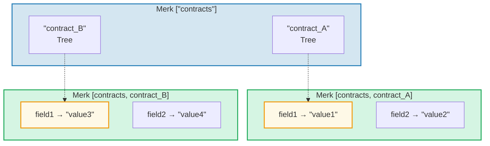
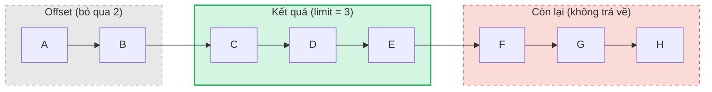

# Hệ thống truy vấn

## Cấu trúc PathQuery

Truy vấn GroveDB sử dụng kiểu `PathQuery`, kết hợp đường dẫn (nơi tìm kiếm) với truy vấn (chọn gì):

```rust
pub struct PathQuery {
    pub path: Vec<Vec<u8>>,         // Đường dẫn bắt đầu trong grove
    pub query: SizedQuery,          // Chọn gì
}

pub struct SizedQuery {
    pub query: Query,               // Tiêu chí chọn lọc
    pub limit: Option<u16>,         // Số kết quả tối đa
    pub offset: Option<u16>,        // Bỏ qua N kết quả đầu
}
```

## Kiểu Query

```rust
pub struct Query {
    pub items: Vec<QueryItem>,              // Cần khớp gì
    pub default_subquery_branch: SubqueryBranch,
    pub conditional_subquery_branches: Option<IndexMap<QueryItem, SubqueryBranch>>,
    pub left_to_right: bool,                // Hướng duyệt
    pub add_parent_tree_on_subquery: bool,  // Bao gồm phần tử cây cha trong kết quả (v2)
}
```

> **`add_parent_tree_on_subquery`** (v2): Khi `true`, phần tử cây cha (ví dụ CountTree hoặc SumTree) được bao gồm trong kết quả truy vấn cùng với giá trị của các con. Điều này cho phép bạn lấy cả giá trị tổng hợp và phần tử riêng lẻ trong một truy vấn.

## QueryItem — Chọn gì

Mỗi `QueryItem` chỉ định một khóa hoặc phạm vi để khớp:

```rust
pub enum QueryItem {
    Key(Vec<u8>),                           // Khớp khóa chính xác
    Range(Range<Vec<u8>>),                  // Phạm vi không bao gồm cuối [start..end)
    RangeInclusive(RangeInclusive<Vec<u8>>),// Phạm vi bao gồm cuối [start..=end]
    RangeFull(RangeFull),                   // Tất cả khóa
    RangeFrom(RangeFrom<Vec<u8>>),          // [start..)
    RangeTo(RangeTo<Vec<u8>>),              // [..end)
    RangeToInclusive(RangeToInclusive<Vec<u8>>), // [..=end]
    RangeAfter(RangeFrom<Vec<u8>>),         // (start..) không bao gồm đầu
    RangeAfterTo(Range<Vec<u8>>),           // (start..end) không bao gồm cả hai
    RangeAfterToInclusive(RangeInclusive<Vec<u8>>), // (start..=end]
}
```

Ví dụ truy vấn:

Cây Merk (đã sắp xếp): `alice  bob  carol  dave  eve  frank`

| Truy vấn | Chọn lọc | Kết quả |
|-------|-----------|--------|
| `Key("bob")` | alice **[bob]** carol dave eve frank | bob |
| `RangeInclusive("bob"..="dave")` | alice **[bob carol dave]** eve frank | bob, carol, dave |
| `RangeAfter("carol"..)` | alice bob carol **[dave eve frank]** | dave, eve, frank |
| `RangeFull`, limit=2 | **[alice bob]** carol dave eve frank *(dừng bởi limit)* | alice, bob |
| `RangeFull`, limit=2, phải-sang-trái | alice bob carol dave **[eve frank]** *(dừng bởi limit)* | frank, eve |

## Truy vấn con và nhánh có điều kiện

Sức mạnh thực sự của truy vấn GroveDB là **subquery** (truy vấn con) — khi truy vấn khớp với phần tử Tree, truy vấn có thể tự động đi sâu vào cây con đó:



> **PathQuery:** `path: ["contracts"], query: RangeFull` với `default_subquery: Key("field1")`
>
> **Thực thi:**
> 1. `RangeFull` trên ["contracts"] → khớp contract_A, contract_B
> 2. Cả hai đều là phần tử Tree → đi sâu với subquery `Key("field1")`
> 3. contract_A → "value1", contract_B → "value3"
>
> **Kết quả:** `["value1", "value3"]`

**Subquery có điều kiện** cho phép áp dụng subquery khác nhau tùy theo khóa nào được khớp:

```rust
conditional_subquery_branches: Some(indexmap! {
    QueryItem::Key(b"contract_A".to_vec()) => SubqueryBranch {
        subquery: Some(Query { items: vec![Key(b"field1".to_vec())] }),
        ..
    },
    QueryItem::Key(b"contract_B".to_vec()) => SubqueryBranch {
        subquery: Some(Query { items: vec![Key(b"field2".to_vec())] }),
        ..
    },
})
```

Điều này sẽ lấy `field1` từ `contract_A` nhưng `field2` từ `contract_B`.

## Truy vấn có kích thước — Limit và Offset

Wrapper `SizedQuery` thêm phân trang:



> `SizedQuery { query: RangeFull, limit: Some(3), offset: Some(2) }` → Kết quả: **[C, D, E]**

Khi kết hợp với `left_to_right: false`, việc duyệt được đảo ngược:

```text
    SizedQuery {
        query: Query { items: [RangeFull], left_to_right: false, .. },
        limit: Some(3),
        offset: None
    }

    Kết quả: [H, G, F]
```

## Gộp truy vấn

Nhiều PathQuery có thể được gộp thành một truy vấn duy nhất để tăng hiệu quả. Thuật toán gộp tìm tiền tố đường dẫn chung và kết hợp các mục truy vấn:

```text
    Truy vấn A: path=["users"], query=Key("alice")
    Truy vấn B: path=["users"], query=Key("bob")

    Đã gộp:     path=["users"], query=items=[Key("alice"), Key("bob")]
```

---
