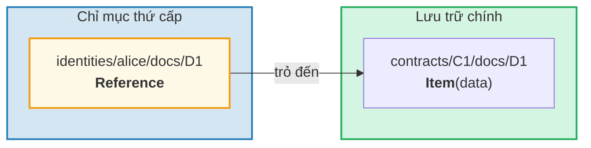
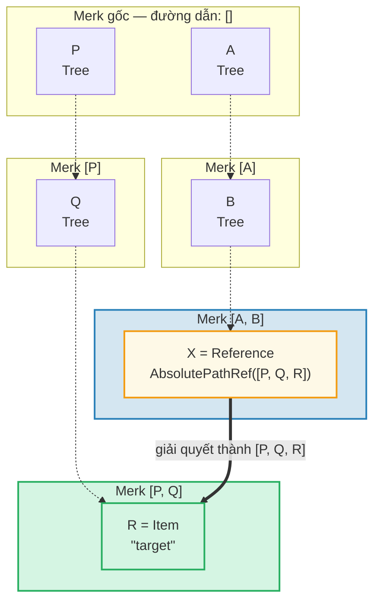
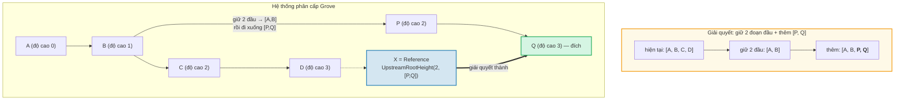
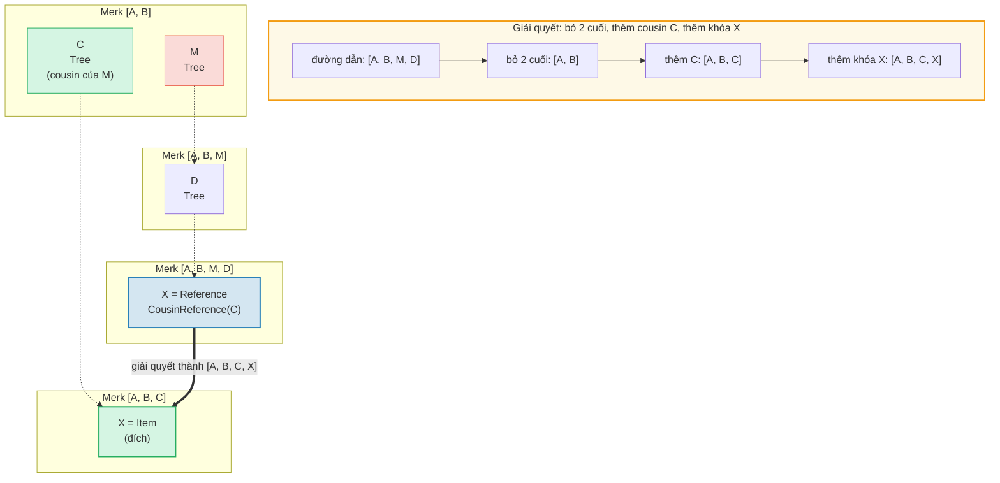
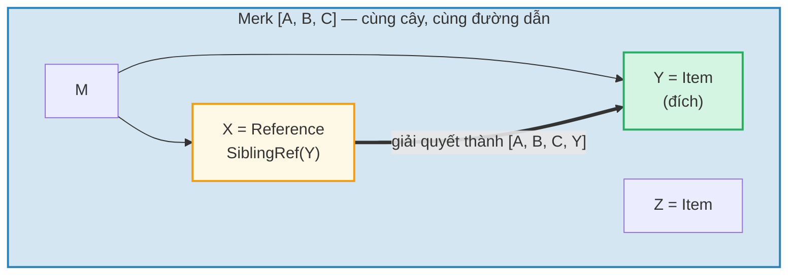
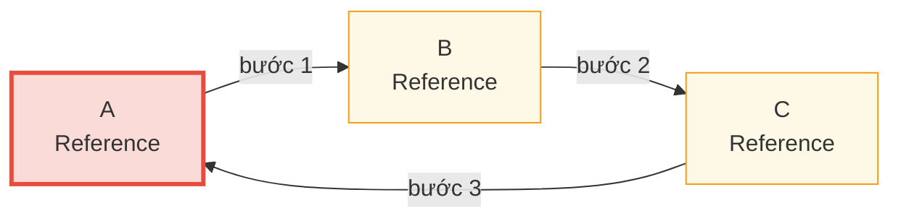

# Hệ thống tham chiếu

## Tại sao cần tham chiếu

Trong cơ sở dữ liệu phân cấp, bạn thường cần cùng dữ liệu có thể truy cập từ nhiều đường dẫn. Ví dụ, tài liệu có thể được lưu dưới hợp đồng nhưng cũng có thể truy vấn theo danh tính chủ sở hữu. **Tham chiếu** (Reference) là câu trả lời của GroveDB — chúng là con trỏ từ một vị trí sang vị trí khác, tương tự như liên kết tượng trưng (symbolic link) trong hệ thống tệp.



Các thuộc tính chính:
- Tham chiếu được **xác thực** — value_hash của tham chiếu bao gồm cả bản thân tham chiếu và phần tử được tham chiếu
- Tham chiếu có thể được **xâu chuỗi** — tham chiếu có thể trỏ đến tham chiếu khác
- Phát hiện chu trình (cycle) ngăn vòng lặp vô hạn
- Giới hạn bước nhảy có thể cấu hình ngăn cạn kiệt tài nguyên

## Bảy loại tham chiếu

```rust
// grovedb-element/src/reference_path/mod.rs
pub enum ReferencePathType {
    AbsolutePathReference(Vec<Vec<u8>>),
    UpstreamRootHeightReference(u8, Vec<Vec<u8>>),
    UpstreamRootHeightWithParentPathAdditionReference(u8, Vec<Vec<u8>>),
    UpstreamFromElementHeightReference(u8, Vec<Vec<u8>>),
    CousinReference(Vec<u8>),
    RemovedCousinReference(Vec<Vec<u8>>),
    SiblingReference(Vec<u8>),
}
```

Hãy cùng xem qua từng loại với sơ đồ.

### AbsolutePathReference

Loại đơn giản nhất. Lưu trữ đường dẫn đầy đủ đến đích:



> X lưu đường dẫn tuyệt đối đầy đủ `[P, Q, R]`. Bất kể X nằm ở đâu, nó luôn giải quyết đến cùng đích.

### UpstreamRootHeightReference

Giữ N đoạn đầu tiên của đường dẫn hiện tại, sau đó thêm đường dẫn mới:



### UpstreamRootHeightWithParentPathAdditionReference

Giống UpstreamRootHeight, nhưng thêm lại đoạn cuối của đường dẫn hiện tại:

```text
    Tham chiếu tại đường dẫn [A, B, C, D, E] khóa=X
    UpstreamRootHeightWithParentPathAdditionReference(2, [P, Q])

    Đường dẫn hiện tại: [A, B, C, D, E]
    Giữ 2 đầu:          [A, B]
    Thêm [P, Q]:         [A, B, P, Q]
    Thêm lại đoạn cuối:  [A, B, P, Q, E]   ← "E" từ đường dẫn gốc được thêm lại

    Hữu ích cho: chỉ mục nơi khóa cha cần được bảo toàn
```

### UpstreamFromElementHeightReference

Loại bỏ N đoạn cuối, sau đó thêm:

```text
    Tham chiếu tại đường dẫn [A, B, C, D] khóa=X
    UpstreamFromElementHeightReference(1, [P, Q])

    Đường dẫn hiện tại:  [A, B, C, D]
    Bỏ 1 đoạn cuối:      [A, B, C]
    Thêm [P, Q]:          [A, B, C, P, Q]
```

### CousinReference

Chỉ thay thế cha trực tiếp bằng khóa mới:



> "Cousin" là cây con anh em của ông bà tham chiếu. Tham chiếu đi lên hai tầng, rồi đi xuống cây con cousin.

### RemovedCousinReference

Giống CousinReference nhưng thay cha bằng đường dẫn nhiều đoạn:

```text
    Tham chiếu tại đường dẫn [A, B, C, D] khóa=X
    RemovedCousinReference([M, N])

    Đường dẫn hiện tại: [A, B, C, D]
    Bỏ cha C:            [A, B]
    Thêm [M, N]:         [A, B, M, N]
    Thêm khóa X:         [A, B, M, N, X]
```

### SiblingReference

Tham chiếu tương đối đơn giản nhất — chỉ đổi khóa trong cùng cây cha:



> Loại tham chiếu đơn giản nhất. X và Y là anh em trong cùng cây Merk — giải quyết chỉ đổi khóa trong khi giữ nguyên đường dẫn.

## Theo dõi tham chiếu và giới hạn bước nhảy

Khi GroveDB gặp phần tử Reference, nó phải **theo** tham chiếu để tìm giá trị thực. Vì tham chiếu có thể trỏ đến tham chiếu khác, điều này liên quan đến một vòng lặp:

```rust
// grovedb/src/reference_path.rs
pub const MAX_REFERENCE_HOPS: usize = 10;

pub fn follow_reference(...) -> CostResult<ResolvedReference, Error> {
    let mut hops_left = MAX_REFERENCE_HOPS;
    let mut visited = HashSet::new();

    while hops_left > 0 {
        // Giải quyết đường dẫn tham chiếu thành đường dẫn tuyệt đối
        let target_path = current_ref.absolute_qualified_path(...);

        // Kiểm tra chu trình
        if !visited.insert(target_path.clone()) {
            return Err(Error::CyclicReference);
        }

        // Lấy phần tử tại đích
        let element = Element::get(target_path);

        match element {
            Element::Reference(next_ref, ..) => {
                // Vẫn là tham chiếu — tiếp tục theo
                current_ref = next_ref;
                hops_left -= 1;
            }
            other => {
                // Tìm thấy phần tử thực!
                return Ok(ResolvedReference { element: other, ... });
            }
        }
    }

    Err(Error::ReferenceLimit)  // Vượt quá 10 bước nhảy
}
```

## Phát hiện chu trình

HashSet `visited` theo dõi tất cả đường dẫn đã thấy. Nếu gặp đường dẫn đã từng thăm, ta có chu trình:



> **Truy vết phát hiện chu trình:**
>
> | Bước | Theo dõi | Tập visited | Kết quả |
> |------|--------|-------------|--------|
> | 1 | Bắt đầu tại A | { A } | A là Ref → theo |
> | 2 | A → B | { A, B } | B là Ref → theo |
> | 3 | B → C | { A, B, C } | C là Ref → theo |
> | 4 | C → A | A đã trong visited! | **Error::CyclicRef** |
>
> Nếu không phát hiện chu trình, sẽ lặp mãi mãi. `MAX_REFERENCE_HOPS = 10` cũng giới hạn độ sâu duyệt cho chuỗi dài.

## Tham chiếu trong Merk — Hash giá trị kết hợp

Khi Reference được lưu trong cây Merk, `value_hash` của nó phải xác thực cả cấu trúc tham chiếu và dữ liệu được tham chiếu:

```rust
// merk/src/tree/kv.rs
pub fn update_hashes_using_reference_value_hash(
    mut self,
    reference_value_hash: CryptoHash,
) -> CostContext<Self> {
    // Băm byte của bản thân phần tử tham chiếu
    let actual_value_hash = value_hash(self.value_as_slice());

    // Kết hợp: H(reference_bytes) ⊕ H(referenced_data)
    let combined = combine_hash(&actual_value_hash, &reference_value_hash);

    self.value_hash = combined;
    self.hash = kv_digest_to_kv_hash(self.key(), self.value_hash());
    // ...
}
```

Điều này có nghĩa là thay đổi tham chiếu HOẶC dữ liệu nó trỏ đến đều sẽ thay đổi root hash — cả hai đều được ràng buộc bằng mật mã.

---
