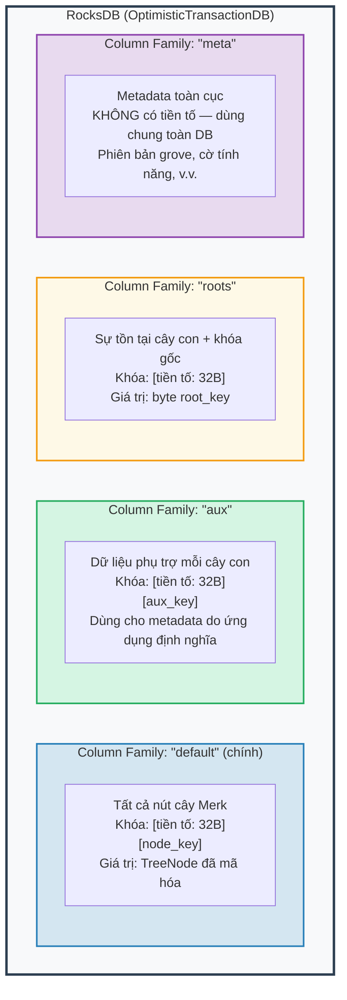
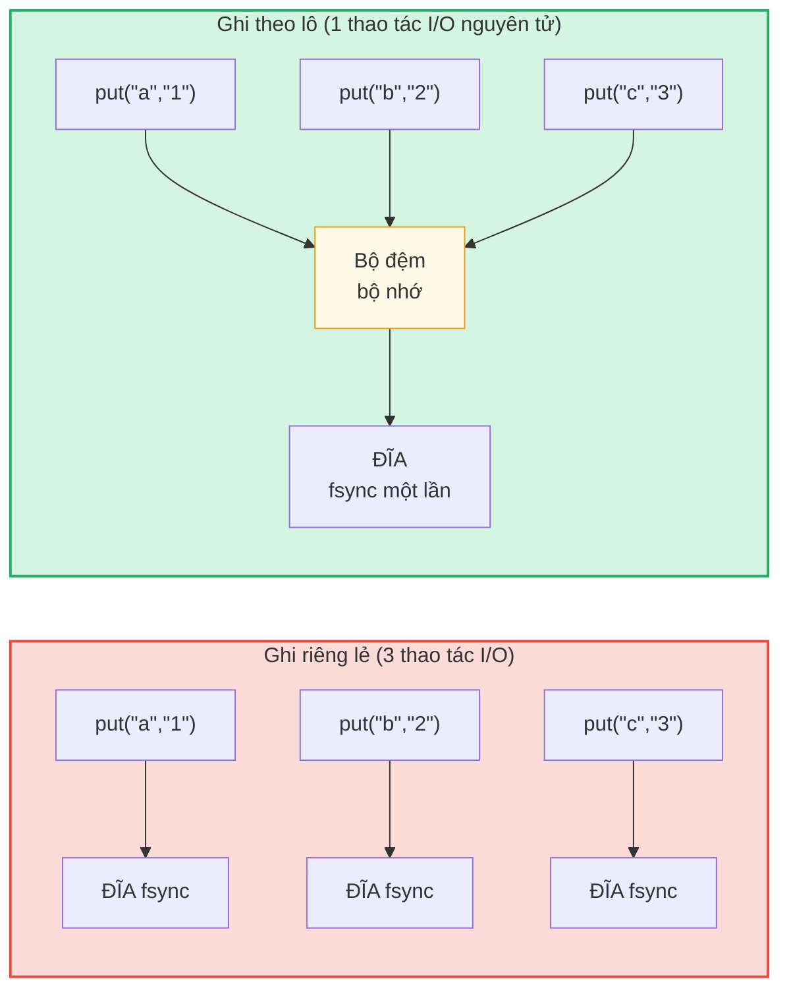

# Tầng lưu trữ

## RocksDB với OptimisticTransactionDB

GroveDB sử dụng **RocksDB** làm nền tảng lưu trữ, cụ thể là biến thể `OptimisticTransactionDB` hỗ trợ giao dịch (transaction):

```rust
// storage/src/rocksdb_storage/storage.rs
pub(crate) type Db = OptimisticTransactionDB;
pub(crate) type Tx<'db> = Transaction<'db, Db>;

pub struct RocksDbStorage {
    db: OptimisticTransactionDB,
}
```

**Giao dịch lạc quan** (optimistic transaction) hoạt động bằng cách giả định sẽ không có xung đột. Nếu hai giao dịch sửa đổi cùng dữ liệu, giao dịch commit sau sẽ thất bại và có thể thử lại. Điều này hiệu quả hơn khóa bi quan (pessimistic locking) cho các tải công việc nơi xung đột hiếm xảy ra.

Tùy chọn RocksDB được tinh chỉnh cho tải công việc của GroveDB:

```rust
lazy_static! {
    static ref DEFAULT_OPTS: rocksdb::Options = {
        let mut opts = rocksdb::Options::default();
        opts.create_if_missing(true);
        opts.increase_parallelism(num_cpus::get() as i32);
        opts.set_allow_mmap_writes(true);
        opts.set_allow_mmap_reads(true);
        opts.create_missing_column_families(true);
        opts.set_atomic_flush(true);
        opts
    };
}
```

## Bốn Column Family

Column family của RocksDB hoạt động như các không gian tên khóa-giá trị riêng biệt trong một cơ sở dữ liệu duy nhất. GroveDB sử dụng bốn:



> **Ví dụ:** Khóa `[ab3fc2...][6e616d65]` trong CF "default" ánh xạ đến `TreeNode{key:"name", val:"Al"}`, trong đó `ab3fc2...` là `Blake3(path)` và `6e616d65` là `"name"` dưới dạng byte.

```rust
pub(crate) const AUX_CF_NAME: &str = "aux";
pub(crate) const ROOTS_CF_NAME: &str = "roots";
pub(crate) const META_CF_NAME: &str = "meta";
// Dữ liệu chính sử dụng column family mặc định
```

## Ngữ cảnh lưu trữ có tiền tố

Mỗi cây con có **ngữ cảnh lưu trữ có tiền tố** riêng — một wrapper tự động thêm tiền tố Blake3 32 byte vào tất cả khóa:

```text
    Đường dẫn cây con: ["identities", "alice"]
    Tiền tố: Blake3(path) = [0xab, 0x3f, 0xc2, ...]  (32 byte)

    Khi cây con lưu khóa "name" với giá trị "Alice":

    Khóa RocksDB:  [0xab 0x3f 0xc2 ... (32 byte) | 0x6e 0x61 0x6d 0x65]
                    \_________tiền tố________/       \_____"name"_____/

    Giá trị RocksDB: [TreeNode đã mã hóa với giá trị "Alice"]
```

Các kiểu ngữ cảnh:

```text
    Không có giao dịch:
    PrefixedRocksDbImmediateStorageContext
    └── Đọc/ghi trực tiếp vào DB với tiền tố

    Có giao dịch:
    PrefixedRocksDbTransactionContext
    └── Đọc/ghi qua Transaction với tiền tố
```

Cả hai triển khai trait `StorageContext`:

```rust
pub trait StorageContext<'db> {
    fn get(&self, key: &[u8]) -> CostResult<Option<Vec<u8>>, Error>;
    fn get_aux(&self, key: &[u8]) -> CostResult<Option<Vec<u8>>, Error>;
    fn get_root(&self, key: &[u8]) -> CostResult<Option<Vec<u8>>, Error>;
    fn get_meta(&self, key: &[u8]) -> CostResult<Option<Vec<u8>>, Error>;
    fn put(&self, key: &[u8], value: &[u8], ...) -> CostResult<(), Error>;
    fn put_aux(&self, key: &[u8], value: &[u8], ...) -> CostResult<(), Error>;
    fn put_root(&self, key: &[u8], value: &[u8], ...) -> CostResult<(), Error>;
    fn put_meta(&self, key: &[u8], value: &[u8], ...) -> CostResult<(), Error>;
    fn delete(&self, key: &[u8], ...) -> CostResult<(), Error>;
    // ...
}
```

## Ghi theo lô và mô hình giao dịch

Để đạt hiệu suất, GroveDB tích lũy ghi vào các lô:



> 3 lần đồng bộ đĩa so với 1 lần = nhanh hơn ~3 lần. Ghi theo lô cũng **nguyên tử** (tất cả hoặc không gì).

`StorageBatch` tích lũy các thao tác được đẩy ra cùng lúc:

```rust
pub struct StorageBatch {
    operations: RefCell<Vec<AbstractBatchOperation>>,
}
```

## Mẫu commit_local() quan trọng

Khi sử dụng giao dịch, có một mẫu quan trọng phải được tuân theo. Các ghi trong giao dịch được lưu trong bộ đệm — chúng không hiển thị cho đến khi commit:

```rust
// Mẫu ĐÚNG:
{
    let tx = db.start_transaction();
    let storage_ctx = db.get_transactional_storage_context(path, &tx);

    storage_ctx.put(key, value);  // Ghi vào bộ đệm giao dịch

    drop(storage_ctx);            // Giải phóng borrow trên tx
    tx.commit_local();            // Đẩy giao dịch vào DB
}

// SAI — dữ liệu bị mất:
{
    let tx = db.start_transaction();
    let storage_ctx = db.get_transactional_storage_context(path, &tx);

    storage_ctx.put(key, value);  // Ghi vào bộ đệm giao dịch

    // tx bị drop ở đây mà không commit_local()!
    // Tất cả ghi đều bị CUỘN LẠI!
}
```

Điều này đặc biệt quan trọng vì `storage_ctx` mượn (borrow) giao dịch. Bạn phải `drop(storage_ctx)` trước khi có thể gọi `tx.commit_local()`.

---
