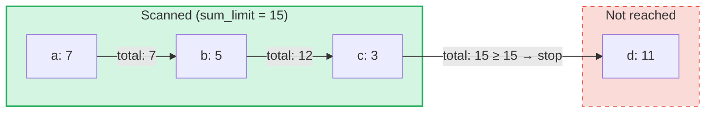

# 聚合求和查询

## 概述

聚合求和查询是一种专为 GroveDB 中的 **SumTree** 设计的特殊查询类型。
与常规查询通过键或范围检索元素不同，聚合求和查询会遍历元素并累加其求和值，
直到达到 **sum limit（求和上限）** 为止。

这种查询适用于以下场景：
- "给我交易数据，直到累计总额超过 1000"
- "哪些项目贡献了该树中前 500 个单位的值？"
- "收集求和项，预算上限为 N"

## 核心概念

### 与常规查询的区别

| 特性 | PathQuery | AggregateSumPathQuery |
|------|-----------|----------------------|
| **目标** | 任意元素类型 | SumItem / ItemWithSumItem 元素 |
| **停止条件** | 数量限制（count）或范围结束 | 求和上限（累计总额）**和/或** 项目限制 |
| **返回值** | 元素或键 | 键-求和值对 |
| **子查询** | 支持（深入子树） | 不支持（仅单层树） |
| **引用** | 由 GroveDB 层解析 | 可选择跟随或忽略 |

### AggregateSumQuery 结构体

```rust
pub struct AggregateSumQuery {
    pub items: Vec<QueryItem>,              // Keys or ranges to scan
    pub left_to_right: bool,                // Iteration direction
    pub sum_limit: u64,                     // Stop when running total reaches this
    pub limit_of_items_to_check: Option<u16>, // Max number of matching items to return
}
```

该查询被封装在 `AggregateSumPathQuery` 中，用于指定在树丛中的查找位置：

```rust
pub struct AggregateSumPathQuery {
    pub path: Vec<Vec<u8>>,                 // Path to the SumTree
    pub aggregate_sum_query: AggregateSumQuery,
}
```

### 求和上限 — 累计总额

`sum_limit` 是核心概念。当扫描元素时，它们的求和值会被累加。一旦累计总额
达到或超过求和上限，迭代即停止：



> **结果：** `[(a, 7), (b, 5), (c, 3)]` — 迭代停止，因为 7 + 5 + 3 = 15 >= sum_limit

支持负数求和值。负值会增加剩余预算：

```text
sum_limit = 12, elements: a(10), b(-3), c(5)

a: total = 10, remaining = 2
b: total =  7, remaining = 5  ← negative value gave us more room
c: total = 12, remaining = 0  ← stop

Result: [(a, 10), (b, -3), (c, 5)]
```

## 查询选项

`AggregateSumQueryOptions` 结构体控制查询行为：

```rust
pub struct AggregateSumQueryOptions {
    pub allow_cache: bool,                              // Use cached reads (default: true)
    pub error_if_intermediate_path_tree_not_present: bool, // Error on missing path (default: true)
    pub error_if_non_sum_item_found: bool,              // Error on non-sum elements (default: true)
    pub ignore_references: bool,                        // Skip references (default: false)
}
```

### 处理非求和元素

SumTree 可能包含多种元素类型：`SumItem`、`Item`、`Reference`、`ItemWithSumItem`
等。默认情况下，遇到非求和、非引用元素会产生错误。

当 `error_if_non_sum_item_found` 设置为 `false` 时，非求和元素会被 **静默跳过**，
且不会占用用户的限制名额：

```text
Tree contents: a(SumItem=7), b(Item), c(SumItem=3)
Query: sum_limit=100, limit_of_items_to_check=2, error_if_non_sum_item_found=false

Scan: a(7) → returned, limit=1
      b(Item) → skipped, limit still 1
      c(3) → returned, limit=0 → stop

Result: [(a, 7), (c, 3)]
```

注意：`ItemWithSumItem` 元素 **始终** 会被处理（不会被跳过），因为它们携带求和值。

### 引用处理

默认情况下，`Reference` 元素会被 **跟随解析** — 查询会沿引用链（最多 3 个中间跳转）
解析以获取目标元素的求和值：

```text
Tree contents: a(SumItem=7), ref_b(Reference → a)
Query: sum_limit=100

ref_b is followed → resolves to a(SumItem=7)

Result: [(a, 7), (ref_b, 7)]
```

当 `ignore_references` 为 `true` 时，引用会被静默跳过，不会占用限制名额，
类似于非求和元素被跳过的方式。

引用链超过 3 个中间跳转会产生 `ReferenceLimit` 错误。

## 结果类型

查询返回 `AggregateSumQueryResult`：

```rust
pub struct AggregateSumQueryResult {
    pub results: Vec<(Vec<u8>, i64)>,       // Key-sum value pairs
    pub hard_limit_reached: bool,           // True if system limit truncated results
}
```

`hard_limit_reached` 标志表示系统的硬扫描限制（默认：1024 个元素）是否在查询
自然完成之前就已达到。当为 `true` 时，返回结果之外可能还存在更多数据。

## 三级限制系统

聚合求和查询有 **三个** 停止条件：

| 限制类型 | 来源 | 计数对象 | 达到时的效果 |
|----------|------|----------|-------------|
| **sum_limit** | 用户（查询） | 求和值的累计总额 | 停止迭代 |
| **limit_of_items_to_check** | 用户（查询） | 已返回的匹配项 | 停止迭代 |
| **硬扫描限制** | 系统（GroveVersion，默认 1024） | 所有已扫描的元素（包括被跳过的） | 停止迭代，设置 `hard_limit_reached` |

硬扫描限制防止在未设置用户限制时出现无界迭代。被跳过的元素
（`error_if_non_sum_item_found=false` 时的非求和项，或 `ignore_references=true`
时的引用）会计入硬扫描限制，但 **不会** 计入用户的 `limit_of_items_to_check`。

## API 用法

### 简单查询

```rust
use grovedb::AggregateSumPathQuery;
use grovedb_merk::proofs::query::AggregateSumQuery;

// "Give me items from this SumTree until the total reaches 1000"
let query = AggregateSumQuery::new(1000, None);
let path_query = AggregateSumPathQuery {
    path: vec![b"my_tree".to_vec()],
    aggregate_sum_query: query,
};

let result = db.query_aggregate_sums(
    &path_query,
    true,   // allow_cache
    true,   // error_if_intermediate_path_tree_not_present
    None,   // transaction
    grove_version,
).unwrap().expect("query failed");

for (key, sum_value) in &result.results {
    println!("{}: {}", String::from_utf8_lossy(key), sum_value);
}
```

### 带选项的查询

```rust
use grovedb::{AggregateSumPathQuery, AggregateSumQueryOptions};
use grovedb_merk::proofs::query::AggregateSumQuery;

// Skip non-sum items and ignore references
let query = AggregateSumQuery::new(1000, Some(50));
let path_query = AggregateSumPathQuery {
    path: vec![b"mixed_tree".to_vec()],
    aggregate_sum_query: query,
};

let result = db.query_aggregate_sums_with_options(
    &path_query,
    AggregateSumQueryOptions {
        error_if_non_sum_item_found: false,  // skip Items, Trees, etc.
        ignore_references: true,              // skip References
        ..AggregateSumQueryOptions::default()
    },
    None,
    grove_version,
).unwrap().expect("query failed");

if result.hard_limit_reached {
    println!("Warning: results may be incomplete (hard limit reached)");
}
```

### 基于键的查询

除了扫描范围，还可以查询特定键：

```rust
// Check the sum value of specific keys
let query = AggregateSumQuery::new_with_keys(
    vec![b"alice".to_vec(), b"bob".to_vec(), b"carol".to_vec()],
    u64::MAX,  // no sum limit
    None,      // no item limit
);
```

### 降序查询

从最高键到最低键进行迭代：

```rust
let query = AggregateSumQuery::new_descending(500, Some(10));
// Or: query.left_to_right = false;
```

## 构造函数参考

| 构造函数 | 说明 |
|----------|------|
| `new(sum_limit, limit)` | 全范围，升序 |
| `new_descending(sum_limit, limit)` | 全范围，降序 |
| `new_single_key(key, sum_limit)` | 单键查找 |
| `new_with_keys(keys, sum_limit, limit)` | 多个指定键 |
| `new_with_keys_reversed(keys, sum_limit, limit)` | 多个键，降序 |
| `new_single_query_item(item, sum_limit, limit)` | 单个 QueryItem（键或范围） |
| `new_with_query_items(items, sum_limit, limit)` | 多个 QueryItem |

---
