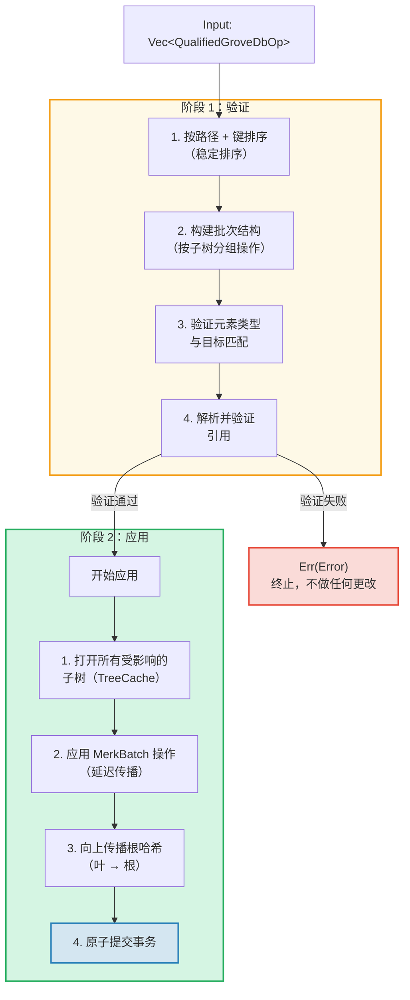
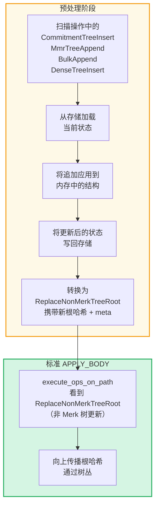

# 树丛级别的批量操作

## GroveOp 变体

在 GroveDB 级别，操作表示为 `GroveOp`：

```rust
pub enum GroveOp {
    // User-facing operations:
    InsertOnly { element: Element },
    InsertOrReplace { element: Element },
    Replace { element: Element },
    Patch { element: Element, change_in_bytes: i32 },
    RefreshReference { reference_path_type, max_reference_hop, flags, trust_refresh_reference },
    Delete,
    DeleteTree(TreeType),                          // Parameterized by tree type

    // Non-Merk tree append operations (user-facing):
    CommitmentTreeInsert { cmx: [u8; 32], payload: Vec<u8> },
    MmrTreeAppend { value: Vec<u8> },
    BulkAppend { value: Vec<u8> },
    DenseTreeInsert { value: Vec<u8> },

    // Internal operations (created by preprocessing/propagation, rejected by from_ops):
    ReplaceTreeRootKey { hash, root_key, aggregate_data },
    InsertTreeWithRootHash { hash, root_key, flags, aggregate_data },
    ReplaceNonMerkTreeRoot { hash: [u8; 32], meta: NonMerkTreeMeta },
    InsertNonMerkTree { hash, root_key, flags, aggregate_data, meta: NonMerkTreeMeta },
}
```

**NonMerkTreeMeta** 在批处理过程中携带树类型特定的状态：

```rust
pub enum NonMerkTreeMeta {
    CommitmentTree { total_count: u64, chunk_power: u8 },
    MmrTree { mmr_size: u64 },
    BulkAppendTree { total_count: u64, chunk_power: u8 },
    DenseTree { count: u16, height: u8 },
}
```

每个操作被包装在一个 `QualifiedGroveDbOp` 中，其中包含路径：

```rust
pub struct QualifiedGroveDbOp {
    pub path: KeyInfoPath,           // Where in the grove
    pub key: Option<KeyInfo>,        // Which key (None for append-only tree ops)
    pub op: GroveOp,                 // What to do
}
```

> **注意：** `key` 字段是 `Option<KeyInfo>` — 对于仅追加树操作（`CommitmentTreeInsert`、`MmrTreeAppend`、`BulkAppend`、`DenseTreeInsert`）它为 `None`，此时树的键是 `path` 的最后一个段。

## 两阶段处理

批量操作分两个阶段处理：



## TreeCache 和延迟传播

在批量应用期间，GroveDB 使用 **TreeCache** 来延迟根哈希传播，直到子树中的所有操作完成：

```mermaid
graph TD
    subgraph without["无 TreeCache（朴素方式）"]
        w1["Op 1: Insert A in X"]
        w1p["Propagate X → parent → root"]
        w2["Op 2: Insert B in X"]
        w2p["Propagate X → parent → root"]
        w3["Op 3: Insert C in X"]
        w3p["Propagate X → parent → root"]
        w1 --> w1p --> w2 --> w2p --> w3 --> w3p
    end

    subgraph with_tc["有 TreeCache（延迟方式）"]
        t1["Op 1: Insert A in X<br/>→ buffered"]
        t2["Op 2: Insert B in X<br/>→ buffered"]
        t3["Op 3: Insert C in X<br/>→ buffered"]
        tp["Propagate X → parent → root<br/>(walk up ONCE)"]
        t1 --> t2 --> t3 --> tp
    end

    style without fill:#fadbd8,stroke:#e74c3c,stroke-width:2px
    style with_tc fill:#d5f5e3,stroke:#27ae60,stroke-width:2px
    style w1p fill:#fadbd8,stroke:#e74c3c
    style w2p fill:#fadbd8,stroke:#e74c3c
    style w3p fill:#fadbd8,stroke:#e74c3c
    style tp fill:#d5f5e3,stroke:#27ae60,stroke-width:2px
```



> **3 次传播 × O(depth)** vs **1 次传播 × O(depth)** = 此子树速度提升 3 倍。

当许多操作针对同一子树时，这是一个显著的优化。

## 跨子树原子操作

GroveDB 批处理的一个关键特性是**跨子树的原子性**。单个批次可以修改多个子树中的元素，要么所有更改都提交，要么都不提交：

```text
    Batch:
    1. Delete ["balances", "alice"]       (remove balance)
    2. Insert ["balances", "bob"] = 100   (add balance)
    3. Update ["identities", "bob", "rev"] = 2  (update revision)

    Three subtrees affected: balances, identities, identities/bob

    If ANY operation fails → ALL operations are rolled back
    If ALL succeed → ALL are committed atomically
```

批处理器通过以下方式处理：
1. 收集所有受影响的路径
2. 打开所有需要的子树
3. 应用所有操作
4. 按依赖顺序传播所有根哈希
5. 提交整个事务

## 非 Merk 树的批量预处理

CommitmentTree、MmrTree、BulkAppendTree 和 DenseAppendOnlyFixedSizeTree 操作需要访问 Merk 之外的存储上下文，而标准的 `execute_ops_on_path` 方法内部无法访问这些（它只能访问 Merk）。这些操作使用**预处理模式**：在主要的 `apply_body` 阶段之前，入口点扫描非 Merk 树操作并将其转换为标准内部操作。

```rust
pub enum GroveOp {
    // ... standard ops ...

    // Non-Merk tree operations (user-facing):
    CommitmentTreeInsert { cmx: [u8; 32], payload: Vec<u8> },
    MmrTreeAppend { value: Vec<u8> },
    BulkAppend { value: Vec<u8> },
    DenseTreeInsert { value: Vec<u8> },

    // Internal ops (produced by preprocessing):
    ReplaceNonMerkTreeRoot { hash: [u8; 32], meta: NonMerkTreeMeta },
}
```



**为什么需要预处理？** `execute_ops_on_path` 函数操作单个 Merk 子树，无法访问 `self.db` 或更广泛的存储上下文。在入口点（`apply_batch_with_element_flags_update`、`apply_partial_batch_with_element_flags_update`）中预处理可以完全访问数据库，因此可以加载/保存数据，然后将简单的 `ReplaceNonMerkTreeRoot` 交给标准批处理机制。

每种预处理方法遵循相同的模式：
1. **`preprocess_commitment_tree_ops`** — 从数据存储加载 frontier 和 BulkAppendTree，向两者追加，保存回去，转换为 `ReplaceNonMerkTreeRoot`，携带更新后的组合根和 `CommitmentTree { total_count, chunk_power }` meta
2. **`preprocess_mmr_tree_ops`** — 从数据存储加载 MMR，追加值，保存回去，转换为 `ReplaceNonMerkTreeRoot`，携带更新后的 MMR 根和 `MmrTree { mmr_size }` meta
3. **`preprocess_bulk_append_ops`** — 从数据存储加载 BulkAppendTree，追加值（可能触发块压缩），保存回去，转换为 `ReplaceNonMerkTreeRoot`，携带更新后的状态根和 `BulkAppendTree { total_count, chunk_power }` meta
4. **`preprocess_dense_tree_ops`** — 从数据存储加载 DenseFixedSizedMerkleTree，依次插入值，重新计算根哈希，保存回去，转换为 `ReplaceNonMerkTreeRoot`，携带更新后的根哈希和 `DenseTree { count, height }` meta

`ReplaceNonMerkTreeRoot` 操作携带新的根哈希和 `NonMerkTreeMeta` 枚举，以便在处理后完全重建元素。

---
