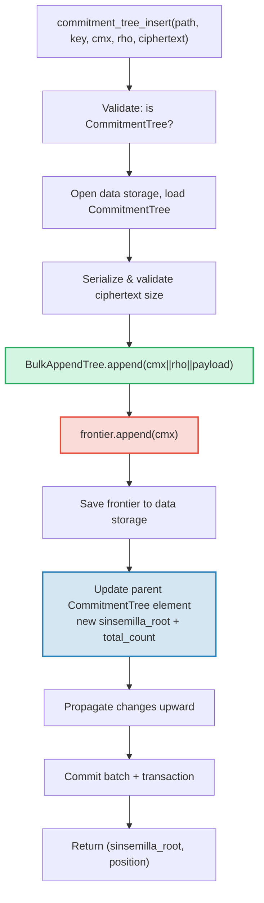

# CommitmentTree — Sinsemilla 承诺锚点

**CommitmentTree** 是 GroveDB 在认证存储和零知识证明系统之间的桥梁。它将一个 **BulkAppendTree**（第 14 章）用于高效的块压缩数据存储，与数据命名空间中的 **Sinsemilla 前沿（frontier）**结合，用于 ZK 兼容的锚点。与 MmrTree 和 BulkAppendTree 一样，它**没有子 Merk** — 组合的根哈希作为 Merk 子哈希流动。BulkAppendTree 条目和 Sinsemilla 前沿都存储在**数据命名空间**中。

本章涵盖 Sinsemilla 哈希函数及其对零知识电路的重要性、前沿数据结构及其紧凑序列化、双命名空间存储架构、GroveDB 操作、批量预处理、客户端见证生成，以及证明的工作原理。

## 为什么需要 ZK 友好的树？

GroveDB 的标准树使用 Blake3 哈希。Blake3 在软件中很快，但**在零知识电路内部开销很大**。当花费者需要证明"我知道承诺树中位置 P 处有一个笔记"而不泄露 P 时，他们必须在 ZK 电路内部评估默克尔哈希函数 32 次（每层树一次）。

Sinsemilla（在 Zcash Orchard 协议的 ZIP-244 中规定）正是为这种用例设计的 — 它在 Pallas 椭圆曲线上提供**高效的电路内哈希**，Pallas 是 Halo 2 证明系统使用的 Pasta 曲线对的一半。

| 属性 | Blake3 | Sinsemilla |
|----------|--------|------------|
| **电路开销** | 每次哈希约 25,000 个约束 | 每次哈希约 800 个约束 |
| **软件速度** | 非常快（约 2 GB/s） | 较慢（约 10,000 次哈希/s） |
| **代数结构** | 无（按位运算） | Pallas 曲线点运算 |
| **主要用途** | 通用哈希、默克尔树 | 电路内默克尔证明 |
| **使用者** | GroveDB Merk 树、MMR、Bulk | Orchard 隐私协议 |
| **输出大小** | 32 字节 | 32 字节（Pallas 域元素） |

CommitmentTree 使用 Sinsemilla 构建 ZK 电路推理的默克尔树，同时仍然使用 Blake3 构建其上层的 GroveDB Merk 层级。插入树中的项通过数据命名空间中的 BulkAppendTree 存储（块压缩，可按位置检索），同时追加到 Sinsemilla 前沿（生成 ZK 可证明的锚点）。

## 数据命名空间架构

CommitmentTree 将**所有数据存储在同一子树路径的数据命名空间中**。与 MmrTree 和 BulkAppendTree 一样，它**没有子 Merk**（没有 `root_key` 字段 — 类型特定的根作为 Merk 子哈希流动）。BulkAppendTree 条目和 Sinsemilla 前沿使用不同的键前缀共存于数据命名空间中：

```text
┌──────────────────────────────────────────────────────────────┐
│                       CommitmentTree                          │
│                                                               │
│  ┌─────────────────────────────────────────────────────────┐  │
│  │  Data Namespace                                         │  │
│  │                                                         │  │
│  │  BulkAppendTree storage (Chapter 14):                   │  │
│  │    Buffer entries → chunk blobs → chunk MMR             │  │
│  │    value = cmx (32) || rho (32) || ciphertext (216)     │  │
│  │                                                         │  │
│  │  Sinsemilla Frontier (~1KB):                            │  │
│  │    key: b"__ct_data__" (COMMITMENT_TREE_DATA_KEY)       │  │
│  │    Depth-32 incremental Merkle tree                     │  │
│  │    Stores only the rightmost path (leaf + ommers)       │  │
│  │    O(1) append, O(1) root computation                   │  │
│  │    Produces Orchard-compatible Anchor for ZK proofs     │  │
│  └─────────────────────────────────────────────────────────┘  │
│                                                               │
│  sinsemilla_root embedded in Element bytes                    │
│    → flows through Merk value_hash → GroveDB state root      │
└──────────────────────────────────────────────────────────────┘
```

**为什么需要两个结构？** BulkAppendTree 为可能数百万条加密笔记提供高效的块压缩存储和检索。Sinsemilla 前沿提供可在 Halo 2 电路内证明的 ZK 兼容锚点。两者在每次追加时同步更新。

与其他非标准树类型的比较：

| | CommitmentTree | MmrTree | BulkAppendTree |
|---|---|---|---|
| **子 Merk** | 无 | 无 | 无 |
| **数据命名空间** | BulkAppendTree 条目 + 前沿 | MMR 节点 | 缓冲区 + 块 + MMR |
| **辅助命名空间** | — | — | — |
| **可查询项** | 通过 V1 证明 | 通过 V1 证明 | 通过 V1 证明 |
| **哈希函数** | Sinsemilla + Blake3 | Blake3 | Blake3 |

## Sinsemilla 前沿

前沿是一个深度 32 的增量默克尔树（incremental Merkle tree），由 `incrementalmerkletree` crate 的 `Frontier<MerkleHashOrchard, 32>` 类型实现。它不存储所有 2^32 个可能的叶子，而是只存储**追加下一个叶子和计算当前根**所需的信息：最右边的叶子及其叔父哈希（ommer，用于根计算所需的兄弟哈希）。

```text
                         root (level 32)
                        /               \
                      ...               ...
                     /                     \
                  (level 2)             (level 2)
                  /     \               /     \
              (level 1) (level 1)   (level 1)  ?
              /    \    /    \      /    \
             L0    L1  L2    L3   L4    ?     ← frontier stores L4
                                              + ommers at levels
                                              where left sibling exists
```

前沿存储：
- **leaf**：最近追加的值（一个 Pallas 域元素）
- **ommers**：前沿路径向右时每个层级的左兄弟哈希（深度 32 的树最多 32 个 ommers）
- **position**：叶子的 0 索引位置

关键属性：
- **O(1) 追加**：插入新叶子，更新 ommers，重新计算根
- **O(1) 根**：从叶子到根遍历存储的 ommers
- **约 1KB 常量大小**：无论追加了多少叶子
- **确定性**：具有相同追加序列的两个前沿产生相同的根

`EMPTY_SINSEMILLA_ROOT` 常量是空的深度 32 树的根，预计算为 `MerkleHashOrchard::empty_root(Level::from(32)).to_bytes()`：

```text
0xae2935f1dfd8a24aed7c70df7de3a668eb7a49b1319880dde2bbd9031ae5d82f
```

## 追加如何工作 — Ommer 级联

当新承诺追加到位置 N 时，必须更新的 ommers 数量等于 `trailing_ones(N)` — N 的二进制表示中尾随 1 位的数量。这与 MMR 合并级联（第 13.4 节）的模式相同，但操作对象是 ommers 而非峰值。

**详解示例 — 追加 4 个叶子：**

```text
Position 0 (binary: 0, trailing_ones: 0):
  frontier = { leaf: L0, ommers: [], position: 0 }
  Sinsemilla hashes: 32 (root computation) + 0 (no ommer merges) = 32

Position 1 (binary: 1, trailing_ones: 0 of PREVIOUS position 0):
  Before: position 0 has trailing_ones = 0
  frontier = { leaf: L1, ommers: [H(L0,L1) at level 1], position: 1 }
  Sinsemilla hashes: 32 + 0 = 32

Position 2 (binary: 10, trailing_ones: 0 of PREVIOUS position 1):
  Before: position 1 has trailing_ones = 1
  frontier = { leaf: L2, ommers: [level1_hash], position: 2 }
  Sinsemilla hashes: 32 + 1 = 33

Position 3 (binary: 11, trailing_ones: 0 of PREVIOUS position 2):
  Before: position 2 has trailing_ones = 0
  frontier = { leaf: L3, ommers: [level1_hash, level2_hash], position: 3 }
  Sinsemilla hashes: 32 + 0 = 32
```

每次追加的**总 Sinsemilla 哈希次数**为：

```text
32 (root computation always traverses all 32 levels)
+ trailing_ones(current_position)  (ommer cascade)
```

平均来说，`trailing_ones` 约为 1（几何分布），因此平均开销为**每次追加约 33 次 Sinsemilla 哈希**。最坏情况（在位置 2^32 - 1，所有位都是 1 时）为 **64 次哈希**。

## 前沿序列化格式

前沿以键 `b"__ct_data__"` 存储在数据存储中。传输格式为：

```text
┌──────────────────────────────────────────────────────────────────┐
│ has_frontier: u8                                                  │
│   0x00 → empty tree (no more fields)                             │
│   0x01 → non-empty (fields follow)                               │
├──────────────────────────────────────────────────────────────────┤
│ position: u64 BE (8 bytes)      — 0-indexed leaf position        │
├──────────────────────────────────────────────────────────────────┤
│ leaf: [u8; 32]                  — Pallas field element bytes     │
├──────────────────────────────────────────────────────────────────┤
│ ommer_count: u8                 — number of ommers (0..=32)      │
├──────────────────────────────────────────────────────────────────┤
│ ommers: [ommer_count × 32 bytes] — Pallas field elements        │
└──────────────────────────────────────────────────────────────────┘
```

**大小分析：**

| 状态 | 大小 | 分解 |
|-------|------|-----------|
| 空 | 1 字节 | 仅 `0x00` 标志 |
| 1 个叶子，0 个 ommers | 42 字节 | 1 + 8 + 32 + 1 |
| 约 16 个 ommers（平均） | 554 字节 | 1 + 8 + 32 + 1 + 16×32 |
| 32 个 ommers（最大） | 1,066 字节 | 1 + 8 + 32 + 1 + 32×32 |

前沿大小限制在约 1.1KB，无论追加了多少百万个承诺。这使得加载→修改→保存循环非常便宜（1 次查找读取，1 次查找写入）。

## 元素表示

```rust
CommitmentTree(
    u64,                  // total_count: number of appended items
    u8,                   // chunk_power: dense tree height for BulkAppendTree buffer
    Option<ElementFlags>, // flags: optional metadata
)
```

`chunk_power` 参数控制 BulkAppendTree 缓冲区的稠密树高度；`chunk_power` 必须在 1..=16 范围内（见第 14.1 节和第 16 章）。

**类型标识符：**

| 标识符 | 值 |
|---|---|
| 元素判别值 | 11 |
| `TreeType` | `CommitmentTree = 7` |
| `ElementType` | 11 |
| `COMMITMENT_TREE_COST_SIZE` | 12 字节（8 total_count + 1 chunk_power + 1 判别值 + 2 开销） |

Sinsemilla 根不存储在 Element 中。它通过 `insert_subtree` 机制作为 Merk 子哈希流动。当父 Merk 计算其 `combined_value_hash` 时，Sinsemilla 派生的根被包含为子哈希：

```text
combined_value_hash = blake3(value_hash || child_hash)
                                           ↑ sinsemilla/BulkAppendTree combined root
```

这意味着 Sinsemilla 前沿的任何变化都会自动通过 GroveDB Merk 层级传播到状态根。

**构造方法：**

| 方法 | 创建内容 |
|---|---|
| `Element::empty_commitment_tree(chunk_power)` | 空树，count=0，无标志 |
| `Element::empty_commitment_tree_with_flags(chunk_power, flags)` | 带标志的空树 |
| `Element::new_commitment_tree(total_count, chunk_power, flags)` | 所有字段显式指定 |

## 存储架构

CommitmentTree 将所有数据存储在子树路径的单个**数据命名空间**中。BulkAppendTree 条目和 Sinsemilla 前沿使用不同的键前缀共存于同一列中。不使用辅助命名空间。

```text
┌──────────────────────────────────────────────────────────────────┐
│  Data Namespace (all CommitmentTree storage)                      │
│                                                                   │
│  BulkAppendTree storage keys (see §14.7):                         │
│    b"m" || pos (u64 BE)  → MMR node blobs                        │
│    b"b" || index (u64 BE)→ buffer entries (cmx || rho || ciphertext) │
│    b"e" || chunk (u64 BE)→ chunk blobs (compacted buffer)         │
│    b"M"                  → BulkAppendTree metadata                │
│                                                                   │
│  Sinsemilla frontier:                                             │
│    b"__ct_data__"        → serialized CommitmentFrontier (~1KB)   │
│                                                                   │
│  No Merk nodes — this is a non-Merk tree.                         │
│  Data authenticated via BulkAppendTree state_root (Blake3).       │
│  Sinsemilla root authenticates all cmx values via Pallas curve.   │
└──────────────────────────────────────────────────────────────────┘
```

**加载→修改→保存模式**：每个变更操作从数据存储加载前沿，在内存中修改，然后写回。由于前沿最大约 1KB，这是一对开销不大的 I/O 操作（1 次查找读取，1 次查找写入）。同时，BulkAppendTree 也被加载、追加和保存。

**根哈希传播**：当插入一个项时，有两件事发生变化：
1. BulkAppendTree 状态改变（缓冲区中的新条目或块压缩）
2. Sinsemilla 根改变（前沿中的新承诺）

两者都在更新的 `CommitmentTree` 元素中被捕获。父 Merk 节点哈希变为：

```text
combined_hash = combine_hash(
    value_hash(element_bytes),    ← includes total_count + chunk_power
    child_hash(combined_root)     ← sinsemilla/BulkAppendTree combined root
)
```

与 MmrTree 和 BulkAppendTree 一样，类型特定的根作为 Merk 子哈希流动。所有数据认证都通过这个子哈希绑定进行。

**非 Merk 数据存储的影响**：因为数据命名空间包含 BulkAppendTree 键（而不是 Merk 节点），以 Merk 元素方式迭代存储的操作 — 如 `find_subtrees`、`is_empty_tree` 和 `verify_merk_and_submerks` — 必须对 CommitmentTree（和其他非 Merk 树类型）进行特殊处理。`Element` 和 `TreeType` 上的 `uses_non_merk_data_storage()` 辅助函数用于识别这些树类型。删除操作直接清除数据命名空间而不是迭代它，`verify_grovedb` 对这些类型跳过子 Merk 递归。

## GroveDB 操作

CommitmentTree 提供四个操作。插入操作对 `M: MemoSize`（来自 `orchard` crate）是泛型的，它控制密文载荷大小验证。默认 `M = DashMemo` 给出 216 字节的载荷（32 epk + 104 enc + 80 out）。

```rust
// Insert a commitment (typed) — returns (sinsemilla_root, position)
// M controls ciphertext size validation
db.commitment_tree_insert::<_, _, M>(path, key, cmx, rho, ciphertext, tx, version)

// Insert a commitment (raw bytes) — validates payload.len() == ciphertext_payload_size::<DashMemo>()
db.commitment_tree_insert_raw(path, key, cmx, rho, payload_vec, tx, version)

// Get the current Orchard Anchor
db.commitment_tree_anchor(path, key, tx, version)

// Retrieve a value by global position
db.commitment_tree_get_value(path, key, position, tx, version)

// Get the current item count
db.commitment_tree_count(path, key, tx, version)
```

类型化的 `commitment_tree_insert` 接受 `TransmittedNoteCiphertext<M>` 并在内部序列化。原始的 `commitment_tree_insert_raw`（`pub(crate)`）接受 `Vec<u8>`，用于载荷已序列化的批量预处理。

### commitment_tree_insert

插入操作在单个原子操作中同时更新 BulkAppendTree 和 Sinsemilla 前沿：

```text
Step 1: Validate element at path/key is a CommitmentTree
        → extract total_count, chunk_power, flags

Step 2: Build ct_path = path ++ [key]

Step 3: Open data storage context at ct_path
        Load CommitmentTree (frontier + BulkAppendTree)
        Serialize ciphertext → validate payload size matches M
        Append cmx||rho||ciphertext to BulkAppendTree
        Append cmx to Sinsemilla frontier → get new sinsemilla_root
        Track Blake3 + Sinsemilla hash costs

Step 4: Save updated frontier to data storage

Step 5: Open parent Merk at path
        Write updated CommitmentTree element:
          new total_count, same chunk_power, same flags
        Child hash = combined_root (sinsemilla + bulk state)

Step 6: Propagate changes from parent upward through Merk hierarchy

Step 7: Commit storage batch and local transaction
        Return (sinsemilla_root, position)
```



> **红色** = Sinsemilla 操作。**绿色** = BulkAppendTree 操作。
> **蓝色** = 桥接两者的元素更新。

### commitment_tree_anchor

锚点操作是只读查询：

```text
Step 1: Validate element at path/key is a CommitmentTree
Step 2: Build ct_path = path ++ [key]
Step 3: Load frontier from data storage
Step 4: Return frontier.anchor() as orchard::tree::Anchor
```

`Anchor` 类型是 Sinsemilla 根的 Orchard 原生表示，适合直接传递给 `orchard::builder::Builder` 来构建花费授权证明。

### commitment_tree_get_value

通过全局位置检索存储的值（cmx || rho || payload）：

```text
Step 1: Validate element at path/key is a CommitmentTree
        → extract total_count, chunk_power
Step 2: Build ct_path = path ++ [key]
Step 3: Open data storage context, wrap in CachedBulkStore
Step 4: Load BulkAppendTree, call get_value(position)
Step 5: Return Option<Vec<u8>>
```

这遵循与 `bulk_get_value`（第 14.9 节）相同的模式 — BulkAppendTree 根据位置所在的位置透明地从缓冲区或压缩块二进制对象中检索。

### commitment_tree_count

返回追加到树中的项总数：

```text
Step 1: Read element at path/key
Step 2: Verify it is a CommitmentTree
Step 3: Return total_count from element fields
```

这是一个简单的元素字段读取 — 除了父 Merk 外不需要存储访问。

## 批量操作

CommitmentTree 通过 `GroveOp::CommitmentTreeInsert` 变体支持批量插入：

```rust
GroveOp::CommitmentTreeInsert {
    cmx: [u8; 32],      // extracted note commitment
    rho: [u8; 32],      // nullifier of the spent note
    payload: Vec<u8>,    // serialized ciphertext (216 bytes for DashMemo)
}
```

两个构造器创建此操作：

```rust
// Raw constructor — caller serializes payload manually
QualifiedGroveDbOp::commitment_tree_insert_op(path, cmx, rho, payload_vec)

// Typed constructor — serializes TransmittedNoteCiphertext<M> internally
QualifiedGroveDbOp::commitment_tree_insert_op_typed::<M>(path, cmx, rho, &ciphertext)
```

允许在单个批次中对同一棵树进行多次插入。由于 `execute_ops_on_path` 无法访问数据存储，所有 CommitmentTree 操作必须在 `apply_body` 之前进行预处理。

**预处理管线**（`preprocess_commitment_tree_ops`）：

```text
Input: [CTInsert{cmx1}, Insert{...}, CTInsert{cmx2}, CTInsert{cmx3}]
                                       ↑ same (path,key) as cmx1

Step 1: Group CommitmentTreeInsert ops by (path, key)
        group_1: [cmx1, cmx2, cmx3]

Step 2: For each group:
        a. Read existing element → verify CommitmentTree, extract chunk_power
        b. Open transactional storage context at ct_path
        c. Load CommitmentTree from data storage (frontier + BulkAppendTree)
        d. For each (cmx, rho, payload):
           - ct.append_raw(cmx, rho, payload) — validates size, appends to both
        e. Save updated frontier to data storage

Step 3: Replace all CTInsert ops with one ReplaceNonMerkTreeRoot per group
        carrying: hash=bulk_state_root (combined root),
                  meta=NonMerkTreeMeta::CommitmentTree {
                      total_count: new_count,
                      chunk_power,
                  }

Output: [ReplaceNonMerkTreeRoot{...}, Insert{...}]
```

每组中的第一个 CommitmentTreeInsert 操作被 `ReplaceNonMerkTreeRoot` 替换；同一 (path, key) 的后续操作被丢弃。标准的批处理机制随后处理元素更新和根哈希传播。

## MemoSize 泛型和密文处理

`CommitmentTree<S, M>` 结构体对 `M: MemoSize`（来自 `orchard` crate）是泛型的。这控制与每个承诺一起存储的加密笔记密文的大小。

```rust
pub struct CommitmentTree<S, M: MemoSize = DashMemo> {
    frontier: CommitmentFrontier,
    pub bulk_tree: BulkAppendTree<S>,
    _memo: PhantomData<M>,
}
```

默认 `M = DashMemo` 意味着不关心备忘录大小的现有代码（如 `verify_grovedb`、`commitment_tree_anchor`、`commitment_tree_count`）无需指定 `M` 就能工作。

**序列化辅助函数**（公开自由函数）：

| 函数 | 描述 |
|----------|-------------|
| `ciphertext_payload_size::<M>()` | 给定 `MemoSize` 的预期载荷大小 |
| `serialize_ciphertext::<M>(ct)` | 将 `TransmittedNoteCiphertext<M>` 序列化为字节 |
| `deserialize_ciphertext::<M>(data)` | 将字节反序列化回 `TransmittedNoteCiphertext<M>` |

**载荷验证**：`append_raw()` 方法验证 `payload.len() == ciphertext_payload_size::<M>()`，不匹配时返回 `CommitmentTreeError::InvalidPayloadSize`。类型化的 `append()` 方法在内部序列化，因此大小始终正确。

### 存储记录布局（DashMemo 为 280 字节）

BulkAppendTree 中的每个条目存储完整的加密笔记记录。完整布局（逐字节计算）：

```text
┌─────────────────────────────────────────────────────────────────────┐
│  Offset   Size   Field                                              │
├─────────────────────────────────────────────────────────────────────┤
│  0        32     cmx — extracted note commitment (Pallas base field)│
│  32       32     rho — nullifier of the spent note                  │
│  64       32     epk_bytes — ephemeral public key (Pallas point)    │
│  96       104    enc_ciphertext — encrypted note plaintext + MAC    │
│  200      80     out_ciphertext — encrypted outgoing data + MAC     │
├─────────────────────────────────────────────────────────────────────┤
│  Total:   280 bytes                                                 │
└─────────────────────────────────────────────────────────────────────┘
```

前两个字段（`cmx` 和 `rho`）是**未加密的协议字段** — 它们在设计上是公开的。其余三个字段
（`epk_bytes`、`enc_ciphertext`、`out_ciphertext`）构成 `TransmittedNoteCiphertext`，
是加密的载荷。

### 逐字段详解

**cmx（32 字节）** — 提取的笔记承诺，一个 Pallas 基域元素。这是追加到 Sinsemilla 前沿的
叶子值。它承诺所有笔记字段（接收者、值、随机数）而不泄露它们。cmx 使笔记在承诺树中
"可发现"。

**rho（32 字节）** — 此操作中正在花费的笔记的无效化器（nullifier）。无效化器在区块链上
已经是公开的（它们必须公开以防止双花）。将 `rho` 与承诺一起存储允许执行试解密
（trial decryption）的轻客户端验证 `esk = PRF(rseed, rho)` 并确认 `epk' == epk`，
而无需单独查找无效化器。此字段位于 `cmx` 和密文之间，作为协议级别的未加密关联。

**epk_bytes（32 字节）** — 临时公钥，一个序列化的 Pallas 曲线点。从笔记的 `rseed`
确定性地派生：

```text
rseed → esk = ToScalar(PRF^expand(rseed, [4] || rho))
esk   → epk = [esk] * g_d     (scalar multiplication on Pallas)
epk   → epk_bytes = Serialize(epk)
```

其中 `g_d = DiversifyHash(d)` 是接收者多样化器（diversifier）的多样化基点。`epk` 使
接收者能够计算用于解密的共享密钥：`shared_secret = [ivk] * epk`。它以明文传输，因为在
不知道 `esk` 或 `ivk` 的情况下不会泄露关于发送者或接收者的任何信息。

**enc_ciphertext（DashMemo 为 104 字节）** — 加密的笔记明文，由 ChaCha20-Poly1305 AEAD
加密产生：

```text
enc_ciphertext = ChaCha20-Poly1305.Encrypt(key, nonce=[0;12], aad=[], plaintext)
               = ciphertext (88 bytes) || MAC tag (16 bytes) = 104 bytes
```

对称密钥通过 ECDH 派生：
`key = BLAKE2b-256("Zcash_OrchardKDF", shared_secret || epk_bytes)`。

当接收者（使用 `ivk`）解密时，**笔记明文**（DashMemo 为 88 字节）包含：

| 偏移量 | 大小 | 字段 | 描述 |
|--------|------|-------|-------------|
| 0 | 1 | version | 始终为 `0x02`（Orchard，后 ZIP-212） |
| 1 | 11 | diversifier (d) | 接收者的多样化器，派生基点 `g_d` |
| 12 | 8 | value (v) | 64 位小端序笔记值（单位：duffs） |
| 20 | 32 | rseed | 用于确定性派生 `rcm`、`psi`、`esk` 的随机种子 |
| 52 | 36 | memo | 应用层备忘录数据（DashMemo：36 字节） |
| **总计** | **88** | | |

前 52 字节（version + diversifier + value + rseed）是**紧凑笔记** — 轻客户端可以仅
使用 ChaCha20 流密码（不验证 MAC）试解密这部分，以检查笔记是否属于自己。如果是，
则解密完整的 88 字节并验证 MAC。

**out_ciphertext（80 字节）** — 加密的出站数据，允许**发送者**事后恢复笔记。使用
出站密码密钥（Outgoing Cipher Key）加密：

```text
ock = BLAKE2b-256("Zcash_Orchardock", ovk || cv_net || cmx || epk)
out_ciphertext = ChaCha20-Poly1305.Encrypt(ock, nonce=[0;12], aad=[], plaintext)
               = ciphertext (64 bytes) || MAC tag (16 bytes) = 80 bytes
```

当发送者（使用 `ovk`）解密时，**出站明文**（64 字节）包含：

| 偏移量 | 大小 | 字段 | 描述 |
|--------|------|-------|-------------|
| 0 | 32 | pk_d | 多样化传输密钥（接收者的公钥） |
| 32 | 32 | esk | 临时私钥（Pallas 标量） |
| **总计** | **64** | | |

借助 `pk_d` 和 `esk`，发送者可以重建共享密钥、解密 `enc_ciphertext` 并恢复完整笔记。
如果发送者设置 `ovk = null`，出站明文在加密前被填充为随机字节，使恢复不可能
（不可恢复的输出）。

### 加密方案：ChaCha20-Poly1305

`enc_ciphertext` 和 `out_ciphertext` 均使用 ChaCha20-Poly1305 AEAD（RFC 8439）：

| 参数 | 值 |
|-----------|-------|
| 密钥大小 | 256 位（32 字节） |
| Nonce | `[0u8; 12]`（安全，因为每个密钥仅使用一次） |
| AAD | 空 |
| MAC 标签 | 16 字节（Poly1305） |

零 nonce 是安全的，因为对称密钥是从每个笔记的新 Diffie-Hellman 交换中派生的 —
每个密钥恰好加密一条消息。

### DashMemo 与 ZcashMemo 大小比较

| 组件 | DashMemo | ZcashMemo | 备注 |
|-----------|----------|-----------|-------|
| 备忘录字段 | 36 字节 | 512 字节 | 应用数据 |
| 笔记明文 | 88 字节 | 564 字节 | 52 固定 + 备忘录 |
| enc_ciphertext | 104 字节 | 580 字节 | 明文 + 16 MAC |
| 密文载荷（epk+enc+out） | 216 字节 | 692 字节 | 每个笔记传输 |
| 完整存储记录（cmx+rho+payload） | **280 字节** | **756 字节** | BulkAppendTree 条目 |

DashMemo 的较小备忘录（36 对 512 字节）使每条存储记录减少 476 字节 — 在存储数百万
笔记时意义重大。

### 试解密流程（轻客户端）

轻客户端扫描自己的笔记时，对每条存储记录执行以下序列：

```text
1. Read record: cmx (32) || rho (32) || epk (32) || enc_ciphertext (104) || out_ciphertext (80)

2. Compute shared_secret = [ivk] * epk     (ECDH with incoming viewing key)

3. Derive key = BLAKE2b-256("Zcash_OrchardKDF", shared_secret || epk)

4. Trial-decrypt compact note (first 52 bytes of enc_ciphertext):
   → version (1) || diversifier (11) || value (8) || rseed (32)

5. Reconstruct esk = PRF(rseed, rho)    ← rho is needed here!
   Verify: [esk] * g_d == epk           ← confirms this is our note

6. If match: decrypt full enc_ciphertext (88 bytes + 16 MAC):
   → compact_note (52) || memo (36)
   Verify MAC tag for authenticity

7. Reconstruct full Note from (diversifier, value, rseed, rho)
   This note can later be spent by proving knowledge of it in ZK
```

步骤 5 说明了为什么 `rho` 必须与密文一起存储 — 没有它，轻客户端无法在试解密期间
验证临时密钥绑定。

## 客户端见证生成

`grovedb-commitment-tree` crate 为需要生成默克尔见证路径以花费笔记的钱包和测试工具提供了一个**客户端**树。启用 `client` 特性来使用它：

```toml
grovedb-commitment-tree = { version = "4", features = ["client"] }
```

```rust
pub struct ClientMemoryCommitmentTree {
    inner: ShardTree<MemoryShardStore<MerkleHashOrchard, u32>, 32, 4>,
}
```

`ClientMemoryCommitmentTree` 封装了 `ShardTree` — 一个完整的承诺树（不仅仅是前沿），在内存中保存完整历史。这允许为任何标记的叶子生成认证路径，而前沿本身无法做到这一点。

**API：**

| 方法 | 描述 |
|---|---|
| `new(max_checkpoints)` | 创建空树，带检查点保留限制 |
| `append(cmx, retention)` | 使用保留策略追加承诺 |
| `checkpoint(id)` | 在当前状态创建检查点 |
| `max_leaf_position()` | 最近追加的叶子的位置 |
| `witness(position, depth)` | 为花费笔记生成 `MerklePath` |
| `anchor()` | 当前根作为 `orchard::tree::Anchor` |

**保留策略**控制哪些叶子以后可以被见证：

| 保留 | 含义 |
|---|---|
| `Retention::Ephemeral` | 叶子不能被见证（其他人的笔记） |
| `Retention::Marked` | 叶子可以被见证（你自己的笔记） |
| `Retention::Checkpoint { id, marking }` | 创建检查点，可选标记 |

**服务端与客户端比较：**

| | `CommitmentFrontier`（服务端） | `ClientMemoryCommitmentTree`（客户端） | `ClientPersistentCommitmentTree`（sqlite） |
|---|---|---|---|
| **存储** | 数据存储中约 1KB 前沿 | 内存中完整树 | SQLite 中完整树 |
| **可以见证** | 否 | 是（仅标记的叶子） | 是（仅标记的叶子） |
| **可以计算锚点** | 是 | 是 | 是 |
| **锚点匹配** | 相同序列 → 相同锚点 | 相同序列 → 相同锚点 | 相同序列 → 相同锚点 |
| **重启后持久** | 是（GroveDB 数据存储） | 否（drop 时丢失） | 是（SQLite 数据库） |
| **用例** | GroveDB 服务端锚点追踪 | 测试、临时钱包 | 生产钱包 |
| **特性标志** | `server` | `client` | `sqlite` |

三者对相同的追加序列产生**完全相同的锚点**。这通过 `test_frontier_and_client_same_root` 测试验证。

### 持久化客户端 — SQLite 后端的见证生成

内存中的 `ClientMemoryCommitmentTree` 在 drop 时丢失所有状态。对于必须在重启后存活而无需重新扫描整个区块链的生产钱包，该 crate 提供了由 SQLite 支持的 `ClientPersistentCommitmentTree`。启用 `sqlite` 特性：

```toml
grovedb-commitment-tree = { version = "4", features = ["sqlite"] }
```

```rust
pub struct ClientPersistentCommitmentTree {
    inner: ShardTree<SqliteShardStore, 32, 4>,
}
```

**三种构造模式：**

| 构造器 | 描述 |
|---|---|
| `open(conn, max_checkpoints)` | 接管现有 `rusqlite::Connection` 的所有权 |
| `open_on_shared_connection(arc, max_checkpoints)` | 与其他组件共享 `Arc<Mutex<Connection>>` |
| `open_path(path, max_checkpoints)` | 便捷方式 — 在给定文件路径打开/创建 SQLite 数据库 |

自带连接的构造器（`open`、`open_on_shared_connection`）允许钱包使用其**现有数据库**进行承诺树存储。`SqliteShardStore` 以 `commitment_tree_` 前缀创建表，因此与其他应用程序表安全共存。

**API** 与 `ClientMemoryCommitmentTree` 完全相同：

| 方法 | 描述 |
|---|---|
| `append(cmx, retention)` | 使用保留策略追加承诺 |
| `checkpoint(id)` | 在当前状态创建检查点 |
| `max_leaf_position()` | 最近追加的叶子的位置 |
| `witness(position, depth)` | 为花费笔记生成 `MerklePath` |
| `anchor()` | 当前根作为 `orchard::tree::Anchor` |

**SQLite 模式**（4 个表，自动创建）：

```sql
commitment_tree_shards                -- Shard data (serialized prunable trees)
commitment_tree_cap                   -- Tree cap (single-row, top of shard tree)
commitment_tree_checkpoints           -- Checkpoint metadata (position or empty)
commitment_tree_checkpoint_marks_removed  -- Marks removed per checkpoint
```

**持久化示例：**

```rust
use grovedb_commitment_tree::{ClientPersistentCommitmentTree, Retention, Position};

// First session: append notes and close
let mut tree = ClientPersistentCommitmentTree::open_path("wallet.db", 100)?;
tree.append(cmx_0, Retention::Marked)?;
tree.append(cmx_1, Retention::Ephemeral)?;
let anchor_before = tree.anchor()?;
drop(tree);

// Second session: reopen, state is preserved
let tree = ClientPersistentCommitmentTree::open_path("wallet.db", 100)?;
let anchor_after = tree.anchor()?;
assert_eq!(anchor_before, anchor_after);  // same anchor, no re-scan needed
```

**共享连接示例**（用于已有 SQLite 数据库的钱包）：

```rust
use std::sync::{Arc, Mutex};
use grovedb_commitment_tree::rusqlite::Connection;

let conn = Arc::new(Mutex::new(Connection::open("wallet.db")?));
// conn is also used by other wallet components...
let mut tree = ClientPersistentCommitmentTree::open_on_shared_connection(
    conn.clone(), 100
)?;
```

`grovedb-commitment-tree` crate 在 `sqlite` 特性标志下重导出 `rusqlite`，因此下游消费者不需要将 `rusqlite` 作为单独的依赖添加。

**SqliteShardStore 内部实现：**

`SqliteShardStore` 实现了 `ShardStore` trait 的全部 18 个方法。分片树使用紧凑的二进制格式序列化：

```text
Nil:    [0x00]                                     — 1 byte
Leaf:   [0x01][hash: 32][flags: 1]                 — 34 bytes
Parent: [0x02][has_ann: 1][ann?: 32][left][right]  — recursive
```

`LocatedPrunableTree` 添加地址前缀：`[level: 1][index: 8][tree_bytes]`。

`ConnectionHolder` 枚举抽象了拥有的连接和共享的连接：

```rust
enum ConnectionHolder {
    Owned(Connection),                    // exclusive access
    Shared(Arc<Mutex<Connection>>),       // shared with other components
}
```

所有数据库操作通过 `with_conn` 辅助函数获取连接，该函数透明处理两种模式，仅在共享时锁定互斥锁。

## 证明集成

CommitmentTree 支持两条证明路径：

**1. Sinsemilla 锚点证明（ZK 路径）：**

```text
GroveDB root hash
  ↓ Merk proof (V0, standard)
Parent Merk node
  ↓ value_hash includes CommitmentTree element bytes
CommitmentTree element bytes
  ↓ contains sinsemilla_root field
Sinsemilla root (Orchard Anchor)
  ↓ ZK proof (Halo 2 circuit, off-chain)
Note commitment at position P
```

1. 父 Merk 证明证明 `CommitmentTree` 元素存在于声称的路径/键处，具有特定字节。
2. 这些字节包含 `sinsemilla_root` 字段。
3. 客户端（钱包）使用 `ClientMemoryCommitmentTree::witness()`（测试）或 `ClientPersistentCommitmentTree::witness()`（生产，SQLite 后端）在 Sinsemilla 树中独立构建默克尔见证。
4. ZK 电路验证见证与锚点（sinsemilla_root）的一致性。

**2. 项检索证明（V1 路径）：**

可以通过位置查询单个项（cmx || rho || payload）并使用 V1 证明（第 9.6 节）进行证明，这与独立 BulkAppendTree 使用的机制相同。V1 证明包含所请求位置的 BulkAppendTree 认证路径，链接到 CommitmentTree 元素的父 Merk 证明。

## 开销追踪

CommitmentTree 引入了用于 Sinsemilla 操作的专用开销字段：

```rust
pub struct OperationCost {
    pub seek_count: u32,
    pub storage_cost: StorageCost,
    pub storage_loaded_bytes: u64,
    pub hash_node_calls: u32,
    pub sinsemilla_hash_calls: u32,   // ← new field for CommitmentTree
}
```

`sinsemilla_hash_calls` 字段与 `hash_node_calls` 分开，因为 Sinsemilla 哈希在 CPU 时间和 ZK 电路开销方面都比 Blake3 昂贵得多。

**每次追加的开销分解：**

| 组件 | 平均情况 | 最坏情况 |
|---|---|---|
| Sinsemilla 哈希 | 33（32 根 + 1 ommer 平均） | 64（32 根 + 32 ommers） |
| 前沿 I/O 查找 | 2（get + put） | 2 |
| 前沿加载字节 | 554（约 16 ommers） | 1,066（32 ommers） |
| 前沿写入字节 | 554 | 1,066 |
| BulkAppendTree 哈希 | 约 5 Blake3（摊销，见第 14.15 节） | 压缩时 O(chunk_size) |
| BulkAppendTree I/O | 2-3 查找（元数据 + 缓冲区） | 块压缩时 +2 |

**开销估算常量**（来自 `average_case_costs.rs` 和 `worst_case_costs.rs`）：

```rust
// Average case
const AVG_FRONTIER_SIZE: u32 = 554;    // ~16 ommers
const AVG_SINSEMILLA_HASHES: u32 = 33; // 32 root levels + 1 avg ommer

// Worst case
const MAX_FRONTIER_SIZE: u32 = 1066;   // 32 ommers (max depth)
const MAX_SINSEMILLA_HASHES: u32 = 64; // 32 root levels + 32 ommers
```

BulkAppendTree 组件的开销与 Sinsemilla 开销一起追踪，将 Blake3 哈希（来自 BulkAppendTree 缓冲区/块操作）和 Sinsemilla 哈希（来自前沿追加）组合到单个 `OperationCost` 中。

## Orchard 密钥层级和重导出

`grovedb-commitment-tree` crate 重导出构建和验证隐私交易所需的完整 Orchard API。这允许 Platform 代码从单个 crate 导入所有内容。

**密钥管理类型：**

```text
SpendingKey
  ├── SpendAuthorizingKey → SpendValidatingKey
  └── FullViewingKey
        ├── IncomingViewingKey (decrypt received notes)
        ├── OutgoingViewingKey (decrypt sent notes)
        └── Address (= PaymentAddress, derive recipient addresses)
```

**笔记类型：**

| 类型 | 用途 |
|---|---|
| `Note` | 包含值、接收者、随机数的完整笔记 |
| `ExtractedNoteCommitment` | 从笔记提取的 `cmx`（32 字节） |
| `Nullifier` | 标记笔记已花费的唯一标签 |
| `Rho` | 无效化器派生输入（链接花费到之前的笔记） |
| `NoteValue` | 64 位笔记值 |
| `ValueCommitment` | 笔记值的 Pedersen 承诺 |

**证明和捆绑类型：**

| 类型 | 用途 |
|---|---|
| `ProvingKey` | Orchard 电路的 Halo 2 证明密钥 |
| `VerifyingKey` | Orchard 电路的 Halo 2 验证密钥 |
| `BatchValidator` | 多个 Orchard 捆绑的批量验证 |
| `Bundle<T, V>` | 组成隐私转账的 Action 集合 |
| `Action` | 捆绑内的单个花费/输出对 |
| `Authorized` | 捆绑授权状态（签名 + ZK 证明） |
| `Flags` | 捆绑标志（启用花费、启用输出） |
| `Proof` | 授权捆绑内的 Halo 2 证明 |

**构建器类型：**

| 类型 | 用途 |
|---|---|
| `Builder` | 从花费和输出构建 Orchard 捆绑 |
| `BundleType` | 配置捆绑的填充策略 |

**树类型：**

| 类型 | 用途 |
|---|---|
| `Anchor` | 作为 Orchard 原生类型的 Sinsemilla 根 |
| `MerkleHashOrchard` | 承诺树中的 Sinsemilla 哈希节点 |
| `MerklePath` | 用于见证生成的 32 级认证路径 |

## 实现文件

| 文件 | 用途 |
|------|---------|
| `grovedb-commitment-tree/src/lib.rs` | `CommitmentFrontier` 结构体、序列化、`EMPTY_SINSEMILLA_ROOT`、重导出 |
| `grovedb-commitment-tree/src/commitment_tree/mod.rs` | `CommitmentTree<S, M>` 结构体、类型化/原始追加、密文序列化/反序列化辅助函数 |
| `grovedb-commitment-tree/src/commitment_frontier/mod.rs` | `CommitmentFrontier`（封装 `Frontier` 的 Sinsemilla 前沿） |
| `grovedb-commitment-tree/src/error.rs` | `CommitmentTreeError`（包括 `InvalidPayloadSize`） |
| `grovedb-commitment-tree/src/client/mod.rs` | `ClientMemoryCommitmentTree`，内存中的见证生成 |
| `grovedb-commitment-tree/src/client/sqlite_store.rs` | `SqliteShardStore`，基于 SQLite 的 `ShardStore` 实现，树序列化 |
| `grovedb-commitment-tree/src/client/client_persistent_commitment_tree.rs` | `ClientPersistentCommitmentTree`，SQLite 后端的见证生成 |
| `grovedb-commitment-tree/Cargo.toml` | 特性标志：`server`、`client`、`sqlite` |
| `grovedb-element/src/element/mod.rs` | `Element::CommitmentTree` 变体（3 个字段：`u64, u8, Option<ElementFlags>`） |
| `grovedb-element/src/element/constructor.rs` | `empty_commitment_tree(chunk_power)`、`new_commitment_tree_with_all()` |
| `grovedb-element/src/element/helpers.rs` | `uses_non_merk_data_storage()` 辅助函数 |
| `merk/src/tree_type/costs.rs` | `COMMITMENT_TREE_COST_SIZE = 12` |
| `merk/src/tree_type/mod.rs` | `TreeType::CommitmentTree = 7`、`uses_non_merk_data_storage()` |
| `grovedb/src/operations/commitment_tree.rs` | GroveDB 操作：类型化插入、原始插入、锚点、获取值、计数、批量预处理 |
| `grovedb/src/operations/delete/mod.rs` | 非 Merk 树类型的删除处理 |
| `grovedb/src/batch/mod.rs` | `GroveOp::CommitmentTreeInsert`、`commitment_tree_insert_op_typed` 构造器 |
| `grovedb/src/batch/estimated_costs/average_case_costs.rs` | 平均情况开销模型 |
| `grovedb/src/batch/estimated_costs/worst_case_costs.rs` | 最坏情况开销模型 |
| `grovedb/src/tests/commitment_tree_tests.rs` | 32 个集成测试 |

## 与其他树类型的比较

| | CommitmentTree | MmrTree | BulkAppendTree | DenseTree |
|---|---|---|---|---|
| **元素判别值** | 11 | 12 | 13 | 14 |
| **TreeType** | 7 | 8 | 9 | 10 |
| **有子 Merk** | 无 | 无 | 无 | 无 |
| **数据命名空间** | BulkAppendTree 条目 + Sinsemilla 前沿 | MMR 节点 | 缓冲区 + 块 + MMR | 按位置存储的值 |
| **哈希函数** | Sinsemilla + Blake3 | Blake3 | Blake3 | Blake3 |
| **证明类型** | V1 (Bulk) + ZK (Sinsemilla) | V1 (MMR 证明) | V1 (Bulk 证明) | V1 (DenseTree 证明) |
| **每次追加的哈希** | 约 33 Sinsemilla + 约 5 Blake3 | 约 2 Blake3 | 约 5 Blake3（摊销） | O(n) Blake3 |
| **开销大小** | 12 字节 | 11 字节 | 12 字节 | 6 字节 |
| **容量** | 无限 | 无限 | 无限 | 固定 (2^h - 1) |
| **ZK 友好** | 是 (Halo 2) | 否 | 否 | 否 |
| **块压缩** | 是（可配置 chunk_power） | 否 | 是 | 否 |
| **用例** | 隐私笔记承诺 | 事件/交易日志 | 高吞吐量批量日志 | 小型有界结构 |

当你需要隐私协议的 ZK 可证明锚点和高效块压缩存储时选择 CommitmentTree。当你需要简单的仅追加日志和单个叶子证明时选择 MmrTree。当你需要高吞吐量范围查询和基于块的快照时选择 BulkAppendTree。当你需要紧凑、固定容量的结构（每个位置存储值，根哈希始终即时重新计算）时选择 DenseAppendOnlyFixedSizeTree。

---
